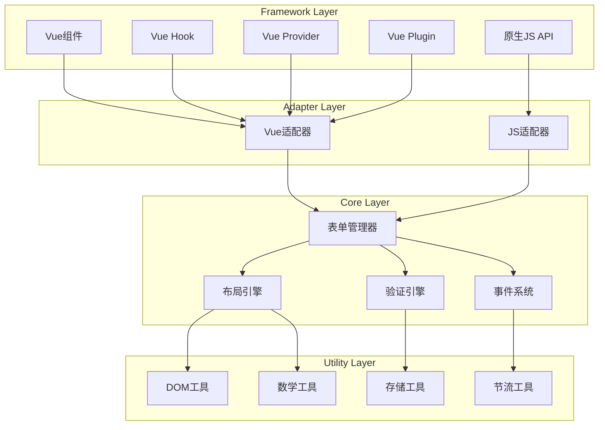
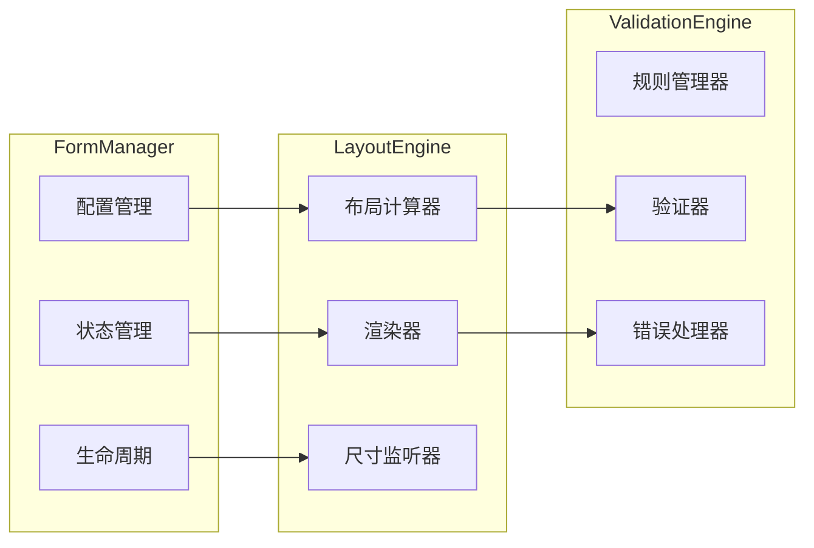

# 设计文档

## 概述

智能表单布局系统是一个高度可配置的表单渲染和管理解决方案，采用模块化架构设计，支持多框架使用。系统核心基于原生JavaScript实现，通过适配器模式为不同框架提供专门的集成接口。

### 核心特性

- **自适应布局引擎**：基于容器宽度和表单项配置自动计算最佳布局
- **智能展开收起**：支持内联展开和弹窗模式的表单项管理
- **灵活的网格系统**：支持动态列占用和自动填充
- **多框架支持**：原生JavaScript + Vue3多种集成方式
- **高性能渲染**：虚拟滚动和增量更新优化
- **完整的验证系统**：实时验证和错误处理

## 架构

### 整体架构图



### 核心模块架构



## 组件和接口

### 核心接口定义

```typescript
// 表单项配置接口
interface FormItemConfig {
  key: string
  label: string
  type: FormItemType
  value?: any
  span?: number // 占用列数
  required?: boolean
  readonly?: boolean
  validation?: ValidationRule[]
  placeholder?: string
  options?: SelectOption[] // 用于select类型
  group?: string // 分组标识
  order?: number // 排序权重
}

// 表单配置接口
interface FormConfig {
  items: FormItemConfig[]
  layout: LayoutConfig
  validation: ValidationConfig
  display: DisplayConfig
  behavior: BehaviorConfig
}

// 布局配置接口
interface LayoutConfig {
  defaultRows?: number // 默认显示行数
  minColumns?: number // 最小列数
  maxColumns?: number // 最大列数
  columnWidth?: number // 列宽度
  gap?: {
    horizontal: number
    vertical: number
  }
  responsive?: ResponsiveConfig
}

// 显示配置接口
interface DisplayConfig {
  labelPosition: 'left' | 'right' | 'top'
  labelWidth?: number
  showExpandButton?: boolean
  expandMode: 'inline' | 'modal'
  modalConfig?: ModalConfig
}

// 行为配置接口
interface BehaviorConfig {
  readonly?: boolean
  autoSave?: boolean
  validateOnChange?: boolean
  expandThreshold?: number // 展开阈值
}
```

### 主要组件类

#### 1. FormManager（表单管理器）

```typescript
class FormManager {
  private config: FormConfig
  private state: FormState
  private layoutEngine: LayoutEngine
  private validationEngine: ValidationEngine
  private eventEmitter: EventEmitter

  constructor(config: FormConfig, container: HTMLElement)

  // 核心方法
  public render(): void
  public updateConfig(config: Partial<FormConfig>): void
  public getValue(key?: string): any
  public setValue(key: string, value: any): void
  public validate(key?: string): ValidationResult
  public reset(): void
  public destroy(): void

  // 布局控制
  public expand(): void
  public collapse(): void
  public openModal(): void
  public closeModal(): void

  // 事件监听
  public on(event: string, handler: (...args: unknown[]) => void): void
  public off(event: string, handler: (...args: unknown[]) => void): void
  public emit(event: string, data?: unknown): void
}
```

#### 2. LayoutEngine（布局引擎）

```typescript
class LayoutEngine {
  private container: HTMLElement
  private config: LayoutConfig
  private calculator: LayoutCalculator
  private renderer: FormRenderer
  private resizeObserver: ResizeObserver

  constructor(container: HTMLElement, config: LayoutConfig)

  // 布局计算
  public calculateLayout(items: FormItemConfig[]): LayoutResult
  public calculateOptimalColumns(containerWidth: number): number
  public calculateItemPositions(items: FormItemConfig[], columns: number): ItemPosition[]

  // 渲染控制
  public render(items: FormItemConfig[], state: FormState): void
  public updateLayout(): void
  public handleResize(): void

  // 展开收起逻辑
  public getVisibleItems(items: FormItemConfig[], expanded: boolean): FormItemConfig[]
  public getHiddenItems(items: FormItemConfig[], expanded: boolean): FormItemConfig[]
}
```

#### 3. ValidationEngine（验证引擎）

```typescript
class ValidationEngine {
  private rules: Map<string, ValidationRule[]>
  private errors: Map<string, string[]>
  private validators: Map<string, ValidatorFunction>

  constructor()

  // 规则管理
  public addRule(key: string, rule: ValidationRule): void
  public removeRule(key: string, ruleId: string): void
  public clearRules(key?: string): void

  // 验证执行
  public validate(key: string, value: any): ValidationResult
  public validateAll(values: Record<string, any>): ValidationResult
  public validateAsync(key: string, value: any): Promise<ValidationResult>

  // 错误管理
  public getErrors(key?: string): string[]
  public setError(key: string, error: string): void
  public clearErrors(key?: string): void
}
```

## 数据模型

### 状态管理模型

```typescript
interface FormState {
  // 表单数据
  values: Record<string, any>

  // 布局状态
  layout: {
    containerWidth: number
    columns: number
    rows: number
    expanded: boolean
    modalOpen: boolean
  }

  // 验证状态
  validation: {
    errors: Record<string, string[]>
    validating: Set<string>
    touched: Set<string>
  }

  // 交互状态
  interaction: {
    readonly: boolean
    disabled: Set<string>
    focused: string | null
  }

  // 分组状态
  groups: Record<string, {
    expanded: boolean
    visible: boolean
  }>
}
```

### 布局计算模型

```typescript
interface LayoutResult {
  // 基础信息
  totalColumns: number
  totalRows: number
  visibleRows: number

  // 项目位置
  items: ItemLayout[]

  // 操作按钮位置
  actionButton?: {
    row: number
    column: number
    span: number
  }

  // 性能信息
  performance: {
    calculationTime: number
    itemCount: number
    hiddenCount: number
  }
}

interface ItemLayout {
  key: string
  row: number
  column: number
  span: number
  width: number
  height: number
  visible: boolean
  group?: string
}
```

## 错误处理

### 错误类型定义

```typescript
enum FormErrorType {
  VALIDATION_ERROR = 'validation_error',
  LAYOUT_ERROR = 'layout_error',
  RENDER_ERROR = 'render_error',
  CONFIG_ERROR = 'config_error',
  NETWORK_ERROR = 'network_error'
}

class FormError extends Error {
  public type: FormErrorType
  public code: string
  public context?: any

  constructor(type: FormErrorType, message: string, code: string, context?: any)
}
```

### 错误处理策略

1. **验证错误**：实时显示，不阻断用户操作
2. **布局错误**：降级到默认布局，记录错误日志
3. **渲染错误**：局部重渲染，保持其他部分正常
4. **配置错误**：使用默认配置，发出警告
5. **网络错误**：重试机制，用户友好提示

### 错误恢复机制

```typescript
class ErrorRecovery {
  // 自动恢复策略
  public static autoRecover(error: FormError, context: FormManager): boolean

  // 降级渲染
  public static fallbackRender(items: FormItemConfig[], container: HTMLElement): void

  // 状态重置
  public static resetToSafeState(manager: FormManager): void
}
```

## 测试策略

### 单元测试

1. **核心算法测试**
   - 布局计算算法
   - 验证规则引擎
   - 事件系统

2. **组件测试**
   - FormManager API
   - LayoutEngine 渲染
   - ValidationEngine 验证

3. **工具函数测试**
   - DOM 操作工具
   - 数学计算工具
   - 节流防抖工具

### 集成测试

1. **框架集成测试**
   - Vue3 组件集成
   - Vue3 Hook 功能
   - 原生JS API

2. **用户交互测试**
   - 表单填写流程
   - 展开收起操作
   - 弹窗交互

3. **响应式测试**
   - 容器尺寸变化
   - 屏幕旋转适配
   - 动态内容更新

### 性能测试

1. **渲染性能**
   - 大量表单项渲染时间
   - 布局计算性能
   - 内存使用情况

2. **交互性能**
   - 输入响应时间
   - 验证执行时间
   - 动画流畅度

3. **压力测试**
   - 1000+ 表单项处理
   - 频繁尺寸变化
   - 大量并发验证

### 测试工具和框架

- **单元测试**：Vitest + @testing-library
- **E2E测试**：Playwright
- **性能测试**：Chrome DevTools + 自定义性能监控
- **视觉回归测试**：Percy 或 Chromatic
- **可访问性测试**：axe-core

### 测试覆盖率目标

- 代码覆盖率：≥ 90%
- 分支覆盖率：≥ 85%
- 函数覆盖率：≥ 95%
- 行覆盖率：≥ 90%
