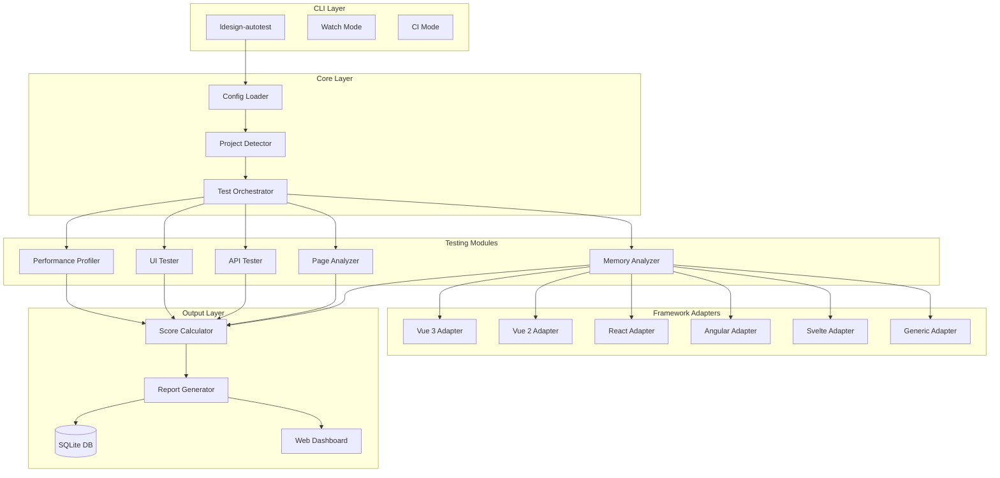

# Design Document: Auto Testing Suite

## Overview

Auto Testing Suite 是一个全面的自动化测试工具，旨在为各种前端框架项目提供一站式测试解决方案。该工具基于现有的 `@ldesign/testing` 包进行扩展，集成 Playwright、Lighthouse、Chrome DevTools Protocol 等技术，实现内存、性能、UI、API、页面展示等全方位自动化测试，并生成评分报告和优化建议。

### 设计目标

1. **零配置启动** - 自动检测项目类型，开箱即用
2. **全面覆盖** - 涵盖内存、性能、UI、API、页面等所有测试维度
3. **智能评分** - 基于行业标准的加权评分系统
4. **可操作建议** - 提供具体的、可执行的优化建议
5. **框架无关** - 支持所有主流前端框架

## Architecture

### 系统架构图



### 技术栈

| 层级 | 技术选型 | 用途 |
|------|----------|------|
| 浏览器自动化 | Playwright | E2E测试、截图、网络拦截 |
| 性能分析 | Lighthouse + web-vitals | Core Web Vitals 测量 |
| 内存分析 | Chrome DevTools Protocol | 堆内存快照、内存泄漏检测 |
| 数据存储 | better-sqlite3 | 测试结果持久化 |
| 报告生成 | EJS + Chart.js | HTML报告和可视化 |
| CLI | Commander + Inquirer | 命令行交互 |

## Components and Interfaces

### 1. Project Detector

负责自动检测项目类型和框架。

```typescript
interface ProjectInfo {
  /** 项目根目录 */
  root: string
  /** 检测到的框架列表 */
  frameworks: FrameworkInfo[]
  /** 构建工具 */
  buildTool: BuildTool
  /** 包管理器 */
  packageManager: 'npm' | 'yarn' | 'pnpm'
  /** 是否为 monorepo */
  isMonorepo: boolean
  /** 入口文件 */
  entryPoints: string[]
}

interface FrameworkInfo {
  name: FrameworkName
  version: string
  configFile?: string
}

type FrameworkName = 
  | 'vue3' | 'vue2' 
  | 'react' | 'preact' 
  | 'angular' | 'svelte' | 'solid' 
  | 'vanilla'

type BuildTool = 'vite' | 'webpack' | 'rollup' | 'esbuild' | 'parcel' | 'unknown'

interface ProjectDetector {
  /** 检测项目信息 */
  detect(cwd?: string): Promise<ProjectInfo>
  /** 检测特定框架 */
  detectFramework(packageJson: PackageJson): FrameworkInfo[]
  /** 检测构建工具 */
  detectBuildTool(cwd: string): BuildTool
}
```

### 2. Test Orchestrator

协调和执行各类测试。

```typescript
interface TestOrchestrator {
  /** 运行所有测试 */
  runAll(config: AutoTestConfig): Promise<TestSuiteResult>
  /** 运行特定类型测试 */
  runTests(types: TestType[], config: AutoTestConfig): Promise<TestSuiteResult>
  /** 停止测试 */
  stop(): void
  /** 监听测试事件 */
  on(event: TestEvent, handler: EventHandler): void
}

type TestType = 'memory' | 'performance' | 'ui' | 'api' | 'page'

interface TestSuiteResult {
  /** 测试开始时间 */
  startTime: number
  /** 测试结束时间 */
  endTime: number
  /** 总耗时 */
  duration: number
  /** 各模块测试结果 */
  results: {
    memory?: MemoryTestResult
    performance?: PerformanceTestResult
    ui?: UITestResult
    api?: APITestResult
    page?: PageTestResult
  }
  /** 综合评分 */
  score: ScoreResult
  /** 优化建议 */
  suggestions: Suggestion[]
}
```

### 3. Memory Analyzer

检测内存泄漏和内存使用情况。

```typescript
interface MemoryAnalyzer {
  /** 开始内存监控 */
  startMonitoring(page: Page): Promise<void>
  /** 停止监控并获取结果 */
  stopMonitoring(): Promise<MemoryTestResult>
  /** 获取堆快照 */
  takeHeapSnapshot(): Promise<HeapSnapshot>
  /** 检测内存泄漏 */
  detectLeaks(snapshots: HeapSnapshot[]): MemoryLeak[]
}

interface MemoryTestResult {
  /** 初始堆大小 (bytes) */
  initialHeapSize: number
  /** 最终堆大小 (bytes) */
  finalHeapSize: number
  /** 峰值堆大小 (bytes) */
  peakHeapSize: number
  /** 内存增长率 */
  growthRate: number
  /** 检测到的内存泄漏 */
  leaks: MemoryLeak[]
  /** 内存使用时间线 */
  timeline: MemoryDataPoint[]
  /** 评分 (0-100) */
  score: number
}

interface MemoryLeak {
  /** 泄漏类型 */
  type: 'detached-dom' | 'event-listener' | 'closure' | 'timer' | 'unknown'
  /** 泄漏大小 (bytes) */
  size: number
  /** 可能的位置 */
  location?: string
  /** 详细描述 */
  description: string
  /** 修复建议 */
  suggestion: string
}

interface MemoryDataPoint {
  timestamp: number
  usedJSHeapSize: number
  totalJSHeapSize: number
}
```

### 4. Performance Profiler

测量性能指标。

```typescript
interface PerformanceProfiler {
  /** 运行 Lighthouse 审计 */
  runLighthouse(url: string, options?: LighthouseOptions): Promise<LighthouseResult>
  /** 测量 Core Web Vitals */
  measureWebVitals(page: Page): Promise<WebVitalsResult>
  /** 分析资源加载 */
  analyzeResources(page: Page): Promise<ResourceAnalysis>
  /** 检测长任务 */
  detectLongTasks(page: Page): Promise<LongTask[]>
}

interface PerformanceTestResult {
  /** Lighthouse 分数 */
  lighthouseScore: number
  /** Core Web Vitals */
  webVitals: WebVitalsResult
  /** 资源分析 */
  resources: ResourceAnalysis
  /** 长任务列表 */
  longTasks: LongTask[]
  /** 网络条件测试结果 */
  networkConditions: NetworkConditionResult[]
  /** 评分 (0-100) */
  score: number
}

interface WebVitalsResult {
  /** Largest Contentful Paint (ms) */
  LCP: number
  /** First Input Delay (ms) */
  FID: number
  /** Cumulative Layout Shift */
  CLS: number
  /** First Contentful Paint (ms) */
  FCP: number
  /** Time to First Byte (ms) */
  TTFB: number
  /** Interaction to Next Paint (ms) */
  INP: number
}

interface ResourceAnalysis {
  /** 总资源数 */
  totalResources: number
  /** 总大小 (bytes) */
  totalSize: number
  /** 按类型分组 */
  byType: Record<ResourceType, ResourceGroup>
  /** 慢资源列表 */
  slowResources: SlowResource[]
}

type ResourceType = 'script' | 'stylesheet' | 'image' | 'font' | 'other'
```

### 5. UI Tester

执行 UI 测试。

```typescript
interface UITester {
  /** 发现所有路由 */
  discoverRoutes(page: Page): Promise<string[]>
  /** 执行视觉回归测试 */
  visualRegression(page: Page, options?: VisualOptions): Promise<VisualResult>
  /** 测试响应式布局 */
  testResponsive(page: Page, viewports: Viewport[]): Promise<ResponsiveResult>
  /** 验证交互元素 */
  validateInteractions(page: Page): Promise<InteractionResult>
  /** 检测样式问题 */
  detectStyleIssues(page: Page): Promise<StyleIssue[]>
}

interface UITestResult {
  /** 测试的路由数 */
  routesTested: number
  /** 视觉回归结果 */
  visualRegression: VisualResult
  /** 响应式测试结果 */
  responsive: ResponsiveResult
  /** 交互验证结果 */
  interactions: InteractionResult
  /** 样式问题 */
  styleIssues: StyleIssue[]
  /** 截图列表 */
  screenshots: Screenshot[]
  /** 评分 (0-100) */
  score: number
}

interface VisualResult {
  /** 对比的页面数 */
  pagesCompared: number
  /** 差异数 */
  differencesFound: number
  /** 差异详情 */
  differences: VisualDifference[]
}

interface StyleIssue {
  /** 问题类型 */
  type: 'overflow' | 'overlap' | 'alignment' | 'contrast' | 'z-index'
  /** 元素选择器 */
  selector: string
  /** 问题描述 */
  description: string
  /** 截图 */
  screenshot?: string
  /** 严重程度 */
  severity: 'error' | 'warning' | 'info'
}
```

### 6. API Tester

测试 API 调用。

```typescript
interface APITester {
  /** 开始拦截请求 */
  startIntercepting(page: Page): Promise<void>
  /** 停止拦截并获取结果 */
  stopIntercepting(): Promise<APITestResult>
  /** 验证请求 */
  validateRequest(request: RequestInfo): ValidationResult
  /** 模拟错误响应 */
  simulateError(pattern: string, error: ErrorType): void
}

interface APITestResult {
  /** 拦截的请求总数 */
  totalRequests: number
  /** 成功请求数 */
  successfulRequests: number
  /** 失败请求数 */
  failedRequests: number
  /** 重复请求 */
  duplicateRequests: DuplicateRequest[]
  /** 慢请求 */
  slowRequests: SlowRequest[]
  /** 错误处理测试结果 */
  errorHandling: ErrorHandlingResult
  /** 请求详情列表 */
  requests: RequestDetail[]
  /** 评分 (0-100) */
  score: number
}

interface RequestDetail {
  /** 请求 URL */
  url: string
  /** 请求方法 */
  method: string
  /** 请求头 */
  headers: Record<string, string>
  /** 请求体 */
  body?: unknown
  /** 响应状态码 */
  status: number
  /** 响应时间 (ms) */
  responseTime: number
  /** 响应大小 (bytes) */
  responseSize: number
  /** 时间戳 */
  timestamp: number
}

interface DuplicateRequest {
  /** 请求 URL */
  url: string
  /** 重复次数 */
  count: number
  /** 时间间隔 (ms) */
  interval: number
}
```

### 7. Page Analyzer

分析页面内容。

```typescript
interface PageAnalyzer {
  /** 分析 SEO */
  analyzeSEO(page: Page): Promise<SEOResult>
  /** 检测无障碍问题 */
  checkAccessibility(page: Page): Promise<AccessibilityResult>
  /** 检测控制台错误 */
  captureConsoleErrors(page: Page): Promise<ConsoleError[]>
  /** 检测死链接 */
  findBrokenLinks(page: Page): Promise<BrokenLink[]>
  /** 验证国际化 */
  validateI18n(page: Page, locales: string[]): Promise<I18nResult>
}

interface PageTestResult {
  /** SEO 分析结果 */
  seo: SEOResult
  /** 无障碍检测结果 */
  accessibility: AccessibilityResult
  /** 控制台错误 */
  consoleErrors: ConsoleError[]
  /** 死链接 */
  brokenLinks: BrokenLink[]
  /** 国际化验证结果 */
  i18n?: I18nResult
  /** 评分 (0-100) */
  score: number
}

interface SEOResult {
  /** 是否有 title */
  hasTitle: boolean
  /** title 内容 */
  title?: string
  /** 是否有 meta description */
  hasMetaDescription: boolean
  /** meta description 内容 */
  metaDescription?: string
  /** heading 结构是否正确 */
  hasProperHeadingStructure: boolean
  /** 图片是否有 alt */
  imagesWithAlt: number
  /** 图片总数 */
  totalImages: number
  /** SEO 问题列表 */
  issues: SEOIssue[]
}

interface AccessibilityResult {
  /** 违规数 */
  violations: number
  /** 通过数 */
  passes: number
  /** 违规详情 */
  violationDetails: AccessibilityViolation[]
  /** WCAG 等级 */
  wcagLevel: 'A' | 'AA' | 'AAA' | 'none'
}
```

### 8. Score Calculator

计算综合评分。

```typescript
interface ScoreCalculator {
  /** 计算综合评分 */
  calculate(results: TestSuiteResult, weights?: ScoreWeights): ScoreResult
  /** 与行业标准对比 */
  compareWithBenchmark(score: number, category: TestType): BenchmarkComparison
}

interface ScoreResult {
  /** 综合评分 (0-100) */
  overall: number
  /** 各类别评分 */
  categories: {
    memory: number
    performance: number
    ui: number
    api: number
    page: number
  }
  /** 评级 */
  grade: 'A' | 'B' | 'C' | 'D' | 'F'
  /** 与上次对比 */
  comparison?: ScoreComparison
  /** 行业对比 */
  benchmark: BenchmarkComparison
}

interface ScoreWeights {
  memory: number      // 默认 0.15
  performance: number // 默认 0.30
  ui: number          // 默认 0.20
  api: number         // 默认 0.15
  page: number        // 默认 0.20
}

interface BenchmarkComparison {
  /** 行业平均分 */
  industryAverage: number
  /** 百分位排名 */
  percentile: number
  /** 对比结果 */
  status: 'above' | 'average' | 'below'
}
```

### 9. Report Generator

生成测试报告。

```typescript
interface ReportGenerator {
  /** 生成 HTML 报告 */
  generateHTML(result: TestSuiteResult): Promise<string>
  /** 生成 JSON 报告 */
  generateJSON(result: TestSuiteResult): string
  /** 生成 Markdown 报告 */
  generateMarkdown(result: TestSuiteResult): string
  /** 生成 JUnit XML */
  generateJUnit(result: TestSuiteResult): string
  /** 保存到数据库 */
  saveToDatabase(result: TestSuiteResult): Promise<void>
  /** 获取历史记录 */
  getHistory(limit?: number): Promise<TestSuiteResult[]>
}

interface Suggestion {
  /** 建议 ID */
  id: string
  /** 类别 */
  category: TestType
  /** 优先级 */
  priority: 'high' | 'medium' | 'low'
  /** 标题 */
  title: string
  /** 详细描述 */
  description: string
  /** 影响的文件/位置 */
  location?: string
  /** 代码示例 */
  codeExample?: string
  /** 预期收益 */
  expectedImpact: string
  /** 参考链接 */
  references?: string[]
}
```

### 10. Framework Adapters

框架适配器接口。

```typescript
interface FrameworkAdapter {
  /** 框架名称 */
  name: FrameworkName
  /** 初始化适配器 */
  initialize(projectInfo: ProjectInfo): Promise<void>
  /** 获取组件列表 */
  getComponents(): Promise<ComponentInfo[]>
  /** 挂载组件用于测试 */
  mountComponent(component: ComponentInfo): Promise<MountedComponent>
  /** 获取路由配置 */
  getRoutes(): Promise<RouteInfo[]>
  /** 获取状态管理信息 */
  getStateManagement(): Promise<StateInfo>
}

interface ComponentInfo {
  name: string
  path: string
  props?: Record<string, unknown>
  slots?: string[]
}

interface MountedComponent {
  element: HTMLElement
  unmount: () => void
  setProps: (props: Record<string, unknown>) => void
}
```

## Data Models

### 配置模型

```typescript
interface AutoTestConfig {
  /** 项目根目录 */
  root?: string
  /** 测试目标 URL */
  targetUrl?: string
  /** 本地服务器配置 */
  server?: {
    command: string
    port: number
    readyPattern?: string
  }
  /** 启用的测试类型 */
  tests?: TestType[]
  /** 内存测试配置 */
  memory?: MemoryConfig
  /** 性能测试配置 */
  performance?: PerformanceConfig
  /** UI 测试配置 */
  ui?: UIConfig
  /** API 测试配置 */
  api?: APIConfig
  /** 页面测试配置 */
  page?: PageConfig
  /** 评分权重 */
  scoreWeights?: ScoreWeights
  /** 报告配置 */
  report?: ReportConfig
  /** CI 模式 */
  ci?: boolean
  /** 并行数 */
  parallel?: number
}

interface MemoryConfig {
  /** 是否启用 */
  enabled?: boolean
  /** 内存阈值 (MB) */
  threshold?: number
  /** 泄漏检测灵敏度 */
  leakSensitivity?: 'low' | 'medium' | 'high'
}

interface PerformanceConfig {
  /** 是否启用 */
  enabled?: boolean
  /** Lighthouse 配置 */
  lighthouse?: {
    categories?: string[]
    throttling?: 'mobile' | 'desktop'
  }
  /** 网络条件 */
  networkConditions?: NetworkCondition[]
  /** 性能阈值 */
  thresholds?: {
    LCP?: number
    FID?: number
    CLS?: number
    FCP?: number
    TTFB?: number
  }
}

interface UIConfig {
  /** 是否启用 */
  enabled?: boolean
  /** 视口尺寸列表 */
  viewports?: Viewport[]
  /** 视觉回归阈值 */
  visualThreshold?: number
  /** 基准截图目录 */
  baselineDir?: string
  /** 是否测试暗黑模式 */
  testDarkMode?: boolean
}

interface APIConfig {
  /** 是否启用 */
  enabled?: boolean
  /** 忽略的 URL 模式 */
  ignorePatterns?: string[]
  /** 超时阈值 (ms) */
  timeoutThreshold?: number
  /** 是否测试错误处理 */
  testErrorHandling?: boolean
}

interface PageConfig {
  /** 是否启用 */
  enabled?: boolean
  /** 是否检测 SEO */
  checkSEO?: boolean
  /** 是否检测无障碍 */
  checkAccessibility?: boolean
  /** WCAG 等级 */
  wcagLevel?: 'A' | 'AA' | 'AAA'
  /** 国际化语言列表 */
  i18nLocales?: string[]
}

interface ReportConfig {
  /** 输出目录 */
  outputDir?: string
  /** 报告格式 */
  formats?: ('html' | 'json' | 'markdown' | 'junit')[]
  /** 是否打开报告 */
  open?: boolean
  /** 是否保存历史 */
  saveHistory?: boolean
}
```

### 数据库模型

```typescript
interface TestRunRecord {
  id: number
  projectName: string
  timestamp: number
  duration: number
  overallScore: number
  memoryScore: number
  performanceScore: number
  uiScore: number
  apiScore: number
  pageScore: number
  grade: string
  resultJson: string
  suggestionsJson: string
}
```

## Error Handling

### 错误类型

```typescript
class AutoTestError extends Error {
  constructor(
    message: string,
    public code: ErrorCode,
    public details?: unknown
  ) {
    super(message)
    this.name = 'AutoTestError'
  }
}

enum ErrorCode {
  // 配置错误
  CONFIG_NOT_FOUND = 'CONFIG_NOT_FOUND',
  CONFIG_INVALID = 'CONFIG_INVALID',
  
  // 项目检测错误
  PROJECT_NOT_DETECTED = 'PROJECT_NOT_DETECTED',
  UNSUPPORTED_FRAMEWORK = 'UNSUPPORTED_FRAMEWORK',
  
  // 服务器错误
  SERVER_START_FAILED = 'SERVER_START_FAILED',
  SERVER_TIMEOUT = 'SERVER_TIMEOUT',
  
  // 浏览器错误
  BROWSER_LAUNCH_FAILED = 'BROWSER_LAUNCH_FAILED',
  PAGE_LOAD_FAILED = 'PAGE_LOAD_FAILED',
  
  // 测试错误
  TEST_TIMEOUT = 'TEST_TIMEOUT',
  TEST_FAILED = 'TEST_FAILED',
  
  // 报告错误
  REPORT_GENERATION_FAILED = 'REPORT_GENERATION_FAILED',
  DATABASE_ERROR = 'DATABASE_ERROR'
}
```

### 错误处理策略

1. **配置错误**: 提示用户检查配置文件，提供默认配置示例
2. **项目检测失败**: 提示用户手动选择框架类型
3. **服务器启动失败**: 检查端口占用，提供替代方案
4. **浏览器启动失败**: 检查 Playwright 安装，提供安装命令
5. **测试超时**: 记录部分结果，继续执行其他测试
6. **报告生成失败**: 输出原始 JSON 数据作为备份

## Testing Strategy

### 测试类型

1. **单元测试**: 测试各个模块的核心逻辑
2. **集成测试**: 测试模块间的协作
3. **E2E 测试**: 测试完整的测试流程

### 测试框架

- 单元测试: Vitest
- E2E 测试: Playwright
- 属性测试: fast-check


## Correctness Properties

*A property is a characteristic or behavior that should hold true across all valid executions of a system—essentially, a formal statement about what the system should do. Properties serve as the bridge between human-readable specifications and machine-verifiable correctness guarantees.*

Based on the prework analysis, the following correctness properties have been identified:

### Property 1: Project Detection Completeness

*For any* valid project structure containing one or more supported frameworks (Vue 3, Vue 2, React, Angular, Svelte, Solid, Preact), the Project_Detector SHALL correctly identify all frameworks present and return them in the detection result.

**Validates: Requirements 1.1, 1.2, 1.3**

### Property 2: Memory Monitoring Consistency

*For any* application under test, the Memory_Analyzer SHALL record memory usage data points that form a monotonically timestamped timeline, where the final heap size equals the last recorded data point, and peak heap size is greater than or equal to all recorded values.

**Validates: Requirements 2.1, 2.4, 2.5**

### Property 3: Memory Leak Detection Accuracy

*For any* component that creates detached DOM nodes, uncleared timers, or uncleaned event listeners without proper cleanup, the Memory_Analyzer SHALL detect and report these as memory leaks with type, size, and suggested fix.

**Validates: Requirements 2.2, 2.3**

### Property 4: Memory Threshold Alerting

*For any* memory usage value that exceeds the configured threshold, the Memory_Analyzer SHALL mark the result with a warning or error severity level.

**Validates: Requirements 2.6**

### Property 5: Performance Metrics Completeness

*For any* page under test, the Performance_Profiler SHALL return all Core Web Vitals (LCP, FID, CLS, FCP, TTFB) as numeric values, along with resource analysis grouped by type (script, stylesheet, image, font) and a list of detected long tasks.

**Validates: Requirements 3.1, 3.2, 3.5, 3.6**

### Property 6: Network Condition Testing

*For any* set of network conditions (3G, 4G, WiFi), the Performance_Profiler SHALL execute tests under each condition and return separate results for each, with metrics reflecting the simulated network constraints.

**Validates: Requirements 3.4**

### Property 7: Performance Suggestion Generation

*For any* performance metric that falls below the configured threshold, the Performance_Profiler SHALL include at least one specific optimization suggestion with expected impact.

**Validates: Requirements 3.7**

### Property 8: UI Route Discovery

*For any* application with defined routes, the UI_Tester SHALL discover and return all navigable routes, and test results SHALL include entries for each discovered route across all configured viewports.

**Validates: Requirements 4.1, 4.3**

### Property 9: Visual Regression Detection

*For any* two page states with pixel differences exceeding the configured threshold, the UI_Tester SHALL detect the difference and include it in the visual regression result with a diff image.

**Validates: Requirements 4.2**

### Property 10: Interactive Element Validation

*For any* page containing buttons, forms, or links, the UI_Tester SHALL validate their clickability and include validation results for each element type.

**Validates: Requirements 4.4**

### Property 11: Style Issue Detection

*For any* page with CSS overflow, element overlap, or alignment issues, the UI_Tester SHALL detect and report these issues with element selectors and severity levels.

**Validates: Requirements 4.5, 4.7**

### Property 12: API Request Recording

*For any* HTTP request made by the application, the API_Tester SHALL record the request URL, method, headers, body, response status, response time, and response size.

**Validates: Requirements 5.1, 5.2, 5.6**

### Property 13: Duplicate Request Detection

*For any* set of requests where two or more requests have identical URLs and methods within a configurable time window, the API_Tester SHALL identify and report them as duplicate requests.

**Validates: Requirements 5.5**

### Property 14: API Error Handling Verification

*For any* simulated API error (timeout, network error, HTTP error status), the API_Tester SHALL verify that the application handles the error without crashing and report the handling behavior.

**Validates: Requirements 5.3, 5.4, 5.7**

### Property 15: Page Content Analysis

*For any* page under test, the Page_Analyzer SHALL return SEO analysis (title, meta description, heading structure), accessibility violations count, and captured console errors.

**Validates: Requirements 6.2, 6.3, 6.5**

### Property 16: Dynamic Content Verification

*For any* page with dynamically loaded content, the Page_Analyzer SHALL wait for content to load before performing analysis and report the final content state.

**Validates: Requirements 6.1, 6.4**

### Property 17: Broken Link Detection

*For any* link on a page that returns a 4xx or 5xx status code or fails to load, the Page_Analyzer SHALL identify and report it as a broken link.

**Validates: Requirements 6.7**

### Property 18: Score Calculation Bounds

*For any* test result, the Score_Calculator SHALL produce an overall score and category scores that are all within the range [0, 100].

**Validates: Requirements 7.1, 7.2**

### Property 19: Weighted Score Calculation

*For any* set of category scores and weights where weights sum to 1.0, the overall score SHALL equal the weighted sum of category scores (within floating-point tolerance).

**Validates: Requirements 7.3**

### Property 20: Low Score Flagging

*For any* category score below the configured threshold, the Score_Calculator SHALL flag that category as needing attention in the result.

**Validates: Requirements 7.4, 7.5**

### Property 21: Suggestion Completeness

*For any* detected issue, the Report_Generator SHALL produce a suggestion with priority (high/medium/low), title, description, and expected impact.

**Validates: Requirements 8.1, 8.2, 8.5**

### Property 22: Suggestion Ordering

*For any* list of suggestions, they SHALL be ordered by priority (high before medium before low).

**Validates: Requirements 8.2**

### Property 23: Configuration Loading

*For any* valid configuration file, the Config_Loader SHALL parse and apply all specified settings, with environment variables taking precedence over file values.

**Validates: Requirements 9.1, 9.3, 9.5**

### Property 24: Test Type Filtering

*For any* configuration that disables specific test types, the Test_Orchestrator SHALL skip those tests and not include their results in the final report.

**Validates: Requirements 9.2**

### Property 25: Exit Code Correctness

*For any* test run where at least one test fails or a score falls below the failure threshold, the CLI SHALL return a non-zero exit code.

**Validates: Requirements 10.3**

### Property 26: JUnit Report Validity

*For any* test run, the generated JUnit XML report SHALL be valid XML that conforms to the JUnit schema and contains test case entries for all executed tests.

**Validates: Requirements 10.5**

### Property 27: Parallel Execution Speedup

*For any* test suite run with parallel execution enabled (workers > 1), the total execution time SHALL be less than or equal to the sequential execution time.

**Validates: Requirements 10.6**

### Property 28: Framework Adapter Fallback

*For any* project with an unrecognized framework, the Framework_Adapter SHALL successfully fall back to generic DOM testing mode and complete the test run.

**Validates: Requirements 11.6, 11.7**

### Property 29: Data Persistence Round-Trip

*For any* test result saved to the database, querying the database for that result SHALL return an equivalent object (within serialization tolerance).

**Validates: Requirements 12.1, 12.2, 12.3**

### Property 30: History Comparison

*For any* test run with existing history, the report SHALL include a comparison with the previous run showing score changes for each category.

**Validates: Requirements 12.3**

