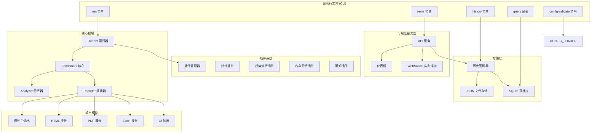
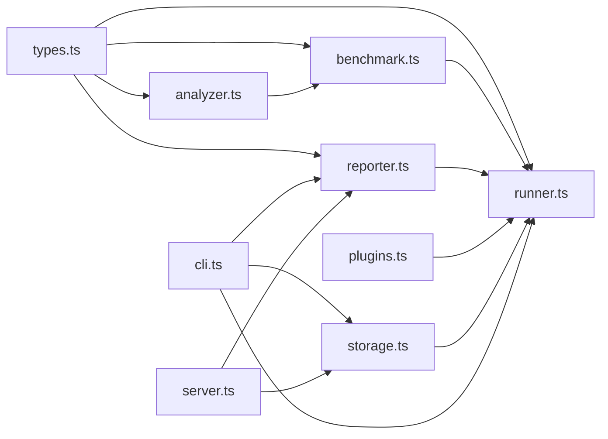

# 设计文档

## 概述

本设计文档描述了 @ldesign/benchmark 性能基准测试框架的增强方案。基于现有架构，我们将通过模块化扩展的方式添加新功能，确保向后兼容性和代码可维护性。

### 设计原则

1. **向后兼容**: 所有新功能都是可选的，不影响现有 API
2. **模块化设计**: 新功能以独立模块形式添加，便于维护和测试
3. **渐进增强**: 用户可以按需启用高级功能
4. **性能优先**: 新功能不应显著影响基准测试的准确性

## 架构

### 整体架构图



### 模块依赖关系



## 组件和接口

### 1. 增强的配置系统

```typescript
// src/config.ts

import { parse as parseYAML } from 'yaml'

/**
 * 配置加载器 - 支持 JSON 和 YAML
 */
export interface ConfigLoader {
  /**
   * 加载配置文件
   * @param configPath - 配置文件路径（可选）
   * @returns 合并后的配置
   */
  load(configPath?: string): Promise<BenchmarkConfig>
  
  /**
   * 验证配置
   * @param config - 配置对象
   * @returns 验证结果
   */
  validate(config: BenchmarkConfig): ValidationResult
  
  /**
   * 合并配置
   * @param configs - 配置数组（按优先级从低到高）
   * @returns 合并后的配置
   */
  merge(...configs: Partial<BenchmarkConfig>[]): BenchmarkConfig
}

export interface ValidationResult {
  valid: boolean
  errors: ValidationError[]
  warnings: ValidationWarning[]
}

export interface ValidationError {
  path: string
  message: string
  value?: unknown
}

export interface ValidationWarning {
  path: string
  message: string
  suggestion?: string
}

/**
 * 增强的配置结构
 */
export interface EnhancedBenchmarkConfig extends BenchmarkConfig {
  /** CI/CD 配置 */
  ci?: {
    enabled: boolean
    provider?: 'github' | 'gitlab' | 'jenkins' | 'azure'
    failOnRegression: boolean
    regressionThreshold: number
    annotations: boolean
  }
  
  /** 并行执行配置 */
  parallel?: {
    enabled: boolean
    maxWorkers: number
    isolate: boolean
  }
  
  /** 存储配置 */
  storage?: {
    type: 'json' | 'sqlite'
    path: string
    retention: {
      maxAge: number  // 天数
      maxCount: number
    }
  }
  
  /** 国际化配置 */
  locale?: {
    language: 'zh-CN' | 'en-US'
    dateFormat: string
    numberFormat: string
  }
}
```

### 2. SQLite 存储层

```typescript
// src/storage.ts

/**
 * 存储接口 - 抽象存储层
 */
export interface BenchmarkStorage {
  /**
   * 保存基准测试报告
   */
  save(report: BenchmarkReport): Promise<string>
  
  /**
   * 获取报告
   */
  get(id: string): Promise<BenchmarkReport | null>
  
  /**
   * 查询历史记录
   */
  query(options: QueryOptions): Promise<BenchmarkReport[]>
  
  /**
   * 删除记录
   */
  delete(id: string): Promise<boolean>
  
  /**
   * 清理旧记录
   */
  cleanup(options: CleanupOptions): Promise<number>
  
  /**
   * 关闭连接
   */
  close(): Promise<void>
}

export interface QueryOptions {
  /** 日期范围 */
  dateRange?: {
    start: Date
    end: Date
  }
  /** 套件名称过滤 */
  suites?: string[]
  /** 标签过滤 */
  tags?: string[]
  /** Git 分支过滤 */
  branch?: string
  /** 排序 */
  orderBy?: 'date' | 'duration' | 'suiteCount'
  /** 排序方向 */
  order?: 'asc' | 'desc'
  /** 限制数量 */
  limit?: number
  /** 偏移量 */
  offset?: number
}

export interface CleanupOptions {
  /** 保留最近 N 天的记录 */
  maxAge?: number
  /** 保留最近 N 条记录 */
  maxCount?: number
  /** 只清理特定套件 */
  suites?: string[]
}

/**
 * SQLite 存储实现
 */
export class SQLiteStorage implements BenchmarkStorage {
  private db: Database
  
  constructor(dbPath: string) {
    // 初始化数据库连接
  }
  
  async initialize(): Promise<void> {
    // 创建表结构
    await this.db.exec(`
      CREATE TABLE IF NOT EXISTS benchmark_reports (
        id TEXT PRIMARY KEY,
        name TEXT NOT NULL,
        generated_at TEXT NOT NULL,
        duration INTEGER,
        environment TEXT,
        git_commit TEXT,
        git_branch TEXT,
        data TEXT NOT NULL,
        created_at TEXT DEFAULT CURRENT_TIMESTAMP
      );
      
      CREATE TABLE IF NOT EXISTS benchmark_suites (
        id TEXT PRIMARY KEY,
        report_id TEXT NOT NULL,
        name TEXT NOT NULL,
        duration INTEGER,
        task_count INTEGER,
        FOREIGN KEY (report_id) REFERENCES benchmark_reports(id)
      );
      
      CREATE TABLE IF NOT EXISTS benchmark_results (
        id TEXT PRIMARY KEY,
        suite_id TEXT NOT NULL,
        name TEXT NOT NULL,
        ops_per_second REAL,
        avg_time REAL,
        min_time REAL,
        max_time REAL,
        std_dev REAL,
        rme REAL,
        iterations INTEGER,
        tags TEXT,
        FOREIGN KEY (suite_id) REFERENCES benchmark_suites(id)
      );
      
      CREATE INDEX IF NOT EXISTS idx_reports_date ON benchmark_reports(generated_at);
      CREATE INDEX IF NOT EXISTS idx_reports_branch ON benchmark_reports(git_branch);
      CREATE INDEX IF NOT EXISTS idx_suites_name ON benchmark_suites(name);
    `)
  }
  
  // ... 实现其他方法
}
```

### 3. 增强的报告生成器

```typescript
// src/reporter-enhanced.ts

/**
 * PDF 报告生成器
 */
export class PDFReporter {
  /**
   * 生成 PDF 报告
   */
  async generate(
    results: BenchmarkResult[],
    suiteName: string,
    options?: PDFReportOptions
  ): Promise<Buffer>
}

export interface PDFReportOptions {
  /** 页面大小 */
  pageSize?: 'A4' | 'Letter'
  /** 是否包含图表 */
  includeCharts?: boolean
  /** 是否包含详细统计 */
  includeDetailedStats?: boolean
  /** 自定义页眉 */
  header?: string
  /** 自定义页脚 */
  footer?: string
  /** 语言 */
  locale?: 'zh-CN' | 'en-US'
}

/**
 * Excel 报告生成器
 */
export class ExcelReporter {
  /**
   * 生成 Excel 报告
   */
  async generate(
    results: BenchmarkResult[],
    suiteName: string,
    options?: ExcelReportOptions
  ): Promise<Buffer>
}

export interface ExcelReportOptions {
  /** 是否包含图表工作表 */
  includeCharts?: boolean
  /** 是否包含原始数据 */
  includeRawData?: boolean
  /** 工作表名称 */
  sheetName?: string
}

/**
 * CI 输出生成器
 */
export class CIReporter {
  /**
   * 生成 GitHub Actions 注释
   */
  generateGitHubAnnotations(
    results: BenchmarkResult[],
    baseline?: BenchmarkReport
  ): GitHubAnnotation[]
  
  /**
   * 生成 CI 摘要
   */
  generateSummary(
    results: BenchmarkResult[],
    comparison?: ComparisonSummary
  ): string
  
  /**
   * 检查是否应该失败
   */
  shouldFail(
    comparison: ComparisonSummary,
    threshold: number
  ): boolean
}

export interface GitHubAnnotation {
  level: 'notice' | 'warning' | 'error'
  message: string
  title?: string
  file?: string
  line?: number
}
```

### 4. 增强的分析器

```typescript
// src/analyzer-enhanced.ts

/**
 * 统计分析结果
 */
export interface StatisticalAnalysis {
  /** 置信区间 */
  confidenceInterval: {
    lower: number
    upper: number
    level: number  // 0.95 = 95%
  }
  /** 异常值 */
  outliers: {
    values: number[]
    indices: number[]
    method: 'iqr' | 'zscore'
  }
  /** 分布类型 */
  distribution: 'normal' | 'skewed' | 'bimodal' | 'unknown'
  /** 偏度 */
  skewness: number
  /** 峰度 */
  kurtosis: number
}

/**
 * 增强的性能分析器
 */
export class EnhancedAnalyzer extends PerformanceAnalyzer {
  /**
   * 执行统计分析
   */
  analyzeStatistics(samples: number[]): StatisticalAnalysis
  
  /**
   * 检测异常值
   */
  detectOutliers(
    samples: number[],
    method?: 'iqr' | 'zscore'
  ): OutlierResult
  
  /**
   * 计算置信区间
   */
  calculateConfidenceInterval(
    samples: number[],
    confidenceLevel?: number
  ): ConfidenceInterval
  
  /**
   * 生成火焰图数据
   */
  generateFlameGraphData(
    profileData: ProfileData
  ): FlameGraphNode[]
  
  /**
   * 分析 GC 事件
   */
  analyzeGCEvents(
    gcEvents: GCEvent[]
  ): GCAnalysis
}

export interface OutlierResult {
  outliers: number[]
  outlierIndices: number[]
  cleanedSamples: number[]
  method: string
  threshold: number
}

export interface ConfidenceInterval {
  lower: number
  upper: number
  mean: number
  level: number
  marginOfError: number
}

export interface FlameGraphNode {
  name: string
  value: number
  children: FlameGraphNode[]
}

export interface GCEvent {
  type: 'minor' | 'major'
  timestamp: number
  duration: number
  heapBefore: number
  heapAfter: number
}

export interface GCAnalysis {
  totalGCTime: number
  gcCount: number
  avgGCDuration: number
  memoryReclaimed: number
  gcPressure: 'low' | 'medium' | 'high'
  recommendations: string[]
}
```

### 5. 增强的仪表板

```typescript
// src/server-enhanced.ts

/**
 * WebSocket 消息类型
 */
export interface WSMessage {
  type: 'progress' | 'result' | 'error' | 'status'
  payload: unknown
}

export interface ProgressMessage {
  type: 'progress'
  payload: {
    suite: string
    task: string
    current: number
    total: number
    percentage: number
    phase: 'warmup' | 'running' | 'complete'
  }
}

/**
 * 增强的仪表板服务器
 */
export class EnhancedBenchmarkServer extends BenchmarkServer {
  private wsClients: Set<WebSocket>
  
  /**
   * 广播进度更新
   */
  broadcastProgress(progress: ProgressInfo): void
  
  /**
   * 广播结果
   */
  broadcastResult(result: BenchmarkResult): void
  
  /**
   * 获取趋势数据
   */
  async getTrendData(
    suiteName: string,
    taskName: string,
    options?: TrendOptions
  ): Promise<TrendDataPoint[]>
  
  /**
   * 获取对比数据
   */
  async getComparisonData(
    reportIds: string[]
  ): Promise<ComparisonData>
}

export interface TrendOptions {
  /** 时间范围 */
  range?: 'week' | 'month' | 'quarter' | 'year'
  /** 数据点数量 */
  points?: number
  /** 是否包含预测 */
  includePrediction?: boolean
}

export interface ComparisonData {
  reports: BenchmarkReport[]
  comparisons: TaskComparison[]
  summary: {
    improvements: number
    regressions: number
    stable: number
    avgChange: number
  }
}

export interface TaskComparison {
  task: string
  values: {
    reportId: string
    opsPerSecond: number
    avgTime: number
  }[]
  trend: 'improving' | 'stable' | 'degrading'
}
```

### 6. 通知插件

```typescript
// src/plugins/notification.ts

/**
 * 通知插件接口
 */
export interface NotificationPlugin extends BenchmarkPlugin {
  /**
   * 发送通知
   */
  notify(message: NotificationMessage): Promise<void>
}

export interface NotificationMessage {
  title: string
  body: string
  level: 'info' | 'warning' | 'error' | 'success'
  data?: Record<string, unknown>
}

/**
 * Slack 通知插件
 */
export class SlackNotificationPlugin implements NotificationPlugin {
  name = 'slack-notification'
  version = '1.0.0'
  
  constructor(private webhookUrl: string) {}
  
  async notify(message: NotificationMessage): Promise<void> {
    // 发送 Slack 消息
  }
  
  onBenchmarkComplete(
    suite: string,
    task: string,
    result: BenchmarkResult
  ): void {
    // 检查是否需要发送通知
  }
}

/**
 * Discord 通知插件
 */
export class DiscordNotificationPlugin implements NotificationPlugin {
  name = 'discord-notification'
  version = '1.0.0'
  
  constructor(private webhookUrl: string) {}
  
  async notify(message: NotificationMessage): Promise<void> {
    // 发送 Discord 消息
  }
}
```

### 7. 国际化模块

```typescript
// src/i18n.ts

/**
 * 国际化管理器
 */
export class I18nManager {
  private locale: string
  private messages: Map<string, Record<string, string>>
  
  constructor(locale: string = 'zh-CN') {
    this.locale = locale
    this.messages = new Map()
    this.loadBuiltinLocales()
  }
  
  /**
   * 设置语言
   */
  setLocale(locale: string): void
  
  /**
   * 获取翻译
   */
  t(key: string, params?: Record<string, unknown>): string
  
  /**
   * 格式化数字
   */
  formatNumber(value: number, options?: Intl.NumberFormatOptions): string
  
  /**
   * 格式化日期
   */
  formatDate(date: Date, options?: Intl.DateTimeFormatOptions): string
  
  /**
   * 加载自定义语言文件
   */
  loadLocale(locale: string, messages: Record<string, string>): void
}

// 内置中文翻译
export const zhCN = {
  'benchmark.running': '正在运行基准测试...',
  'benchmark.complete': '基准测试完成',
  'benchmark.failed': '基准测试失败',
  'report.generated': '报告已生成',
  'report.saved': '报告已保存到: {path}',
  'threshold.passed': '阈值检查通过',
  'threshold.failed': '阈值检查失败',
  'regression.detected': '检测到性能回归',
  'improvement.detected': '检测到性能提升',
  // ... 更多翻译
}

// 内置英文翻译
export const enUS = {
  'benchmark.running': 'Running benchmarks...',
  'benchmark.complete': 'Benchmark complete',
  'benchmark.failed': 'Benchmark failed',
  'report.generated': 'Report generated',
  'report.saved': 'Report saved to: {path}',
  'threshold.passed': 'Threshold check passed',
  'threshold.failed': 'Threshold check failed',
  'regression.detected': 'Performance regression detected',
  'improvement.detected': 'Performance improvement detected',
  // ... more translations
}
```

## 数据模型

### 增强的报告结构

```typescript
/**
 * 增强的基准测试报告
 */
export interface EnhancedBenchmarkReport extends BenchmarkReport {
  /** 报告 ID */
  id: string
  
  /** 增强的环境信息 */
  environment: {
    platform: string
    arch: string
    nodeVersion: string
    cpuModel?: string
    cpuCores?: number
    totalMemory?: number
    freeMemory?: number
    gitCommit?: string
    gitBranch?: string
    gitDirty?: boolean
    ciProvider?: string
    ciJobId?: string
  }
  
  /** 执行元数据 */
  metadata: {
    startTime: string
    endTime: string
    totalDuration: number
    configPath?: string
    commandLine?: string
  }
  
  /** 统计摘要 */
  summary: {
    totalSuites: number
    totalTasks: number
    passedTasks: number
    failedTasks: number
    skippedTasks: number
    avgOpsPerSecond: number
    fastestTask: string
    slowestTask: string
  }
  
  /** 与基线的对比 */
  comparison?: ComparisonSummary
}
```

### 数据库 Schema

```sql
-- 基准测试报告表
CREATE TABLE benchmark_reports (
  id TEXT PRIMARY KEY,
  name TEXT NOT NULL,
  generated_at TEXT NOT NULL,
  duration INTEGER,
  
  -- 环境信息
  platform TEXT,
  arch TEXT,
  node_version TEXT,
  cpu_model TEXT,
  cpu_cores INTEGER,
  total_memory INTEGER,
  
  -- Git 信息
  git_commit TEXT,
  git_branch TEXT,
  git_dirty INTEGER,
  
  -- CI 信息
  ci_provider TEXT,
  ci_job_id TEXT,
  
  -- 完整数据 (JSON)
  data TEXT NOT NULL,
  
  created_at TEXT DEFAULT CURRENT_TIMESTAMP
);

-- 套件表
CREATE TABLE benchmark_suites (
  id TEXT PRIMARY KEY,
  report_id TEXT NOT NULL,
  name TEXT NOT NULL,
  duration INTEGER,
  task_count INTEGER,
  passed_count INTEGER,
  failed_count INTEGER,
  FOREIGN KEY (report_id) REFERENCES benchmark_reports(id) ON DELETE CASCADE
);

-- 结果表
CREATE TABLE benchmark_results (
  id TEXT PRIMARY KEY,
  suite_id TEXT NOT NULL,
  name TEXT NOT NULL,
  status TEXT DEFAULT 'success',
  ops_per_second REAL,
  avg_time REAL,
  min_time REAL,
  max_time REAL,
  std_dev REAL,
  rme REAL,
  iterations INTEGER,
  p50 REAL,
  p95 REAL,
  p99 REAL,
  memory_delta INTEGER,
  tags TEXT,
  FOREIGN KEY (suite_id) REFERENCES benchmark_suites(id) ON DELETE CASCADE
);

-- 索引
CREATE INDEX idx_reports_date ON benchmark_reports(generated_at);
CREATE INDEX idx_reports_branch ON benchmark_reports(git_branch);
CREATE INDEX idx_reports_commit ON benchmark_reports(git_commit);
CREATE INDEX idx_suites_name ON benchmark_suites(name);
CREATE INDEX idx_results_name ON benchmark_results(name);
CREATE INDEX idx_results_ops ON benchmark_results(ops_per_second);
```

## 正确性属性

*正确性属性是一种特征或行为，应该在系统的所有有效执行中保持为真——本质上是关于系统应该做什么的形式化陈述。属性作为人类可读规范和机器可验证正确性保证之间的桥梁。*

### 属性 1: 配置格式等价性（往返属性）

*对于任意*有效的配置对象，将其序列化为 JSON 然后解析，与序列化为 YAML 然后解析，应该产生等价的配置对象。

**验证: 需求 5.1**

### 属性 2: 配置合并优先级

*对于任意*多层配置（用户级、工作区级、命令行级），合并后的配置中每个字段的值应该来自优先级最高的配置源（命令行 > 工作区 > 用户级）。

**验证: 需求 5.2, 5.3**

### 属性 3: 存储往返一致性

*对于任意*有效的基准测试报告，保存到存储（JSON 或 SQLite）后再读取，应该产生与原始报告等价的对象（包含所有字段和 Git 信息）。

**验证: 需求 7.1, 7.4**

### 属性 4: 查询过滤正确性

*对于任意*存储的报告集合和查询条件（日期范围、套件名称、标签），查询结果应该只包含满足所有过滤条件的报告，且不遗漏任何满足条件的报告。

**验证: 需求 7.2**

### 属性 5: 数据保留策略正确性

*对于任意*存储的报告集合和保留策略（最大天数或最大数量），清理后保留的报告应该满足保留策略，且被删除的报告都是超出策略范围的。

**验证: 需求 7.3**

### 属性 6: 异常值检测正确性

*对于任意*包含已知异常值的样本数据集，分析器检测到的异常值集合应该包含所有真实的异常值（使用 IQR 或 Z-score 方法的标准定义）。

**验证: 需求 3.1**

### 属性 7: 置信区间有效性

*对于任意*样本数据集，计算的置信区间应该满足：下界 ≤ 样本均值 ≤ 上界，且区间宽度与样本标准差和样本大小成正比。

**验证: 需求 3.2**

### 属性 8: 并行执行完整性

*对于任意*基准测试套件集合，无论是串行还是并行执行，最终的结果集合应该包含所有套件的结果（除非某个套件失败且配置为不继续）。

**验证: 需求 6.1, 6.4**

### 属性 9: 并发限制遵守

*对于任意*并行执行配置（max-workers = N），在任意时刻同时运行的任务数不应超过 N。

**验证: 需求 6.2**

### 属性 10: 依赖顺序正确性

*对于任意*带有依赖声明的套件集合，如果套件 A 依赖套件 B，则 A 的开始时间应该晚于 B 的结束时间。

**验证: 需求 6.5**

### 属性 11: 插件错误隔离

*对于任意*插件集合（包含会抛出错误的插件），一个插件的失败不应阻止其他插件的执行，且所有非失败插件的钩子都应被调用。

**验证: 需求 8.4**

### 属性 12: 性能回归检测正确性

*对于任意*基线报告和当前报告，如果当前报告中某个任务的 ops/sec 比基线低超过阈值百分比，则该任务应被标记为回归。

**验证: 需求 1.2**

### 属性 13: CI 输出格式有效性

*对于任意*基准测试结果，在 CI 模式下生成的输出应该是有效的 GitHub Actions 注释格式（以 `::` 开头的特定格式）。

**验证: 需求 1.1, 1.4**

### 属性 14: 报告环境元数据完整性

*对于任意*生成的报告，环境元数据应该包含所有必需字段（platform、arch、nodeVersion），且这些值应该与当前运行环境一致。

**验证: 需求 2.4**

### 属性 15: 国际化数字格式正确性

*对于任意*数字值和语言环境设置，格式化后的字符串应该符合该语言环境的数字格式规范（如中文使用逗号分隔千位，英文同样）。

**验证: 需求 10.3**

### 属性 16: 超时处理正确性

*对于任意*设置了超时的基准测试任务，如果任务执行时间超过超时值，应该返回部分结果（已完成的迭代）和超时状态。

**验证: 需求 9.3**

### 属性 17: 错误恢复数据保存

*对于任意*基准测试执行，如果在报告生成阶段发生错误，原始结果数据应该被保存到恢复文件中，且该文件可以被后续读取。

**验证: 需求 9.5**

## 错误处理

### 错误类型层次

```typescript
/**
 * 基准测试错误基类
 */
export class BenchmarkError extends Error {
  constructor(
    message: string,
    public code: string,
    public context?: Record<string, unknown>
  ) {
    super(message)
    this.name = 'BenchmarkError'
  }
}

/**
 * 配置错误
 */
export class ConfigurationError extends BenchmarkError {
  constructor(message: string, context?: Record<string, unknown>) {
    super(message, 'CONFIG_ERROR', context)
    this.name = 'ConfigurationError'
  }
}

/**
 * 执行错误
 */
export class ExecutionError extends BenchmarkError {
  constructor(
    message: string,
    public taskName: string,
    public suiteName: string,
    context?: Record<string, unknown>
  ) {
    super(message, 'EXECUTION_ERROR', { taskName, suiteName, ...context })
    this.name = 'ExecutionError'
  }
}

/**
 * 超时错误
 */
export class TimeoutError extends BenchmarkError {
  constructor(
    message: string,
    public taskName: string,
    public timeout: number,
    public partialResults?: Partial<BenchmarkResult>
  ) {
    super(message, 'TIMEOUT_ERROR', { taskName, timeout })
    this.name = 'TimeoutError'
  }
}

/**
 * 存储错误
 */
export class StorageError extends BenchmarkError {
  constructor(message: string, context?: Record<string, unknown>) {
    super(message, 'STORAGE_ERROR', context)
    this.name = 'StorageError'
  }
}

/**
 * 插件错误
 */
export class PluginError extends BenchmarkError {
  constructor(
    message: string,
    public pluginName: string,
    public originalError?: Error
  ) {
    super(message, 'PLUGIN_ERROR', { pluginName })
    this.name = 'PluginError'
  }
}
```

### 错误处理策略

1. **配置错误**: 在启动时验证，提供清晰的错误消息和修复建议
2. **执行错误**: 捕获并记录，根据配置决定是否继续执行其他任务
3. **超时错误**: 返回部分结果，标记任务状态为 timeout
4. **存储错误**: 回退到 JSON 文件存储，记录警告日志
5. **插件错误**: 隔离失败的插件，继续执行其他插件

### 恢复机制

```typescript
/**
 * 结果恢复管理器
 */
export class RecoveryManager {
  private recoveryDir: string
  
  constructor(recoveryDir: string = '.benchmark-recovery') {
    this.recoveryDir = recoveryDir
  }
  
  /**
   * 保存恢复数据
   */
  async saveRecoveryData(
    results: BenchmarkResult[],
    error: Error
  ): Promise<string> {
    const recoveryFile = path.join(
      this.recoveryDir,
      `recovery-${Date.now()}.json`
    )
    
    await fs.mkdir(this.recoveryDir, { recursive: true })
    await fs.writeFile(recoveryFile, JSON.stringify({
      timestamp: new Date().toISOString(),
      error: {
        name: error.name,
        message: error.message,
        stack: error.stack
      },
      results
    }, null, 2))
    
    return recoveryFile
  }
  
  /**
   * 加载恢复数据
   */
  async loadRecoveryData(recoveryFile: string): Promise<{
    results: BenchmarkResult[]
    error: { name: string; message: string }
    timestamp: string
  }> {
    const content = await fs.readFile(recoveryFile, 'utf-8')
    return JSON.parse(content)
  }
  
  /**
   * 列出可恢复的数据
   */
  async listRecoveryFiles(): Promise<string[]> {
    if (!await this.exists(this.recoveryDir)) {
      return []
    }
    
    const files = await fs.readdir(this.recoveryDir)
    return files
      .filter(f => f.startsWith('recovery-') && f.endsWith('.json'))
      .map(f => path.join(this.recoveryDir, f))
  }
}
```

## 测试策略

### 单元测试

单元测试用于验证各个模块的独立功能：

1. **配置模块测试**
   - YAML 解析正确性
   - JSON 解析正确性
   - 配置合并逻辑
   - 配置验证逻辑

2. **存储模块测试**
   - SQLite CRUD 操作
   - 查询过滤逻辑
   - 数据清理逻辑

3. **分析器测试**
   - 异常值检测算法
   - 置信区间计算
   - 统计指标计算

4. **报告生成器测试**
   - 各种格式输出
   - 模板渲染
   - 国际化格式

### 属性测试

属性测试用于验证系统的正确性属性，使用 fast-check 库：

```typescript
import fc from 'fast-check'

// 属性 1: 配置格式等价性
describe('配置格式等价性', () => {
  it('JSON 和 YAML 解析结果应该等价', () => {
    fc.assert(
      fc.property(
        fc.record({
          pattern: fc.array(fc.string()),
          ignore: fc.array(fc.string()),
          outputDir: fc.string(),
          defaults: fc.record({
            time: fc.nat(),
            iterations: fc.nat(),
            warmup: fc.nat()
          })
        }),
        (config) => {
          const jsonStr = JSON.stringify(config)
          const yamlStr = YAML.stringify(config)
          
          const fromJson = JSON.parse(jsonStr)
          const fromYaml = YAML.parse(yamlStr)
          
          return deepEqual(fromJson, fromYaml)
        }
      ),
      { numRuns: 100 }
    )
  })
})

// 属性 3: 存储往返一致性
describe('存储往返一致性', () => {
  it('保存后读取应该返回等价的报告', () => {
    fc.assert(
      fc.asyncProperty(
        benchmarkReportArbitrary(),
        async (report) => {
          const storage = new SQLiteStorage(':memory:')
          await storage.initialize()
          
          const id = await storage.save(report)
          const loaded = await storage.get(id)
          
          await storage.close()
          
          return deepEqual(report, loaded)
        }
      ),
      { numRuns: 100 }
    )
  })
})
```

### 集成测试

集成测试用于验证模块间的协作：

1. **CLI 集成测试**
   - 完整的命令执行流程
   - 配置加载和验证
   - 报告生成和保存

2. **服务器集成测试**
   - API 端点响应
   - WebSocket 通信
   - 历史数据查询

### 测试配置

```typescript
// vitest.config.ts
export default defineConfig({
  test: {
    include: ['src/**/*.test.ts', 'src/**/*.spec.ts'],
    coverage: {
      provider: 'v8',
      reporter: ['text', 'json', 'html'],
      exclude: ['node_modules', 'dist', '**/*.d.ts']
    },
    // 属性测试需要更长的超时时间
    testTimeout: 30000
  }
})
```

### 测试框架选择

- **单元测试**: Vitest
- **属性测试**: fast-check
- **集成测试**: Vitest + supertest (API 测试)
- **覆盖率**: @vitest/coverage-v8

