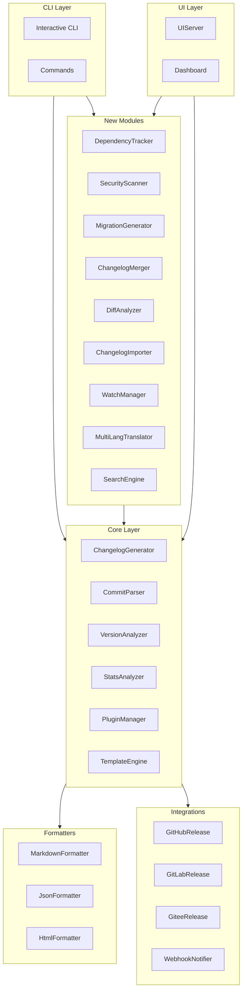
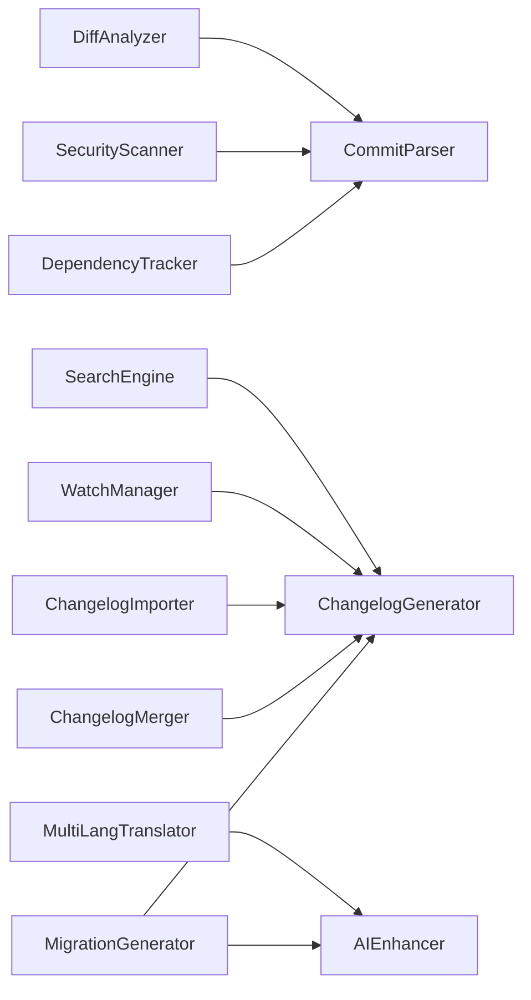

# Design Document

## Overview

本设计文档描述 @ldesign/changelog 工具增强功能的技术架构和实现方案。基于现有的模块化架构，新增依赖追踪、安全扫描、迁移生成、changelog 合并、交互式 CLI、影响分析等功能模块。

## Architecture

### 系统架构图



### 模块依赖关系



## Components and Interfaces

### 1. DependencyTracker (依赖追踪器)

```typescript
interface DependencyChange {
  name: string
  type: 'added' | 'updated' | 'removed'
  oldVersion?: string
  newVersion?: string
  dependencyType: 'dependencies' | 'devDependencies' | 'peerDependencies' | 'optionalDependencies'
}

interface DependencyTrackerOptions {
  /** 要追踪的文件模式 */
  patterns: string[]
  /** 是否包含 devDependencies */
  includeDevDependencies: boolean
  /** 是否包含 peerDependencies */
  includePeerDependencies: boolean
  /** 是否显示版本范围变化 */
  showVersionRange: boolean
}

interface DependencyTracker {
  /** 从提交中提取依赖变更 */
  extractChanges(commits: ParsedCommit[]): Promise<DependencyChange[]>
  /** 对比两个版本的依赖差异 */
  diffDependencies(fromRef: string, toRef: string): Promise<DependencyChange[]>
  /** 格式化依赖变更为 changelog 条目 */
  formatChanges(changes: DependencyChange[]): ChangelogSection
}
```

### 2. SecurityScanner (安全扫描器)

```typescript
interface SecurityIssue {
  commitHash: string
  type: 'fix' | 'vulnerability' | 'advisory'
  severity: 'low' | 'medium' | 'high' | 'critical'
  cveId?: string
  description: string
  affectedComponent?: string
}

interface SecurityScannerOptions {
  /** 安全关键词列表 */
  keywords: string[]
  /** CVE 模式匹配 */
  cvePattern: RegExp
  /** 是否查询 CVE 数据库获取详情 */
  fetchCveDetails: boolean
  /** 严重性关键词映射 */
  severityKeywords: Record<string, string[]>
}

interface SecurityScanner {
  /** 扫描提交中的安全问题 */
  scan(commits: ParsedCommit[]): Promise<SecurityIssue[]>
  /** 获取 CVE 详情 */
  getCveDetails(cveId: string): Promise<CveDetails | null>
  /** 生成安全报告 */
  generateReport(issues: SecurityIssue[]): SecurityReport
}
```

### 3. MigrationGenerator (迁移指南生成器)

```typescript
interface MigrationEntry {
  version: string
  breakingChanges: BreakingChange[]
  migrationSteps: MigrationStep[]
  codeExamples: CodeExample[]
  affectedApis: string[]
}

interface MigrationStep {
  order: number
  title: string
  description: string
  codeExample?: CodeExample
  automated: boolean
}

interface CodeExample {
  language: string
  before: string
  after: string
  description?: string
}

interface MigrationGeneratorOptions {
  /** 是否使用 AI 生成详细步骤 */
  useAI: boolean
  /** 输出格式 */
  format: 'markdown' | 'json'
  /** 是否包含代码示例 */
  includeCodeExamples: boolean
  /** 模板路径 */
  template?: string
}

interface MigrationGenerator {
  /** 从 changelog 内容生成迁移指南 */
  generate(content: ChangelogContent): Promise<MigrationEntry[]>
  /** 使用 AI 增强迁移步骤 */
  enhanceWithAI(entry: MigrationEntry): Promise<MigrationEntry>
  /** 渲染迁移指南 */
  render(entries: MigrationEntry[]): string
}
```

### 4. ChangelogMerger (Changelog 合并器)

```typescript
interface MergeSource {
  path: string
  packageName?: string
  format: 'markdown' | 'json' | 'auto'
}

interface MergeOptions {
  /** 合并策略 */
  strategy: 'by-date' | 'by-version' | 'by-package'
  /** 是否去重 */
  deduplicate: boolean
  /** 去重键 */
  deduplicateKey: 'hash' | 'message' | 'both'
  /** 是否保留包名前缀 */
  preservePackagePrefix: boolean
  /** 输出格式 */
  outputFormat: 'markdown' | 'json'
}

interface ChangelogMerger {
  /** 合并多个 changelog */
  merge(sources: MergeSource[], options: MergeOptions): Promise<ChangelogContent>
  /** 解析 changelog 文件 */
  parse(source: MergeSource): Promise<ChangelogContent>
  /** 去重条目 */
  deduplicate(entries: ChangelogEntry[]): ChangelogEntry[]
}
```

### 5. InteractiveCLI (交互式 CLI)

```typescript
interface InteractiveAction {
  name: string
  description: string
  handler: () => Promise<void>
}

interface InteractivePrompt {
  type: 'select' | 'multiselect' | 'input' | 'confirm' | 'autocomplete'
  message: string
  choices?: Choice[]
  default?: unknown
  validate?: (value: unknown) => boolean | string
}

interface InteractiveCLIOptions {
  /** 主题配置 */
  theme: 'default' | 'minimal' | 'colorful'
  /** 是否显示帮助提示 */
  showHints: boolean
  /** 键盘快捷键 */
  shortcuts: Record<string, string>
}

interface InteractiveCLI {
  /** 显示主菜单 */
  showMainMenu(): Promise<void>
  /** 运行生成向导 */
  runGenerateWizard(): Promise<void>
  /** 运行发布向导 */
  runReleaseWizard(): Promise<void>
  /** 显示预览 */
  showPreview(content: string): Promise<void>
  /** 确认操作 */
  confirm(message: string): Promise<boolean>
}
```

### 6. DiffAnalyzer (差异分析器)

```typescript
interface ChangeImpact {
  filesChanged: number
  linesAdded: number
  linesRemoved: number
  affectedModules: string[]
  riskScore: number
  riskLevel: 'low' | 'medium' | 'high'
  riskFactors: string[]
}

interface ModuleImpact {
  name: string
  filesChanged: number
  changePercentage: number
  isCore: boolean
}

interface DiffAnalyzerOptions {
  /** 核心模块路径模式 */
  coreModulePatterns: string[]
  /** 风险评分权重 */
  riskWeights: {
    coreModuleChange: number
    largeRefactor: number
    breakingChange: number
    securityChange: number
  }
  /** 大型重构阈值（文件数） */
  largeRefactorThreshold: number
}

interface DiffAnalyzer {
  /** 分析变更影响 */
  analyze(fromRef: string, toRef: string): Promise<ChangeImpact>
  /** 获取模块影响 */
  getModuleImpacts(commits: ParsedCommit[]): ModuleImpact[]
  /** 计算风险评分 */
  calculateRiskScore(impact: ChangeImpact): number
  /** 生成影响摘要 */
  generateSummary(impact: ChangeImpact): string
}
```

### 7. ChangelogImporter (Changelog 导入器)

```typescript
interface ImportSource {
  path: string
  format: 'keep-a-changelog' | 'conventional-changelog' | 'plain-markdown' | 'auto'
}

interface ImportOptions {
  /** 是否保留原始日期 */
  preserveDates: boolean
  /** 是否保留原始版本号 */
  preserveVersions: boolean
  /** 日期格式 */
  dateFormat: string
  /** 版本号前缀 */
  versionPrefix: string
}

interface ImportResult {
  success: boolean
  entries: ChangelogEntry[]
  errors: ImportError[]
  warnings: string[]
}

interface ChangelogImporter {
  /** 导入 changelog */
  import(source: ImportSource, options: ImportOptions): Promise<ImportResult>
  /** 检测格式 */
  detectFormat(content: string): string
  /** 验证导入结果 */
  validate(result: ImportResult): ValidationResult
}
```

### 8. WatchManager (监视管理器)

```typescript
interface WatchOptions {
  /** 监视间隔（毫秒） */
  interval: number
  /** 是否立即执行 */
  immediate: boolean
  /** 状态文件路径 */
  stateFile: string
  /** 触发条件 */
  triggers: ('commit' | 'tag' | 'schedule')[]
  /** Cron 表达式 */
  cron?: string
}

interface WatchState {
  lastCommit: string
  lastRun: Date
  runCount: number
}

interface WatchManager {
  /** 启动监视 */
  start(options: WatchOptions): Promise<void>
  /** 停止监视 */
  stop(): void
  /** 获取状态 */
  getState(): WatchState
  /** 手动触发 */
  trigger(): Promise<void>
  /** 注册回调 */
  onGenerate(callback: (content: ChangelogContent) => void): void
}
```

### 9. MultiLangTranslator (多语言翻译器)

```typescript
interface TranslationOptions {
  /** 目标语言列表 */
  targetLanguages: string[]
  /** 翻译提供者 */
  provider: 'ai' | 'google' | 'deepl'
  /** 是否保留原文 */
  preserveOriginal: boolean
  /** 术语表 */
  glossary?: Record<string, Record<string, string>>
  /** 输出文件命名模式 */
  outputPattern: string
}

interface TranslationResult {
  language: string
  content: ChangelogContent
  outputPath: string
}

interface MultiLangTranslator {
  /** 翻译 changelog */
  translate(content: ChangelogContent, options: TranslationOptions): Promise<TranslationResult[]>
  /** 翻译单个条目 */
  translateEntry(entry: ChangelogEntry, targetLang: string): Promise<ChangelogEntry>
  /** 格式化日期 */
  formatDate(date: Date, locale: string): string
  /** 格式化数字 */
  formatNumber(num: number, locale: string): string
}
```

### 10. SearchEngine (搜索引擎)

```typescript
interface SearchQuery {
  /** 关键词 */
  keyword?: string
  /** 版本范围 */
  versionRange?: { from?: string; to?: string }
  /** 日期范围 */
  dateRange?: { from?: Date; to?: Date }
  /** 类型过滤 */
  types?: string[]
  /** 作用域过滤 */
  scopes?: string[]
  /** 作者过滤 */
  authors?: string[]
  /** 排序方式 */
  sortBy?: 'date' | 'type' | 'relevance'
  /** 排序方向 */
  sortOrder?: 'asc' | 'desc'
  /** 分页 */
  pagination?: { page: number; pageSize: number }
}

interface SearchResult {
  entries: ChangelogEntry[]
  total: number
  page: number
  pageSize: number
  hasMore: boolean
}

interface SearchEngine {
  /** 搜索 changelog */
  search(query: SearchQuery): Promise<SearchResult>
  /** 建立索引 */
  buildIndex(content: ChangelogContent): void
  /** 获取建议 */
  getSuggestions(partial: string): string[]
  /** 高亮匹配 */
  highlight(text: string, keyword: string): string
}
```

## Data Models

### 扩展的 ChangelogContent

```typescript
interface ExtendedChangelogContent extends ChangelogContent {
  /** 依赖变更 */
  dependencyChanges?: DependencyChange[]
  /** 安全问题 */
  securityIssues?: SecurityIssue[]
  /** 迁移指南 */
  migrationGuide?: MigrationEntry
  /** 变更影响 */
  changeImpact?: ChangeImpact
  /** 翻译版本 */
  translations?: Record<string, ChangelogContent>
}
```

### 配置扩展

```typescript
interface ExtendedChangelogConfig extends ChangelogConfig {
  /** 依赖追踪配置 */
  dependencyTracking?: DependencyTrackerOptions
  /** 安全扫描配置 */
  securityScanning?: SecurityScannerOptions
  /** 迁移生成配置 */
  migrationGeneration?: MigrationGeneratorOptions
  /** 合并配置 */
  merge?: MergeOptions
  /** 交互式 CLI 配置 */
  interactive?: InteractiveCLIOptions
  /** 影响分析配置 */
  impactAnalysis?: DiffAnalyzerOptions
  /** 导入配置 */
  import?: ImportOptions
  /** 监视配置 */
  watch?: WatchOptions
  /** 多语言配置 */
  multiLang?: TranslationOptions
  /** 搜索配置 */
  search?: {
    enabled: boolean
    indexPath?: string
  }
}
```


## Correctness Properties

*A property is a characteristic or behavior that should hold true across all valid executions of a system—essentially, a formal statement about what the system should do. Properties serve as the bridge between human-readable specifications and machine-verifiable correctness guarantees.*

### Property 1: Dependency Change Detection and Recording

*For any* set of commits containing package.json modifications, the DependencyTracker SHALL correctly identify all added, updated, and removed dependencies with accurate version information.

**Validates: Requirements 1.1, 1.2, 1.3, 1.4**

### Property 2: Security Issue Identification

*For any* commit message containing security-related keywords (security, vulnerability, CVE, XSS, SQL injection, etc.), the SecurityScanner SHALL identify it as a security-related commit and assign appropriate severity.

**Validates: Requirements 2.1, 2.2**

### Property 3: Security Section Ordering

*For any* changelog containing security issues, the Security section SHALL appear before all other change type sections in the output.

**Validates: Requirements 2.3, 2.4**

### Property 4: Migration Guide Generation

*For any* breaking change commit with a description in the commit body, the MigrationGenerator SHALL create a migration entry containing the extracted description and organize entries by scope.

**Validates: Requirements 3.1, 3.2, 3.4, 3.5**

### Property 5: Changelog Merge Correctness

*For any* set of changelog files in supported formats (Markdown, JSON), the ChangelogMerger SHALL produce a merged result that:
- Contains all unique entries from all sources
- Groups entries correctly by the configured strategy
- Preserves package/scope information
- Removes duplicates based on commit hash

**Validates: Requirements 4.2, 4.3, 4.4, 4.5, 4.6**

### Property 6: Commit Validation Feedback

*For any* invalid commit message, the CommitParser SHALL provide specific feedback identifying:
- Which validation rule was violated
- The expected format or value
- Suggestions for correction when fix flag is enabled

**Validates: Requirements 7.2, 7.3, 7.4, 7.5, 7.6**

### Property 7: Import Format Round-Trip

*For any* valid changelog in Keep a Changelog, conventional-changelog, or plain Markdown format, importing and then exporting SHALL preserve:
- All version numbers
- All dates
- All change entries with their types and descriptions

**Validates: Requirements 8.2, 8.3, 8.4, 8.5**

### Property 8: Watch Mode Incremental Processing

*For any* sequence of commits, the WatchManager SHALL:
- Process only commits newer than the last processed commit
- Update the state file with the latest processed commit
- Skip generation when no new commits exist

**Validates: Requirements 9.2, 9.4, 9.5**

### Property 9: Multi-Language Output Consistency

*For any* changelog content translated to multiple languages:
- All language versions SHALL have the same structure (sections, entry count)
- Date and number formats SHALL match the target locale
- Output file names SHALL follow the configured pattern

**Validates: Requirements 10.1, 10.3, 10.4, 10.5**

### Property 10: Search and Filter Correctness

*For any* search query with filters (keyword, version range, date range, type, scope):
- All returned entries SHALL match ALL specified filter criteria
- Results SHALL be sorted according to the specified sort option
- Pagination SHALL return correct subsets with accurate total count

**Validates: Requirements 11.1, 11.2, 11.3, 11.5, 11.6**

### Property 11: Risk Score Calculation

*For any* set of changes, the DiffAnalyzer SHALL calculate a risk score where:
- Core module changes increase the score
- Large refactors (above threshold) increase the score
- Breaking changes increase the score
- The risk level (low/medium/high) correctly reflects the score

**Validates: Requirements 6.1, 6.3, 6.4, 6.5**

### Property 12: Affected Module Identification

*For any* set of file changes, the DiffAnalyzer SHALL correctly identify all affected modules based on file paths and the configured module patterns.

**Validates: Requirements 6.2, 6.6**

## Error Handling

### DependencyTracker Errors

| Error Type | Condition | Handling |
|------------|-----------|----------|
| ParseError | Invalid package.json format | Log warning, skip file, continue processing |
| GitError | Cannot read file from commit | Log error with commit hash, continue with other commits |
| VersionParseError | Invalid version string | Record as "unknown" version, log warning |

### SecurityScanner Errors

| Error Type | Condition | Handling |
|------------|-----------|----------|
| NetworkError | CVE database unreachable | Use cached data or skip CVE details, log warning |
| RateLimitError | API rate limit exceeded | Queue request for retry, continue without details |

### MigrationGenerator Errors

| Error Type | Condition | Handling |
|------------|-----------|----------|
| AIError | AI service unavailable | Fall back to basic extraction, log warning |
| TemplateError | Invalid template syntax | Use default template, log error |

### ChangelogMerger Errors

| Error Type | Condition | Handling |
|------------|-----------|----------|
| FileNotFoundError | Source file doesn't exist | Log error, skip source, continue with others |
| ParseError | Invalid changelog format | Log error with details, skip source |
| ConflictError | Merge conflict detected | Use configured resolution strategy |

### ChangelogImporter Errors

| Error Type | Condition | Handling |
|------------|-----------|----------|
| FormatDetectionError | Cannot detect format | Ask user or use default parser |
| PartialParseError | Some entries failed to parse | Return valid entries, report errors |

### WatchManager Errors

| Error Type | Condition | Handling |
|------------|-----------|----------|
| StateFileError | Cannot read/write state | Create new state, log warning |
| GitError | Cannot fetch commits | Retry with backoff, log error |

### SearchEngine Errors

| Error Type | Condition | Handling |
|------------|-----------|----------|
| IndexError | Index corrupted | Rebuild index automatically |
| QueryParseError | Invalid query syntax | Return error with syntax help |

## Testing Strategy

### Unit Tests

Unit tests focus on specific examples and edge cases:

1. **DependencyTracker**
   - Parse valid package.json diff
   - Handle malformed JSON
   - Detect all dependency types

2. **SecurityScanner**
   - Detect various security keywords
   - Parse CVE IDs correctly
   - Assign correct severity levels

3. **MigrationGenerator**
   - Extract breaking change descriptions
   - Group by scope correctly
   - Handle missing descriptions

4. **ChangelogMerger**
   - Merge two simple changelogs
   - Handle empty changelogs
   - Deduplicate correctly

5. **DiffAnalyzer**
   - Calculate correct line counts
   - Identify core modules
   - Calculate risk scores

6. **ChangelogImporter**
   - Import Keep a Changelog format
   - Import conventional-changelog format
   - Handle partial failures

7. **SearchEngine**
   - Search by keyword
   - Filter by date range
   - Paginate results

### Property-Based Tests

Property-based tests use fast-check library with minimum 100 iterations per test:

1. **Property 1 Test**: Generate random package.json diffs, verify all changes detected
2. **Property 2 Test**: Generate commits with random security keywords, verify detection
3. **Property 3 Test**: Generate changelogs with security issues, verify section ordering
4. **Property 4 Test**: Generate breaking change commits, verify migration entries
5. **Property 5 Test**: Generate changelog sets, verify merge correctness
6. **Property 6 Test**: Generate invalid commits, verify feedback specificity
7. **Property 7 Test**: Generate changelogs in various formats, verify round-trip
8. **Property 8 Test**: Generate commit sequences, verify incremental processing
9. **Property 9 Test**: Generate multi-language outputs, verify consistency
10. **Property 10 Test**: Generate search queries, verify filter correctness
11. **Property 11 Test**: Generate change sets, verify risk score calculation
12. **Property 12 Test**: Generate file changes, verify module identification

### Test Configuration

```typescript
// vitest.config.ts
export default defineConfig({
  test: {
    include: ['__tests__/**/*.test.ts'],
    coverage: {
      provider: 'v8',
      reporter: ['text', 'json', 'html'],
      exclude: ['node_modules', 'dist', '__tests__']
    }
  }
})
```

### Property Test Example

```typescript
import { fc } from 'fast-check'
import { describe, it, expect } from 'vitest'

describe('DependencyTracker', () => {
  // Feature: changelog-enhancement, Property 1: Dependency Change Detection
  it('should detect all dependency changes', () => {
    fc.assert(
      fc.property(
        fc.array(arbitraryPackageJsonDiff()),
        (diffs) => {
          const tracker = new DependencyTracker()
          const changes = tracker.extractChanges(diffs)
          
          // All added deps should be recorded
          const addedInDiffs = diffs.flatMap(d => d.added)
          const addedInChanges = changes.filter(c => c.type === 'added')
          expect(addedInChanges.length).toBe(addedInDiffs.length)
          
          // All removed deps should be recorded
          const removedInDiffs = diffs.flatMap(d => d.removed)
          const removedInChanges = changes.filter(c => c.type === 'removed')
          expect(removedInChanges.length).toBe(removedInDiffs.length)
          
          return true
        }
      ),
      { numRuns: 100 }
    )
  })
})
```
