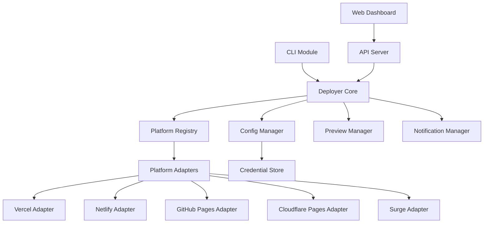

# 设计文档

## 概述

本设计文档描述了 @ldesign/deployer 部署工具的增强方案，包括新增开源托管平台支持、优化命令行交互体验、提供可视化操作界面等功能。设计遵循现有项目的分层架构，保持高内聚低耦合的原则。

## 架构设计

### 整体架构

```
┌─────────────────────────────────────────────────────────────┐
│                    Presentation Layer                        │
│  ┌─────────────┐  ┌─────────────┐  ┌─────────────────────┐  │
│  │ CLI Module  │  │ Web Dashboard│  │ API Server         │  │
│  │ (Enhanced)  │  │ (Vue 3)      │  │ (Express/Fastify)  │  │
│  └─────────────┘  └─────────────┘  └─────────────────────┘  │
├─────────────────────────────────────────────────────────────┤
│                    Business Layer                            │
│  ┌─────────────┐  ┌─────────────┐  ┌─────────────────────┐  │
│  │ Deployer    │  │ Platform    │  │ Config Manager     │  │
│  │ Core        │  │ Registry    │  │ (Enhanced)         │  │
│  └─────────────┘  └─────────────┘  └─────────────────────┘  │
│  ┌─────────────┐  ┌─────────────┐  ┌─────────────────────┐  │
│  │ Preview     │  │ Notification│  │ Report Generator   │  │
│  │ Manager     │  │ Manager     │  │ (Enhanced)         │  │
│  └─────────────┘  └─────────────┘  └─────────────────────┘  │
├─────────────────────────────────────────────────────────────┤
│                    Platform Adapters                         │
│  ┌────────┐ ┌────────┐ ┌────────┐ ┌────────┐ ┌────────────┐ │
│  │ Vercel │ │Netlify │ │ GitHub │ │Cloudflare│ │ Surge     │ │
│  │Adapter │ │Adapter │ │ Pages  │ │ Pages   │ │ Adapter   │ │
│  └────────┘ └────────┘ └────────┘ └────────┘ └────────────┘ │
│  ┌────────┐ ┌────────┐ ┌────────┐                           │
│  │  SSH   │ │  ECS   │ │CloudRun│                           │
│  │Deployer│ │Deployer│ │Deployer│                           │
│  └────────┘ └────────┘ └────────┘                           │
├─────────────────────────────────────────────────────────────┤
│                    Infrastructure Layer                      │
│  ┌─────────────┐  ┌─────────────┐  ┌─────────────────────┐  │
│  │ Credential  │  │ Logger      │  │ Progress Reporter   │  │
│  │ Store       │  │ (Enhanced)  │  │ (Enhanced)          │  │
│  └─────────────┘  └─────────────┘  └─────────────────────┘  │
└─────────────────────────────────────────────────────────────┘
```

### 模块依赖关系



## 组件和接口

### 1. 平台适配器接口

所有平台适配器实现统一的 `PlatformAdapter` 接口：

```typescript
/**
 * 平台适配器基础接口
 */
interface PlatformAdapter {
  /** 平台标识 */
  readonly id: string
  /** 平台名称 */
  readonly name: string
  /** 平台图标 */
  readonly icon: string
  
  /**
   * 验证凭证
   */
  validateCredentials(credentials: PlatformCredentials): Promise<ValidationResult>
  
  /**
   * 执行部署
   */
  deploy(options: DeployOptions): Promise<DeployResult>
  
  /**
   * 创建预览部署
   */
  createPreview(options: PreviewOptions): Promise<PreviewResult>
  
  /**
   * 提升预览到生产
   */
  promotePreview(previewId: string): Promise<DeployResult>
  
  /**
   * 获取部署状态
   */
  getStatus(deploymentId: string): Promise<DeploymentStatus>
  
  /**
   * 回滚部署
   */
  rollback(deploymentId: string): Promise<RollbackResult>
  
  /**
   * 删除部署
   */
  delete(deploymentId: string): Promise<void>
}
```

### 2. Vercel 适配器

```typescript
/**
 * Vercel 平台适配器
 */
class VercelAdapter implements PlatformAdapter {
  readonly id = 'vercel'
  readonly name = 'Vercel'
  readonly icon = '▲'
  
  private apiClient: VercelAPIClient
  
  constructor(config: VercelConfig) {
    this.apiClient = new VercelAPIClient(config.token)
  }
  
  async deploy(options: DeployOptions): Promise<DeployResult> {
    // 1. 创建部署
    // 2. 上传文件
    // 3. 等待构建完成
    // 4. 返回部署 URL
  }
}

interface VercelConfig {
  token: string
  teamId?: string
  projectId?: string
}
```

### 3. Netlify 适配器

```typescript
/**
 * Netlify 平台适配器
 */
class NetlifyAdapter implements PlatformAdapter {
  readonly id = 'netlify'
  readonly name = 'Netlify'
  readonly icon = '◆'
  
  private apiClient: NetlifyAPIClient
  
  constructor(config: NetlifyConfig) {
    this.apiClient = new NetlifyAPIClient(config.token)
  }
  
  async deploy(options: DeployOptions): Promise<DeployResult> {
    // 1. 获取或创建站点
    // 2. 创建部署
    // 3. 上传文件（支持增量部署）
    // 4. 返回部署 URL
  }
}

interface NetlifyConfig {
  token: string
  siteId?: string
}
```

### 4. GitHub Pages 适配器

```typescript
/**
 * GitHub Pages 平台适配器
 */
class GitHubPagesAdapter implements PlatformAdapter {
  readonly id = 'github-pages'
  readonly name = 'GitHub Pages'
  readonly icon = '🐙'
  
  private octokit: Octokit
  
  constructor(config: GitHubPagesConfig) {
    this.octokit = new Octokit({ auth: config.token })
  }
  
  async deploy(options: DeployOptions): Promise<DeployResult> {
    // 1. 检查仓库配置
    // 2. 创建或更新 gh-pages 分支
    // 3. 推送文件
    // 4. 触发 Pages 构建
    // 5. 返回 Pages URL
  }
}

interface GitHubPagesConfig {
  token: string
  owner: string
  repo: string
  branch?: string  // 默认 gh-pages
}
```

### 5. Cloudflare Pages 适配器

```typescript
/**
 * Cloudflare Pages 平台适配器
 */
class CloudflarePagesAdapter implements PlatformAdapter {
  readonly id = 'cloudflare-pages'
  readonly name = 'Cloudflare Pages'
  readonly icon = '☁️'
  
  private apiClient: CloudflareAPIClient
  
  constructor(config: CloudflarePagesConfig) {
    this.apiClient = new CloudflareAPIClient(config.apiToken, config.accountId)
  }
  
  async deploy(options: DeployOptions): Promise<DeployResult> {
    // 1. 获取或创建项目
    // 2. 创建部署
    // 3. 上传文件
    // 4. 返回部署 URL
  }
}

interface CloudflarePagesConfig {
  apiToken: string
  accountId: string
  projectName?: string
}
```

### 6. Surge 适配器

```typescript
/**
 * Surge.sh 平台适配器
 */
class SurgeAdapter implements PlatformAdapter {
  readonly id = 'surge'
  readonly name = 'Surge.sh'
  readonly icon = '⚡'
  
  constructor(config: SurgeConfig) {
    // Surge 使用 CLI 认证
  }
  
  async deploy(options: DeployOptions): Promise<DeployResult> {
    // 1. 调用 surge CLI
    // 2. 解析输出获取 URL
    // 3. 返回部署结果
  }
}

interface SurgeConfig {
  domain?: string  // 自定义域名
  token?: string   // 可选的 token
}
```

### 7. 平台注册表

```typescript
/**
 * 平台注册表 - 管理所有平台适配器
 */
class PlatformRegistry {
  private static instance: PlatformRegistry
  private adapters: Map<string, PlatformAdapter> = new Map()
  
  static getInstance(): PlatformRegistry {
    if (!this.instance) {
      this.instance = new PlatformRegistry()
    }
    return this.instance
  }
  
  /**
   * 注册平台适配器
   */
  register(adapter: PlatformAdapter): void {
    this.adapters.set(adapter.id, adapter)
  }
  
  /**
   * 获取平台适配器
   */
  get(platformId: string): PlatformAdapter | undefined {
    return this.adapters.get(platformId)
  }
  
  /**
   * 获取所有平台
   */
  getAll(): PlatformAdapter[] {
    return Array.from(this.adapters.values())
  }
  
  /**
   * 初始化内置平台
   */
  initializeBuiltIn(credentials: CredentialStore): void {
    // 根据已配置的凭证初始化适配器
  }
}
```

### 8. 凭证存储

```typescript
/**
 * 凭证安全存储
 */
class CredentialStore {
  private encryptionKey: string
  private storePath: string
  
  constructor(options: CredentialStoreOptions) {
    this.storePath = options.storePath || '~/.ldesign/credentials.enc'
    this.encryptionKey = this.deriveKey(options.masterPassword)
  }
  
  /**
   * 存储凭证
   */
  async set(platformId: string, credentials: PlatformCredentials): Promise<void> {
    // 加密并存储
  }
  
  /**
   * 获取凭证
   */
  async get(platformId: string): Promise<PlatformCredentials | null> {
    // 解密并返回
  }
  
  /**
   * 删除凭证
   */
  async delete(platformId: string): Promise<void> {
    // 删除指定平台凭证
  }
  
  /**
   * 导出配置（不含敏感信息）
   */
  async exportSafe(): Promise<SafeConfig> {
    // 导出不含凭证的配置
  }
}
```

### 9. 增强的 CLI 界面

```typescript
/**
 * 增强的 CLI 输出管理器
 */
class EnhancedCLI {
  private spinner: Ora
  private progressBar: ProgressBar
  
  /**
   * 显示进度条
   */
  showProgress(options: ProgressOptions): void {
    // 显示带百分比和 ETA 的进度条
  }
  
  /**
   * 更新进度
   */
  updateProgress(current: number, total: number, message?: string): void {
    // 更新进度条
  }
  
  /**
   * 显示成功消息
   */
  success(message: string): void {
    console.log(chalk.green('✓'), message)
  }
  
  /**
   * 显示错误消息
   */
  error(message: string, suggestion?: string): void {
    console.log(chalk.red('✗'), message)
    if (suggestion) {
      console.log(chalk.yellow('💡'), suggestion)
    }
  }
  
  /**
   * 显示部署摘要
   */
  showDeploySummary(result: DeployResult): void {
    // 格式化显示部署结果
  }
  
  /**
   * 输出 JSON 格式
   */
  outputJSON(data: any): void {
    console.log(JSON.stringify(data, null, 2))
  }
}
```

### 10. Web Dashboard

```typescript
/**
 * Web Dashboard 服务器
 */
class DashboardServer {
  private app: Express
  private port: number
  
  constructor(options: DashboardOptions) {
    this.port = options.port || 3456
    this.app = this.createApp()
  }
  
  /**
   * 启动服务器
   */
  async start(): Promise<void> {
    // 启动 Express 服务器
    // 提供静态文件
    // 设置 API 路由
    // 打开浏览器
  }
  
  /**
   * 创建 Express 应用
   */
  private createApp(): Express {
    const app = express()
    
    // 静态文件
    app.use(express.static(path.join(__dirname, 'dashboard/dist')))
    
    // API 路由
    app.use('/api', this.createAPIRouter())
    
    // WebSocket 用于实时更新
    this.setupWebSocket(app)
    
    return app
  }
}
```

## 数据模型

### 部署配置扩展

```typescript
/**
 * 扩展的部署配置
 */
interface ExtendedDeployConfig extends DeployConfig {
  /** 目标平台 */
  targetPlatform: PlatformType
  
  /** 平台特定配置 */
  platformConfig?: PlatformSpecificConfig
  
  /** 预览配置 */
  preview?: PreviewConfig
  
  /** 文档站点配置 */
  docs?: DocsConfig
}

type PlatformType = 
  | 'vercel' 
  | 'netlify' 
  | 'github-pages' 
  | 'cloudflare-pages' 
  | 'surge'
  | 'ssh'
  | 'docker'
  | 'kubernetes'

interface PreviewConfig {
  enabled: boolean
  autoExpire?: number  // 预览过期时间（小时）
  requireApproval?: boolean
}

interface DocsConfig {
  type: 'vitepress' | 'docusaurus' | 'custom'
  buildCommand?: string
  outputDir?: string
  customDomain?: string
  versioning?: {
    enabled: boolean
    versions: string[]
  }
}
```

### 部署结果扩展

```typescript
/**
 * 扩展的部署结果
 */
interface ExtendedDeployResult extends DeployResult {
  /** 部署 URL */
  url: string
  
  /** 预览 URL（如果是预览部署） */
  previewUrl?: string
  
  /** 部署 ID */
  deploymentId: string
  
  /** 文件统计 */
  fileStats: {
    total: number
    uploaded: number
    skipped: number
    size: number
  }
  
  /** 构建信息 */
  buildInfo?: {
    duration: number
    logs: string[]
  }
}
```

## 正确性属性

*正确性属性是系统在所有有效执行中都应保持为真的特征或行为。属性作为人类可读规范和机器可验证正确性保证之间的桥梁。*

### 属性 1：平台适配器部署一致性

*对于任意* 平台适配器和有效的部署配置，执行部署操作后应返回包含 URL 和状态的 DeployResult 对象。

**验证: 需求 1.6**

### 属性 2：平台认证错误处理

*对于任意* 平台适配器和无效的凭证，验证凭证操作应返回包含错误描述和修复建议的 ValidationResult 对象。

**验证: 需求 1.7**

### 属性 3：SSH 认证方式支持

*对于任意* SSH 部署配置，无论使用密钥认证还是密码认证，部署器都应成功建立连接或返回明确的认证错误。

**验证: 需求 2.1**

### 属性 4：重试机制指数退避

*对于任意* 失败的部署操作，重试间隔应遵循指数退避策略，即第 n 次重试的等待时间应大于第 n-1 次。

**验证: 需求 2.4**

### 属性 5：并行部署并发控制

*对于任意* 多服务器并行部署，同时进行的部署数量不应超过配置的最大并发数。

**验证: 需求 2.5**

### 属性 6：CLI 输出格式完整性

*对于任意* 部署完成事件，CLI 输出的摘要应包含部署 URL、耗时和文件数量三个必需字段。

**验证: 需求 3.3**

### 属性 7：CLI 状态颜色编码

*对于任意* 部署状态输出，成功状态应使用绿色，错误状态应使用红色，警告状态应使用黄色。

**验证: 需求 3.2**

### 属性 8：JSON 输出有效性

*对于任意* 使用 --json 标志的命令输出，输出内容应为有效的 JSON 格式，解析后再序列化应得到等价的对象。

**验证: 需求 3.6**

### 属性 9：凭证安全存储

*对于任意* 存储的平台凭证，从存储中读取后应能正确解密并与原始凭证相等。

**验证: 需求 5.1**

### 属性 10：配置导出安全性

*对于任意* 导出的配置，导出结果不应包含任何敏感凭证字段（如 token、password、secret）。

**验证: 需求 5.6**

### 属性 11：预览 URL 唯一性

*对于任意* 两个不同的预览部署，它们的预览 URL 应该是不同的。

**验证: 需求 6.2**

### 属性 12：部署前验证阻断

*对于任意* 部署前验证失败的情况，部署操作应被阻止且不应有任何文件被上传到目标平台。

**验证: 需求 6.5**

### 属性 13：文档站点自动检测

*对于任意* 包含 VitePress 或 Docusaurus 配置文件的项目，部署器应正确识别文档类型并使用相应的构建命令。

**验证: 需求 7.1, 7.2**

### 属性 14：通知发送完整性

*对于任意* 部署完成事件和已配置的通知渠道，所有渠道都应收到包含部署状态的通知。

**验证: 需求 8.1**

### 属性 15：部署报告内容完整性

*对于任意* 生成的部署报告，报告应包含部署耗时、文件变更数量和环境详情三个必需字段。

**验证: 需求 8.2**

## 错误处理

### 错误类型层次

```typescript
/**
 * 部署错误基类
 */
class DeployError extends Error {
  code: string
  suggestion?: string
  
  constructor(message: string, code: string, suggestion?: string) {
    super(message)
    this.code = code
    this.suggestion = suggestion
  }
}

/**
 * 认证错误
 */
class AuthenticationError extends DeployError {
  constructor(platform: string, message: string) {
    super(
      `${platform} 认证失败: ${message}`,
      'AUTH_FAILED',
      `请检查 ${platform} 的 API Token 是否正确，可使用 'ldesign-deployer platforms test ${platform}' 测试连接`
    )
  }
}

/**
 * 网络错误
 */
class NetworkError extends DeployError {
  constructor(message: string) {
    super(
      `网络错误: ${message}`,
      'NETWORK_ERROR',
      '请检查网络连接，或稍后重试'
    )
  }
}

/**
 * 配置错误
 */
class ConfigurationError extends DeployError {
  constructor(field: string, message: string) {
    super(
      `配置错误 [${field}]: ${message}`,
      'CONFIG_ERROR',
      `请检查配置文件中的 '${field}' 字段`
    )
  }
}

/**
 * 验证错误
 */
class ValidationError extends DeployError {
  issues: ValidationIssue[]
  
  constructor(issues: ValidationIssue[]) {
    super(
      `部署前验证失败: 发现 ${issues.length} 个问题`,
      'VALIDATION_FAILED'
    )
    this.issues = issues
  }
}
```

### 错误恢复策略

```typescript
/**
 * 错误恢复策略
 */
interface RecoveryStrategy {
  /** 是否可重试 */
  retryable: boolean
  /** 最大重试次数 */
  maxRetries: number
  /** 重试延迟（毫秒） */
  retryDelay: number
  /** 退避策略 */
  backoff: 'linear' | 'exponential'
}

const ERROR_RECOVERY_STRATEGIES: Record<string, RecoveryStrategy> = {
  NETWORK_ERROR: {
    retryable: true,
    maxRetries: 3,
    retryDelay: 1000,
    backoff: 'exponential'
  },
  AUTH_FAILED: {
    retryable: false,
    maxRetries: 0,
    retryDelay: 0,
    backoff: 'linear'
  },
  RATE_LIMITED: {
    retryable: true,
    maxRetries: 5,
    retryDelay: 5000,
    backoff: 'exponential'
  }
}
```

## 测试策略

### 单元测试

- 测试各平台适配器的 API 调用逻辑
- 测试凭证加密/解密功能
- 测试配置解析和验证
- 测试 CLI 输出格式化

### 属性测试

- 使用 fast-check 进行属性测试
- 每个属性测试至少运行 100 次迭代
- 测试标签格式: **Feature: deployer-enhancement, Property {number}: {property_text}**

### 集成测试

- 测试完整的部署流程（使用模拟服务器）
- 测试 Dashboard API 端点
- 测试 WebSocket 实时更新

### 端到端测试

- 使用 Playwright 测试 Dashboard UI
- 测试 CLI 命令的完整执行流程

