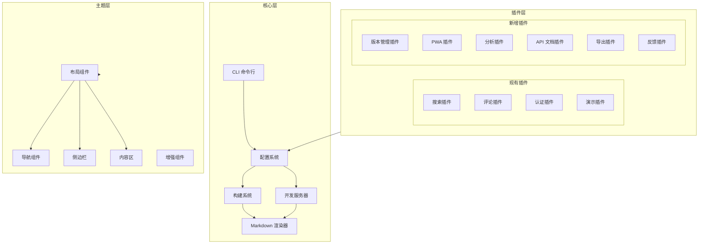
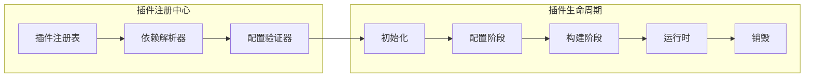

# Design Document: @ldesign/doc 文档系统增强

## Overview

本设计文档描述了 @ldesign/doc 文档系统的优化和功能增强方案。基于现有的插件化架构，我们将通过新增插件、增强核心功能和优化现有组件来实现这些改进。

设计原则：
1. **向后兼容** - 所有新功能都是可选的，不影响现有用户
2. **插件优先** - 尽可能通过插件实现新功能，保持核心精简
3. **渐进增强** - 功能可以逐步启用，按需加载
4. **类型安全** - 所有新 API 都提供完整的 TypeScript 类型定义

## Architecture

### 系统架构图



### 插件系统增强架构



## Components and Interfaces

### 1. 版本管理插件 (versionPlugin)

```typescript
// src/plugins/version/index.ts

export interface VersionConfig {
  /** 版本列表 */
  versions: VersionItem[]
  /** 当前版本 */
  current: string
  /** 版本别名映射 */
  aliases?: Record<string, string>
  /** 版本选择器位置 */
  selectorPosition?: 'nav' | 'sidebar'
  /** 废弃版本警告配置 */
  deprecation?: {
    versions: string[]
    message?: string
  }
}

export interface VersionItem {
  /** 版本号 */
  version: string
  /** 显示标签 */
  label?: string
  /** 文档路径前缀 */
  path: string
  /** 是否为预发布版本 */
  prerelease?: boolean
}

export interface VersionPluginOptions extends VersionConfig {
  /** 版本切换时的回调 */
  onVersionChange?: (from: string, to: string) => void
}

export function versionPlugin(options: VersionPluginOptions): LDocPlugin
```

### 2. 增强搜索插件 (enhancedSearchPlugin)

```typescript
// src/plugins/search-enhanced/index.ts

export interface EnhancedSearchOptions {
  /** 基础搜索配置 */
  ...SearchPluginOptions
  
  /** 模糊匹配配置 */
  fuzzy?: {
    enabled: boolean
    threshold?: number  // 0-1, 默认 0.6
    distance?: number   // 最大编辑距离
  }
  
  /** 中文分词配置 */
  cjk?: {
    enabled: boolean
    segmenter?: 'jieba' | 'nodejieba' | 'custom'
    customDict?: string[]
  }
  
  /** 搜索过滤器 */
  filters?: SearchFilter[]
  
  /** 搜索建议配置 */
  suggestions?: {
    enabled: boolean
    maxSuggestions?: number
  }
  
  /** 搜索历史 */
  history?: {
    enabled: boolean
    maxItems?: number
    storageKey?: string
  }
}

export interface SearchFilter {
  name: string
  label: string
  field: string
  options: FilterOption[]
}

export interface FilterOption {
  value: string
  label: string
}

export function enhancedSearchPlugin(options: EnhancedSearchOptions): LDocPlugin
```

### 3. API 文档生成插件 (apiDocPlugin)

```typescript
// src/plugins/api-doc/index.ts

export interface ApiDocOptions {
  /** TypeScript 源文件路径 */
  include: string[]
  /** 排除路径 */
  exclude?: string[]
  /** 输出目录 */
  outDir?: string
  /** TSDoc 配置 */
  tsdoc?: {
    /** 是否解析 @example 标签 */
    parseExamples?: boolean
    /** 自定义标签 */
    customTags?: string[]
  }
  /** 文档模板 */
  template?: 'default' | 'minimal' | 'detailed'
  /** 分组配置 */
  groups?: ApiGroup[]
  /** 是否生成类型链接 */
  typeLinks?: boolean
}

export interface ApiGroup {
  name: string
  pattern: string
  title: string
}

export interface ApiDocResult {
  modules: ApiModule[]
  types: ApiType[]
  functions: ApiFunction[]
  classes: ApiClass[]
}

export function apiDocPlugin(options: ApiDocOptions): LDocPlugin
```

### 4. PWA 插件 (pwaPlugin)

```typescript
// src/plugins/pwa/index.ts

export interface PWAOptions {
  /** 是否启用 */
  enabled?: boolean
  /** Service Worker 配置 */
  serviceWorker?: {
    /** 缓存策略 */
    strategy?: 'cache-first' | 'network-first' | 'stale-while-revalidate'
    /** 预缓存资源 */
    precache?: string[]
    /** 运行时缓存规则 */
    runtimeCaching?: RuntimeCacheRule[]
  }
  /** Web App Manifest 配置 */
  manifest?: {
    name: string
    shortName?: string
    description?: string
    themeColor?: string
    backgroundColor?: string
    icons?: ManifestIcon[]
  }
  /** 更新提示配置 */
  updatePrompt?: {
    enabled: boolean
    message?: string
    buttonText?: string
  }
}

export interface RuntimeCacheRule {
  urlPattern: RegExp | string
  handler: 'CacheFirst' | 'NetworkFirst' | 'StaleWhileRevalidate'
  options?: {
    cacheName?: string
    expiration?: {
      maxEntries?: number
      maxAgeSeconds?: number
    }
  }
}

export function pwaPlugin(options: PWAOptions): LDocPlugin
```

### 5. 文档分析插件 (analyticsPlugin)

```typescript
// src/plugins/analytics/index.ts

export interface AnalyticsOptions {
  /** 分析提供商 */
  provider: 'google' | 'plausible' | 'umami' | 'custom'
  
  /** Google Analytics 配置 */
  google?: {
    measurementId: string
  }
  
  /** Plausible 配置 */
  plausible?: {
    domain: string
    apiHost?: string
  }
  
  /** Umami 配置 */
  umami?: {
    websiteId: string
    src: string
  }
  
  /** 自定义分析配置 */
  custom?: {
    script?: string
    trackPageView?: (path: string) => void
    trackEvent?: (name: string, data?: Record<string, unknown>) => void
  }
  
  /** 文档健康检查 */
  healthCheck?: {
    enabled: boolean
    /** 检查断链 */
    checkBrokenLinks?: boolean
    /** 检查过期内容 */
    checkOutdated?: {
      enabled: boolean
      maxAgeDays?: number
    }
  }
}

export function analyticsPlugin(options: AnalyticsOptions): LDocPlugin
```

### 6. 反馈插件 (feedbackPlugin)

```typescript
// src/plugins/feedback/index.ts

export interface FeedbackOptions {
  /** 反馈类型 */
  type: 'helpful' | 'rating' | 'form' | 'inline'
  
  /** "是否有帮助" 配置 */
  helpful?: {
    question?: string
    yesText?: string
    noText?: string
    followUp?: {
      enabled: boolean
      placeholder?: string
    }
  }
  
  /** 评分配置 */
  rating?: {
    maxStars?: number
    labels?: string[]
  }
  
  /** 反馈表单配置 */
  form?: {
    fields: FormField[]
    submitText?: string
  }
  
  /** 内联建议配置 */
  inline?: {
    enabled: boolean
    buttonText?: string
  }
  
  /** 反馈存储 */
  storage: {
    type: 'api' | 'github' | 'local'
    endpoint?: string
    githubRepo?: string
  }
  
  /** 显示位置 */
  position?: 'doc-bottom' | 'doc-footer' | 'floating'
}

export interface FormField {
  name: string
  type: 'text' | 'textarea' | 'select' | 'email'
  label: string
  required?: boolean
  options?: string[]
}

export function feedbackPlugin(options: FeedbackOptions): LDocPlugin
```

### 7. 导出插件 (exportPlugin)

```typescript
// src/plugins/export/index.ts

export interface ExportOptions {
  /** 支持的导出格式 */
  formats: ('pdf' | 'epub' | 'html')[]
  
  /** PDF 配置 */
  pdf?: {
    /** 页面大小 */
    pageSize?: 'A4' | 'Letter' | 'Legal'
    /** 页边距 */
    margin?: {
      top?: string
      right?: string
      bottom?: string
      left?: string
    }
    /** 是否包含目录 */
    toc?: boolean
    /** 页眉页脚 */
    headerFooter?: {
      header?: string
      footer?: string
    }
  }
  
  /** EPUB 配置 */
  epub?: {
    title?: string
    author?: string
    cover?: string
    language?: string
  }
  
  /** 单页 HTML 配置 */
  html?: {
    /** 是否内联样式 */
    inlineStyles?: boolean
    /** 是否内联图片 */
    inlineImages?: boolean
  }
  
  /** 导出按钮位置 */
  buttonPosition?: 'nav' | 'doc-top' | 'doc-bottom'
}

export function exportPlugin(options: ExportOptions): LDocPlugin
```

## Data Models

### 搜索索引数据模型

```typescript
interface SearchDocument {
  id: string
  path: string
  title: string
  content: string
  headers: string[]
  tags?: string[]
  category?: string
  lastUpdated?: number
  // 用于过滤
  metadata: Record<string, unknown>
}

interface SearchIndex {
  documents: SearchDocument[]
  invertedIndex: Map<string, Set<string>>
  // 中文分词索引
  cjkIndex?: Map<string, Set<string>>
}
```

### 版本数据模型

```typescript
interface VersionManifest {
  current: string
  versions: {
    version: string
    label: string
    path: string
    releaseDate?: string
    deprecated?: boolean
  }[]
  aliases: Record<string, string>
}
```

### API 文档数据模型

```typescript
interface ApiModule {
  name: string
  path: string
  description?: string
  exports: ApiExport[]
}

interface ApiExport {
  name: string
  kind: 'function' | 'class' | 'interface' | 'type' | 'const' | 'enum'
  signature?: string
  description?: string
  params?: ApiParam[]
  returns?: ApiReturn
  examples?: string[]
  tags?: Record<string, string>
}

interface ApiParam {
  name: string
  type: string
  description?: string
  optional?: boolean
  default?: string
}

interface ApiReturn {
  type: string
  description?: string
}
```


## Correctness Properties

*A property is a characteristic or behavior that should hold true across all valid executions of a system—essentially, a formal statement about what the system should do. Properties serve as the bridge between human-readable specifications and machine-verifiable correctness guarantees.*

### Version Management Properties

**Property 1: Version selector rendering**
*For any* valid version configuration with at least one version, rendering the navigation component SHALL produce HTML containing a version selector element.
**Validates: Requirements 1.1**

**Property 2: Version navigation correctness**
*For any* version selection event, the resulting navigation path SHALL match the configured path for that version.
**Validates: Requirements 1.2**

**Property 3: Multi-version build output**
*For any* build with multiple versions configured, the output directory SHALL contain separate subdirectories for each version with complete documentation.
**Validates: Requirements 1.3**

**Property 4: Version alias resolution**
*For any* version alias, resolving the alias SHALL return the correct version path as defined in the configuration.
**Validates: Requirements 1.4**

**Property 5: Deprecation banner display**
*For any* page in a deprecated version, the rendered HTML SHALL contain a deprecation warning banner.
**Validates: Requirements 1.5**

### Search Properties

**Property 6: Fuzzy search matching**
*For any* search query with up to 2 character typos, the search results SHALL include documents that would match the corrected query.
**Validates: Requirements 2.1**

**Property 7: Search result highlighting**
*For any* search result, the content preview SHALL contain HTML markup highlighting the matched terms.
**Validates: Requirements 2.2**

**Property 8: Search filter application**
*For any* search with active filters, all returned results SHALL satisfy the filter criteria.
**Validates: Requirements 2.3**

**Property 9: CJK word segmentation**
*For any* Chinese text content, the search index SHALL contain segmented tokens that enable partial word matching.
**Validates: Requirements 2.4**

**Property 10: Empty search suggestions**
*For any* search query returning zero results, the search component SHALL provide at least one alternative suggestion or related term.
**Validates: Requirements 2.6**

### API Documentation Properties

**Property 11: TypeScript extraction completeness**
*For any* TypeScript source file, the API documentation generator SHALL extract all exported types, functions, classes, and interfaces.
**Validates: Requirements 3.1**

**Property 12: JSDoc comment parsing**
*For any* exported symbol with JSDoc comments, the generated documentation SHALL include the description, parameters, and return type from the comments.
**Validates: Requirements 3.2**

**Property 13: Module hierarchy navigation**
*For any* set of TypeScript modules, the generated navigation structure SHALL reflect the module hierarchy with correct parent-child relationships.
**Validates: Requirements 3.3**

**Property 14: Type reference linking**
*For any* type reference in API documentation, if the referenced type is documented, a valid link to that type's documentation SHALL be generated.
**Validates: Requirements 3.4**

### Feedback Properties

**Property 15: Feedback data persistence**
*For any* feedback submission, the feedback data SHALL be stored and retrievable with all submitted fields intact.
**Validates: Requirements 4.2**

**Property 16: Contributor display**
*For any* page with contributor metadata, the rendered page SHALL display the contributor information.
**Validates: Requirements 4.5**

### PWA Properties

**Property 17: Service worker generation**
*For any* build with PWA enabled, the output SHALL include a valid service worker file implementing the configured caching strategy.
**Validates: Requirements 5.1**

**Property 18: Web manifest generation**
*For any* PWA configuration, the build output SHALL include a valid web app manifest with all configured properties.
**Validates: Requirements 5.2**

**Property 19: Caching strategy implementation**
*For any* caching strategy configuration, the generated service worker code SHALL implement the specified strategy (cache-first, network-first, or stale-while-revalidate).
**Validates: Requirements 5.4**

### Code Block Properties

**Property 20: Diff highlighting**
*For any* code block with diff syntax (lines starting with + or -), the rendered HTML SHALL apply appropriate CSS classes for added and removed lines.
**Validates: Requirements 6.1**

**Property 21: Code block titles**
*For any* code block with a title annotation, the rendered HTML SHALL include a title element displaying the specified title.
**Validates: Requirements 6.2**

**Property 22: Playground link generation**
*For any* code block with playground enabled, the rendered HTML SHALL include a link to the configured playground URL with the code properly encoded.
**Validates: Requirements 6.3**

**Property 23: Line focus styling**
*For any* code block with focus annotation, non-focused lines SHALL have a dimmed CSS class applied.
**Validates: Requirements 6.4**

**Property 24: Long code collapsing**
*For any* code block exceeding the configured line threshold, the rendered HTML SHALL include a collapse wrapper with expand/collapse functionality.
**Validates: Requirements 6.5**

**Property 25: Code annotations**
*For any* code block with annotation comments, the rendered HTML SHALL include callout elements positioned at the annotated lines.
**Validates: Requirements 6.6**

### Analytics Properties

**Property 26: Analytics script injection**
*For any* analytics provider configuration, the generated HTML SHALL include the correct tracking script for that provider.
**Validates: Requirements 7.2**

**Property 27: Health check report generation**
*For any* documentation build with health check enabled, the system SHALL generate a report listing all broken links and outdated content.
**Validates: Requirements 7.3**

**Property 28: Search query logging**
*For any* search query when analytics is enabled, the query SHALL be logged with timestamp and result count.
**Validates: Requirements 7.4**

### Navigation Properties

**Property 29: Breadcrumb generation**
*For any* page at depth > 1 in the hierarchy, the rendered page SHALL include breadcrumb navigation reflecting the path from root.
**Validates: Requirements 8.1**

**Property 30: Related pages computation**
*For any* page with tags or in a section with multiple pages, the system SHALL compute and display related pages based on content similarity or shared tags.
**Validates: Requirements 8.2**

**Property 31: Tag indexing**
*For any* page with frontmatter tags, the tags SHALL be indexed and the page SHALL appear in tag-based navigation.
**Validates: Requirements 8.3**

**Property 32: Sitemap completeness**
*For any* documentation build with sitemap enabled, the sitemap page SHALL list all non-hidden pages in the documentation.
**Validates: Requirements 8.4**

**Property 33: Previous/Next navigation**
*For any* page in a sequential section, the rendered page SHALL include correct previous and next page links based on the configured order.
**Validates: Requirements 8.5**

**Property 34: Subpage TOC display**
*For any* page with child pages, the rendered page SHALL include a mini table of contents listing the subpages.
**Validates: Requirements 8.6**

### Content Component Properties

**Property 35: Timeline rendering**
*For any* timeline component with event data, the rendered HTML SHALL display events in chronological order with correct dates and descriptions.
**Validates: Requirements 9.1**

**Property 36: Comparison table rendering**
*For any* comparison table data, the rendered HTML SHALL produce a table with correct headers and cell values matching the input data.
**Validates: Requirements 9.2**

**Property 37: Video player chapters**
*For any* video component with chapter markers, the rendered player SHALL include chapter navigation with correct timestamps.
**Validates: Requirements 9.4**

**Property 38: FAQ structure**
*For any* FAQ component with questions, the rendered HTML SHALL include collapsible sections with correct question-answer pairs.
**Validates: Requirements 9.6**

### Performance Properties

**Property 39: Image optimization**
*For any* image in the documentation, the build process SHALL generate optimized versions (WebP) and apply lazy loading attributes.
**Validates: Requirements 10.1**

**Property 40: Code splitting**
*For any* build, the output SHALL contain multiple chunks with shared dependencies extracted into common chunks.
**Validates: Requirements 10.2**

**Property 41: Preload hints**
*For any* page with navigation links, the rendered HTML SHALL include preload hints for likely next pages.
**Validates: Requirements 10.3**

### Security Properties

**Property 42: RBAC enforcement**
*For any* page with role restrictions, access attempts by users without the required role SHALL be denied.
**Validates: Requirements 11.1**

**Property 43: Content encryption round-trip**
*For any* encrypted content, decrypting with the correct key SHALL produce the original content.
**Validates: Requirements 11.2**

**Property 44: Rate limiting**
*For any* API endpoint with rate limiting, requests exceeding the limit SHALL receive a 429 response.
**Validates: Requirements 11.3**

**Property 45: Audit logging**
*For any* access to protected content, an audit log entry SHALL be created with user, timestamp, and resource information.
**Validates: Requirements 11.4**

**Property 46: XSS sanitization**
*For any* user-generated content containing script tags or event handlers, the sanitized output SHALL not contain executable JavaScript.
**Validates: Requirements 11.5**

### Developer Experience Properties

**Property 47: Scaffold file generation**
*For any* scaffold command with a template, the generated files SHALL match the template structure with placeholders replaced.
**Validates: Requirements 12.1**

**Property 48: Documentation linting**
*For any* documentation with broken links or spelling errors, the linter SHALL report all issues with file locations.
**Validates: Requirements 12.3**

**Property 49: Build report generation**
*For any* build, the system SHALL generate a report including page count, bundle sizes, and any warnings.
**Validates: Requirements 12.4**

**Property 50: Build hook execution**
*For any* configured build hooks, the hooks SHALL be executed at the correct lifecycle phase (pre-build or post-build).
**Validates: Requirements 12.5**

### Internationalization Properties

**Property 51: Translation status tracking**
*For any* page with translations, the system SHALL track and report the translation status (up-to-date, outdated, missing) for each locale.
**Validates: Requirements 13.1**

**Property 52: Outdated translation detection**
*For any* source page update, translations of that page SHALL be marked as potentially outdated.
**Validates: Requirements 13.2**

**Property 53: Fallback content resolution**
*For any* missing translation, the system SHALL serve the fallback locale content with a translation notice.
**Validates: Requirements 13.3**

**Property 54: RTL layout application**
*For any* RTL language configuration, the generated CSS SHALL include direction: rtl and appropriate layout adjustments.
**Validates: Requirements 13.5**

### Export Properties

**Property 55: Print stylesheet inclusion**
*For any* page, the rendered HTML SHALL include print-optimized stylesheets.
**Validates: Requirements 14.1**

**Property 56: PDF export completeness**
*For any* PDF export, the generated PDF SHALL contain all content from the source pages with preserved formatting.
**Validates: Requirements 14.2, 14.4**

**Property 57: EPUB structure validity**
*For any* EPUB export, the generated file SHALL be a valid EPUB with correct metadata and chapter structure.
**Validates: Requirements 14.3, 14.4**

**Property 58: Single-page export completeness**
*For any* single-page export, the generated HTML SHALL contain all documentation content with working internal links.
**Validates: Requirements 14.5**

### Plugin System Properties

**Property 59: Plugin dependency resolution**
*For any* plugin with declared dependencies, the system SHALL load dependencies before the dependent plugin.
**Validates: Requirements 15.1**

**Property 60: Plugin configuration validation**
*For any* invalid plugin configuration, the system SHALL provide an error message identifying the invalid fields and expected values.
**Validates: Requirements 15.3**

**Property 61: Plugin composition**
*For any* plugin extending another plugin, the extended plugin's hooks SHALL be called before the extending plugin's hooks.
**Validates: Requirements 15.4**

**Property 62: Plugin conflict detection**
*For any* plugins with conflicting slot registrations or hook priorities, the system SHALL report the conflict with affected plugins and resolution options.
**Validates: Requirements 15.6**

## Error Handling

### Configuration Errors

| Error Type | Detection | User Message | Recovery |
|------------|-----------|--------------|----------|
| Invalid version config | Config validation | "Version configuration is invalid: {details}" | Provide example config |
| Missing required plugin | Dependency resolution | "Plugin '{name}' requires '{dependency}' which is not installed" | Suggest installation command |
| Invalid search options | Plugin initialization | "Search plugin configuration error: {field} must be {type}" | Show valid options |
| API doc source not found | Build start | "TypeScript source files not found at '{path}'" | Check path configuration |

### Runtime Errors

| Error Type | Detection | User Message | Recovery |
|------------|-----------|--------------|----------|
| Search index corruption | Index load | "Search index is corrupted, rebuilding..." | Auto-rebuild index |
| PWA cache failure | Service worker | "Failed to cache resources, offline mode may not work" | Retry on next visit |
| Export generation failure | Export process | "Failed to generate {format}: {reason}" | Provide troubleshooting steps |
| Analytics script blocked | Script load | Silent failure | Graceful degradation |

### Build Errors

| Error Type | Detection | User Message | Recovery |
|------------|-----------|--------------|----------|
| Broken internal links | Link validation | "Found {count} broken links in documentation" | List all broken links |
| Invalid frontmatter | Page parsing | "Invalid frontmatter in '{file}': {error}" | Show line number |
| Image optimization failure | Asset processing | "Failed to optimize image '{path}': {reason}" | Use original image |
| Plugin hook error | Hook execution | "Plugin '{name}' threw error in '{hook}': {message}" | Skip plugin, continue build |

## Testing Strategy

### Unit Tests

Unit tests will focus on:
- Configuration parsing and validation
- Search indexing and query algorithms
- API documentation extraction
- Content transformation functions
- Plugin lifecycle management

### Property-Based Tests

Property-based tests will validate the correctness properties defined above using fast-check library:
- Minimum 100 iterations per property
- Custom generators for complex data types (TypeScript AST, Markdown content, etc.)
- Shrinking enabled for minimal failing examples

### Integration Tests

Integration tests will cover:
- Full build pipeline with various configurations
- Plugin interaction and composition
- Multi-language documentation generation
- Export format generation

### E2E Tests

End-to-end tests using Playwright will verify:
- Search functionality in browser
- Navigation and routing
- PWA installation and offline mode
- Theme switching and responsive layout

### Test Configuration

```typescript
// vitest.config.ts
export default defineConfig({
  test: {
    include: ['src/**/*.test.ts', 'src/**/*.spec.ts'],
    coverage: {
      provider: 'v8',
      reporter: ['text', 'json', 'html'],
      exclude: ['node_modules', 'dist', '**/*.d.ts']
    }
  }
})
```

### Property Test Example

```typescript
import { fc } from 'fast-check'
import { describe, it, expect } from 'vitest'

describe('Search Plugin', () => {
  // Property 8: Search filter application
  it('should return only results matching active filters', () => {
    fc.assert(
      fc.property(
        fc.array(searchDocumentArb),
        fc.record({ category: fc.string() }),
        (documents, filter) => {
          const index = createSearchIndex(documents)
          const results = search(index, '*', { filters: filter })
          
          return results.every(doc => 
            doc.metadata.category === filter.category
          )
        }
      ),
      { numRuns: 100 }
    )
  })
})
```
