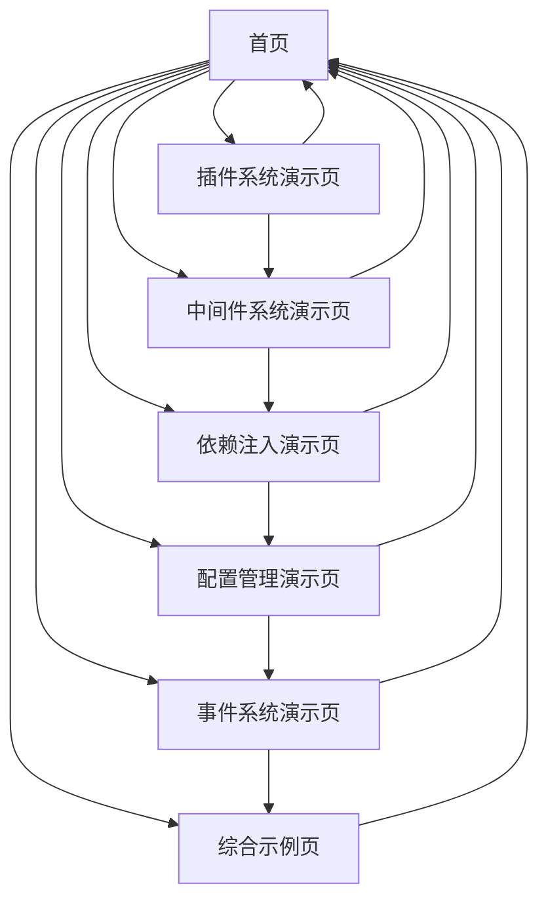

# LDesign Engine 演示应用产品需求文档

## 1. 产品概述

本项目旨在创建一个全面的演示应用，详细展示 @ldesign/engine 的所有核心功能和使用方式。通过交互式的界面和实时的功能演示，帮助开发者深入理解引擎的插件系统、中间件、依赖注入、配置管理、事件系统等企业级特性。

该演示应用将作为 @ldesign/engine 的官方示例项目，为开发者提供最佳实践指导和完整的功能参考。

## 2. 核心功能

### 2.1 用户角色

| 角色     | 访问方式 | 核心权限                                         |
| -------- | -------- | ------------------------------------------------ |
| 默认用户 | 直接访问 | 可以查看所有演示功能、测试所有特性、查看实时状态 |

### 2.2 功能模块

我们的 Engine 演示应用包含以下主要页面：

1. **首页**：引擎概览、功能导航、实时状态监控
2. **插件系统演示页**：插件管理、动态加载、依赖关系展示
3. **中间件系统演示页**：生命周期钩子、中间件执行流程、性能监控
4. **依赖注入演示页**：服务注册、服务注入、服务管理
5. **配置管理演示页**：配置设置、实时更新、配置监听
6. **事件系统演示页**：事件发射、事件监听、事件流可视化
7. **综合示例页**：完整的业务场景演示、最佳实践展示

### 2.3 页面详情

| 页面名称         | 模块名称       | 功能描述                                                  |
| ---------------- | -------------- | --------------------------------------------------------- |
| 首页             | 引擎状态面板   | 显示引擎当前状态、版本信息、已安装插件数量、性能指标      |
| 首页             | 功能导航卡片   | 提供各功能模块的快速入口，包含功能简介和跳转链接          |
| 首页             | 实时日志面板   | 显示引擎运行时的实时日志、事件流、性能数据                |
| 插件系统演示页   | 插件列表管理   | 展示所有可用插件、已安装插件、插件详细信息、安装/卸载操作 |
| 插件系统演示页   | 插件依赖图     | 可视化展示插件之间的依赖关系、加载顺序、优先级            |
| 插件系统演示页   | 动态插件加载   | 演示运行时动态加载插件、热插拔功能、插件配置              |
| 中间件系统演示页 | 生命周期可视化 | 展示引擎生命周期各阶段、中间件执行顺序、执行时间          |
| 中间件系统演示页 | 中间件管理器   | 添加/移除中间件、中间件配置、执行结果查看                 |
| 中间件系统演示页 | 性能监控面板   | 实时监控中间件执行性能、内存使用、执行时长统计            |
| 依赖注入演示页   | 服务注册中心   | 注册新服务、查看已注册服务、服务配置管理                  |
| 依赖注入演示页   | 服务注入演示   | 演示服务注入过程、依赖解析、服务生命周期                  |
| 依赖注入演示页   | 服务监控面板   | 监控服务使用情况、依赖关系图、服务健康状态                |
| 配置管理演示页   | 配置编辑器     | 实时编辑引擎配置、配置验证、配置预览                      |
| 配置管理演示页   | 配置监听器     | 添加配置监听器、查看配置变化历史、监听器管理              |
| 配置管理演示页   | 配置模板库     | 预设配置模板、配置导入导出、配置备份恢复                  |
| 事件系统演示页   | 事件发射器     | 发射自定义事件、事件参数配置、事件类型管理                |
| 事件系统演示页   | 事件监听器     | 添加事件监听器、监听器管理、一次性监听演示                |
| 事件系统演示页   | 事件流可视化   | 实时显示事件流、事件传播路径、事件统计分析                |
| 综合示例页       | 用户管理系统   | 完整的用户CRUD操作、权限管理、状态同步                    |
| 综合示例页       | 主题切换系统   | 动态主题切换、主题配置、样式实时更新                      |
| 综合示例页       | 通知系统       | 消息通知、通知队列、通知历史记录                          |

## 3. 核心流程

### 主要用户操作流程

用户首先进入首页查看引擎整体状态和功能概览，然后可以通过导航访问各个功能演示页面。在每个演示页面中，用户可以进行交互式操作来测试和学习相应功能。最后在综合示例页面查看完整的业务场景应用。

### 页面导航流程图

## 4. 用户界面设计

### 4.1 设计风格

- **主色调**：#007bff (蓝色) 和 #6c757d (灰色)
- **辅助色**：#28a745 (绿色)、#dc3545 (红色)、#ffc107 (黄色)
- **按钮样式**：圆角按钮，支持悬停和点击效果
- **字体**：系统默认字体，标题使用 18px-24px，正文使用 14px-16px
- **布局风格**：卡片式布局，左侧导航栏，顶部状态栏
- **图标风格**：使用 Lucide 图标库，简洁现代的线性图标

### 4.2 页面设计概览

| 页面名称         | 模块名称       | UI元素                                                        |
| ---------------- | -------------- | ------------------------------------------------------------- |
| 首页             | 引擎状态面板   | 状态指示器（绿色/红色圆点）、版本号徽章、统计数字卡片、进度条 |
| 首页             | 功能导航卡片   | 6个功能卡片，每个包含图标、标题、描述、跳转按钮               |
| 首页             | 实时日志面板   | 滚动日志区域、日志级别过滤器、清空按钮、自动滚动开关          |
| 插件系统演示页   | 插件列表管理   | 插件卡片列表、安装/卸载按钮、插件状态标签、搜索过滤器         |
| 插件系统演示页   | 插件依赖图     | SVG依赖关系图、节点拖拽、连接线动画、缩放控制                 |
| 中间件系统演示页 | 生命周期可视化 | 时间轴组件、执行步骤指示器、耗时统计、状态颜色编码            |
| 依赖注入演示页   | 服务注册中心   | 服务列表表格、注册表单、服务类型标签、操作按钮组              |
| 配置管理演示页   | 配置编辑器     | JSON编辑器、语法高亮、实时验证、保存/重置按钮                 |
| 事件系统演示页   | 事件流可视化   | 实时事件流图表、事件气泡动画、统计仪表盘、过滤控制            |
| 综合示例页       | 用户管理系统   | 用户表格、CRUD操作按钮、模态对话框、表单验证提示              |

### 4.3 响应式设计

采用桌面优先的响应式设计，支持平板和移动设备适配。在小屏幕设备上，侧边导航栏会折叠为汉堡菜单，卡片布局会调整为单列显示，确保良好的触摸交互体验。
