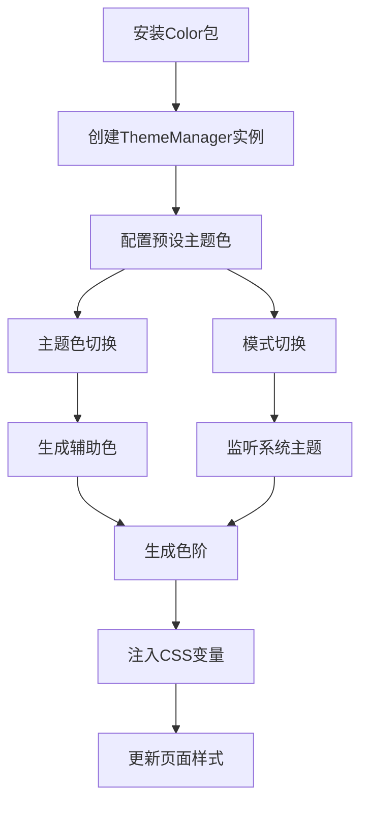

## 1. Product Overview

LDesign Color Package 是一个用于网页主题色管理和自动生成的JavaScript类库。用户通过简单的实例化即可获得完整的主题色管理功能，包括预设主题色配置、动态主题切换、亮暗模式支持以及完整的色阶生成系统。

该包解决了前端开发中主题色管理复杂、色彩搭配困难、暗黑模式适配繁琐等问题，为设计师和开发者提供了一站式的色彩解决方案。

## 2. Core Features

### 2.1 Feature Module

我们的color包需求包含以下主要功能模块：

1. **主题色管理类**：核心ThemeManager类，提供完整的主题色管理功能
2. **色彩生成算法**：基于参考库优化的色彩生成和色阶扩展算法
3. **CSS变量注入**：自动生成CSS变量并注入到页面head中
4. **示例展示页面**：原生JS和Vue两种使用方式的完整示例

### 2.2 Page Details

| Page Name | Module Name | Feature description |
|-----------|-------------|---------------------|
| 主题色管理类 | ThemeManager核心类 | 实例化创建、预设主题色配置、禁用内置预设、获取当前主题色状态 |
| 主题色管理类 | 主题色切换模块 | 动态改变主题色、根据主色调生成warning/success/danger/gray四个辅助色 |
| 主题色管理类 | 模式切换模块 | 亮色模式、暗色模式、系统自动模式、系统主题变化监听 |
| 色彩生成算法 | 色彩生成引擎 | 基于a-nice-red库的色彩生成算法优化、brand/warning/success/danger生成12个色阶、gray生成14个色阶 |
| 色彩生成算法 | 暗黑模式色阶 | 基于arco-design/color算法扩展、支持10+色阶生成、暗黑模式色彩适配 |
| CSS变量注入 | 样式注入模块 | 自动生成CSS变量、动态插入到head标签、实时更新主题样式 |
| 原生JS示例 | 基础功能展示 | 主题色切换演示、暗黑模式切换、完整色阶展示、交互式色彩选择器 |
| Vue示例页面 | 组件化展示 | Vue组件封装、响应式主题切换、组件化色彩展示面板 |

## 3. Core Process

### 主要用户操作流程：

**开发者集成流程：**
1. 安装color包依赖
2. 创建ThemeManager实例，可选配置预设主题色
3. 调用主题切换方法或模式切换方法
4. 系统自动生成色阶并注入CSS变量

**最终用户使用流程：**
1. 访问应用页面
2. 通过UI控件选择主题色或切换亮暗模式
3. 页面实时更新主题样式
4. 查看完整的色彩展示面板

## 4. User Interface Design

### 4.1 Design Style

- **主色调**：支持用户自定义，默认提供蓝色(#1890ff)、绿色(#52c41a)、红色(#f5222d)等预设
- **辅助色**：warning(橙色系)、success(绿色系)、danger(红色系)、gray(灰色系)
- **按钮样式**：现代化圆角按钮，支持主题色动态变化
- **字体**：系统默认字体栈，14px基础字号
- **布局风格**：卡片式布局，清晰的色彩分组展示
- **图标样式**：简洁的线性图标，支持主题色填充

### 4.2 Page Design Overview

| Page Name | Module Name | UI Elements |
|-----------|-------------|-------------|
| 原生JS示例 | 主题切换面板 | 色彩选择器、模式切换按钮、实时预览区域，采用网格布局展示色阶 |
| 原生JS示例 | 色阶展示区 | 12x5网格展示brand/warning/success/danger色阶，14x1展示gray色阶，每个色块显示色值 |
| Vue示例页面 | 组件化面板 | Vue组件封装的主题选择器、响应式布局、动画过渡效果 |
| Vue示例页面 | 交互展示区 | 可点击的色块、悬浮提示、复制色值功能 |

### 4.3 Responsiveness

产品采用桌面优先设计，同时支持移动端适配。在移动设备上色彩展示面板会调整为单列布局，确保色块大小适合触摸操作。支持触摸手势进行主题切换和色彩选择。