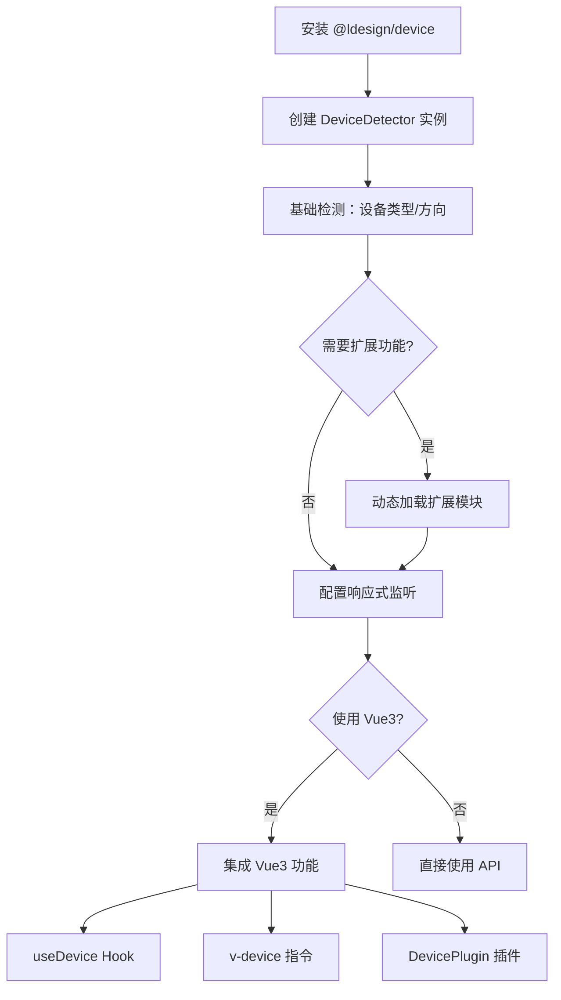

# @ldesign/device 设备信息检测库产品需求文档

## 1. 产品概述

@ldesign/device 是一个现代化的设备信息检测库，通过实例化对象提供设备类型、屏幕方向等信息的获取能力。
- 采用模块化设计，支持按需动态加载设备信息模块，提供响应式监听功能和完整的 Vue3 生态集成。
- 面向现代前端开发者，解决跨设备兼容性检测和响应式设计需求，提升开发效率。

## 2. 核心功能

### 2.1 用户角色

| 角色 | 使用方式 | 核心权限 |
|------|----------|----------|
| 前端开发者 | npm 安装使用 | 可使用所有 API 和 Vue3 集成功能 |
| Vue3 开发者 | 插件/组合式 API | 可使用 hooks、指令、插件、组件等便捷功能 |

### 2.2 功能模块

我们的设备检测库包含以下主要功能页面：
1. **核心检测模块**：设备类型检测、屏幕方向检测、基础设备信息获取
2. **扩展模块系统**：网络信息、电池状态、地理位置等可选模块的动态加载
3. **响应式监听**：窗口缩放监听、设备方向变化监听、配置化开关控制
4. **Vue3 集成**：组合式 API hooks、自定义指令、插件系统、响应式组件
5. **开发工具链**：TypeScript 支持、完整的构建配置、测试套件
6. **文档系统**：VitePress 文档站点、API 参考、使用示例
7. **测试覆盖**：单元测试、集成测试、端到端测试

### 2.3 页面详情

| 页面名称 | 模块名称 | 功能描述 |
|----------|----------|----------|
| 核心检测模块 | DeviceDetector 类 | 实例化后提供 getDeviceType()、getOrientation() 等基础检测方法 |
| 核心检测模块 | 配置系统 | 支持传入配置对象控制检测行为和模块加载 |
| 扩展模块系统 | 模块加载器 | 动态导入网络、电池、位置等信息模块，按需加载减少包体积 |
| 扩展模块系统 | 网络信息模块 | 检测网络连接状态、网络类型、连接速度等信息 |
| 响应式监听 | 窗口监听器 | 监听浏览器窗口缩放，重新计算设备类型（PC端） |
| 响应式监听 | 方向监听器 | 监听设备方向变化事件（移动端），提供方向变化回调 |
| Vue3 集成 | useDevice Hook | 提供响应式的设备信息状态，自动更新 |
| Vue3 集成 | v-device 指令 | 根据设备类型条件性渲染元素 |
| Vue3 集成 | DevicePlugin 插件 | 全局注册设备检测功能，提供 $device 实例 |
| Vue3 集成 | DeviceInfo 组件 | 显示设备信息的预制组件 |
| 开发工具链 | TypeScript 配置 | 完整的类型定义，支持 IDE 智能提示 |
| 开发工具链 | Rollup 构建 | 输出 ESM、UMD、类型声明等多种格式 |
| 文档系统 | VitePress 站点 | 完整的 API 文档、使用指南、示例代码 |
| 测试覆盖 | Vitest 单元测试 | 核心功能单元测试，确保代码质量 |
| 测试覆盖 | Playwright E2E | 端到端测试，验证真实浏览器环境功能 |

## 3. 核心流程

**开发者使用流程：**
1. 安装 @ldesign/device 包
2. 创建 DeviceDetector 实例，传入配置选项
3. 调用基础检测方法获取设备类型和方向
4. 根据需要启用扩展模块（网络、电池等）
5. 配置响应式监听器处理设备变化

**Vue3 集成流程：**
1. 安装插件或导入 hooks
2. 在组件中使用 useDevice 获取响应式设备状态
3. 使用 v-device 指令进行条件渲染
4. 利用 DeviceInfo 组件快速显示设备信息

## 4. 用户界面设计

### 4.1 设计风格

- **主色调**：#3B82F6（蓝色主题），#10B981（成功绿色）
- **按钮样式**：圆角现代风格，支持悬停和激活状态
- **字体**：系统字体栈，代码使用 'Fira Code' 等等宽字体
- **布局风格**：卡片式布局，清晰的层次结构
- **图标风格**：线性图标，简洁现代

### 4.2 页面设计概览

| 页面名称 | 模块名称 | UI 元素 |
|----------|----------|----------|
| 文档首页 | Hero 区域 | 渐变背景，大标题，快速开始按钮，特性展示卡片 |
| API 文档 | 代码示例 | 语法高亮代码块，复制按钮，实时预览区域 |
| 示例页面 | 交互演示 | 设备信息实时显示，响应式布局演示，配置面板 |
| DeviceInfo 组件 | 信息展示 | 卡片式布局，图标+文字，状态指示器，深色/浅色主题 |

### 4.3 响应式设计

产品采用移动优先的响应式设计，支持桌面端和移动端的完美适配，包含触摸交互优化和手势支持。