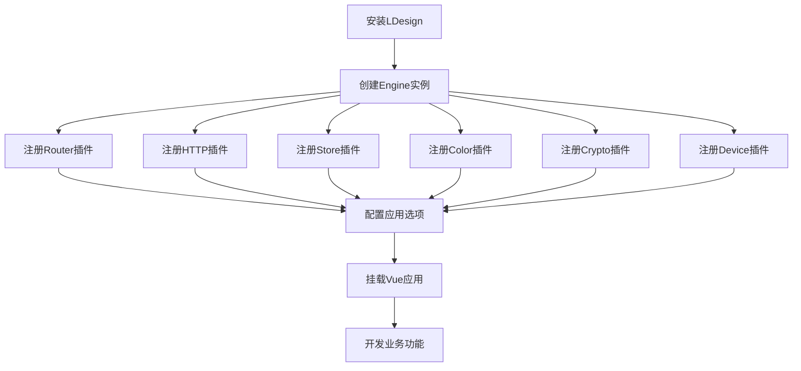

## 1. 产品概述

LDesign是一个基于Vue3的模块化应用开发框架，通过Engine核心引擎整合router、http、crypto、color、store、device等功能包，为开发者提供开箱即用的企业级应用开发解决方案。

- 解决Vue3应用开发中各功能模块分散、集成复杂的问题，为开发者提供统一的开发体验和标准化的模块集成方案。
- 目标是成为Vue3生态中最易用、最完整的企业级应用开发框架。

## 2. 核心功能

### 2.1 用户角色

| 角色       | 使用方式     | 核心权限                     |
| ---------- | ------------ | ---------------------------- |
| 前端开发者 | npm安装使用  | 可使用所有功能包和集成接口   |
| 架构师     | 项目架构设计 | 可配置引擎和各模块的集成方式 |

### 2.2 功能模块

我们的LDesign框架包含以下核心页面和功能：

1. **Engine核心引擎页面**: 插件管理、中间件系统、事件管理、依赖注入、配置管理
2. **Router路由管理页面**: 路由配置、导航守卫、面包屑、标签页、权限控制
3. **HTTP请求管理页面**: 请求配置、拦截器、缓存、重试、进度监控
4. **Store状态管理页面**: 状态定义、动作管理、持久化、时间旅行、性能监控
5. **Color主题管理页面**: 主题生成、色彩配置、CSS变量、明暗模式切换
6. **Crypto加密管理页面**: 加解密配置、算法选择、密钥管理、国密支持
7. **Device设备检测页面**: 设备信息、响应式适配、特性检测、环境判断

### 2.3 页面详情

| 页面名称           | 模块名称   | 功能描述                                         |
| ------------------ | ---------- | ------------------------------------------------ |
| Engine核心引擎页面 | 插件系统   | 注册插件、卸载插件、插件生命周期管理、插件间通信 |
| Engine核心引擎页面 | 中间件系统 | 生命周期钩子、中间件注册、执行顺序控制           |
| Engine核心引擎页面 | 事件管理   | 事件发布订阅、事件命名空间、事件优先级           |
| Engine核心引擎页面 | 依赖注入   | 服务注册、依赖解析、作用域管理                   |
| Engine核心引擎页面 | 配置管理   | 配置读写、配置监听、配置验证                     |
| Router路由管理页面 | 路由核心   | 路由定义、动态路由、嵌套路由、路由懒加载         |
| Router路由管理页面 | 导航守卫   | 全局守卫、路由守卫、组件守卫、权限验证           |
| Router路由管理页面 | 面包屑导航 | 自动生成面包屑、自定义面包屑、面包屑样式         |
| Router路由管理页面 | 标签页管理 | 标签页开启关闭、标签页缓存、标签页右键菜单       |
| HTTP请求管理页面   | 请求适配器 | Fetch适配器、Axios适配器、Alova适配器切换        |
| HTTP请求管理页面   | 拦截器系统 | 请求拦截、响应拦截、错误拦截、认证拦截           |
| HTTP请求管理页面   | 缓存机制   | 内存缓存、本地存储缓存、缓存策略配置             |
| HTTP请求管理页面   | 重试机制   | 重试策略、重试次数、重试间隔、条件重试           |
| Store状态管理页面  | 状态定义   | 响应式状态、计算属性、状态验证、状态装饰器       |
| Store状态管理页面  | 动作管理   | 同步动作、异步动作、动作装饰器、批量更新         |
| Store状态管理页面  | 持久化插件 | 本地存储、会话存储、自定义存储、选择性持久化     |
| Store状态管理页面  | 时间旅行   | 状态快照、撤销重做、状态历史、调试工具           |
| Color主题管理页面  | 主题生成   | 基于主色生成完整色板、语义化颜色、色彩算法       |
| Color主题管理页面  | CSS变量    | 自动生成CSS变量、变量注入、变量更新              |
| Color主题管理页面  | 明暗模式   | 主题切换、自动检测、过渡动画、主题预设           |
| Crypto加密管理页面 | 对称加密   | AES加密、DES加密、密钥管理、加密模式             |
| Crypto加密管理页面 | 非对称加密 | RSA加密、ECC加密、密钥对生成、数字签名           |
| Crypto加密管理页面 | 哈希算法   | MD5、SHA系列、密码强度检测、盐值处理             |
| Crypto加密管理页面 | 国密算法   | SM2、SM3、SM4算法、国密证书、合规性支持          |
| Device设备检测页面 | 设备信息   | 设备类型、操作系统、浏览器信息、屏幕信息         |
| Device设备检测页面 | 特性检测   | API支持检测、功能可用性、兼容性判断              |
| Device设备检测页面 | 响应式适配 | 断点检测、设备方向、触摸支持、网络状态           |

## 3. 核心流程

### 开发者使用流程

开发者首先安装LDesign框架，然后通过Engine引擎创建应用实例，按需注册各功能包插件，配置相应的选项，最后启动应用。具体流程包括：安装依赖 → 创建Engine实例 → 注册功能插件 → 配置应用选项 → 挂载应用 → 开发业务功能。

### 插件集成流程

各功能包通过统一的插件接口集成到Engine中，Engine负责管理插件的生命周期、依赖关系和通信机制。流程为：插件注册 → 依赖检查 → 初始化配置 → 安装到Vue应用 → 提供服务接口。

## 4. 用户界面设计

### 4.1 设计风格

- 主色调：#1890ff（蓝色）、辅助色：#52c41a（绿色）、#faad14（黄色）、#f5222d（红色）
- 按钮样式：圆角按钮，支持多种尺寸和状态
- 字体：系统默认字体栈，主要文字14px，标题16-24px
- 布局风格：卡片式布局，顶部导航，响应式设计
- 图标风格：线性图标，统一的视觉语言

### 4.2 页面设计概览

| 页面名称           | 模块名称     | UI元素                                             |
| ------------------ | ------------ | -------------------------------------------------- |
| Engine核心引擎页面 | 插件管理面板 | 插件列表卡片、状态指示器、操作按钮、配置表单       |
| Router路由管理页面 | 路由配置界面 | 路由树形结构、配置表单、面包屑导航、标签页组件     |
| HTTP请求管理页面   | 请求监控面板 | 请求列表、状态图表、配置面板、日志查看器           |
| Store状态管理页面  | 状态管理界面 | 状态树、动作列表、时间旅行控制器、性能图表         |
| Color主题管理页面  | 主题配置面板 | 色彩选择器、预览面板、CSS变量表、主题切换器        |
| Crypto加密管理页面 | 加密工具界面 | 算法选择器、密钥管理、加解密操作面板、测试工具     |
| Device设备检测页面 | 设备信息面板 | 设备信息卡片、特性检测列表、兼容性报告、响应式预览 |

### 4.3 响应式设计

采用移动优先的响应式设计策略，支持桌面端、平板端和移动端的适配，提供触摸交互优化和手势支持。
