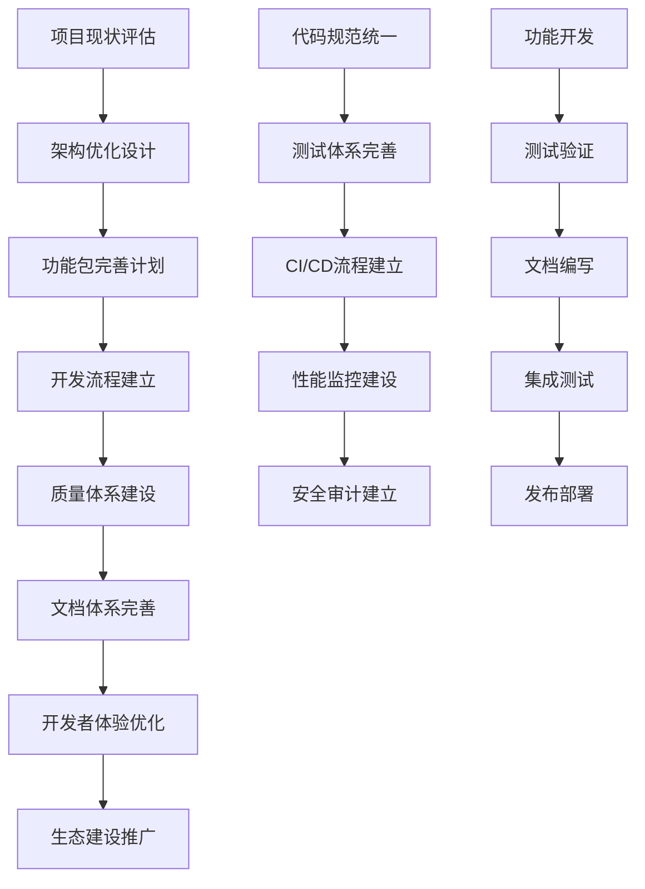

# LDesign Vue引擎项目优化需求文档

## 1. 产品概述

LDesign是一个基于Vue3的现代化前端开发引擎，采用monorepo架构设计，旨在为开发者提供完整的插件化开发解决方案。
- 核心目标：构建一个功能完备、性能优异、易于扩展的Vue3开发生态系统，解决企业级前端开发中的通用问题和痛点
- 目标用户：前端开发者、技术团队、企业开发团队，帮助他们快速构建高质量、可维护的现代化Web应用
- 市场价值：打造业界领先的Vue3开发引擎，提升开发效率50%以上，降低项目维护成本，建立完善的前端开发标准

## 2. 核心功能

### 2.1 用户角色

| 角色 | 使用方式 | 核心权限 |
|------|----------|----------|
| 核心开发者 | 项目维护和架构设计 | 可修改核心架构、发布版本、制定开发规范 |
| 包开发者 | 开发和维护特定功能包 | 可开发功能包、编写文档、提交代码 |
| 应用开发者 | 使用引擎开发应用 | 可使用所有功能包、配置应用、集成第三方库 |
| 社区贡献者 | 贡献代码和文档 | 可提交PR、报告问题、完善文档 |

### 2.2 功能模块

项目优化涉及以下核心模块：

1. **项目架构优化模块**：统一项目结构、完善monorepo配置、优化构建流程
2. **功能包完善模块**：补全缺失功能、提升包质量、增强包间协作
3. **开发流程优化模块**：建立CI/CD流程、完善测试体系、优化发布流程
4. **质量保障模块**：代码规范统一、测试覆盖率提升、性能监控建立
5. **文档体系模块**：完善API文档、使用指南、最佳实践文档
6. **开发者体验模块**：工具链优化、调试体验提升、错误处理改进
7. **生态建设模块**：示例项目完善、社区建设、插件生态

### 2.3 页面详情

| 模块名称 | 组件名称 | 功能描述 |
|----------|----------|----------|
| 项目架构优化 | Monorepo配置管理 | 统一workspace配置，优化依赖管理，建立包间依赖关系图 |
| 项目架构优化 | 构建系统优化 | 统一构建配置，支持增量构建，优化构建性能和产物质量 |
| 项目架构优化 | 版本管理系统 | 完善changesets配置，自动化版本发布，建立语义化版本规范 |
| 功能包完善 | Engine核心增强 | 完善插件系统，增加性能监控，优化错误处理和日志系统 |
| 功能包完善 | Router包完善 | 增强路由功能，完善守卫系统，优化性能和类型定义 |
| 功能包完善 | HTTP包优化 | 完善请求拦截器，增加缓存策略，优化错误处理机制 |
| 功能包完善 | Crypto包实现 | 完善加密算法，增加安全策略，优化性能和易用性 |
| 功能包完善 | Device包增强 | 完善设备检测，增加传感器支持，优化兼容性 |
| 功能包完善 | Template包完善 | 完善模板引擎，增加SSR支持，优化渲染性能 |
| 开发流程优化 | CI/CD流程建立 | 建立自动化测试，配置部署流程，优化代码质量检查 |
| 开发流程优化 | 测试体系完善 | 提升测试覆盖率，建立E2E测试，完善性能测试 |
| 开发流程优化 | 代码质量管控 | 统一ESLint配置，建立代码审查流程，优化代码规范 |
| 质量保障 | 性能监控系统 | 建立性能基准测试，监控包体积，优化运行时性能 |
| 质量保障 | 错误监控系统 | 建立错误收集，完善错误分类，优化错误恢复机制 |
| 质量保障 | 安全审计系统 | 建立安全扫描，完善依赖审计，优化安全策略 |
| 文档体系 | API文档完善 | 完善所有包的API文档，建立交互式文档，优化文档搜索 |
| 文档体系 | 使用指南编写 | 编写详细教程，建立最佳实践，完善故障排除指南 |
| 文档体系 | 示例项目建设 | 建立完整示例，覆盖常见场景，优化学习曲线 |
| 开发者体验 | 开发工具优化 | 完善VSCode插件，优化调试体验，建立开发者工具 |
| 开发者体验 | 错误提示优化 | 优化错误信息，建立错误码系统，完善解决方案提示 |
| 开发者体验 | 类型系统完善 | 完善TypeScript类型，优化类型推导，建立类型工具 |

## 3. 核心流程

### 主要优化流程：

**项目架构优化流程：**
评估现状 → 制定架构规范 → 统一项目结构 → 优化构建配置 → 完善依赖管理 → 建立版本控制

**功能包完善流程：**
功能评估 → 需求分析 → 功能开发 → 测试验证 → 文档编写 → 集成测试 → 发布上线

**质量提升流程：**
质量基线建立 → 测试体系完善 → 代码规范统一 → 性能优化 → 安全加固 → 持续监控

**开发流程优化：**
流程梳理 → 工具选型 → 自动化建设 → 规范制定 → 培训推广 → 持续改进



## 4. 用户界面设计

### 4.1 设计风格

- **主色调**：现代科技蓝 (#1890ff, #40a9ff, #69c0ff)
- **辅助色**：成功绿 (#52c41a)、警告橙 (#fa8c16)、错误红 (#f5222d)、中性灰 (#8c8c8c)
- **按钮样式**：现代圆角设计，支持多种尺寸和状态，具有良好的交互反馈
- **字体**：系统默认字体栈，代码区域使用 'Fira Code', 'Consolas', monospace
- **布局风格**：卡片式设计，清晰的层次结构，响应式布局，支持暗色模式
- **图标风格**：线性图标为主，简洁现代，支持多种尺寸和颜色

### 4.2 页面设计概览

| 模块名称 | 组件名称 | UI元素 |
|----------|----------|--------|
| 项目仪表板 | 总览面板 | 现代卡片布局，数据可视化图表，实时状态指示器，使用蓝色主题 |
| 项目仪表板 | 包状态监控 | 网格布局，状态徽章，进度条，操作按钮组 |
| 开发工具 | 代码质量面板 | 表格布局，质量评分，趋势图表，问题列表 |
| 开发工具 | 性能监控面板 | 仪表盘样式，实时图表，性能指标，告警提示 |
| 文档系统 | API文档界面 | VitePress主题，代码高亮，交互式示例，搜索功能 |
| 文档系统 | 教程指南界面 | 分步骤导航，代码示例，视频教程，进度跟踪 |
| 示例项目 | 演示应用界面 | 现代Web应用界面，功能展示区，代码查看器，实时预览 |
| 管理后台 | 包管理界面 | 列表视图，筛选搜索，批量操作，详情抽屉 |

### 4.3 响应式设计

项目采用移动优先的响应式设计策略，支持桌面端、平板端和移动端的完美适配。考虑触摸交互优化，确保在各种设备和屏幕尺寸上都有优秀的用户体验。支持PWA特性，可离线使用核心功能。

## 5. 技术架构优化

### 5.1 Monorepo架构完善

#### 5.1.1 工作空间配置优化
```yaml
# pnpm-workspace.yaml
packages:
  - 'packages/*'
  - 'tools/*'
  - 'examples/*'
  - 'docs'
```

#### 5.1.2 依赖管理策略
- 统一版本管理：关键依赖版本统一
- 依赖提升：公共依赖提升到根目录
- 开发依赖优化：减少重复安装
- 安全审计：定期进行依赖安全检查

#### 5.1.3 构建系统优化
- 增量构建：只构建变更的包
- 并行构建：利用多核CPU提升构建速度
- 缓存策略：构建结果缓存和复用
- 产物优化：代码分割和Tree-shaking

### 5.2 包架构标准化

#### 5.2.1 统一目录结构
```
packages/[package-name]/
├── src/                    # 源代码
│   ├── core/              # 核心功能
│   ├── utils/             # 工具函数
│   ├── types/             # 类型定义
│   └── index.ts           # 入口文件
├── __tests__/             # 测试文件
├── examples/              # 使用示例
├── docs/                  # 文档
├── dist/                  # 构建产物
├── es/                    # ESM格式
├── lib/                   # CJS格式
├── types/                 # 类型声明
├── package.json           # 包配置
├── README.md              # 说明文档
├── CHANGELOG.md           # 变更日志
└── rollup.config.js       # 构建配置
```

#### 5.2.2 包配置标准化
- 统一的package.json结构
- 标准化的导出字段配置
- 一致的脚本命令定义
- 规范的元数据信息

### 5.3 构建配置优化

#### 5.3.1 Rollup配置增强
```javascript
// rollup.config.js
import { defineConfig } from 'rollup'
import typescript from '@rollup/plugin-typescript'
import { nodeResolve } from '@rollup/plugin-node-resolve'
import commonjs from '@rollup/plugin-commonjs'
import terser from '@rollup/plugin-terser'
import dts from 'rollup-plugin-dts'
import { visualizer } from 'rollup-plugin-visualizer'

export default defineConfig([
  // 多格式构建配置
  // 性能分析配置
  // 类型生成配置
])
```

#### 5.3.2 TypeScript配置优化
- 严格模式启用
- 路径映射配置
- 增量编译支持
- 类型检查优化

## 6. 功能包完善计划

### 6.1 Engine包增强

#### 6.1.1 核心功能完善
- **插件系统增强**：支持插件热插拔、版本管理、依赖解析
- **性能监控系统**：内置性能指标收集、分析和报告
- **错误处理优化**：全局错误捕获、分类处理、恢复策略
- **日志系统完善**：多级别日志、格式化输出、持久化存储
- **配置管理增强**：响应式配置、环境变量支持、配置验证

#### 6.1.2 新增功能模块
- **缓存管理器**：多级缓存策略、智能过期、数据同步
- **安全管理器**：XSS防护、CSRF保护、内容安全策略
- **表单管理器**：验证引擎、自动保存、状态管理
- **动画管理器**：过渡动画、手势识别、性能优化
- **PWA管理器**：Service Worker、离线缓存、推送通知

### 6.2 Router包完善

#### 6.2.1 功能增强
- **路由守卫增强**：支持异步守卫、条件守卫、全局守卫链
- **动态路由优化**：路由懒加载、预加载策略、错误边界
- **历史管理完善**：浏览器历史、状态保存、回退处理
- **路由缓存**：页面缓存、组件缓存、数据缓存

#### 6.2.2 性能优化
- 路由匹配算法优化
- 组件预加载策略
- 路由切换动画优化
- 内存泄漏防护

### 6.3 HTTP包优化

#### 6.3.1 功能完善
- **拦截器增强**：请求/响应拦截器链、条件拦截、异步拦截
- **缓存策略**：HTTP缓存、内存缓存、持久化缓存
- **重试机制**：智能重试、指数退避、条件重试
- **并发控制**：请求队列、并发限制、优先级管理

#### 6.3.2 适配器扩展
- Fetch适配器优化
- XMLHttpRequest适配器
- Node.js适配器
- 小程序适配器

### 6.4 其他包完善

#### 6.4.1 Crypto包实现
- 对称加密算法（AES、DES）
- 非对称加密算法（RSA、ECC）
- 哈希算法（SHA系列、MD5）
- 数字签名和验证
- 安全随机数生成

#### 6.4.2 Device包增强
- 设备信息检测完善
- 传感器API支持
- 网络状态监控
- 电池状态检测
- 屏幕方向管理

#### 6.4.3 Template包完善
- 模板编译引擎
- 组件动态渲染
- SSR支持
- 模板缓存机制
- 自定义指令系统

## 7. 开发流程优化

### 7.1 CI/CD流程建立

#### 7.1.1 GitHub Actions配置
```yaml
# .github/workflows/ci.yml
name: CI/CD Pipeline

on:
  push:
    branches: [main, develop]
  pull_request:
    branches: [main]

jobs:
  test:
    runs-on: ubuntu-latest
    steps:
      - name: Checkout
        uses: actions/checkout@v4
      - name: Setup Node.js
        uses: actions/setup-node@v4
        with:
          node-version: '20'
          cache: 'pnpm'
      - name: Install dependencies
        run: pnpm install
      - name: Lint
        run: pnpm lint
      - name: Test
        run: pnpm test:coverage
      - name: Build
        run: pnpm build
      - name: Upload coverage
        uses: codecov/codecov-action@v3
```

#### 7.1.2 自动化流程
- 代码质量检查自动化
- 测试执行自动化
- 构建部署自动化
- 版本发布自动化
- 文档生成自动化

### 7.2 测试体系完善

#### 7.2.1 测试策略
- **单元测试**：覆盖率目标90%以上
- **集成测试**：包间集成测试
- **E2E测试**：关键用户流程测试
- **性能测试**：性能基准和回归测试
- **兼容性测试**：浏览器和Node.js版本兼容性

#### 7.2.2 测试工具配置
```typescript
// vitest.config.ts
import { defineConfig } from 'vitest/config'

export default defineConfig({
  test: {
    environment: 'jsdom',
    coverage: {
      provider: 'v8',
      reporter: ['text', 'json', 'html'],
      threshold: {
        global: {
          branches: 90,
          functions: 90,
          lines: 90,
          statements: 90
        }
      }
    },
    setupFiles: ['./test/setup.ts']
  }
})
```

### 7.3 代码质量管控

#### 7.3.1 ESLint配置统一
```javascript
// eslint.config.js
import antfu from '@antfu/eslint-config'

export default antfu({
  typescript: true,
  vue: true,
  rules: {
    'no-console': 'warn',
    'no-debugger': 'error',
    '@typescript-eslint/no-unused-vars': 'error',
    'vue/component-name-in-template-casing': ['error', 'PascalCase']
  }
})
```

#### 7.3.2 代码审查流程
- PR模板标准化
- 代码审查清单
- 自动化代码检查
- 安全扫描集成

### 7.4 版本管理优化

#### 7.4.1 Changesets配置
```json
{
  "$schema": "https://unpkg.com/@changesets/config@3.0.0/schema.json",
  "changelog": "@changesets/cli/changelog",
  "commit": false,
  "fixed": [],
  "linked": [],
  "access": "public",
  "baseBranch": "main",
  "updateInternalDependencies": "patch",
  "ignore": ["@ldesign/examples"]
}
```

#### 7.4.2 发布流程
- 语义化版本控制
- 自动化变更日志生成
- 多包协调发布
- 发布前验证检查

## 8. 质量保障体系

### 8.1 性能监控

#### 8.1.1 性能指标
- 包体积监控
- 运行时性能监控
- 内存使用监控
- 加载时间监控

#### 8.1.2 性能优化
- 代码分割优化
- Tree-shaking优化
- 懒加载策略
- 缓存策略优化

### 8.2 安全保障

#### 8.2.1 安全扫描
- 依赖漏洞扫描
- 代码安全扫描
- 许可证合规检查
- 敏感信息检测

#### 8.2.2 安全策略
- 安全编码规范
- 依赖更新策略
- 漏洞响应流程
- 安全培训计划

### 8.3 监控告警

#### 8.3.1 监控指标
- 构建成功率
- 测试通过率
- 代码覆盖率
- 性能指标

#### 8.3.2 告警机制
- 构建失败告警
- 性能回归告警
- 安全漏洞告警
- 质量下降告警

## 9. 文档体系建设

### 9.1 API文档完善

#### 9.1.1 文档结构
- 快速开始指南
- API参考文档
- 使用教程
- 最佳实践
- 故障排除

#### 9.1.2 文档工具
- VitePress文档系统
- TypeDoc API生成
- 交互式示例
- 搜索功能

### 9.2 示例项目建设

#### 9.2.1 示例类型
- 基础使用示例
- 高级功能示例
- 集成示例
- 最佳实践示例

#### 9.2.2 示例质量
- 代码质量保证
- 详细注释说明
- 运行环境配置
- 部署指南

## 10. 开发者体验优化

### 10.1 开发工具

#### 10.1.1 VSCode扩展
- 语法高亮
- 智能提示
- 代码片段
- 调试支持

#### 10.1.2 CLI工具
- 项目脚手架
- 代码生成器
- 开发服务器
- 构建工具

### 10.2 错误处理优化

#### 10.2.1 错误信息优化
- 清晰的错误描述
- 解决方案提示
- 相关文档链接
- 错误码系统

#### 10.2.2 调试体验
- Source Map支持
- 调试工具集成
- 性能分析工具
- 错误追踪系统

## 11. 实施计划

### 11.1 第一阶段（1-2个月）：基础设施完善
- [ ] 统一项目架构和构建配置
- [ ] 建立CI/CD流程
- [ ] 完善测试体系
- [ ] 统一代码规范
- [ ] 建立质量监控

### 11.2 第二阶段（2-3个月）：核心功能完善
- [ ] Engine包功能增强
- [ ] Router包完善
- [ ] HTTP包优化
- [ ] Crypto包实现
- [ ] Device包增强

### 11.3 第三阶段（1-2个月）：生态建设
- [ ] Template包完善
- [ ] 文档体系建设
- [ ] 示例项目完善
- [ ] 开发者工具优化
- [ ] 社区建设

### 11.4 第四阶段（持续）：优化迭代
- [ ] 性能持续优化
- [ ] 功能持续增强
- [ ] 生态持续建设
- [ ] 社区持续运营

## 12. 成功指标

### 12.1 技术指标
- 代码覆盖率达到90%以上
- 构建时间减少50%
- 包体积优化30%
- 性能提升40%

### 12.2 质量指标
- 零安全漏洞
- 99%的测试通过率
- 文档覆盖率100%
- 用户满意度90%以上

### 12.3 生态指标
- 社区贡献者数量增长
- 下载量持续增长
- GitHub Star数量增长
- 企业采用案例增加

通过以上全面的优化方案，LDesign Vue引擎项目将成为业界领先的Vue3开发解决方案，为开发者提供卓越的开发体验和强大的功能支持。