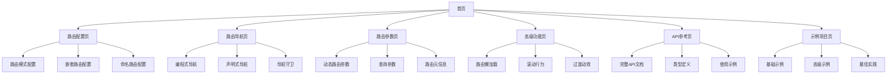

## 1. 产品概述
LDesign Router是一个功能强大的Vue路由库，为Vue应用提供简单易用的路由管理功能。该库旨在简化路由配置和使用流程，提供丰富的路由功能，同时保持轻量级和高性能。
- 该产品主要解决Vue应用中路由管理的复杂性问题，适用于所有使用Vue框架的开发者。
- 目标是成为Vue生态系统中最易用、功能最完善的路由解决方案之一。

## 2. 核心功能

### 2.1 用户角色
| 角色 | 注册方式 | 核心权限 |
|------|---------------------|------------------|
| 开发者 | 直接使用npm安装 | 使用所有路由功能，配置路由 |

### 2.2 功能模块
我们的Vue Router库包含以下主要页面：
1. **首页**: 路由基础配置，路由导航，路由守卫。
2. **路由配置页**: 路由模式配置，嵌套路由配置，命名路由配置。
3. **路由导航页**: 编程式导航，声明式导航，导航守卫。
4. **路由参数页**: 动态路由参数，查询参数，路由元信息。
5. **高级功能页**: 路由懒加载，滚动行为，过渡动效。
6. **API参考页**: 完整API文档，类型定义，使用示例。
7. **示例项目页**: 基础示例，高级示例，最佳实践。

### 2.3 页面详情
| 页面名称 | 模块名称 | 功能描述 |
|-----------|-------------|---------------------|
| 首页 | 路由基础配置 | 提供路由库的基本介绍、安装指南和快速入门示例。包含npm安装命令、基础配置示例和简单使用方法。 |
| 首页 | 路由导航 | 展示基本的路由导航方法，包括声明式导航和编程式导航的简单示例。 |
| 首页 | 路由守卫 | 介绍路由守卫的概念和基本使用场景，提供简单的全局守卫示例。 |
| 路由配置页 | 路由模式配置 | 支持配置hash模式和history模式，提供两种模式的优缺点对比和使用场景建议。包含基本配置示例和注意事项。 |
| 路由配置页 | 嵌套路由配置 | 实现父子路由的嵌套关系配置，支持多级嵌套，提供清晰的配置语法和示例。 |
| 路由配置页 | 命名路由配置 | 支持为路由指定名称，便于通过名称进行导航。提供命名路由的配置方法和使用示例。 |
| 路由导航页 | 编程式导航 | 提供router.push、router.replace、router.go等方法，支持对象和字符串两种参数形式。包含完整示例和常见用法。 |
| 路由导航页 | 声明式导航 | 提供RouterLink组件，支持active-class、exact等属性配置。包含基本用法和高级配置示例。 |
| 路由导航页 | 导航守卫 | 实现全局前置守卫、全局解析守卫、全局后置钩子、路由独享守卫和组件内守卫。提供各类守卫的使用场景和示例代码。 |
| 路由参数页 | 动态路由参数 | 支持在路径中使用参数占位符，如/user/:id。提供参数获取方法和响应参数变化的处理方式。 |
| 路由参数页 | 查询参数 | 支持通过查询字符串传递参数，提供参数获取和处理方法。包含与动态路由参数的对比和使用建议。 |
| 路由参数页 | 路由元信息 | 允许为路由配置添加自定义元数据，用于实现权限控制等功能。提供元数据的定义和访问方法。 |
| 高级功能页 | 路由懒加载 | 支持组件懒加载，优化首屏加载性能。提供基于动态import()的实现方式和Webpack分块策略。 |
| 高级功能页 | 滚动行为 | 控制页面切换时的滚动位置，支持滚动到顶部或保持滚动位置。提供自定义滚动行为的配置方法。 |
| 高级功能页 | 过渡动效 | 与Vue的transition组件集成，为路由切换提供动画效果。包含常见过渡效果的实现示例。 |
| API参考页 | 完整API文档 | 详细列出所有公开API，包括Router构造选项、实例属性和方法。提供每个API的参数、返回值和使用示例。 |
| API参考页 | 类型定义 | 提供完整的TypeScript类型定义，支持IDE智能提示。包含主要接口和类型的说明。 |
| API参考页 | 使用示例 | 为每个API提供实际使用示例，帮助开发者理解API的使用场景和方法。 |
| 示例项目页 | 基础示例 | 提供简单的路由配置和使用示例，适合初学者快速上手。包含基本路由、参数传递和导航示例。 |
| 示例项目页 | 高级示例 | 展示复杂场景下的路由使用方法，包括权限控制、多级嵌套和动态路由。 |
| 示例项目页 | 最佳实践 | 提供路由配置和使用的最佳实践建议，包括目录结构、代码组织和性能优化技巧。 |

## 3. 核心流程

### 用户使用流程
1. 开发者通过npm安装LDesign Router库
2. 在Vue应用中导入并配置路由
3. 定义路由映射配置
4. 创建路由实例并挂载到Vue应用
5. 在应用中使用RouterView组件显示路由内容
6. 使用RouterLink或编程式导航在不同路由间切换
7. 根据需要配置路由守卫处理导航逻辑

## 4. 用户界面设计
### 4.1 设计风格
- 主色调：#3498db（蓝色）和#2ecc71（绿色）
- 次要色调：#ecf0f1（浅灰）和#34495e（深灰）
- 按钮风格：圆角矩形，带有轻微的阴影效果
- 字体：系统默认字体，主标题16-20px，正文14-16px
- 布局风格：左侧导航栏，右侧内容区，卡片式内容展示
- 图标风格：线性图标，简洁现代

### 4.2 页面设计概览
| 页面名称 | 模块名称 | UI元素 |
|-----------|-------------|-------------|
| 首页 | 路由基础配置 | 顶部大标题，简洁介绍文字，安装命令代码块（深色背景，浅色文字），快速入门示例代码块，开始使用按钮（主色调） |
| 首页 | 路由导航 | 导航方法卡片（浅色背景，圆角），代码示例（语法高亮），效果预览区域 |
| 首页 | 路由守卫 | 守卫概念图解（流程图），代码示例，常见使用场景列表 |
| 路由配置页 | 路由模式配置 | 模式选择卡片（可切换），配置代码示例，模式对比表格 |
| 路由配置页 | 嵌套路由配置 | 嵌套结构可视化图表，配置代码示例，实际效果预览 |
| 路由配置页 | 命名路由配置 | 命名路由示例卡片，代码示例，使用场景说明 |
| 路由导航页 | 编程式导航 | 方法列表（卡片式），参数说明表格，代码示例 |
| 路由导航页 | 声明式导航 | RouterLink属性表格，使用示例代码，效果预览 |
| 路由导航页 | 导航守卫 | 守卫类型流程图，各类守卫代码示例，使用场景说明 |
| 路由参数页 | 动态路由参数 | 参数定义示例，参数获取代码，参数变化处理示例 |
| 路由参数页 | 查询参数 | 查询参数示例，参数获取代码，与动态参数对比表格 |
| 路由参数页 | 路由元信息 | 元信息定义示例，访问方法代码，应用场景卡片 |
| 高级功能页 | 路由懒加载 | 懒加载原理图解，代码示例，性能对比图表 |
| 高级功能页 | 滚动行为 | 滚动行为配置示例，效果预览，常见配置卡片 |
| 高级功能页 | 过渡动效 | 动效示例预览（可交互），代码示例，自定义动效指南 |
| API参考页 | 完整API文档 | 分类API列表，详细参数表格，返回值说明 |
| API参考页 | 类型定义 | TypeScript接口定义，类型说明，使用示例 |
| API参考页 | 使用示例 | 分类示例代码，效果预览，最佳实践提示 |
| 示例项目页 | 基础示例 | 示例项目预览，代码结构说明，关键代码高亮 |
| 示例项目页 | 高级示例 | 复杂示例预览，功能说明，实现思路解析 |
| 示例项目页 | 最佳实践 | 最佳实践列表，目录结构建议，性能优化技巧 |

### 4.3 响应式设计
- 设计采用移动优先原则，确保在各种设备上都有良好的显示效果
- 在小屏幕设备上，左侧导航将转为顶部下拉菜单
- 代码示例区域在小屏幕上将自动调整宽度，并支持横向滚动
- 表格在小屏幕上将转为卡片式布局
- 针对触摸设备优化交互体验，增大可点击区域，支持滑动手势