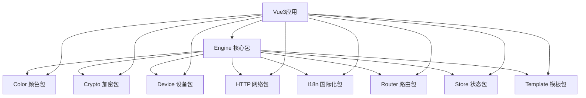

# LDesign Vue引擎项目产品需求文档

## 1. 产品概述

LDesign是一个基于Vue3的现代化前端开发引擎，采用monorepo架构，提供核心引擎和多个功能扩展包。
- 核心目标：为Vue3应用提供快速开发能力，同时支持跨框架扩展，解决前端开发中的通用问题
- 目标用户：前端开发者、技术团队，帮助他们快速构建高质量的现代化Web应用
- 市场价值：提供一站式前端开发解决方案，提升开发效率和代码质量

## 2. 包架构设计

### 2.1 统一目录结构
所有包都采用以下标准目录结构：

```
packages/[package-name]/
├── src/                    # 源代码目录
│   ├── index.ts           # 主入口文件
│   ├── types/             # TypeScript类型定义
│   ├── utils/             # 工具函数
│   └── core/              # 核心功能模块
├── examples/              # 示例项目
│   └── vue3-demo/         # Vue3示例项目
├── docs/                  # VitePress文档
│   ├── .vitepress/        # VitePress配置
│   ├── guide/             # 使用指南
│   └── api/               # API文档
├── tests/                 # 测试文件
│   ├── unit/              # 单元测试
│   ├── integration/       # 集成测试
│   ├── performance/       # 性能测试
│   └── e2e/               # 端到端测试
├── dist/                  # UMD构建产物
├── es/                    # ESM构建产物
├── cjs/                   # CommonJS构建产物
├── types/                 # TypeScript声明文件
├── package.json           # 包配置文件
├── tsconfig.json          # TypeScript配置
├── rollup.config.js       # Rollup构建配置
├── vitest.config.ts       # Vitest测试配置
├── eslint.config.js       # ESLint配置
└── README.md              # 包说明文档
```

### 2.2 核心包功能模块

#### 2.2.1 Engine包 (核心引擎)
- **应用创建器**: 提供快速创建Vue3应用的类和方法
- **插件系统**: 设计扩展接口，支持其他包的插件化集成
- **生命周期管理**: 应用启动、运行、销毁的完整生命周期
- **配置管理**: 统一的配置系统，支持环境变量和动态配置
- **错误处理**: 全局错误捕获和处理机制
- **性能监控**: 内置性能监控和优化建议

#### 2.2.2 Color包 (颜色处理)
- **颜色转换**: RGB、HSL、HSV、HEX等格式互转
- **颜色计算**: 颜色混合、渐变、对比度计算
- **主题生成**: 基于主色调生成完整色彩方案
- **无障碍支持**: 颜色对比度检查和无障碍色彩建议
- **颜色提取**: 从图片中提取主要颜色

#### 2.2.3 Crypto包 (加密处理)
- **对称加密**: AES、DES等对称加密算法
- **非对称加密**: RSA、ECC等非对称加密
- **哈希算法**: MD5、SHA系列、HMAC等
- **数字签名**: 数字签名生成和验证
- **随机数生成**: 安全随机数和UUID生成

#### 2.2.4 Device包 (设备检测)
- **设备识别**: 检测设备类型、操作系统、浏览器
- **屏幕信息**: 屏幕尺寸、分辨率、像素密度
- **网络状态**: 网络连接状态和速度检测
- **硬件能力**: GPU、内存、存储等硬件信息
- **传感器支持**: 陀螺仪、加速度计等传感器检测

#### 2.2.5 HTTP包 (网络请求)
- **请求封装**: 基于fetch的现代HTTP客户端
- **拦截器**: 请求和响应拦截器
- **错误处理**: 统一的错误处理和重试机制
- **缓存策略**: 请求缓存和缓存策略
- **上传下载**: 文件上传下载和进度监控

#### 2.2.6 I18n包 (国际化)
- **多语言支持**: 多语言文本管理和切换
- **动态加载**: 按需加载语言包
- **格式化**: 日期、数字、货币格式化
- **复数处理**: 复数形式的智能处理
- **RTL支持**: 右到左语言的布局支持

#### 2.2.7 Router包 (路由管理)
- **声明式路由**: 基于配置的路由定义
- **动态路由**: 动态路由匹配和参数提取
- **路由守卫**: 导航守卫和权限控制
- **懒加载**: 路由组件的懒加载
- **历史管理**: 浏览器历史记录管理

#### 2.2.8 Store包 (状态管理)
- **响应式状态**: 基于Vue3响应式系统的状态管理
- **模块化**: 状态模块的组织和管理
- **持久化**: 状态的本地存储和恢复
- **时间旅行**: 状态变更的历史记录和回滚
- **开发工具**: 状态调试和监控工具

#### 2.2.9 Template包 (模板引擎)
- **模板编译**: 模板语法解析和编译
- **组件渲染**: 动态组件渲染和管理
- **指令系统**: 自定义指令的注册和使用
- **插槽系统**: 灵活的插槽和作用域插槽
- **SSR支持**: 服务端渲染支持

## 3. 开发工作流程

### 3.1 包开发流程
1. **初始化包结构**: 基于统一模板创建包目录和基础文件
2. **核心功能开发**: 实现包的核心功能模块
3. **扩展接口设计**: 为Engine包设计插件接口，为其他包预留扩展点
4. **测试用例编写**: 编写单元测试、集成测试、性能测试和E2E测试
5. **文档编写**: 使用VitePress编写API文档和使用指南
6. **示例项目**: 创建Vue3示例项目展示包的使用方法
7. **构建和发布**: 使用Rollup构建多格式产物并发布到npm

### 3.2 用户使用流程
1. **安装核心包**: `pnpm add @ldesign/engine`
2. **安装扩展包**: `pnpm add @ldesign/color @ldesign/http`
3. **创建应用**: 使用Engine创建Vue3应用实例
4. **注册插件**: 将扩展包注册到Engine中
5. **配置应用**: 设置应用配置和插件参数
6. **开发业务**: 使用各种包提供的功能开发业务逻辑

### 3.3 包间依赖关系



## 4. 技术规范

### 4.1 统一编码风格

#### 4.1.1 TypeScript规范
- **严格模式**: 启用TypeScript严格模式，确保类型安全
- **命名规范**: 使用camelCase命名变量和函数，PascalCase命名类和接口
- **类型定义**: 所有公共API必须有完整的类型定义
- **导出规范**: 使用命名导出，避免默认导出

#### 4.1.2 代码组织
- **文件命名**: 使用kebab-case命名文件，如`color-utils.ts`
- **目录结构**: 按功能模块组织代码，保持目录结构清晰
- **导入顺序**: 第三方库 → 内部模块 → 相对路径导入
- **注释规范**: 使用JSDoc格式编写函数和类的注释

#### 4.1.3 ESLint配置
所有包统一使用@antfu/eslint-config配置：

```javascript
// eslint.config.js
import antfu from '@antfu/eslint-config'

export default antfu({
  typescript: true,
  vue: true,
  rules: {
    'no-console': 'warn',
    'no-debugger': 'error',
    '@typescript-eslint/no-unused-vars': 'error'
  }
})
```

### 4.2 构建配置

#### 4.2.1 Rollup配置
统一的Rollup构建配置，支持多格式输出：

```javascript
// rollup.config.js
import typescript from '@rollup/plugin-typescript'
import { nodeResolve } from '@rollup/plugin-node-resolve'
import commonjs from '@rollup/plugin-commonjs'
import terser from '@rollup/plugin-terser'
import dts from 'rollup-plugin-dts'

const external = ['vue', '@vue/reactivity']

export default [
  // ESM build
  {
    input: 'src/index.ts',
    output: { dir: 'es', format: 'es' },
    external,
    plugins: [typescript(), nodeResolve(), commonjs()]
  },
  // CJS build
  {
    input: 'src/index.ts',
    output: { dir: 'cjs', format: 'cjs' },
    external,
    plugins: [typescript(), nodeResolve(), commonjs()]
  },
  // UMD build
  {
    input: 'src/index.ts',
    output: { dir: 'dist', format: 'umd', name: 'LDesign' },
    plugins: [typescript(), nodeResolve(), commonjs(), terser()]
  },
  // Types
  {
    input: 'src/index.ts',
    output: { dir: 'types', format: 'es' },
    plugins: [dts()]
  }
]
```

#### 4.2.2 Package.json配置
统一的包配置结构：

```json
{
  "name": "@ldesign/[package-name]",
  "version": "1.0.0",
  "description": "LDesign [Package Name] - [Description]",
  "main": "cjs/index.js",
  "module": "es/index.js",
  "types": "types/index.d.ts",
  "exports": {
    ".": {
      "import": "./es/index.js",
      "require": "./cjs/index.js",
      "types": "./types/index.d.ts"
    }
  },
  "files": ["es", "cjs", "dist", "types"],
  "scripts": {
    "build": "rollup -c",
    "test": "vitest",
    "test:coverage": "vitest --coverage",
    "docs:dev": "vitepress dev docs",
    "docs:build": "vitepress build docs",
    "lint": "eslint .",
    "lint:fix": "eslint . --fix"
  }
}
```

### 4.3 测试规范

#### 4.3.1 Vitest配置
```typescript
// vitest.config.ts
import { defineConfig } from 'vitest/config'

export default defineConfig({
  test: {
    environment: 'jsdom',
    coverage: {
      provider: 'v8',
      reporter: ['text', 'json', 'html'],
      threshold: {
        global: {
          branches: 80,
          functions: 80,
          lines: 80,
          statements: 80
        }
      }
    }
  }
})
```

#### 4.3.2 测试类型
- **单元测试**: 测试单个函数和类的功能
- **集成测试**: 测试模块间的交互
- **性能测试**: 测试关键功能的性能指标
- **E2E测试**: 使用Playwright测试完整用户流程

### 4.4 文档规范

#### 4.4.1 VitePress配置
```typescript
// docs/.vitepress/config.ts
import { defineConfig } from 'vitepress'

export default defineConfig({
  title: 'LDesign [Package Name]',
  description: '[Package Description]',
  themeConfig: {
    nav: [
      { text: '指南', link: '/guide/' },
      { text: 'API', link: '/api/' },
      { text: '示例', link: '/examples/' }
    ],
    sidebar: {
      '/guide/': [
        { text: '快速开始', link: '/guide/getting-started' },
        { text: '基础用法', link: '/guide/basic-usage' },
        { text: '高级用法', link: '/guide/advanced-usage' }
      ]
    }
  }
})
```

#### 4.4.2 文档结构
- **README.md**: 包的基本介绍和快速开始
- **guide/**: 详细的使用指南和教程
- **api/**: 完整的API文档
- **examples/**: 实际使用示例和最佳实践

## 5. 依赖管理

### 5.1 核心依赖
所有包使用最新稳定版本的依赖：

```json
{
  "devDependencies": {
    "@antfu/eslint-config": "^3.0.0",
    "@rollup/plugin-commonjs": "^28.0.0",
    "@rollup/plugin-node-resolve": "^16.0.0",
    "@rollup/plugin-terser": "^0.4.4",
    "@rollup/plugin-typescript": "^12.0.0",
    "@types/node": "^22.0.0",
    "@vitest/coverage-v8": "^2.0.0",
    "eslint": "^9.0.0",
    "jsdom": "^25.0.0",
    "playwright": "^1.48.0",
    "rollup": "^4.0.0",
    "rollup-plugin-dts": "^6.1.1",
    "typescript": "^5.6.0",
    "vitepress": "^1.4.0",
    "vitest": "^2.0.0",
    "vue": "^3.5.0"
  }
}
```

### 5.2 Monorepo配置

#### 5.2.1 pnpm-workspace.yaml
```yaml
packages:
  - 'packages/*'
```

#### 5.2.2 根目录package.json
```json
{
  "name": "ldesign",
  "private": true,
  "type": "module",
  "scripts": {
    "build": "pnpm -r run build",
    "test": "pnpm -r run test",
    "test:coverage": "pnpm -r run test:coverage",
    "lint": "pnpm -r run lint",
    "lint:fix": "pnpm -r run lint:fix",
    "docs:dev": "pnpm -r run docs:dev",
    "docs:build": "pnpm -r run docs:build",
    "release": "pnpm build && pnpm test && changeset publish"
  },
  "devDependencies": {
    "@changesets/cli": "^2.27.0",
    "@antfu/eslint-config": "^3.0.0",
    "eslint": "^9.0.0"
  }
}
```

### 5.3 版本管理
使用Changesets进行版本管理和发布：

```json
// .changeset/config.json
{
  "$schema": "https://unpkg.com/@changesets/config@3.0.0/schema.json",
  "changelog": "@changesets/cli/changelog",
  "commit": false,
  "fixed": [],
  "linked": [],
  "access": "public",
  "baseBranch": "main",
  "updateInternalDependencies": "patch",
  "ignore": []
}
```

## 6. 开发环境配置

### 6.1 VSCode配置

#### 6.1.1 .vscode/settings.json
```json
{
  "typescript.preferences.includePackageJsonAutoImports": "off",
  "editor.codeActionsOnSave": {
    "source.fixAll.eslint": "explicit"
  },
  "editor.formatOnSave": true,
  "editor.defaultFormatter": "esbenp.prettier-vscode",
  "files.associations": {
    "*.vue": "vue"
  }
}
```

#### 6.1.2 .vscode/extensions.json
```json
{
  "recommendations": [
    "vue.volar",
    "esbenp.prettier-vscode",
    "dbaeumer.vscode-eslint",
    "bradlc.vscode-tailwindcss",
    "antfu.iconify"
  ]
}
```

### 6.2 Git配置

#### 6.2.1 .gitignore
```
node_modules/
dist/
es/
cjs/
types/
coverage/
.DS_Store
.env
.env.local
.vscode/
*.log
```

#### 6.2.2 .gitattributes
```
* text=auto
*.js text eol=lf
*.ts text eol=lf
*.vue text eol=lf
*.json text eol=lf
*.md text eol=lf
```

## 7. CI/CD配置

### 7.1 GitHub Actions

#### 7.1.1 .github/workflows/ci.yml
```yaml
name: CI

on:
  push:
    branches: [main]
  pull_request:
    branches: [main]

jobs:
  test:
    runs-on: ubuntu-latest
    steps:
      - uses: actions/checkout@v4
      - uses: pnpm/action-setup@v4
        with:
          version: 9
      - uses: actions/setup-node@v4
        with:
          node-version: 22
          cache: 'pnpm'
      - run: pnpm install
      - run: pnpm lint
      - run: pnpm test:coverage
      - run: pnpm build
```

#### 7.1.2 .github/workflows/release.yml
```yaml
name: Release

on:
  push:
    branches: [main]

jobs:
  release:
    runs-on: ubuntu-latest
    if: github.repository_owner == 'ldesign'
    steps:
      - uses: actions/checkout@v4
        with:
          token: ${{ secrets.GITHUB_TOKEN }}
      - uses: pnpm/action-setup@v4
        with:
          version: 9
      - uses: actions/setup-node@v4
        with:
          node-version: 22
          cache: 'pnpm'
      - run: pnpm install
      - run: pnpm build
      - run: pnpm test
      - name: Create Release Pull Request or Publish
        uses: changesets/action@v1
        with:
          publish: pnpm release
        env:
          GITHUB_TOKEN: ${{ secrets.GITHUB_TOKEN }}
          NPM_TOKEN: ${{ secrets.NPM_TOKEN }}
```

## 8. 项目里程碑

### 8.1 第一阶段 (MVP)
- [ ] 完成Engine核心包的基础架构
- [ ] 实现Color、Crypto、Device三个基础包
- [ ] 建立统一的构建和测试流程
- [ ] 完成基础文档和示例项目

### 8.2 第二阶段 (扩展)
- [ ] 完成HTTP、I18n、Router、Store四个扩展包
- [ ] 实现完整的插件系统
- [ ] 添加性能监控和优化
- [ ] 完善文档和最佳实践指南

### 8.3 第三阶段 (完善)
- [ ] 完成Template包和高级功能
- [ ] 实现跨框架支持预留
- [ ] 完整的E2E测试覆盖
- [ ] 社区生态建设和推广

### 8.4 质量标准
- 代码覆盖率 ≥ 80%
- 所有包通过ESLint检查
- 完整的TypeScript类型定义
- 详细的API文档和使用示例
- 性能基准测试通过