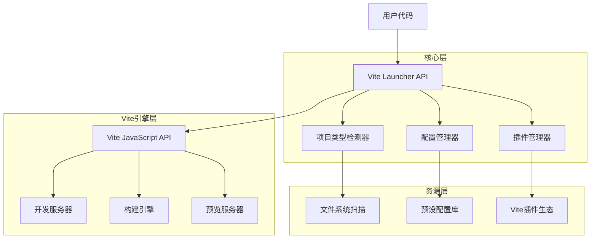
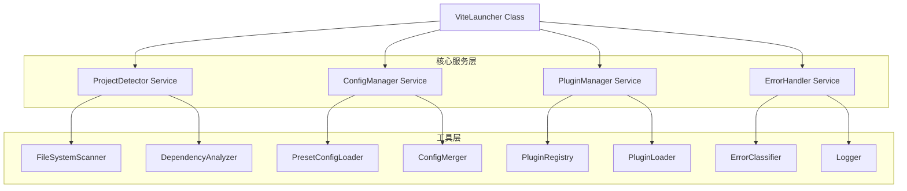
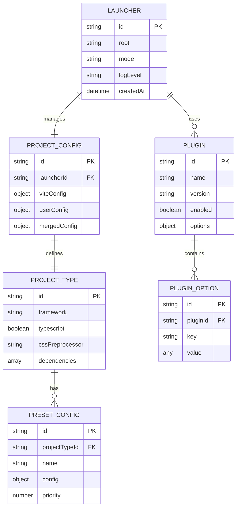

# Vite前端项目启动器技术架构文档

## 1. Architecture design



## 2. Technology Description

- Frontend: TypeScript@5 + Vite@5 JavaScript API
- Backend: None (纯前端工具包)
- Dependencies: @vitejs/plugin-vue, @vitejs/plugin-react, @vitejs/plugin-legacy

## 3. Route definitions

| API路径 | 用途 |
|---------|------|
| ViteLauncher.create() | 创建启动器实例，自动检测项目类型 |
| launcher.dev() | 启动开发模式，提供热更新服务 |
| launcher.build() | 执行构建任务，输出生产环境代码 |
| launcher.preview() | 启动预览服务器，预览构建结果 |
| launcher.configure() | 自定义配置覆盖 |

## 4. API definitions

### 4.1 Core API

**启动器创建**
```typescript
static create(options?: LauncherOptions): Promise<ViteLauncher>
```

参数:
| 参数名 | 参数类型 | 是否必需 | 描述 |
|--------|----------|----------|------|
| options | LauncherOptions | false | 启动器配置选项 |
| options.root | string | false | 项目根目录路径 |
| options.mode | string | false | 运行模式 (development/production) |
| options.logLevel | LogLevel | false | 日志级别 |

返回值:
| 参数名 | 参数类型 | 描述 |
|--------|----------|------|
| launcher | ViteLauncher | 启动器实例 |

**开发模式启动**
```typescript
dev(options?: DevOptions): Promise<ViteDevServer>
```

参数:
| 参数名 | 参数类型 | 是否必需 | 描述 |
|--------|----------|----------|------|
| options | DevOptions | false | 开发服务器配置 |
| options.port | number | false | 服务器端口号 |
| options.host | string | false | 服务器主机地址 |
| options.open | boolean | false | 是否自动打开浏览器 |

**构建任务执行**
```typescript
build(options?: BuildOptions): Promise<BuildResult>
```

参数:
| 参数名 | 参数类型 | 是否必需 | 描述 |
|--------|----------|----------|------|
| options | BuildOptions | false | 构建配置选项 |
| options.outDir | string | false | 输出目录 |
| options.minify | boolean | false | 是否压缩代码 |
| options.sourcemap | boolean | false | 是否生成sourcemap |

**类型定义示例**
```typescript
interface LauncherOptions {
  root?: string;
  mode?: 'development' | 'production';
  logLevel?: 'error' | 'warn' | 'info' | 'silent';
  configFile?: string | false;
  plugins?: PluginOption[];
}

interface ProjectType {
  framework: 'vue2' | 'vue3' | 'react' | 'vanilla' | 'lit';
  typescript: boolean;
  cssPreprocessor?: 'sass' | 'less' | 'stylus';
}

interface BuildResult {
  success: boolean;
  outputFiles: string[];
  duration: number;
  size: number;
  errors?: string[];
}
```

## 5. Server architecture diagram



## 6. Data model

### 6.1 Data model definition



### 6.2 Data Definition Language

**配置预设数据结构**
```typescript
// 项目类型配置预设
const PROJECT_PRESETS = {
  vue3: {
    plugins: ['@vitejs/plugin-vue'],
    resolve: {
      alias: {
        '@': path.resolve(process.cwd(), 'src')
      }
    },
    server: {
      port: 3000
    }
  },
  react: {
    plugins: ['@vitejs/plugin-react'],
    resolve: {
      alias: {
        '@': path.resolve(process.cwd(), 'src')
      }
    },
    server: {
      port: 3001
    }
  },
  vanilla: {
    plugins: [],
    server: {
      port: 3002
    }
  }
};

// 插件配置映射
const PLUGIN_MAPPINGS = {
  vue2: ['@vitejs/plugin-vue2', '@vitejs/plugin-legacy'],
  vue3: ['@vitejs/plugin-vue'],
  react: ['@vitejs/plugin-react'],
  lit: ['@vitejs/plugin-lit'],
  vanilla: []
};

// 错误代码定义
const ERROR_CODES = {
  PROJECT_TYPE_DETECTION_FAILED: 'E001',
  INVALID_CONFIG: 'E002',
  PLUGIN_LOAD_FAILED: 'E003',
  BUILD_FAILED: 'E004',
  DEV_SERVER_START_FAILED: 'E005'
};
```