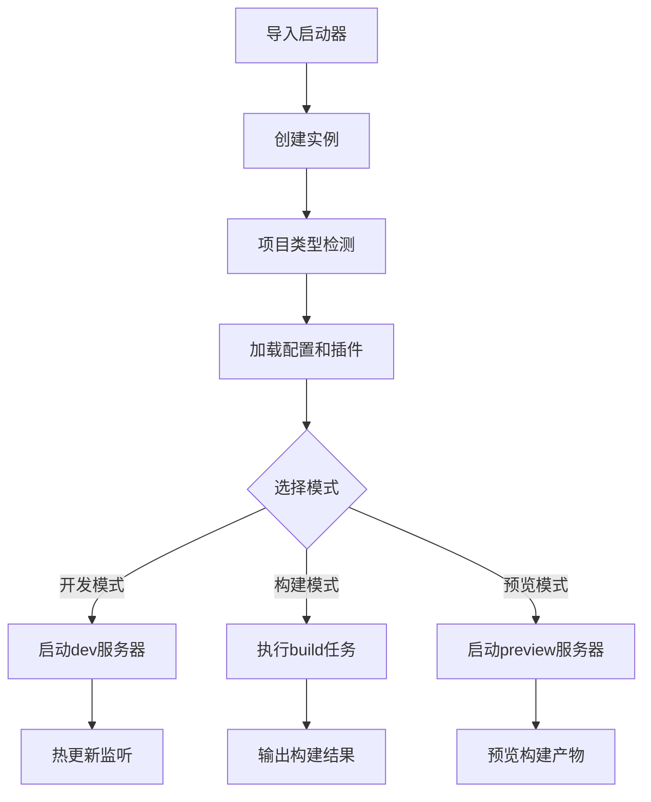

# Vite前端项目启动器产品需求文档

## 1. Product Overview

基于Vite JavaScript API的前端项目启动器，为开发者提供开箱即用的项目构建解决方案。自动识别项目类型并配置最佳实践，支持Vue2/Vue3/React/原生JS/Lit等主流前端技术栈。

- 解决前端项目配置复杂、重复工作多的痛点，为开发者提供零配置启动体验
- 目标用户：前端开发者、团队技术负责人、项目架构师
- 市场价值：提升开发效率，降低项目配置门槛，统一团队开发标准

## 2. Core Features

### 2.1 Feature Module

我们的Vite启动器包含以下核心页面：
1. **API接口层**：提供开发、构建、预览三种模式的统一接口
2. **项目识别模块**：自动检测项目类型和技术栈
3. **配置管理模块**：根据项目类型加载最佳实践配置
4. **插件管理模块**：自动配置和管理Vite插件
5. **错误处理模块**：完整的错误捕获和友好提示系统

### 2.2 Page Details

| 模块名称 | 功能模块 | 功能描述 |
|---------|---------|----------|
| API接口层 | 启动器主类 | 提供dev()、build()、preview()方法，封装Vite JavaScript API调用 |
| API接口层 | 配置接口 | 支持自定义配置覆盖，提供类型安全的配置选项 |
| 项目识别模块 | 文件检测器 | 扫描package.json、依赖包、文件结构识别项目类型 |
| 项目识别模块 | 类型解析器 | 解析Vue2/Vue3/React/原生JS/Lit等框架类型 |
| 配置管理模块 | 预设配置 | 为不同项目类型提供最佳实践配置模板 |
| 配置管理模块 | 配置合并器 | 智能合并用户自定义配置与预设配置 |
| 插件管理模块 | 插件注册器 | 根据项目类型自动注册对应Vite插件 |
| 插件管理模块 | 插件扩展 | 支持用户自定义插件扩展和覆盖 |
| 错误处理模块 | 异常捕获 | 捕获构建过程中的各类错误并分类处理 |
| 错误处理模块 | 日志系统 | 提供详细的构建日志和友好的错误提示 |

## 3. Core Process

**主要用户操作流程：**

1. **初始化流程**：用户导入启动器类 → 创建实例 → 自动检测项目类型 → 加载对应配置和插件
2. **开发模式流程**：调用dev()方法 → 启动开发服务器 → 实时热更新 → 错误监控和提示
3. **构建流程**：调用build()方法 → 执行构建任务 → 输出构建结果 → 生成构建报告
4. **预览流程**：调用preview()方法 → 启动预览服务器 → 预览构建结果

## 4. User Interface Design

### 4.1 Design Style

- **API设计风格**：简洁直观的链式调用API，支持TypeScript类型提示
- **日志输出风格**：清晰的颜色区分（成功绿色、警告黄色、错误红色）
- **错误提示风格**：友好的错误信息，包含解决建议和相关文档链接
- **配置风格**：零配置启动，渐进式配置增强
- **代码风格**：完整的TypeScript类型定义，详细的JSDoc注释

### 4.2 Page Design Overview

| 模块名称 | 功能模块 | 设计要素 |
|---------|---------|----------|
| API接口层 | 主类接口 | 简洁的类方法设计，支持链式调用，完整的TypeScript类型定义 |
| 项目识别模块 | 检测界面 | 静默后台检测，无UI界面，通过日志输出检测结果 |
| 配置管理模块 | 配置接口 | 类型安全的配置对象，支持深度合并和验证 |
| 插件管理模块 | 插件系统 | 模块化插件架构，支持动态加载和热插拔 |
| 错误处理模块 | 错误界面 | 结构化错误信息，包含错误码、描述、解决方案 |

### 4.3 Responsiveness

本产品为Node.js环境下的开发工具包，主要通过命令行和代码API使用，无需考虑响应式设计。重点关注API的易用性和错误处理的友好性。