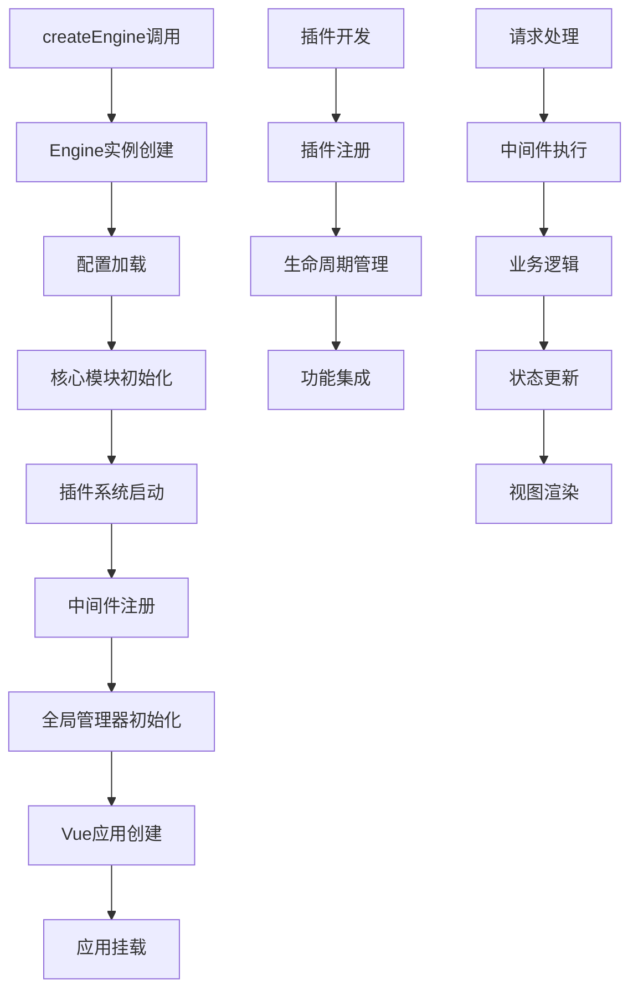

# Vue3 应用引擎架构设计文档

## 1. 产品概述

本项目旨在创建一个强大的Vue3应用引擎类，通过统一的API集成Vue3的所有核心操作，提供createEngine方法让开发者通过简单配置快速创建Vue3项目。

该引擎将作为Vue3应用的核心基础设施，提供完整的插件化架构和扩展机制，支持企业级应用开发需求。

## 2. 核心功能

### 2.1 用户角色

| 角色 | 使用方式 | 核心权限 |
|------|----------|----------|
| 开发者 | npm安装使用 | 可使用所有引擎功能，配置应用架构 |
| 插件开发者 | 扩展引擎功能 | 可开发插件，遵循引擎规范接入新功能 |

### 2.2 功能模块

本Vue3引擎包含以下核心页面和模块：

1. **引擎核心模块**：createEngine方法、引擎类定义、配置管理
2. **插件系统模块**：插件注册、生命周期管理、插件通信
3. **中间件模块**：请求拦截、响应处理、错误捕获
4. **全局管理模块**：状态管理、事件管理、指令管理、错误管理
5. **工具模块**：Logger系统、通知管理、响应式配置
6. **扩展接口模块**：Router接口、State接口、i18n接口、Theme接口
7. **示例和文档**：使用示例、API文档、开发指南

### 2.3 模块详情

| 模块名称 | 组件名称 | 功能描述 |
|----------|----------|----------|
| 引擎核心模块 | Engine类 | 创建和管理Vue3应用实例，提供统一的配置接口和生命周期管理 |
| 引擎核心模块 | createEngine方法 | 工厂方法，接收配置参数快速创建引擎实例 |
| 引擎核心模块 | 配置管理器 | 管理全局配置，支持响应式配置更新和验证 |
| 插件系统模块 | 插件注册器 | 注册、卸载插件，管理插件依赖关系和版本兼容性 |
| 插件系统模块 | 生命周期管理 | 管理插件的安装、激活、停用、卸载等生命周期 |
| 插件系统模块 | 插件通信总线 | 提供插件间通信机制，支持事件发布订阅模式 |
| 中间件模块 | 中间件管理器 | 注册、执行中间件，支持异步中间件和错误处理 |
| 中间件模块 | 请求拦截器 | 拦截和处理HTTP请求，支持请求转换和认证 |
| 中间件模块 | 响应处理器 | 处理HTTP响应，支持数据转换和错误处理 |
| 全局管理模块 | 全局状态管理 | 基于Vue3响应式系统的全局状态管理，支持模块化状态 |
| 全局管理模块 | 事件管理器 | 全局事件发布订阅系统，支持事件命名空间和优先级 |
| 全局管理模块 | 指令管理器 | 注册、管理自定义指令，支持指令的动态加载和卸载 |
| 全局管理模块 | 错误管理器 | 全局错误捕获、处理和上报，支持错误分类和恢复策略 |
| 工具模块 | Logger系统 | 美观的日志系统，支持多级别日志、格式化输出和日志持久化 |
| 工具模块 | 通知管理器 | 全局通知系统，支持多种通知类型和自定义样式 |
| 工具模块 | 响应式配置 | 基于Vue3响应式的配置系统，支持配置热更新 |
| 扩展接口模块 | Router接口 | 预留路由系统接入接口，支持多种路由库集成 |
| 扩展接口模块 | State接口 | 预留状态管理接入接口，支持Pinia等状态库集成 |
| 扩展接口模块 | i18n接口 | 预留国际化接入接口，支持多语言切换和动态加载 |
| 扩展接口模块 | Theme接口 | 预留主题系统接入接口，支持主题切换和自定义样式 |

## 3. 核心流程

### 主要操作流程：

**引擎初始化流程：**
开发者调用createEngine方法 → 创建Engine实例 → 加载配置 → 初始化核心模块 → 注册插件 → 启动应用

**插件扩展流程：**
插件开发 → 插件注册 → 生命周期管理 → 功能集成 → 插件通信

**应用运行流程：**
请求处理 → 中间件执行 → 业务逻辑 → 状态更新 → 视图渲染 → 错误处理

## 4. 用户界面设计

### 4.1 设计风格

- **主色调**：现代蓝色系 (#1890ff, #40a9ff)
- **辅助色**：中性灰色系 (#f0f0f0, #d9d9d9)
- **按钮样式**：圆角现代风格，支持多种状态
- **字体**：系统默认字体，代码区域使用等宽字体
- **布局风格**：卡片式布局，清晰的层次结构
- **图标风格**：线性图标，简洁现代

### 4.2 界面设计概览

| 模块名称 | 组件名称 | UI元素 |
|----------|----------|--------|
| 示例应用 | 主页面 | 现代卡片布局，展示引擎功能演示，使用蓝色主题和圆角设计 |
| 示例应用 | 配置面板 | 表单式布局，实时配置预览，支持响应式更新 |
| 示例应用 | 插件管理 | 列表式布局，插件状态指示器，操作按钮组 |
| 文档系统 | API文档 | VitePress主题，代码高亮，交互式示例 |
| 文档系统 | 使用指南 | 分步骤指导，代码示例，最佳实践展示 |
| 开发工具 | Logger界面 | 控制台风格，多级别日志着色，过滤和搜索功能 |
| 开发工具 | 错误面板 | 错误堆栈展示，错误分类，解决建议 |

### 4.3 响应式设计

项目采用桌面优先的响应式设计，支持移动端适配，考虑触摸交互优化，确保在各种设备上都有良好的用户体验。