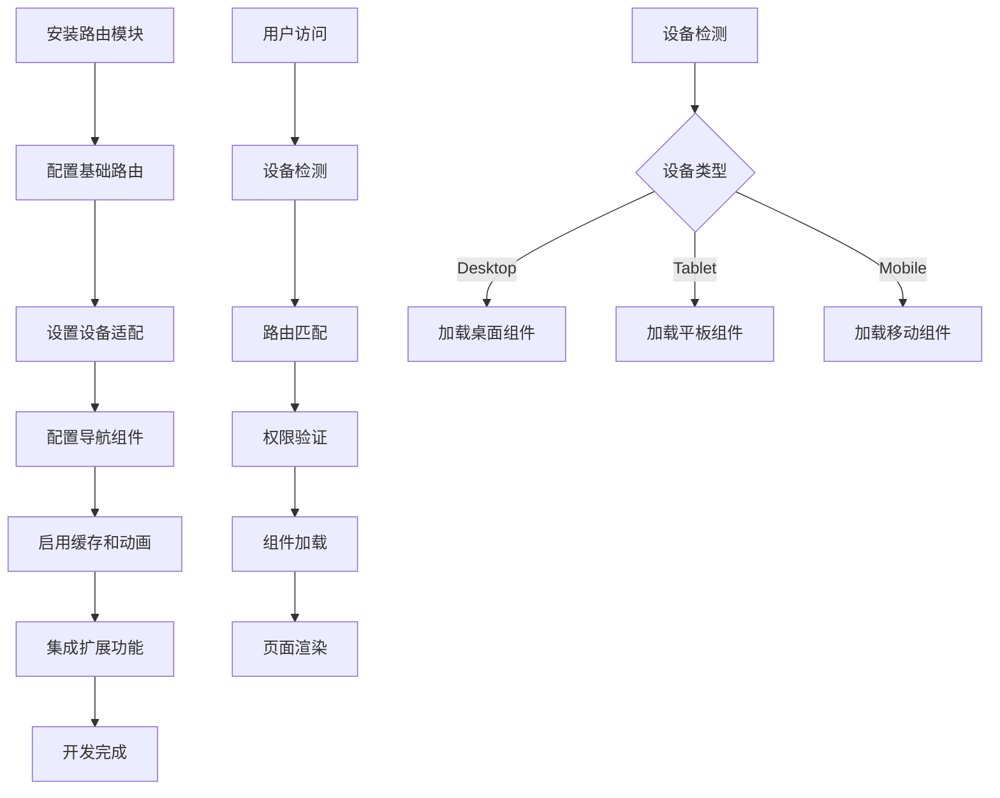

# Vue3 路由模块产品需求文档

## 1. 产品概述

一个专为Vue3设计的轻量级、高性能路由模块，提供简洁的API和丰富的功能特性。

- 解决Vue3项目中路由管理复杂、动画效果难以实现、页面缓存配置繁琐等问题，为开发者提供开箱即用的路由解决方案。

- 目标成为Vue3生态中最易用、功能最全面的路由库，提升开发效率和用户体验。

## 2. 核心功能

### 2.1 用户角色

| 角色     | 使用方式     | 核心权限                             |
| -------- | ------------ | ------------------------------------ |
| 开发者   | npm安装集成  | 完整的路由配置和开发工具访问权限     |
| 最终用户 | 通过应用使用 | 基础的路由导航和页面访问权限         |
| 管理员   | 管理后台配置 | 路由权限管理、性能监控、系统配置权限 |

### 2.2 功能模块

我们的Vue3路由模块包含以下核心功能模块：

1. **路由配置页面**: 基础路由配置、设备类型适配配置、路由守卫配置
2. **路由导航页面**: 标签页管理、面包屑导航、导航菜单
3. **路由缓存页面**: 缓存策略配置、缓存状态管理、性能监控
4. **路由动画页面**: 过渡效果配置、自定义动画、动画预览
5. **开发工具页面**: 路由调试、性能分析、错误监控
6. **示例演示页面**: 功能演示、最佳实践、集成指南
7. **扩展功能页面**: 权限管理、主题切换、国际化支持、插件系统

### 2.3 页面详情

| 页面名称     | 模块名称     | 功能描述                                                        |
| ------------ | ------------ | --------------------------------------------------------------- |
| 路由配置页面 | 基础路由配置 | 创建、编辑、删除路由配置，支持嵌套路由和动态路由参数            |
| 路由配置页面 | 设备类型适配 | 支持desktop/tablet/mobile设备类型配置，根据设备自动加载对应组件 |
| 路由配置页面 | 路由守卫配置 | 全局守卫、路由级守卫、组件级守卫的配置和管理                    |
| 路由导航页面 | 标签页管理   | 多标签页支持、标签页缓存、拖拽排序、右键菜单操作                |
| 路由导航页面 | 面包屑导航   | 自动生成面包屑、自定义面包屑样式、点击导航功能                  |
| 路由导航页面 | 导航菜单     | 侧边栏菜单、顶部菜单、菜单折叠展开、权限控制                    |
| 路由缓存页面 | 缓存策略配置 | Keep-alive集成、智能缓存策略、缓存生命周期管理                  |
| 路由缓存页面 | 缓存状态管理 | 缓存状态监控、手动清除缓存、缓存大小限制                        |
| 路由缓存页面 | 性能监控     | 路由加载时间统计、内存使用监控、性能优化建议                    |
| 路由动画页面 | 过渡效果配置 | 内置过渡动画、自定义CSS动画、动画时长配置                       |
| 路由动画页面 | 自定义动画   | JavaScript动画钩子、第三方动画库集成、动画队列管理              |
| 路由动画页面 | 动画预览     | 实时预览动画效果、动画参数调试、动画性能测试                    |
| 开发工具页面 | 路由调试     | 路由状态查看、路由历史记录、路由参数检查                        |
| 开发工具页面 | 性能分析     | 路由渲染时间分析、组件加载性能、内存泄漏检测                    |
| 开发工具页面 | 错误监控     | 路由错误捕获、错误日志记录、错误恢复机制                        |
| 示例演示页面 | 功能演示     | 各功能模块的实际使用示例、交互式演示                            |
| 示例演示页面 | 最佳实践     | 常见使用场景、性能优化技巧、代码示例                            |
| 示例演示页面 | 集成指南     | Vue项目集成步骤、配置说明、故障排除                             |
| 扩展功能页面 | 权限管理     | 基于角色的访问控制、动态权限验证、权限继承机制                  |
| 扩展功能页面 | 主题切换     | 深色/浅色主题、自定义主题、主题持久化存储                       |
| 扩展功能页面 | 国际化支持   | 多语言路由、语言切换、本地化配置                                |
| 扩展功能页面 | 插件系统     | 插件注册机制、生命周期钩子、第三方插件集成                      |
| 扩展功能页面 | 状态管理集成 | Pinia/Vuex集成、路由状态同步、持久化状态                        |
| 扩展功能页面 | SEO优化      | 元标签管理、结构化数据、预渲染支持                              |

## 3. 核心流程

**开发者集成流程：**

1. 安装路由模块 → 2. 配置基础路由 → 3. 设置设备适配 → 4. 配置导航组件 → 5. 启用缓存和动画 → 6. 集成扩展功能

**用户导航流程：**

1. 访问应用 → 2. 设备检测 → 3. 路由匹配 → 4. 权限验证 → 5. 组件加载 → 6. 页面渲染

**设备适配流程：**

1. 检测设备类型 → 2. 匹配对应路由配置 → 3. 加载适配组件 → 4. 应用响应式样式

## 4. 用户界面设计

### 4.1 设计风格

- **主色调**: #2563eb (蓝色) 用于主要操作按钮和链接

- **辅助色**: #64748b (灰蓝色) 用于次要信息和边框

- **成功色**: #10b981 (绿色) 用于成功状态提示

- **警告色**: #f59e0b (橙色) 用于警告信息

- **错误色**: #ef4444 (红色) 用于错误状态

- **按钮样式**: 圆角按钮 (border-radius: 6px)，支持悬停和点击状态

- **字体**: 系统字体栈 (system-ui, -apple-system, sans-serif)

- **字体大小**: 14px (正文)，16px (标题)，12px (辅助信息)

- **布局风格**: 卡片式布局，顶部导航 + 侧边栏结构

- **图标风格**: 线性图标，统一使用 Heroicons 或 Lucide 图标库

### 4.2 页面设计概览

| 页面名称     | 模块名称     | UI元素                                           |
| ------------ | ------------ | ------------------------------------------------ |
| 路由配置页面 | 基础路由配置 | 表单组件、代码编辑器、实时预览面板、配置树形结构 |
| 路由配置页面 | 设备类型适配 | 设备类型选择器、响应式预览、配置对比视图         |
| 路由导航页面 | 标签页管理   | 可拖拽标签栏、右键菜单、关闭按钮、新增按钮       |
| 路由导航页面 | 面包屑导航   | 链式导航条、分隔符、可点击链接、当前页面高亮     |
| 路由缓存页面 | 缓存策略配置 | 开关组件、滑块控制、缓存规则列表、状态指示器     |
| 路由动画页面 | 过渡效果配置 | 动画选择器、参数调节器、实时预览窗口、代码生成器 |
| 开发工具页面 | 路由调试     | 调试面板、日志查看器、状态树、性能图表           |
| 示例演示页面 | 功能演示     | 交互式演示区、代码高亮显示、复制按钮、运行按钮   |
| 扩展功能页面 | 权限管理     | 权限树组件、角色选择器、权限矩阵表格、测试工具   |
| 扩展功能页面 | 主题切换     | 主题选择器、颜色预览、实时切换、自定义配置面板   |
| 扩展功能页面 | 国际化支持   | 语言选择器、翻译编辑器、本地化预览、导入导出工具 |
| 扩展功能页面 | 插件系统     | 插件列表、安装向导、配置面板、状态监控           |

### 4.3 响应式设计

- **设计优先级**: Desktop-first 设计，向下兼容移动端

- **断点设置**:
  - Desktop: ≥1024px

  - Tablet: 768px-1023px

  - Mobile: <768px

- **触摸优化**: 移动端增大点击区域，支持手势操作，优化滚动体验

- **自适应布局**: 侧边栏在移动端自动折叠，表格在小屏幕下支持横向滚动
