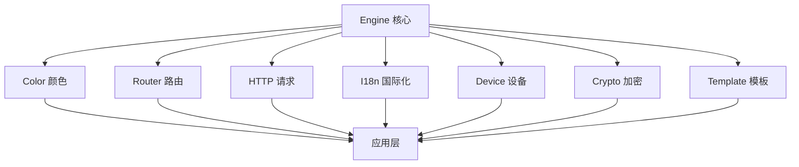

# 开发指南

本文档详细介绍了 LDesign 项目的开发流程、架构设计和最佳实践。

## 项目架构

### Monorepo 架构

LDesign 采用 monorepo 架构，使用 pnpm workspace 管理多个包：

```
ldesign/
├── packages/          # 核心包目录
│   ├── engine/        # 🚀 引擎核心 - 插件系统、中间件、全局管理
│   ├── color/         # 🎨 颜色管理 - 主题切换、颜色生成、CSS变量
│   ├── router/        # 🛣️  路由系统 - Vue路由增强、守卫、缓存
│   ├── http/          # 🌐 HTTP客户端 - 请求库、拦截器、缓存
│   ├── i18n/          # 🌍 国际化 - 多语言支持、动态加载
│   ├── device/        # 📱 设备检测 - 设备信息、传感器、网络状态
│   ├── crypto/        # 🔐 加密工具 - 加密算法、哈希、签名
│   └── template/      # 📄 模板引擎 - 模板编译、SSR支持
├── tools/             # 🛠️  开发工具
│   ├── build-config.js      # 统一构建配置
│   ├── package-template.json # 包配置模板
│   ├── eslint-config.js     # ESLint配置
│   ├── tsconfig-template.json # TypeScript配置模板
│   ├── vitest-config.js     # Vitest配置
│   ├── playwright-config.js # Playwright配置
│   └── package-manager.js   # 包管理工具
├── examples/          # 📚 示例项目
├── docs/              # 📖 文档
└── .github/           # ⚙️  GitHub配置
    └── workflows/     # CI/CD工作流
```

### 包依赖关系



## 技术栈

### 核心技术

- **Vue 3**: 渐进式 JavaScript 框架
- **TypeScript**: 类型安全的 JavaScript 超集
- **Vite**: 快速的构建工具
- **Rollup**: 模块打包器
- **pnpm**: 高效的包管理器

### 开发工具

- **ESLint**: 代码质量检查
- **Prettier**: 代码格式化
- **Vitest**: 单元测试框架
- **Playwright**: E2E 测试框架
- **Changesets**: 版本管理和发布

### CI/CD

- **GitHub Actions**: 持续集成和部署
- **Codecov**: 代码覆盖率报告
- **Size Limit**: 包体积监控

## 开发环境设置

### 1. 环境要求

```bash
# 检查 Node.js 版本
node --version  # >= 18.0.0

# 检查 pnpm 版本
pnpm --version  # >= 8.0.0
```

### 2. 项目设置

```bash
# 克隆项目
git clone https://github.com/ldesign/ldesign.git
cd ldesign

# 安装依赖
pnpm install

# 构建所有包
pnpm build

# 运行测试
pnpm test
```

### 3. 开发模式

```bash
# 启动所有包的开发模式（监听文件变化）
pnpm dev

# 启动特定包的开发模式
cd packages/engine
pnpm dev

# 运行测试（监听模式）
pnpm test --watch
```

## 包开发流程

### 1. 创建新包

```bash
# 使用包管理器创建新包
pnpm create-package my-package "My package description"

# 创建支持 Vue 的包
pnpm create-package my-vue-package "My Vue package description" --vue
```

### 2. 包结构标准

每个包都遵循统一的目录结构：

```
package-name/
├── src/                    # 源代码
│   ├── core/              # 核心功能
│   │   └── index.ts       # 核心逻辑
│   ├── utils/             # 工具函数
│   │   └── index.ts       # 工具函数
│   ├── types/             # 类型定义
│   │   └── index.ts       # 类型声明
│   └── index.ts           # 包入口
├── tests/                 # 测试文件
│   └── setup.ts           # 测试设置
├── __tests__/             # 单元测试
│   └── index.test.ts      # 测试用例
├── e2e/                   # E2E测试
│   └── basic.spec.ts      # E2E测试用例
├── examples/              # 使用示例
├── docs/                  # 文档
├── dist/                  # 构建产物
├── package.json           # 包配置
├── README.md              # 说明文档
├── CHANGELOG.md           # 变更日志
├── rollup.config.js       # 构建配置
├── tsconfig.json          # TypeScript配置
├── vitest.config.ts       # 测试配置
├── playwright.config.ts   # E2E测试配置
└── eslint.config.js       # ESLint配置
```

### 3. 包配置标准

#### package.json 配置

```json
{
  "name": "@ldesign/package-name",
  "version": "0.1.0",
  "type": "module",
  "main": "dist/index.cjs",
  "module": "dist/index.js",
  "types": "dist/index.d.ts",
  "browser": "dist/package-name.umd.js",
  "exports": {
    ".": {
      "types": "./dist/index.d.ts",
      "import": "./dist/index.js",
      "require": "./dist/index.cjs",
      "browser": "./dist/package-name.umd.js"
    }
  },
  "files": ["dist", "README.md", "CHANGELOG.md"]
}
```

#### 构建配置

```javascript
// rollup.config.js
import { createBuildConfig } from '../../tools/build-config.js'

export default createBuildConfig({
  packageName: 'package-name',
  vue: false, // 如果支持 Vue 则设为 true
})
```

## 代码规范

### TypeScript 规范

```typescript
// ✅ 好的实践
export interface UserOptions {
  name: string
  age?: number
}

export class UserManager {
  private options: UserOptions

  constructor(options: UserOptions) {
    this.options = options
  }

  public getName(): string {
    return this.options.name
  }
}

// ❌ 避免的实践
export class UserManager {
  private options: any // 避免使用 any

  constructor(options: any) {
    this.options = options
  }

  public getName() {
    // 缺少返回类型
    return this.options.name
  }
}
```

### Vue 3 规范

```vue
<!-- ✅ 好的实践 -->
<script setup lang="ts">
import type { UserOptions } from '@ldesign/engine'
import { computed, ref } from 'vue'

interface Props {
  user: UserOptions
  disabled?: boolean
}

const props = withDefaults(defineProps<Props>(), {
  disabled: false,
})

const emit = defineEmits<{
  update: [user: UserOptions]
}>()

const isActive = ref(false)
const displayName = computed(() => props.user.name)
</script>

<template>
  <div :class="{ active: isActive, disabled }">
    {{ displayName }}
  </div>
</template>
```

### 命名规范

- **文件名**: kebab-case (`user-manager.ts`)
- **类名**: PascalCase (`UserManager`)
- **函数名**: camelCase (`getUserName`)
- **常量**: UPPER_SNAKE_CASE (`MAX_RETRY_COUNT`)
- **接口**: PascalCase + Interface 后缀 (`UserInterface`)
- **类型**: PascalCase + Type 后缀 (`UserType`)

## 测试策略

### 测试金字塔

```
    /\     E2E Tests (少量)
   /  \
  /____\   Integration Tests (适量)
 /______\  Unit Tests (大量)
```

### 单元测试

```typescript
// __tests__/user-manager.test.ts
import { beforeEach, describe, expect, it } from 'vitest'
import { UserManager } from '../src/core/user-manager'

describe('UserManager', () => {
  let userManager: UserManager

  beforeEach(() => {
    userManager = new UserManager({ name: 'John' })
  })

  it('should create instance', () => {
    expect(userManager).toBeInstanceOf(UserManager)
  })

  it('should return user name', () => {
    expect(userManager.getName()).toBe('John')
  })

  it('should handle empty name', () => {
    const manager = new UserManager({ name: '' })
    expect(manager.getName()).toBe('')
  })
})
```

### E2E 测试

```typescript
// e2e/user-flow.spec.ts
import { expect, test } from '@playwright/test'

test.describe('User Flow', () => {
  test('should create and display user', async ({ page }) => {
    await page.goto('/user')

    await page.fill('[data-testid="name-input"]', 'John Doe')
    await page.click('[data-testid="create-button"]')

    await expect(page.locator('[data-testid="user-name"]')).toHaveText('John Doe')
  })
})
```

### 测试覆盖率

- 目标覆盖率: 90%+
- 分支覆盖率: 90%+
- 函数覆盖率: 90%+
- 行覆盖率: 90%+

## 构建和发布

### 构建流程

```bash
# 清理构建产物
pnpm clean

# 类型检查
pnpm type-check

# 代码检查
pnpm lint

# 运行测试
pnpm test

# 构建所有包
pnpm build

# 检查包大小
pnpm size-check
```

### 版本管理

使用 Changesets 进行版本管理：

```bash
# 1. 添加变更集
pnpm changeset

# 2. 选择变更类型
# - patch: 修复 bug
# - minor: 新增功能
# - major: 破坏性变更

# 3. 版本更新
pnpm changeset version

# 4. 发布
pnpm release
```

### 发布检查清单

- [ ] 所有测试通过
- [ ] 代码覆盖率达标
- [ ] 文档已更新
- [ ] CHANGELOG 已更新
- [ ] 版本号正确
- [ ] 构建产物正常
- [ ] 包大小在限制内

## 性能优化

### 包体积优化

- 使用 Tree-shaking
- 避免不必要的依赖
- 使用动态导入
- 压缩代码

### 运行时性能

- 避免不必要的计算
- 使用缓存策略
- 优化算法复杂度
- 减少内存泄漏

### 构建性能

- 使用增量构建
- 并行构建
- 缓存构建结果
- 优化依赖解析

## 调试技巧

### 开发调试

```typescript
// 使用 console.log 进行调试（开发环境）
if (process.env.NODE_ENV === 'development') {
  console.log('Debug info:', data)
}

// 使用断点调试
// eslint-disable-next-line no-debugger
debugger // 在浏览器开发者工具中会暂停
```

### 测试调试

```bash
# 调试特定测试
pnpm test --reporter=verbose user-manager.test.ts

# 使用 UI 模式调试
pnpm test:ui
```

### 生产调试

```typescript
// 使用日志系统
import { logger } from '@ldesign/engine'

logger.error('Something went wrong', { error, context })
```

## 最佳实践

### 代码组织

1. **单一职责**: 每个模块只负责一个功能
2. **依赖注入**: 使用依赖注入提高可测试性
3. **接口隔离**: 定义清晰的接口边界
4. **开闭原则**: 对扩展开放，对修改关闭

### 错误处理

```typescript
// ✅ 好的错误处理
export class UserManager {
  public async getUser(id: string): Promise<User> {
    try {
      const user = await this.userService.findById(id)
      if (!user) {
        throw new UserNotFoundError(`User with id ${id} not found`)
      }
      return user
    } catch (error) {
      this.logger.error('Failed to get user', { id, error })
      throw error
    }
  }
}
```

### 文档编写

````typescript
/**
 * 用户管理器
 *
 * @example
 * ```typescript
 * const manager = new UserManager({ apiUrl: '/api' })
 * const user = await manager.getUser('123')
 * ```
 */
export class UserManager {
  /**
   * 获取用户信息
   *
   * @param id - 用户ID
   * @returns 用户信息
   * @throws {UserNotFoundError} 当用户不存在时
   */
  public async getUser(id: string): Promise<User> {
    // 实现
  }
}
````

## 故障排除

### 常见问题

#### 1. 构建失败

```bash
# 清理缓存
pnpm clean
rm -rf node_modules
pnpm install

# 检查 TypeScript 错误
pnpm type-check
```

#### 2. 测试失败

```bash
# 运行特定测试
pnpm test user-manager.test.ts

# 查看详细输出
pnpm test --reporter=verbose
```

#### 3. 依赖问题

```bash
# 检查依赖
pnpm ls

# 更新依赖
pnpm update

# 检查安全漏洞
pnpm audit
```

### 性能问题

#### 1. 构建慢

- 检查并行构建配置
- 使用构建缓存
- 优化依赖解析

#### 2. 测试慢

- 使用并行测试
- 优化测试设置
- 减少不必要的测试

#### 3. 包体积大

- 分析包内容
- 移除未使用的代码
- 使用动态导入

---

这份开发指南会随着项目的发展持续更新。如有问题或建议，请提交 Issue 或 PR。
