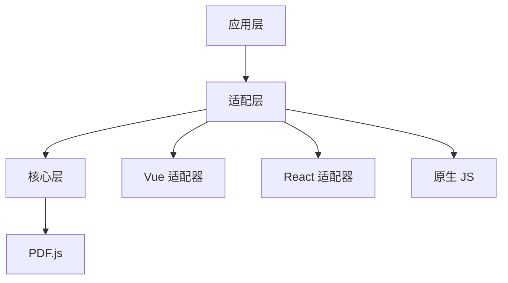

# 介绍

@ldesign/pdf 是一个功能强大、高性能的PDF阅读器插件，基于Mozilla的PDF.js构建。

## 特性

### 🚀 高性能

- **虚拟滚动**: 只渲染可见区域的页面，大幅提升性能
- **智能缓存**: 支持LRU、FIFO、LFU等多种缓存策略
- **Web Worker**: 在后台线程处理PDF解析，不阻塞UI
- **页面预加载**: 智能预加载相邻页面，提升翻页体验

### 🎯 功能完善

- **多种缩放模式**: 自动、适应页面、适应宽度、适应高度
- **全文搜索**: 支持正则表达式、大小写敏感、全词匹配
- **缩略图导航**: 快速预览和跳转到任意页面
- **打印和下载**: 一键打印和下载PDF文档
- **文本选择**: 支持文本选择和复制
- **书签/大纲**: 显示文档大纲结构，快速导航

### 🔧 高度可配置

提供丰富的配置选项，满足各种使用场景：

- 渲染质量配置
- 缓存策略配置
- 搜索选项配置
- 打印选项配置
- 自定义事件处理

### 🛠️ 框架无关

核心功能完全独立于框架，同时提供官方适配器：

- **Vue 3**: 提供组件和Composable
- **React**: 提供组件和Hooks
- **原生JS**: 直接使用核心API

### 🎨 易于定制

- 完全自定义UI
- 插件系统支持功能扩展
- 灵活的事件系统

## 工作原理

@ldesign/pdf 采用分层架构设计：

1. **核心层**: 提供PDF加载、渲染、缓存等核心功能
2. **管理层**: 文档管理器、页面渲染器、缓存管理器等
3. **适配层**: 框架适配器，提供框架特定的API
4. **UI层**: 可选的UI组件和工具栏

## 性能优化

### 虚拟滚动

只渲染可见区域的页面，大幅减少DOM节点数量和内存占用。

### 智能缓存

支持多种缓存策略：

- **LRU (Least Recently Used)**: 淘汰最近最少使用的页面
- **FIFO (First In First Out)**: 淘汰最早加载的页面
- **LFU (Least Frequently Used)**: 淘汰访问频率最低的页面

### 页面预加载

智能预加载当前页面前后的几页，提升翻页体验。

### Web Worker

在后台线程处理PDF解析和渲染，避免阻塞主线程。

## 下一步

- [快速开始](/guide/getting-started) - 了解如何安装和使用
- [基础用法](/guide/basic-usage) - 学习基本使用方法
- [配置选项](/guide/configuration) - 了解所有配置选项
- [API 参考](/api/) - 查看完整的API文档
