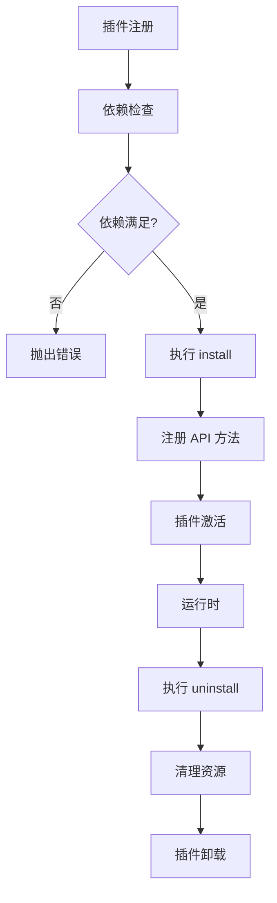
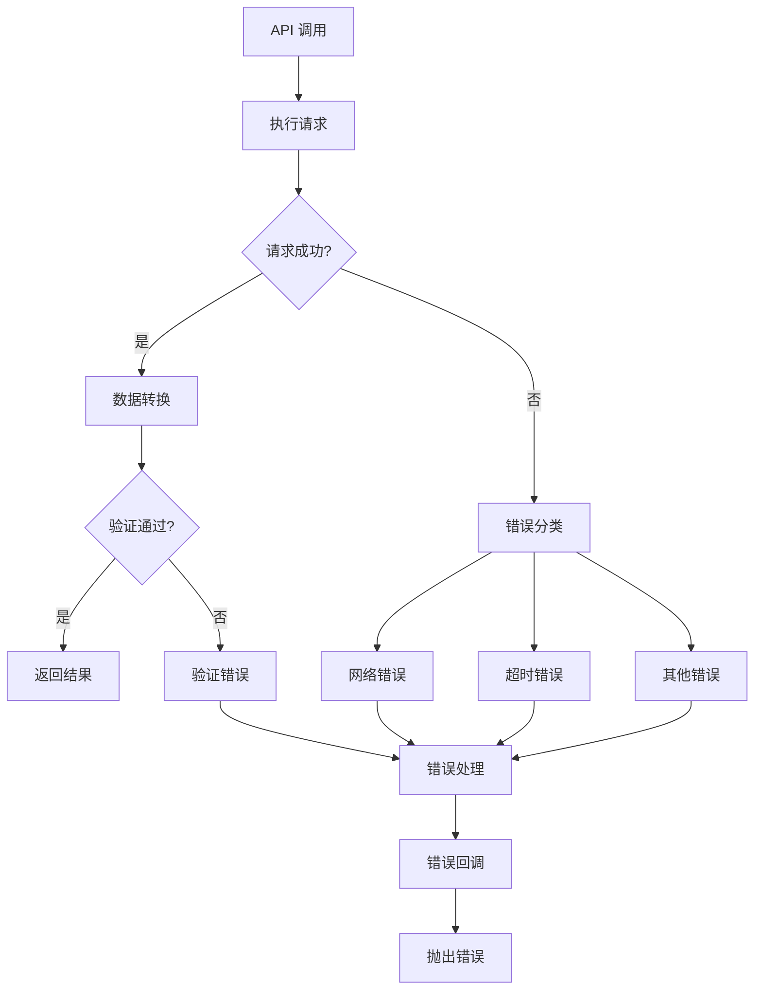

# @ldesign/api 架构设计

## 🏗️ 整体架构

### 架构图

```
┌─────────────────────────────────────────────────────────────┐
│                    @ldesign/api                             │
├─────────────────────────────────────────────────────────────┤
│                   Vue 3 Integration                        │
│  ┌─────────────────┐  ┌─────────────────┐  ┌─────────────┐ │
│  │   Vue Plugin    │  │   Composables   │  │   Provide   │ │
│  │  (apiVuePlugin) │  │  (useApiCall)   │  │   Inject    │ │
│  └─────────────────┘  └─────────────────┘  └─────────────┘ │
├─────────────────────────────────────────────────────────────┤
│                     Core Engine                            │
│  ┌─────────────────────────────────────────────────────────┐ │
│  │                  ApiEngine                              │ │
│  │  ┌─────────────┐ ┌─────────────┐ ┌─────────────────────┐ │ │
│  │  │   Config    │ │   Methods   │ │    HTTP Client      │ │ │
│  │  │ Management  │ │  Registry   │ │   (@ldesign/http)   │ │ │
│  │  └─────────────┘ └─────────────┘ └─────────────────────┘ │ │
│  └─────────────────────────────────────────────────────────┘ │
├─────────────────────────────────────────────────────────────┤
│                    Plugin System                           │
│  ┌─────────────────┐  ┌─────────────────┐  ┌─────────────┐ │
│  │ Plugin Manager  │  │ System APIs     │  │   Custom    │ │
│  │   (Registry)    │  │    Plugin       │  │   Plugins   │ │
│  └─────────────────┘  └─────────────────┘  └─────────────┘ │
├─────────────────────────────────────────────────────────────┤
│                Performance Optimization                    │
│  ┌─────────────────┐  ┌─────────────────┐  ┌─────────────┐ │
│  │ Cache Manager   │  │Debounce Manager │  │Deduplication│ │
│  │  (Multi-tier)   │  │  (Anti-shake)   │  │   Manager   │ │
│  └─────────────────┘  └─────────────────┘  └─────────────┘ │
├─────────────────────────────────────────────────────────────┤
│                      Utilities                             │
│  ┌─────────────────┐  ┌─────────────────┐  ┌─────────────┐ │
│  │  Type Helpers   │  │  Error Handling │  │   Common    │ │
│  │   (TypeScript)  │  │   (Formatting)  │  │  Functions  │ │
│  └─────────────────┘  └─────────────────┘  └─────────────┘ │
└─────────────────────────────────────────────────────────────┘
```

## 🎯 设计原则

### 1. 单一职责原则 (SRP)

每个模块都有明确的单一职责：

- **ApiEngine**: 协调和管理
- **PluginManager**: 插件生命周期管理
- **CacheManager**: 缓存策略和存储
- **DebounceManager**: 防抖逻辑
- **DeduplicationManager**: 请求去重

### 2. 开放封闭原则 (OCP)

- 对扩展开放：通过插件系统支持功能扩展
- 对修改封闭：核心 API 保持稳定，不轻易修改

### 3. 依赖倒置原则 (DIP)

- 高层模块不依赖低层模块，都依赖抽象
- 通过接口定义依赖关系，便于测试和替换

### 4. 接口隔离原则 (ISP)

- 提供细粒度的接口，避免臃肿的接口
- 客户端只依赖它需要的接口

## 🔧 核心组件设计

### ApiEngine (核心引擎)

```typescript
class ApiEngineImpl implements ApiEngine {
  // 配置管理
  public readonly config: ApiEngineConfig

  // 依赖组件
  private readonly httpClient: HttpClientImpl
  private readonly pluginManager: PluginManager
  private readonly cacheManager: CacheManager
  private readonly debounceManager: DebounceManager
  private readonly deduplicationManager: DeduplicationManager

  // 方法注册表
  private readonly apiMethods = new Map<string, ApiMethod>()

  // 生命周期状态
  private destroyed = false
}
```

#### 职责分工

1. **配置管理**: 合并和验证配置选项
2. **组件协调**: 协调各个管理器的工作
3. **方法注册**: 管理 API 方法的注册和调用
4. **生命周期**: 管理引擎的初始化和销毁

#### 关键方法

- `use(plugin)`: 注册插件
- `register(name, method)`: 注册 API 方法
- `call(name, params)`: 调用 API 方法
- `destroy()`: 销毁引擎

### PluginManager (插件管理器)

```typescript
class PluginManager {
  private readonly plugins = new Map<string, ApiPlugin>()
  private readonly loadOrder: string[] = []
  private readonly engine: ApiEngine

  async register(plugin: ApiPlugin): Promise<void>
  async unregister(name: string): Promise<void>
  get(name: string): ApiPlugin | undefined
  getAll(): ApiPlugin[]
}
```

#### 核心功能

1. **依赖检查**: 验证插件依赖关系
2. **加载顺序**: 确保按正确顺序加载插件
3. **生命周期**: 管理插件的安装和卸载
4. **错误处理**: 处理插件加载失败的情况

#### 依赖解析算法

```typescript
// 简化的依赖解析逻辑
function resolveDependencies(plugins: Map<string, ApiPlugin>): string[] {
  const resolved: string[] = []
  const visiting = new Set<string>()

  function visit(name: string) {
    if (visiting.has(name)) {
      throw new Error(`Circular dependency detected: ${name}`)
    }

    if (resolved.includes(name)) {
      return
    }

    visiting.add(name)
    const plugin = plugins.get(name)

    if (plugin?.dependencies) {
      plugin.dependencies.forEach(dep => visit(dep))
    }

    visiting.delete(name)
    resolved.push(name)
  }

  plugins.forEach((_, name) => visit(name))
  return resolved
}
```

### CacheManager (缓存管理器)

```typescript
class CacheManager {
  private readonly config: Required<CacheConfig>
  private readonly memoryCache = new Map<string, CacheItem>()
  private readonly stats = { hits: 0, misses: 0, sets: 0 }

  async get<T>(key: string): Promise<T | null>
  async set<T>(key: string, value: T, ttl?: number): Promise<void>
  async delete(key: string): Promise<void>
  async clear(): Promise<void>
}
```

#### 缓存策略

1. **多级存储**: 支持内存、localStorage、sessionStorage
2. **TTL 过期**: 基于时间的自动过期机制
3. **LRU 淘汰**: 最近最少使用的数据优先淘汰
4. **大小限制**: 防止缓存无限增长

#### 缓存键设计

```typescript
// 缓存键生成策略
function generateCacheKey(methodName: string, params?: any): string {
  const prefix = this.config.cache?.prefix ?? 'api_cache_'
  const paramsStr = params ? JSON.stringify(params) : ''
  const hash = this.hashCode(paramsStr)
  return `${prefix}${methodName}_${hash}`
}
```

### DebounceManager (防抖管理器)

```typescript
class DebounceManager {
  private readonly config: Required<DebounceConfig>
  private readonly tasks = new Map<string, DebounceTask>()
  private readonly stats = { executions: 0, cancellations: 0 }

  async execute<T>(key: string, task: () => Promise<T>, delay?: number): Promise<T>
  cancel(key: string): boolean
  flush<T>(key: string): Promise<T | null>
}
```

#### 防抖算法

```typescript
// 防抖执行逻辑
async execute<T>(key: string, task: () => Promise<T>, delay?: number): Promise<T> {
  // 取消之前的任务
  const existingTask = this.tasks.get(key)
  if (existingTask) {
    clearTimeout(existingTask.timerId)
    existingTask.reject(new Error('Debounced: replaced by newer request'))
  }

  // 创建新任务
  return new Promise<T>((resolve, reject) => {
    const timerId = setTimeout(async () => {
      try {
        const result = await task()
        resolve(result)
      } catch (error) {
        reject(error)
      } finally {
        this.tasks.delete(key)
      }
    }, delay ?? this.config.delay)

    this.tasks.set(key, { task, timerId, resolve, reject })
  })
}
```

### DeduplicationManager (去重管理器)

```typescript
class DeduplicationManager {
  private readonly config: Required<DeduplicationConfig>
  private readonly runningTasks = new Map<string, DeduplicationTask>()
  private readonly stats = { executions: 0, duplications: 0 }

  async execute<T>(key: string, task: () => Promise<T>): Promise<T>
  cancel(key: string): boolean
  waitFor<T>(key: string): Promise<T | null>
}
```

#### 去重算法

```typescript
// 请求去重逻辑
async execute<T>(key: string, task: () => Promise<T>): Promise<T> {
  // 检查是否有相同任务正在执行
  const existingTask = this.runningTasks.get(key)
  if (existingTask) {
    existingTask.refCount++
    this.stats.duplications++
    return await existingTask.promise
  }

  // 创建新任务
  const promise = this.createTask(key, task)
  const newTask = { promise, refCount: 1, createdAt: Date.now() }

  this.runningTasks.set(key, newTask)
  this.stats.executions++

  try {
    return await promise
  } finally {
    this.runningTasks.delete(key)
  }
}
```

## 🔌 插件系统架构

### 插件接口设计

```typescript
interface ApiPlugin {
  // 基本信息
  name: string
  version?: string

  // 依赖管理
  dependencies?: string[]

  // 生命周期钩子
  install: (engine: ApiEngine) => void | Promise<void>
  uninstall?: (engine: ApiEngine) => void | Promise<void>

  // API 方法定义
  apis?: Record<string, ApiMethod>
}
```

### 插件生命周期



### 内置插件设计

#### SystemApiPlugin

```typescript
const systemApiPlugin: ApiPlugin = {
  name: 'system-apis',
  version: '1.0.0',

  apis: {
    getCaptcha: {
      name: 'getCaptcha',
      config: { method: 'GET', url: '/auth/captcha' },
      cache: { enabled: false },
    },

    login: {
      name: 'login',
      config: params => ({
        method: 'POST',
        url: '/auth/login',
        data: params,
      }),
      cache: { enabled: false },
      transform: response => response.data,
    },

    // ... 其他系统接口
  },

  install: engine => {
    console.log('System APIs plugin installed')
  },
}
```

## 🌟 Vue 3 集成架构

### 集成策略

```typescript
// Vue 插件安装
const apiVuePlugin = {
  install(app: App, options: ApiVuePluginOptions = {}) {
    // 创建 API 引擎
    const apiEngine = createApiEngine(options)

    // 依赖注入
    app.provide(API_ENGINE_KEY, apiEngine)

    // 全局属性
    app.config.globalProperties.$api = apiEngine

    // 生命周期管理
    const originalUnmount = app.unmount
    app.unmount = function () {
      apiEngine.destroy()
      originalUnmount.call(this)
    }
  },
}
```

### 组合式 API 设计

```typescript
// useApiCall 实现
function useApiCall<T, P>(methodName: string, options: UseApiCallOptions = {}) {
  const apiEngine = useApi()

  // 响应式状态
  const data = ref<T | null>(null)
  const loading = ref(false)
  const error = ref<Error | null>(null)
  const finished = ref(false)

  // 执行函数
  const execute = async (params?: P): Promise<T> => {
    loading.value = true
    error.value = null

    try {
      const result = await apiEngine.call<T, P>(methodName, params)
      data.value = result
      finished.value = true
      return result
    } catch (err) {
      error.value = err as Error
      finished.value = true
      throw err
    } finally {
      loading.value = false
    }
  }

  // 生命周期管理
  onUnmounted(() => {
    // 清理资源
  })

  return { data, loading, error, finished, execute }
}
```

## 🛡️ 错误处理架构

### 错误分类

```typescript
enum ErrorType {
  NETWORK_ERROR = 'NETWORK_ERROR',
  TIMEOUT_ERROR = 'TIMEOUT_ERROR',
  VALIDATION_ERROR = 'VALIDATION_ERROR',
  PLUGIN_ERROR = 'PLUGIN_ERROR',
  CONFIG_ERROR = 'CONFIG_ERROR',
}

class ApiError extends Error {
  constructor(
    public type: ErrorType,
    message: string,
    public originalError?: Error
  ) {
    super(message)
    this.name = 'ApiError'
  }
}
```

### 错误处理流程



## 📊 性能优化架构

### 性能监控

```typescript
class PerformanceMonitor {
  private metrics = {
    apiCalls: 0,
    cacheHits: 0,
    cacheMisses: 0,
    averageResponseTime: 0,
    errorRate: 0,
  }

  recordApiCall(duration: number, cached: boolean, error?: Error) {
    this.metrics.apiCalls++

    if (cached) {
      this.metrics.cacheHits++
    } else {
      this.metrics.cacheMisses++
    }

    if (error) {
      this.metrics.errorRate =
        (this.metrics.errorRate * (this.metrics.apiCalls - 1) + 1) / this.metrics.apiCalls
    }

    this.metrics.averageResponseTime =
      (this.metrics.averageResponseTime * (this.metrics.apiCalls - 1) + duration) /
      this.metrics.apiCalls
  }

  getMetrics() {
    return { ...this.metrics }
  }
}
```

### 内存管理

```typescript
class MemoryManager {
  private readonly maxMemoryUsage = 50 * 1024 * 1024 // 50MB

  checkMemoryUsage() {
    if (performance.memory) {
      const usage = performance.memory.usedJSHeapSize
      if (usage > this.maxMemoryUsage) {
        this.triggerCleanup()
      }
    }
  }

  private triggerCleanup() {
    // 清理缓存
    this.cacheManager.cleanup()

    // 取消待执行的防抖任务
    this.debounceManager.cancelAll()

    // 清理已完成的去重任务
    this.deduplicationManager.cleanup()
  }
}
```

## 🔮 扩展性设计

### 中间件系统 (未来版本)

```typescript
interface Middleware {
  name: string
  priority?: number
  handler: (context: MiddlewareContext, next: () => Promise<void>) => Promise<void>
}

class MiddlewareManager {
  private middlewares: Middleware[] = []

  use(middleware: Middleware) {
    this.middlewares.push(middleware)
    this.middlewares.sort((a, b) => (b.priority || 0) - (a.priority || 0))
  }

  async execute(context: MiddlewareContext) {
    let index = 0

    const next = async () => {
      if (index < this.middlewares.length) {
        const middleware = this.middlewares[index++]
        await middleware.handler(context, next)
      }
    }

    await next()
  }
}
```

### 插件市场 (未来版本)

```typescript
interface PluginRegistry {
  search: (query: string) => Promise<PluginInfo[]>
  install: (name: string, version?: string) => Promise<ApiPlugin>
  uninstall: (name: string) => Promise<void>
  update: (name: string, version?: string) => Promise<ApiPlugin>
  list: () => Promise<PluginInfo[]>
}
```

这种架构设计确保了 @ldesign/api 具有良好的可扩展性、可维护性和性能，同时保持了简洁的 API 和优秀的开发体验。
