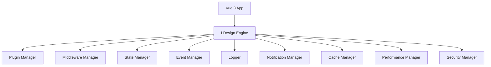

## 🚀 为什么选择 LDesign Engine？

LDesign Engine 是一个现代化的 Vue3 应用引擎，专为构建高性能、可扩展的 Web 应用而设计。它提供了完整的
插件化架构和丰富的功能模块，让开发者能够快速构建复杂的应用。

### ✨ 核心优势

- **🎯 开箱即用** - 提供完整的功能模块，无需重复造轮子
- **🔧 高度可配置** - 灵活的配置选项，满足不同场景需求
- **📈 性能优异** - 优化的架构设计，确保应用高性能运行
- **🛡️ 安全可靠** - 内置安全防护机制，保障应用安全
- **📚 文档完善** - 详细的文档和示例，降低学习成本
- **🧪 测试完备** - 完整的测试覆盖，确保代码质量

### 🎪 演示应用特色

这个演示应用不仅展示了 LDesign Engine 的所有功能，还提供了：

- **交互式体验** - 实时代码编辑和执行
- **可视化展示** - 直观的功能演示和数据展示
- **响应式设计** - 完美适配各种设备
- **完整测试** - 单元测试和 E2E 测试示例

## 🏗️ 技术架构

## 📊 性能表现

| 指标       | 数值    | 说明           |
| ---------- | ------- | -------------- |
| 包大小     | < 85KB  | 压缩后的包大小 |
| 启动时间   | < 100ms | 应用初始化时间 |
| 内存占用   | < 50MB  | 运行时内存使用 |
| 测试覆盖率 | > 90%   | 代码测试覆盖率 |

## 🤝 社区支持

- **GitHub** - [源码仓库](https://github.com/ldesign/ldesign)
- **Issues** - [问题反馈](https://github.com/ldesign/ldesign/issues)
- **Discussions** - [社区讨论](https://github.com/ldesign/ldesign/discussions)
- **文档** - [完整文档](./guide/)

## 📄 许可证

本项目基于 [MIT 许可证](https://github.com/ldesign/ldesign/blob/main/LICENSE) 开源。

---

  
Made with ❤️ by LDesign Team

