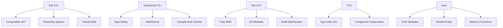
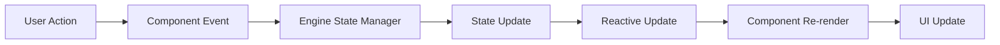
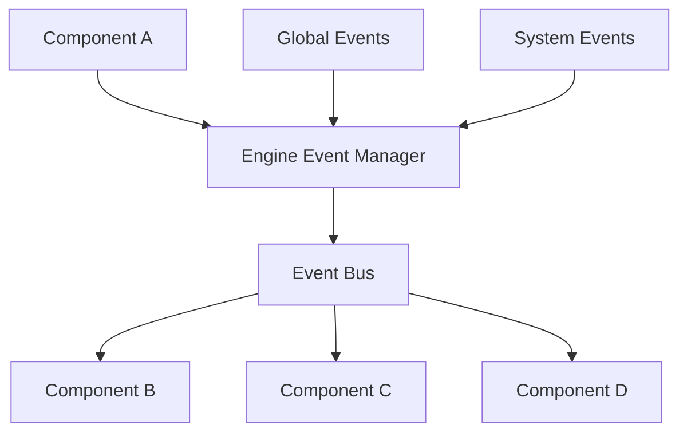

# 架构设计

## 🏗️ 整体架构

LDesign Engine 演示应用采用现代化的前端架构设计，基于 Vue 3 的组合式 API 和 TypeScript 构建，具有清
晰的分层结构和模块化设计。

### 架构层次

```
┌─────────────────────────────────────────────────────────────┐
│                    Presentation Layer                       │
│  ┌─────────────┐ ┌─────────────┐ ┌─────────────────────────┐ │
│  │   Header    │ │   Sidebar   │ │      MainContent        │ │
│  └─────────────┘ └─────────────┘ └─────────────────────────┘ │
├─────────────────────────────────────────────────────────────┤
│                    Component Layer                          │
│  ┌─────────────┐ ┌─────────────┐ ┌─────────────────────────┐ │
│  │ OverviewDemo│ │ PluginDemo  │ │    Other Demos...       │ │
│  └─────────────┘ └─────────────┘ └─────────────────────────┘ │
├─────────────────────────────────────────────────────────────┤
│                    Business Logic Layer                     │
│  ┌─────────────┐ ┌─────────────┐ ┌─────────────────────────┐ │
│  │   State     │ │   Events    │ │      Utils              │ │
│  │ Management  │ │ Management  │ │                         │ │
│  └─────────────┘ └─────────────┘ └─────────────────────────┘ │
├─────────────────────────────────────────────────────────────┤
│                    Engine Layer                             │
│  ┌─────────────────────────────────────────────────────────┐ │
│  │              LDesign Engine Core                        │ │
│  │  Plugin │ Middleware │ State │ Events │ Logger │ ...    │ │
│  └─────────────────────────────────────────────────────────┘ │
├─────────────────────────────────────────────────────────────┤
│                    Infrastructure Layer                     │
│  ┌─────────────┐ ┌─────────────┐ ┌─────────────────────────┐ │
│  │    Vue 3    │ │ TypeScript  │ │      Vite               │ │
│  └─────────────┘ └─────────────┘ └─────────────────────────┘ │
└─────────────────────────────────────────────────────────────┘
```

## 🎯 设计原则

### 1. 单一职责原则 (SRP)

每个组件和模块都有明确的职责：

- **Header**: 负责顶部导航和全局操作
- **Sidebar**: 负责功能模块导航
- **MainContent**: 负责主要内容展示
- **Demo Components**: 各自负责特定功能的演示

### 2. 开闭原则 (OCP)

系统对扩展开放，对修改关闭：

- 新的演示组件可以轻松添加
- 现有组件无需修改即可支持新功能
- 插件化的架构支持功能扩展

### 3. 依赖倒置原则 (DIP)

高层模块不依赖低层模块：

- 组件依赖抽象接口而非具体实现
- 通过依赖注入管理组件间的依赖关系
- Engine 作为核心抽象层统一管理各种功能

### 4. 组合优于继承

通过组合实现功能复用：

- 使用 Composition API 组合逻辑
- 通过 Hooks 复用状态逻辑
- 模块化设计支持功能组合

## 🔧 技术架构

### 前端技术栈



### 构建工具链

1. **开发环境**

   - Vite 开发服务器
   - 热模块替换 (HMR)
   - TypeScript 类型检查
   - ESLint 代码检查

2. **构建流程**

   - TypeScript 编译
   - 代码分割和优化
   - 资源压缩和打包
   - Source Map 生成

3. **测试工具**
   - Vitest 单元测试
   - Playwright E2E 测试
   - 测试覆盖率报告

## 📦 模块设计

### 组件模块化

```
src/
├── components/
│   ├── Layout.tsx              # 布局组件
│   ├── Header.tsx              # 头部组件
│   ├── Sidebar.tsx             # 侧边栏组件
│   ├── MainContent.tsx         # 主内容组件
│   └── demos/                  # 演示组件
│       ├── OverviewDemo.tsx    # 概览演示
│       ├── PluginDemo.tsx      # 插件演示
│       ├── MiddlewareDemo.tsx  # 中间件演示
│       ├── StateDemo.tsx       # 状态管理演示
│       ├── EventDemo.tsx       # 事件系统演示
│       ├── LoggerDemo.tsx      # 日志系统演示
│       ├── NotificationDemo.tsx # 通知系统演示
│       ├── DirectiveDemo.tsx   # 指令管理演示
│       ├── CacheDemo.tsx       # 缓存管理演示
│       ├── PerformanceDemo.tsx # 性能监控演示
│       └── SecurityDemo.tsx    # 安全管理演示
```

### 样式模块化

```
src/styles/
├── index.less              # 主样式文件
├── variables.less          # 变量定义
└── components/             # 组件样式
    ├── app.less           # 应用样式
    ├── layout.less        # 布局样式
    └── main-content.less  # 主内容样式
```

## 🔄 数据流设计

### 状态管理流程



### 事件通信机制



## 🎨 UI/UX 设计

### 设计系统

1. **颜色系统**

   - 主色调：#646cff (品牌蓝)
   - 功能色：成功绿、警告橙、错误红、信息蓝
   - 中性色：文本色、背景色、边框色

2. **字体系统**

   - 主字体：系统字体栈
   - 代码字体：等宽字体
   - 字号层级：12px - 24px

3. **间距系统**

   - 基础单位：4px
   - 间距级别：xs(4px), sm(8px), md(16px), lg(24px), xl(32px), xxl(48px)

4. **组件规范**
   - 按钮：多种尺寸和状态
   - 卡片：统一的阴影和圆角
   - 表单：一致的输入框样式

### 响应式设计

```less
// 断点定义
@screen-xs: 480px; // 超小屏
@screen-sm: 576px; // 小屏
@screen-md: 768px; // 中屏
@screen-lg: 992px; // 大屏
@screen-xl: 1200px; // 超大屏
@screen-xxl: 1600px; // 超超大屏

// 响应式布局
.layout {
  @media (max-width: @screen-md) {
    // 移动端布局调整
    .sidebar {
      position: fixed;
      transform: translateX(-100%);
    }

    .main-content {
      margin-left: 0;
    }
  }
}
```

## 🔒 安全设计

### 输入安全

1. **XSS 防护**

   - 输入内容转义
   - CSP 策略配置
   - 安全的 innerHTML 替代方案

2. **类型安全**
   - TypeScript 类型检查
   - 运行时类型验证
   - API 接口类型定义

### 错误处理

1. **全局错误捕获**

   - Vue 错误边界
   - 未捕获异常处理
   - Promise 错误捕获

2. **错误恢复机制**
   - 组件级错误恢复
   - 状态回滚机制
   - 用户友好的错误提示

## 📈 性能设计

### 加载性能

1. **代码分割**

   - 路由级别分割
   - 组件懒加载
   - 第三方库分离

2. **资源优化**
   - 图片压缩和格式优化
   - 字体子集化
   - CSS 和 JS 压缩

### 运行时性能

1. **渲染优化**

   - Virtual DOM 优化
   - 组件缓存策略
   - 避免不必要的重渲染

2. **内存管理**
   - 事件监听器清理
   - 定时器清理
   - 大对象释放

## 🧪 测试架构

### 测试策略

```
测试金字塔
    ┌─────────────┐
    │   E2E Tests │  ← 少量，覆盖关键用户流程
    ├─────────────┤
    │ Integration │  ← 中等，测试组件集成
    │    Tests    │
    ├─────────────┤
    │ Unit Tests  │  ← 大量，测试单个函数/组件
    └─────────────┘
```

### 测试工具配置

1. **单元测试 (Vitest)**

   - 组件测试
   - 工具函数测试
   - 状态管理测试

2. **E2E 测试 (Playwright)**
   - 用户流程测试
   - 跨浏览器测试
   - 性能测试

## 🚀 部署架构

### 构建产物

```
dist/
├── index.html              # 入口 HTML
├── assets/
│   ├── index-[hash].js     # 主应用代码
│   ├── vendor-[hash].js    # 第三方库
│   ├── engine-[hash].js    # Engine 代码
│   └── index-[hash].css    # 样式文件
└── favicon.ico             # 图标
```

### 部署策略

1. **静态部署**

   - CDN 分发
   - 缓存策略
   - 版本管理

2. **容器化部署**
   - Docker 镜像
   - Kubernetes 编排
   - 自动扩缩容

---

这个架构设计确保了应用的可维护性、可扩展性和高性能，为用户提供了优秀的开发和使用体验。
