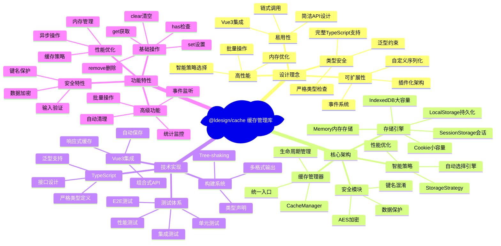
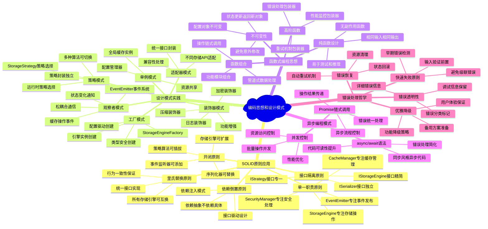
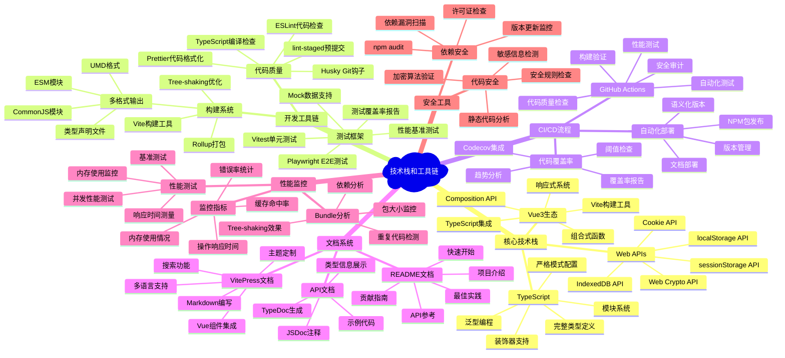

# @ldesign/cache 项目思维导图

本文档包含了 @ldesign/cache 项目的详细思维导图，展示了项目的架构设计、核心实现要点、编码思想和技术栈。

## 1. 项目架构思维导图



## 2. 核心实现要点思维导图

```mermaid
mindmap
  root)核心实现要点(
    智能策略系统
      策略选择算法
        数据大小分析
          小数据(<1KB) → Memory/LocalStorage
          中等数据(1KB-100KB) → LocalStorage/SessionStorage
          大数据(>100KB) → IndexedDB
        TTL时间分析
          短期(<5min) → Memory/SessionStorage
          中期(5min-1h) → SessionStorage/LocalStorage
          长期(>1h) → LocalStorage/IndexedDB
        访问频率分析
          高频访问 → Memory优先
          中频访问 → LocalStorage
          低频访问 → IndexedDB
      性能优化
        缓存命中率统计
        策略选择缓存
        批量操作优化
        内存使用监控
    
    存储引擎抽象
      统一接口设计
        IStorageEngine接口
        标准化操作方法
        错误处理统一
      引擎特性适配
        Memory引擎
          同步操作
          最高性能
          易失性存储
        LocalStorage引擎
          持久化存储
          同步API
          容量限制5-10MB
        SessionStorage引擎
          会话级存储
          页面关闭清除
          同步API
        IndexedDB引擎
          异步操作
          大容量存储
          事务支持
        Cookie引擎
          HTTP传输
          容量限制4KB
          过期时间支持
    
    安全机制
      数据加密
        AES-256-GCM算法
        密钥管理
        IV随机生成
        加密性能优化
      键名混淆
        SHA-256哈希
        盐值处理
        碰撞检测
      输入验证
        键名格式检查
        数据类型验证
        大小限制检查
        安全字符过滤
    
    错误处理体系
      分层错误处理
        操作级错误
        引擎级错误
        系统级错误
      错误恢复机制
        自动重试
        降级策略
        错误日志
      异常安全保证
        事务回滚
        状态一致性
        资源清理
    
    性能监控
      实时统计
        命中率计算
        响应时间监控
        内存使用跟踪
        操作计数统计
      性能分析
        热点数据识别
        慢查询检测
        内存泄漏监控
        引擎性能对比
      优化建议
        策略调整建议
        容量规划建议
        清理时机建议
```

## 3. 编码思想和设计模式思维导图



## 4. 技术栈和工具链思维导图



## 总结

这些思维导图全面展示了 @ldesign/cache 项目的：

1. **项目架构** - 整体设计理念和核心架构组件
2. **核心实现** - 关键技术实现要点和算法设计
3. **编码思想** - SOLID原则、设计模式和编程范式的应用
4. **技术栈** - 完整的开发工具链和技术选型

通过这些思维导图，可以快速理解项目的设计思路、技术架构和实现细节，为后续的开发和维护提供清晰的指导。
