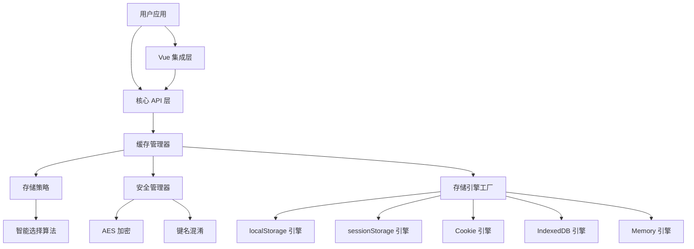
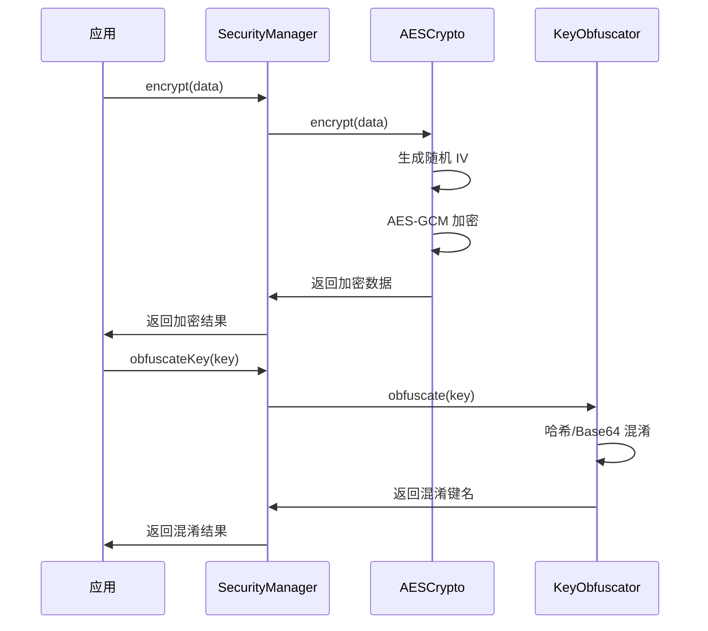
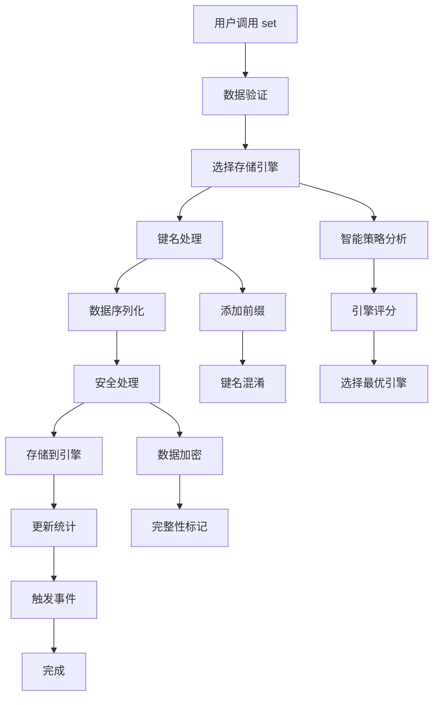
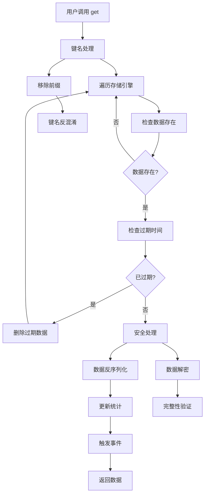

# 架构设计

## 整体架构

@ldesign/cache 采用分层架构设计，确保代码的可维护性、可扩展性和可测试性。



## 核心组件

### 1. CacheManager (缓存管理器)

**职责**：

- 统一的缓存操作接口
- 存储引擎的协调和管理
- 事件发射和监听
- 生命周期管理

**设计模式**：

- **外观模式** - 为复杂的存储系统提供简单接口
- **策略模式** - 动态选择存储引擎
- **观察者模式** - 事件驱动的架构

**核心方法**：

```typescript
class CacheManager {
  // 基础 CRUD 操作
  async set<T>(key: string, value: T, options?: SetOptions): Promise<void>
  async get<T>(key: string): Promise<T | null>
  async remove(key: string): Promise<void>
  async clear(engine?: StorageEngine): Promise<void>

  // 查询和统计
  async has(key: string): Promise<boolean>
  async keys(engine?: StorageEngine): Promise<string[]>
  async getStats(): Promise<CacheStats>

  // 生命周期
  async cleanup(): Promise<void>
  async destroy(): Promise<void>
}
```

### 2. StorageEngine (存储引擎)

**设计原则**：

- **接口隔离** - 每个引擎实现统一接口
- **单一职责** - 每个引擎只负责一种存储方式
- **开闭原则** - 易于扩展新的存储引擎

**引擎架构**：

```typescript
interface IStorageEngine {
  readonly name: StorageEngine
  readonly available: boolean
  readonly maxSize: number
  readonly usedSize: number

  setItem: (key: string, value: string, ttl?: number) => Promise<void>
  getItem: (key: string) => Promise<string | null>
  removeItem: (key: string) => Promise<void>
  clear: () => Promise<void>
  keys: () => Promise<string[]>
  hasItem: (key: string) => Promise<boolean>
  length: () => Promise<number>
  cleanup: () => Promise<void>
}
```

**引擎特性对比**：

| 引擎           | 容量   | 持久性 | 性能 | 适用场景           |
| -------------- | ------ | ------ | ---- | ------------------ |
| localStorage   | ~5MB   | 永久   | 高   | 配置、偏好设置     |
| sessionStorage | ~5MB   | 会话   | 高   | 临时数据、表单状态 |
| Cookie         | ~4KB   | 可配置 | 中   | 认证信息、跨域数据 |
| IndexedDB      | ~50MB+ | 永久   | 中   | 大数据集、离线数据 |
| Memory         | 无限制 | 临时   | 极高 | 计算结果、高频访问 |

### 3. StorageStrategy (存储策略)

**算法设计**：

```typescript
class StorageStrategy {
  async selectEngine(
    key: string,
    value: any,
    options?: SetOptions
  ): Promise<StorageStrategyResult> {
    // 1. 数据特征分析
    const dataSize = this.calculateDataSize(value)
    const dataType = this.getDataType(value)
    const ttl = options?.ttl

    // 2. 引擎评分计算
    const scores = this.calculateEngineScores({
      sizeBasedEngine: this.selectBySize(dataSize),
      ttlBasedEngine: this.selectByTTL(ttl),
      typeBasedEngine: this.selectByDataType(dataType),
      dataSize,
      ttl,
      dataType,
    })

    // 3. 最优引擎选择
    return this.getBestEngine(scores)
  }
}
```

**评分权重**：

- TTL 权重：50%
- 数据大小权重：30%
- 数据类型权重：15%
- 引擎优先级权重：5%

### 4. SecurityManager (安全管理器)

**安全层次**：

1. **传输层安全** - HTTPS 传输保护
2. **存储层安全** - 数据加密存储
3. **访问层安全** - 键名混淆保护
4. **应用层安全** - 自定义安全策略

**加密流程**：



## 数据流设计

### 1. 写入流程



### 2. 读取流程



## 性能优化策略

### 1. 内存管理

- **LRU 淘汰** - 最近最少使用算法
- **定期清理** - 自动清理过期项
- **空间预警** - 存储空间不足时的处理

### 2. 并发控制

- **异步操作** - 所有操作都是异步的
- **批量处理** - 支持批量读写操作
- **锁机制** - 防止并发写入冲突

### 3. 缓存优化

- **预加载** - 预测性数据加载
- **压缩存储** - 数据压缩减少存储空间
- **智能预取** - 基于访问模式的预取

## 错误处理策略

### 1. 分层错误处理

- **引擎层** - 存储引擎特定错误
- **管理层** - 缓存管理器错误
- **应用层** - 用户应用错误

### 2. 错误恢复机制

- **自动重试** - 临时错误的自动重试
- **降级处理** - 存储引擎不可用时的降级
- **错误上报** - 详细的错误信息和上下文

### 3. 容错设计

- **优雅降级** - 功能不可用时的优雅处理
- **数据恢复** - 损坏数据的恢复机制
- **状态一致性** - 确保缓存状态的一致性

## 扩展性设计

### 1. 插件化架构

- **存储引擎插件** - 易于添加新的存储引擎
- **策略插件** - 自定义存储选择策略
- **安全插件** - 自定义加密和混淆算法

### 2. 配置驱动

- **运行时配置** - 支持运行时修改配置
- **环境适配** - 根据环境自动调整配置
- **版本兼容** - 向后兼容的配置升级

### 3. 框架集成

- **Vue 3 集成** - 深度集成 Vue 3 生态
- **React 支持** - 计划支持 React
- **原生 JS** - 框架无关的核心库

## 质量保证

### 1. 测试策略

- **单元测试** - 100% 核心功能覆盖
- **集成测试** - 组件间交互测试
- **E2E 测试** - 端到端功能验证
- **性能测试** - 性能基准和回归测试

### 2. 代码质量

- **TypeScript** - 静态类型检查
- **ESLint** - 代码规范检查
- **Prettier** - 代码格式化
- **Husky** - Git 钩子质量控制

### 3. 文档质量

- **API 文档** - 完整的 API 参考
- **使用指南** - 详细的使用教程
- **示例代码** - 丰富的示例和最佳实践
- **变更日志** - 详细的版本变更记录
