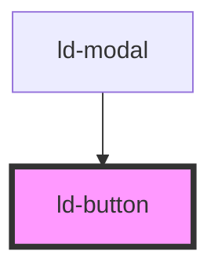

# ld-button

<!-- Auto Generated Below -->

## Properties

| Property      | Attribute      | Description    | Type                                                                    | Default     |
| ------------- | -------------- | -------------- | ----------------------------------------------------------------------- | ----------- |
| `autofocus`   | `autofocus`    | 自动聚焦           | `boolean`                                                               | `false`     |
| `block`       | `block`        | 是否为块级按钮        | `boolean`                                                               | `false`     |
| `customClass` | `custom-class` | 自定义 CSS 类名     | `string`                                                                | `undefined` |
| `customStyle` | `custom-style` | 自定义内联样式        | `{ [key: string]: string; }`                                            | `undefined` |
| `danger`      | `danger`       | 是否为危险按钮        | `boolean`                                                               | `false`     |
| `disabled`    | `disabled`     | 是否禁用按钮         | `boolean`                                                               | `false`     |
| `ghost`       | `ghost`        | 是否为幽灵按钮        | `boolean`                                                               | `false`     |
| `href`        | `href`         | 按钮链接地址         | `string`                                                                | `undefined` |
| `htmlType`    | `html-type`    | HTML button 类型 | `"button" \| "reset" \| "submit"`                                       | `'button'`  |
| `icon`        | `icon`         | 按钮图标（左侧）       | `string`                                                                | `undefined` |
| `iconRight`   | `icon-right`   | 按钮图标（右侧）       | `string`                                                                | `undefined` |
| `loading`     | `loading`      | 是否显示加载状态       | `boolean`                                                               | `false`     |
| `loadingIcon` | `loading-icon` | 自定义加载图标        | `string`                                                                | `undefined` |
| `shape`       | `shape`        | 按钮形状           | `"circle" \| "default" \| "round"`                                      | `'default'` |
| `size`        | `size`         | 按钮尺寸           | `"large" \| "medium" \| "small"`                                        | `'medium'`  |
| `status`      | `status`       | 按钮状态           | `"default" \| "error" \| "info" \| "primary" \| "success" \| "warning"` | `undefined` |
| `tabIndex`    | `tab-index`    | Tab 索引         | `number`                                                                | `undefined` |
| `target`      | `target`       | 链接打开方式         | `"_blank" \| "_parent" \| "_self" \| "_top"`                            | `'_self'`   |
| `text`        | `text`         | 按钮文本内容         | `string`                                                                | `undefined` |
| `type`        | `type`         | 按钮类型           | `"dashed" \| "default" \| "link" \| "primary" \| "text"`                | `'default'` |

## Events

| Event          | Description | Type                                  |
| -------------- | ----------- | ------------------------------------- |
| `ldBlur`       | 失焦事件        | `CustomEvent<ButtonFocusEventDetail>` |
| `ldClick`      | 点击事件        | `CustomEvent<ButtonClickEventDetail>` |
| `ldFocus`      | 聚焦事件        | `CustomEvent<ButtonFocusEventDetail>` |
| `ldMouseEnter` | 鼠标进入事件      | `CustomEvent<MouseEvent>`             |
| `ldMouseLeave` | 鼠标离开事件      | `CustomEvent<MouseEvent>`             |

## Dependencies

### Used by

 - [ld-modal](../modal)

### Graph

----------------------------------------------

*Built with [StencilJS](https://stenciljs.com/)*
