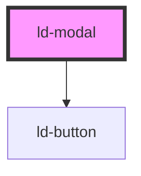

# ld-modal

<!-- Auto Generated Below -->

## Overview

Modal 模态框组件

用于显示重要信息、确认操作或收集用户输入的浮层组件

## Properties

| Property         | Attribute         | Description   | Type                                                     | Default     |
| ---------------- | ----------------- | ------------- | -------------------------------------------------------- | ----------- |
| `animation`      | `animation`       | 动画名称          | `"fade" \| "slide-down" \| "slide-up" \| "zoom"`         | `'fade'`    |
| `cancelText`     | `cancel-text`     | 取消按钮文本        | `string`                                                 | `'取消'`      |
| `centered`       | `centered`        | 是否居中显示        | `boolean`                                                | `false`     |
| `closable`       | `closable`        | 是否显示关闭按钮      | `boolean`                                                | `true`      |
| `confirmLoading` | `confirm-loading` | 确认按钮是否加载中     | `boolean`                                                | `false`     |
| `customClass`    | `custom-class`    | 自定义样式类名       | `string`                                                 | `undefined` |
| `footer`         | `footer`          | 是否显示底部操作区域    | `boolean`                                                | `true`      |
| `fullscreen`     | `fullscreen`      | 是否全屏显示        | `boolean`                                                | `false`     |
| `height`         | `height`          | 模态框高度         | `number \| string`                                       | `undefined` |
| `isDraggable`    | `is-draggable`    | 是否可拖拽         | `boolean`                                                | `false`     |
| `keyboard`       | `keyboard`        | 是否支持键盘 ESC 关闭 | `boolean`                                                | `true`      |
| `mask`           | `mask`            | 是否显示遮罩层       | `boolean`                                                | `true`      |
| `maskClosable`   | `mask-closable`   | 点击遮罩层是否关闭     | `boolean`                                                | `true`      |
| `modalTitle`     | `modal-title`     | 模态框标题         | `string`                                                 | `undefined` |
| `okText`         | `ok-text`         | 确认按钮文本        | `string`                                                 | `'确定'`      |
| `okType`         | `ok-type`         | 确认按钮类型        | `"dashed" \| "default" \| "link" \| "primary" \| "text"` | `'primary'` |
| `resizable`      | `resizable`       | 是否可调整大小       | `boolean`                                                | `false`     |
| `visible`        | `visible`         | 是否可见          | `boolean`                                                | `false`     |
| `width`          | `width`           | 模态框宽度         | `number \| string`                                       | `520`       |
| `zIndex`         | `z-index`         | z-index 层级    | `number`                                                 | `1000`      |

## Events

| Event      | Description | Type                |
| ---------- | ----------- | ------------------- |
| `ldCancel` | 取消事件        | `CustomEvent<void>` |
| `ldClose`  | 关闭事件        | `CustomEvent<void>` |
| `ldOk`     | 确认事件        | `CustomEvent<void>` |
| `ldOpen`   | 打开事件        | `CustomEvent<void>` |

## Methods

### `close() => Promise<void>`

关闭模态框

#### Returns

Type: `Promise<void>`

### `open() => Promise<void>`

打开模态框

#### Returns

Type: `Promise<void>`

## Dependencies

### Depends on

- [ld-button](../button)

### Graph

----------------------------------------------

*Built with [StencilJS](https://stenciljs.com/)*
