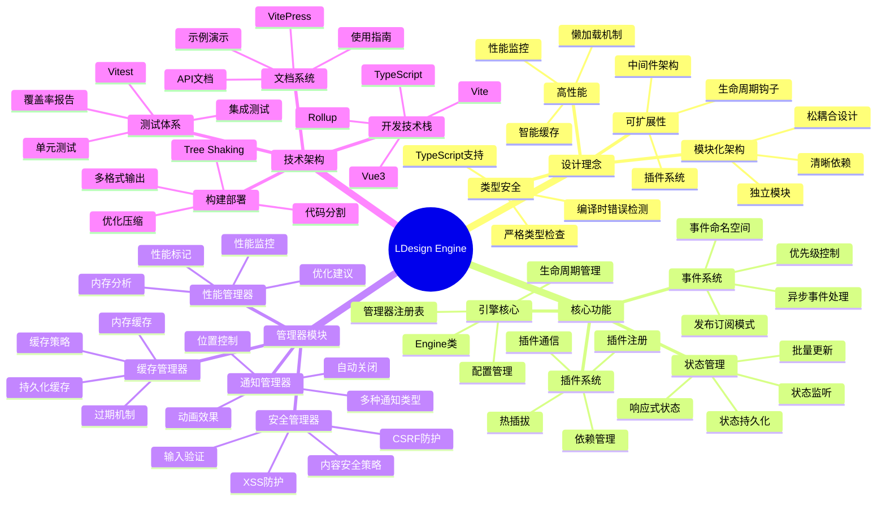
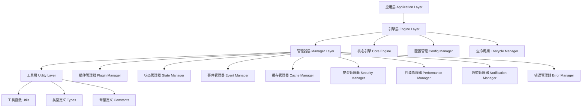
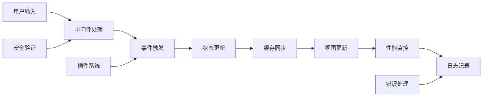

# 🧠 LDesign Engine 项目思维导图

## 🎯 项目核心理念

## 🏗️ 系统架构层次

## 🔄 数据流架构

## 🎨 设计模式应用

### 核心设计模式
- **单例模式**: Engine实例管理
- **工厂模式**: 管理器创建
- **观察者模式**: 事件系统
- **策略模式**: 缓存策略
- **装饰器模式**: 中间件系统
- **代理模式**: 状态管理
- **命令模式**: 插件系统

### 架构模式
- **分层架构**: 清晰的层次结构
- **模块化架构**: 独立的功能模块
- **插件架构**: 可扩展的插件系统
- **事件驱动架构**: 基于事件的通信

## 🚀 性能优化策略

### 加载优化
- **懒加载**: 按需加载管理器
- **代码分割**: 模块级别分割
- **Tree Shaking**: 移除未使用代码
- **缓存策略**: 智能缓存机制

### 运行时优化
- **对象池**: 减少GC压力
- **防抖节流**: 优化事件处理
- **虚拟化**: 大数据渲染优化
- **Web Workers**: 后台任务处理

## 🛡️ 安全防护体系

### 输入安全
- **XSS防护**: HTML内容清理
- **CSRF防护**: 令牌验证
- **输入验证**: 严格的输入检查
- **SQL注入防护**: 参数化查询

### 运行时安全
- **CSP策略**: 内容安全策略
- **权限控制**: 基于角色的访问控制
- **加密传输**: HTTPS强制
- **安全头**: 安全相关HTTP头

## 📊 质量保证体系

### 代码质量
- **TypeScript**: 类型安全
- **ESLint**: 代码规范
- **Prettier**: 代码格式化
- **Husky**: Git钩子

### 测试体系
- **单元测试**: 函数级测试
- **集成测试**: 模块间测试
- **E2E测试**: 端到端测试
- **性能测试**: 性能基准测试

### 文档体系
- **API文档**: 完整的API参考
- **使用指南**: 详细的使用说明
- **示例代码**: 丰富的代码示例
- **最佳实践**: 开发最佳实践

---

*此思维导图展示了 LDesign Engine 的完整技术架构和设计理念，为开发者提供全面的项目理解。*
