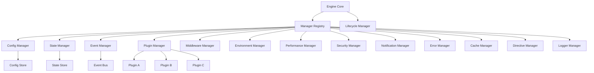
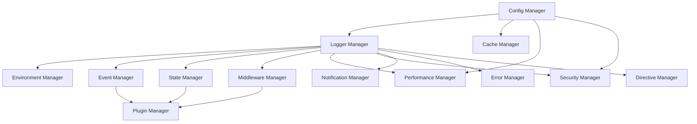
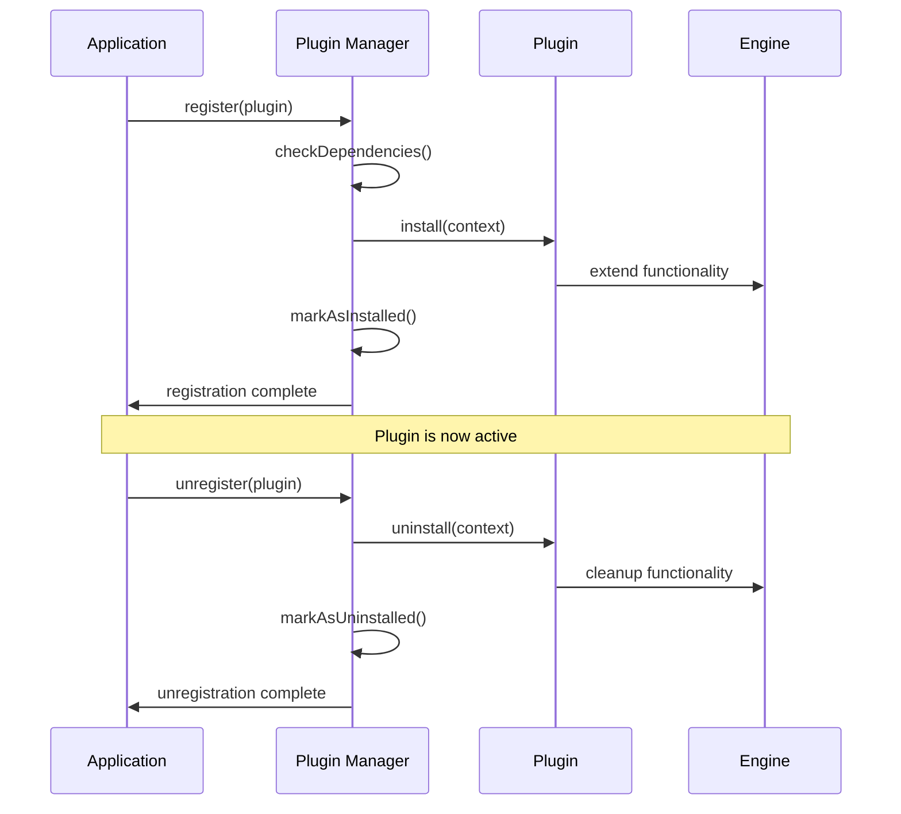
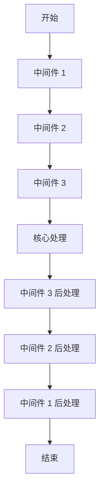

# LDesign Engine - 架构设计

## 🏗️ 整体架构

### 分层架构图

```
┌─────────────────────────────────────────────────────────────┐
│                    应用层 (Application Layer)                │
│  ┌─────────────┐ ┌─────────────┐ ┌─────────────┐ ┌─────────┐ │
│  │   Vue App   │ │ React App   │ │ Angular App │ │   ...   │ │
│  └─────────────┘ └─────────────┘ └─────────────┘ └─────────┘ │
├─────────────────────────────────────────────────────────────┤
│                    适配层 (Adapter Layer)                    │
│  ┌─────────────┐ ┌─────────────┐ ┌─────────────┐ ┌─────────┐ │
│  │ Vue Adapter │ │React Adapter│ │Angular Adapt│ │   ...   │ │
│  └─────────────┘ └─────────────┘ └─────────────┘ └─────────┘ │
├─────────────────────────────────────────────────────────────┤
│                    插件层 (Plugin Layer)                     │
│  ┌─────────────┐ ┌─────────────┐ ┌─────────────┐ ┌─────────┐ │
│  │ UI Plugins  │ │State Plugins│ │Route Plugins│ │   ...   │ │
│  └─────────────┘ └─────────────┘ └─────────────┘ └─────────┘ │
├─────────────────────────────────────────────────────────────┤
│                   管理器层 (Manager Layer)                   │
│  ┌─────────────┐ ┌─────────────┐ ┌─────────────┐ ┌─────────┐ │
│  │   Config    │ │    State    │ │   Events    │ │   ...   │ │
│  │  Manager    │ │  Manager    │ │  Manager    │ │ Manager │ │
│  └─────────────┘ └─────────────┘ └─────────────┘ └─────────┘ │
├─────────────────────────────────────────────────────────────┤
│                    核心层 (Core Layer)                       │
│  ┌─────────────┐ ┌─────────────┐ ┌─────────────┐ ┌─────────┐ │
│  │   Engine    │ │  Registry   │ │ Lifecycle   │ │   DI    │ │
│  │    Core     │ │  Manager    │ │  Manager    │ │Container│ │
│  └─────────────┘ └─────────────┘ └─────────────┘ └─────────┘ │
├─────────────────────────────────────────────────────────────┤
│                   基础层 (Foundation Layer)                  │
│  ┌─────────────┐ ┌─────────────┐ ┌─────────────┐ ┌─────────┐ │
│  │   Utils     │ │   Types     │ │ Constants   │ │ Helpers │ │
│  └─────────────┘ └─────────────┘ └─────────────┘ └─────────┘ │
└─────────────────────────────────────────────────────────────┘
```

### 核心组件关系图



## 🔧 核心架构组件

### 1. 引擎核心 (Engine Core)

**职责**: 统一管理和协调所有功能模块

```typescript
class EngineImpl implements Engine {
  private registry: ManagerRegistry
  private lifecycle: LifecycleManager
  private initialized = false

  constructor(config?: EngineConfig) {
    this.registry = new ManagerRegistry()
    this.lifecycle = new LifecycleManager()
    this.registerCoreManagers()
    this.initializeWithConfig(config)
  }

  private registerCoreManagers() {
    // 注册核心管理器
    this.registry.register('config', () => new ConfigManager(), [])
    this.registry.register('logger', () => new LoggerManager(), ['config'])
    this.registry.register('events', () => new EventManager(), ['logger'])
    // ... 其他管理器
  }
}
```

**特性**:
- 统一的入口点
- 生命周期管理
- 依赖协调
- 配置管理

### 2. 管理器注册表 (Manager Registry)

**职责**: 管理器的注册、依赖解析和初始化

```typescript
class ManagerRegistry {
  private managers = new Map<string, any>()
  private factories = new Map<string, ManagerFactory>()
  private dependencies = new Map<string, string[]>()
  private initialized = new Set<string>()

  register<T>(
    name: string,
    factory: ManagerFactory<T>,
    dependencies: string[] = [],
    options: ManagerOptions = {}
  ) {
    this.factories.set(name, factory)
    this.dependencies.set(name, dependencies)

    if (!options.lazy) {
      this.initialize(name)
    }
  }

  private initialize(name: string): any {
    if (this.initialized.has(name)) {
      return this.managers.get(name)
    }

    // 递归初始化依赖
    const deps = this.dependencies.get(name) || []
    const resolvedDeps = deps.map(dep => this.initialize(dep))

    // 创建管理器实例
    const factory = this.factories.get(name)
    const manager = factory(...resolvedDeps)

    this.managers.set(name, manager)
    this.initialized.add(name)

    return manager
  }
}
```

**特性**:
- 依赖注入
- 懒加载支持
- 循环依赖检测
- 初始化顺序控制

### 3. 生命周期管理器 (Lifecycle Manager)

**职责**: 管理应用的完整生命周期

```typescript
class LifecycleManager {
  private hooks = new Map<string, LifecycleHook[]>()
  private currentPhase?: string
  private history: LifecycleEvent[] = []

  on(phase: string, hook: LifecycleHook, priority = 0): string {
    if (!this.hooks.has(phase)) {
      this.hooks.set(phase, [])
    }

    const hookInfo = { id: generateId(), hook, priority }
    const hooks = this.hooks.get(phase)!

    // 按优先级插入
    const insertIndex = hooks.findIndex(h => h.priority < priority)
    if (insertIndex === -1) {
      hooks.push(hookInfo)
    }
    else {
      hooks.splice(insertIndex, 0, hookInfo)
    }

    return hookInfo.id
  }

  async execute(phase: string, context: any): Promise<void> {
    this.currentPhase = phase
    const hooks = this.hooks.get(phase) || []

    const event: LifecycleEvent = {
      phase,
      timestamp: Date.now(),
      context
    }

    try {
      for (const hookInfo of hooks) {
        await hookInfo.hook(context)
      }
      event.success = true
    }
    catch (error) {
      event.error = error
      event.success = false
      throw error
    }
    finally {
      this.history.push(event)
      this.currentPhase = undefined
    }
  }
}
```

**生命周期阶段**:
- `beforeInit` - 初始化前
- `init` - 初始化中
- `afterInit` - 初始化后
- `beforeMount` - 挂载前
- `mount` - 挂载中
- `afterMount` - 挂载后
- `beforeUnmount` - 卸载前
- `unmount` - 卸载中
- `afterUnmount` - 卸载后
- `beforeDestroy` - 销毁前
- `destroy` - 销毁中
- `afterDestroy` - 销毁后

## 📦 管理器架构

### 管理器基类设计

```typescript
abstract class BaseManager {
  protected logger: Logger
  protected config: ConfigManager
  protected events: EventManager

  constructor(dependencies: ManagerDependencies) {
    this.logger = dependencies.logger
    this.config = dependencies.config
    this.events = dependencies.events
  }

  abstract initialize(): Promise<void> | void
  abstract destroy(): Promise<void> | void

  protected emit(event: string, data?: any) {
    this.events.emit(`${this.constructor.name}:${event}`, data)
  }

  protected log(level: LogLevel, message: string, data?: any) {
    this.logger[level](`[${this.constructor.name}] ${message}`, data)
  }
}
```

### 管理器依赖图



## 🔌 插件架构

### 插件系统设计

```typescript
interface Plugin {
  name: string
  version: string
  description?: string
  dependencies?: string[]

  install: (context: PluginContext) => void | Promise<void>
  uninstall?: (context: PluginContext) => void | Promise<void>
}

interface PluginContext {
  engine: Engine
  config: ConfigManager
  logger: Logger
  events: EventManager
  state: StateManager
  [key: string]: any
}

class PluginManager extends BaseManager {
  private plugins = new Map<string, Plugin>()
  private installed = new Set<string>()

  async register(plugin: Plugin): Promise<void> {
    // 检查依赖
    await this.checkDependencies(plugin)

    // 安装插件
    const context = this.createPluginContext()
    await plugin.install(context)

    this.plugins.set(plugin.name, plugin)
    this.installed.add(plugin.name)

    this.emit('plugin:registered', { plugin: plugin.name })
  }

  private createPluginContext(): PluginContext {
    return {
      engine: this.engine,
      config: this.config,
      logger: this.logger,
      events: this.events,
      state: this.state
    }
  }
}
```

### 插件生命周期



## 🌊 中间件架构

### 中间件系统设计

```typescript
interface Middleware {
  (context: MiddlewareContext, next: NextFunction): Promise<void> | void
}

interface MiddlewareContext {
  request: any
  response: any
  state: Record<string, any>
  [key: string]: any
}

type NextFunction = () => Promise<void>

class MiddlewareManager extends BaseManager {
  private middlewares: Middleware[] = []

  use(middleware: Middleware): void {
    this.middlewares.push(middleware)
  }

  async execute(context: MiddlewareContext): Promise<void> {
    let index = 0

    const next = async (): Promise<void> => {
      if (index >= this.middlewares.length)
        return

      const middleware = this.middlewares[index++]
      await middleware(context, next)
    }

    await next()
  }
}
```

### 中间件执行流程



## 🔄 事件架构

### 事件系统设计

```typescript
class EventManager extends BaseManager {
  private events = new Map<string, EventListener[]>()
  private namespaces = new Map<string, NamespacedEventManager>()
  private maxListeners = 100

  on(event: string, listener: EventListener, options?: EventOptions): string {
    if (!this.events.has(event)) {
      this.events.set(event, [])
    }

    const listeners = this.events.get(event)!

    // 检查监听器数量限制
    if (listeners.length >= this.maxListeners) {
      this.logger.warn(
        `Maximum listeners (${this.maxListeners}) exceeded for event "${event}"`
      )
    }

    const listenerInfo: EventListenerInfo = {
      id: generateId(),
      listener,
      once: options?.once || false,
      priority: options?.priority || 0
    }

    // 按优先级插入
    const insertIndex = listeners.findIndex(l => l.priority < listenerInfo.priority)
    if (insertIndex === -1) {
      listeners.push(listenerInfo)
    }
    else {
      listeners.splice(insertIndex, 0, listenerInfo)
    }

    return listenerInfo.id
  }

  emit(event: string, data?: any): boolean {
    const listeners = this.events.get(event)
    if (!listeners || listeners.length === 0) {
      return false
    }

    const eventData: EventData = {
      type: event,
      data,
      timestamp: Date.now(),
      source: this
    }

    // 执行监听器
    for (const listenerInfo of [...listeners]) {
      try {
        listenerInfo.listener(eventData)

        // 移除一次性监听器
        if (listenerInfo.once) {
          this.off(listenerInfo.id)
        }
      }
      catch (error) {
        this.logger.error(`Error in event listener for "${event}":`, error)
      }
    }

    return true
  }

  namespace(name: string): NamespacedEventManager {
    if (!this.namespaces.has(name)) {
      this.namespaces.set(name, new NamespacedEventManager(this, name))
    }
    return this.namespaces.get(name)!
  }
}
```

## 🗄️ 状态架构

### 状态管理设计

```typescript
class StateManager extends BaseManager {
  private state: Record<string, any> = {}
  private watchers = new Map<string, StateWatcher[]>()
  private history: StateChange[] = []
  private maxHistorySize = 100

  set(path: string, value: any): void {
    const oldValue = this.get(path)

    // 设置值
    this.setNestedValue(this.state, path, value)

    // 记录变化
    const change: StateChange = {
      path,
      oldValue,
      newValue: value,
      timestamp: Date.now()
    }

    this.addToHistory(change)

    // 触发监听器
    this.notifyWatchers(path, value, oldValue)

    // 触发事件
    this.emit('state:changed', change)
  }

  get<T = any>(path: string, defaultValue?: T): T {
    return this.getNestedValue(this.state, path, defaultValue)
  }

  watch(path: string, watcher: StateWatcher): () => void {
    if (!this.watchers.has(path)) {
      this.watchers.set(path, [])
    }

    const watcherInfo: StateWatcherInfo = {
      id: generateId(),
      watcher,
      path
    }

    this.watchers.get(path)!.push(watcherInfo)

    // 返回取消监听的函数
    return () => this.unwatch(watcherInfo.id)
  }

  private notifyWatchers(path: string, newValue: any, oldValue: any): void {
    // 通知精确路径的监听器
    const exactWatchers = this.watchers.get(path) || []
    exactWatchers.forEach((watcher) => {
      try {
        watcher.watcher(newValue, oldValue, path)
      }
      catch (error) {
        this.logger.error(`Error in state watcher for "${path}":`, error)
      }
    })

    // 通知父路径的监听器
    const pathParts = path.split('.')
    for (let i = pathParts.length - 1; i > 0; i--) {
      const parentPath = pathParts.slice(0, i).join('.')
      const parentWatchers = this.watchers.get(parentPath) || []

      parentWatchers.forEach((watcher) => {
        try {
          const parentNewValue = this.get(parentPath)
          const parentOldValue = this.reconstructOldValue(parentPath, path, oldValue)
          watcher.watcher(parentNewValue, parentOldValue, parentPath)
        }
        catch (error) {
          this.logger.error(`Error in parent state watcher for "${parentPath}":`, error)
        }
      })
    }
  }
}
```

## 🔧 配置架构

### 配置系统设计

```typescript
class ConfigManager extends BaseManager {
  private config: Record<string, any> = {}
  private schema?: ConfigSchema
  private watchers = new Map<string, ConfigWatcher[]>()
  private snapshots: ConfigSnapshot[] = []
  private maxSnapshots = 10

  constructor(initialConfig?: any, schema?: ConfigSchema) {
    super()
    this.schema = schema

    if (initialConfig) {
      this.merge(initialConfig)
    }

    this.createSnapshot('initial')
  }

  set(path: string, value: any): void {
    // 验证配置
    if (this.schema) {
      this.validateValue(path, value)
    }

    const oldValue = this.get(path)

    // 设置值
    this.setNestedValue(this.config, path, value)

    // 创建快照
    this.createSnapshot(`set:${path}`)

    // 通知监听器
    this.notifyWatchers(path, value, oldValue)

    // 触发事件
    this.emit('config:changed', { path, value, oldValue })
  }

  private validateValue(path: string, value: any): void {
    const schemaNode = this.getSchemaNode(path)
    if (!schemaNode)
      return

    if (schemaNode.type && typeof value !== schemaNode.type) {
      throw new ConfigValidationError(
        `Invalid type for "${path}": expected ${schemaNode.type}, got ${typeof value}`
      )
    }

    if (schemaNode.validator && !schemaNode.validator(value)) {
      throw new ConfigValidationError(
        `Validation failed for "${path}": ${value}`
      )
    }
  }

  private createSnapshot(reason: string): void {
    const snapshot: ConfigSnapshot = {
      config: JSON.parse(JSON.stringify(this.config)),
      timestamp: Date.now(),
      reason,
      version: generateVersion()
    }

    this.snapshots.push(snapshot)

    // 限制快照数量
    if (this.snapshots.length > this.maxSnapshots) {
      this.snapshots.shift()
    }
  }
}
```

LDesign Engine 的架构设计体现了现代软件工程的最佳实践，通过分层设计、依赖注入、事件驱动等模式，构建了一个高度模块化、可扩展、易维护的前端应用引擎。这种架构不仅保证了系统的稳定性和性能，也为未来的功能扩展和技术演进提供了坚实的基础。
