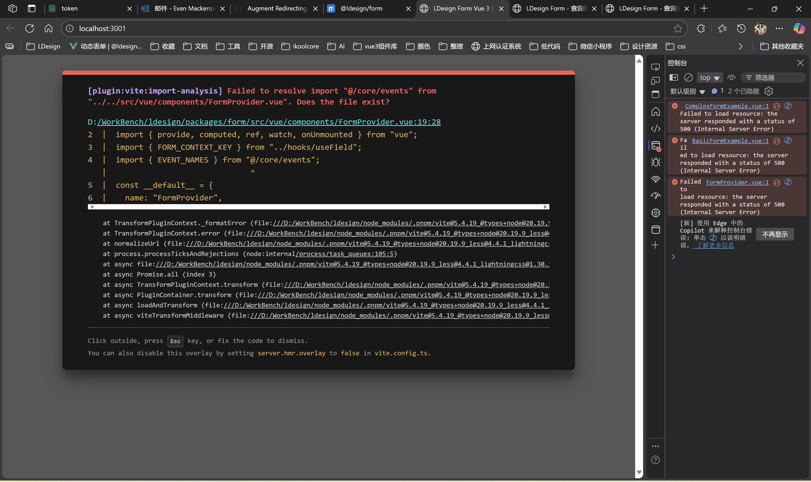

请对 `packages/form/` 目录下的表单功能插件进行全面的质量检查和优化，具体要求如下：

## 1. 代码质量检查
- 仔细审查现有代码，识别并修复所有潜在的隐藏bug
- 优化代码性能，包括但不限于：
  - 内存泄漏检查
  - 不必要的重渲染优化
  - 事件监听器清理
  - 异步操作优化

## 2. 功能完整性验证
- 检查表单验证逻辑的正确性
- 确保所有表单控件的交互行为符合预期
- 验证数据绑定和更新机制
- 检查错误处理和边界情况

## 3. 自动化测试用例编写
编写完整的测试套件，覆盖以下场景：
- **原生JavaScript使用**：测试核心表单逻辑和API
- **Vue组件使用**：测试Vue组件的渲染、事件处理、响应式更新
- **Vue Hook使用**：测试自定义Hook的功能和状态管理
- **边界情况测试**：异常输入、网络错误、极限数据等
- **性能测试**：大量数据渲染、频繁操作等场景

## 4. 手动功能测试
- 启动开发服务器
- 使用MCP工具打开浏览器测试页面
- 逐一测试每个表单功能：
  - 输入验证
  - 提交流程
  - 错误显示
  - 样式渲染
  - 响应式布局
- 对每个功能进行截图验证，确保：
  - 视觉样式符合设计规范
  - 交互反馈正确
  - 错误状态显示清晰
  - 在不同屏幕尺寸下正常显示

## 5. 文档和示例更新
- 更新README.md文档
- 确保示例代码与实际功能一致
- 补充缺失的使用说明

请按照任务管理工具创建详细的任务列表，逐步完成每个检查项目，并在完成后提供测试报告和优化建议。