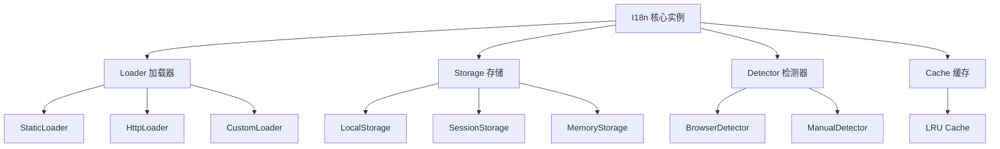
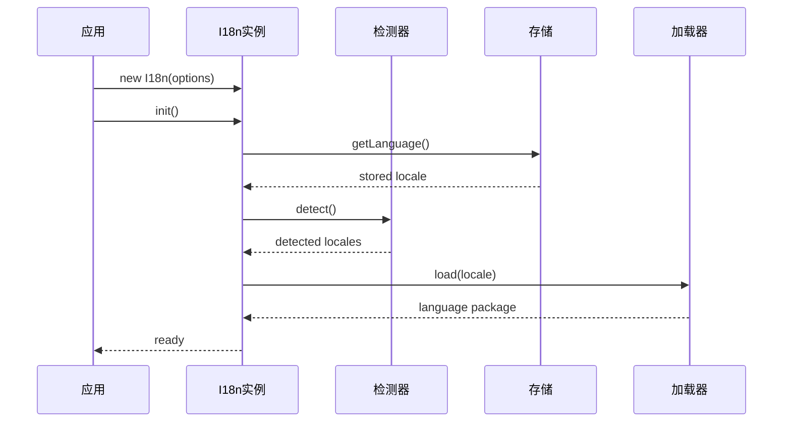
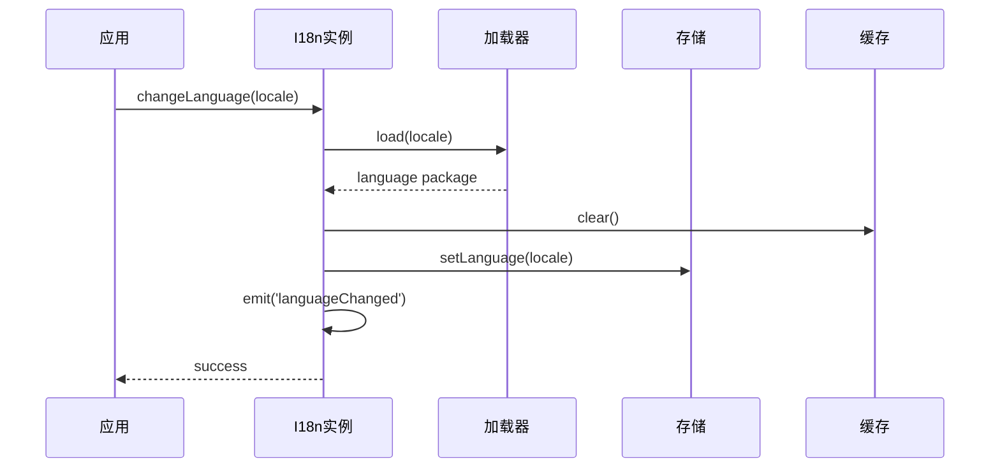

# 基础概念

本页面介绍 @ldesign/i18n 的核心概念和架构设计，帮助您更好地理解和使用这个国际化库。

## 核心架构

@ldesign/i18n 采用模块化设计，主要由以下几个核心组件组成：



## 主要概念

### 1. I18n 实例

I18n 实例是整个国际化系统的核心，负责协调各个组件的工作：

```typescript
import { I18n } from '@ldesign/i18n'

const i18n = new I18n({
  defaultLocale: 'en',
  fallbackLocale: 'en',
})
```

**职责：**

- 管理当前语言状态
- 协调加载器、存储、检测器等组件
- 提供翻译 API
- 处理事件和错误

### 2. 语言包 (Language Package)

语言包是包含特定语言翻译内容的数据结构：

```typescript
interface LanguagePackage {
  info: LanguageInfo // 语言元信息
  translations: object // 翻译内容
}

// 示例
const enPackage = {
  info: {
    name: 'English',
    nativeName: 'English',
    code: 'en',
    direction: 'ltr',
    dateFormat: 'MM/DD/YYYY',
  },
  translations: {
    common: {
      ok: 'OK',
      cancel: 'Cancel',
    },
  },
}
```

### 3. 加载器 (Loader)

加载器负责获取和管理语言包：

```typescript
interface Loader {
  load: (locale: string) => Promise<void>
  isLoaded: (locale: string) => boolean
  preload: (locale: string) => Promise<void>
}
```

**内置加载器：**

- **StaticLoader**: 静态语言包加载器
- **HttpLoader**: HTTP 远程加载器
- **DefaultLoader**: 默认加载器

### 4. 存储 (Storage)

存储负责持久化用户的语言偏好：

```typescript
interface Storage {
  getLanguage: () => string | null
  setLanguage: (locale: string) => void
  removeLanguage: () => void
}
```

**内置存储：**

- **LocalStorage**: 浏览器本地存储
- **SessionStorage**: 会话存储
- **MemoryStorage**: 内存存储
- **CookieStorage**: Cookie 存储

### 5. 检测器 (Detector)

检测器用于自动检测用户的语言偏好：

```typescript
interface Detector {
  detect: () => string[]
}
```

**内置检测器：**

- **BrowserDetector**: 浏览器语言检测
- **ManualDetector**: 手动指定语言

### 6. 缓存 (Cache)

缓存系统用于提高翻译性能：

```typescript
interface LRUCache<T> {
  get: (key: string) => T | undefined
  set: (key: string, value: T) => void
  clear: () => void
  size: () => number
}
```

## 翻译键系统

### 嵌套键结构

@ldesign/i18n 支持点分隔的嵌套键访问：

```typescript
const translations = {
  user: {
    profile: {
      name: 'Name',
      email: 'Email',
    },
  },
}

// 访问嵌套键
i18n.t('user.profile.name') // "Name"
i18n.t('user.profile.email') // "Email"
```

### 键命名约定

推荐使用以下命名约定：

```typescript
{
  // 通用文本
  common: {
    ok: 'OK',
    cancel: 'Cancel'
  },

  // 页面特定文本
  pages: {
    home: {
      title: 'Home Page',
      welcome: 'Welcome to our site'
    }
  },

  // 组件特定文本
  components: {
    userCard: {
      editButton: 'Edit',
      deleteButton: 'Delete'
    }
  },

  // 错误消息
  errors: {
    network: 'Network error',
    validation: 'Validation failed'
  }
}
```

## 插值系统

### 基础插值

使用双花括号语法进行参数插值：

```typescript
const template = 'Hello {{name}}!'
i18n.t('greeting', { name: 'John' }) // "Hello John!"
```

### 嵌套参数

支持嵌套对象参数：

```typescript
const template = 'Welcome {{user.name}}, you have {{user.messages}} messages'
i18n.t('welcome', {
  user: {
    name: 'John',
    messages: 5,
  },
})
```

### HTML 转义

默认启用 HTML 转义以防止 XSS 攻击：

```typescript
i18n.t('message', {
  content: '<script>alert("xss")</script>',
})
// 输出: "&lt;script&gt;alert(&quot;xss&quot;)&lt;/script&gt;"
```

## 复数系统

### ICU 复数语法

支持 ICU MessageFormat 复数语法：

```typescript
const template = '{count, plural, =0{no items} =1{one item} other{# items}}'

i18n.t('items', { count: 0 }) // "no items"
i18n.t('items', { count: 1 }) // "one item"
i18n.t('items', { count: 5 }) // "5 items"
```

### 语言特定复数规则

不同语言有不同的复数规则：

```typescript
// 英语：0, 1, 2+ (two forms)
// 中文：所有数字相同 (one form)
// 俄语：1, 2-4, 5+ (three forms)
// 阿拉伯语：0, 1, 2, 3-10, 11+ (six forms)
```

## 事件系统

### 事件类型

```typescript
type I18nEventType =
  | 'languageChanged' // 语言切换
  | 'loaded' // 语言包加载完成
  | 'loadError' // 语言包加载失败
```

### 事件监听

```typescript
// 监听语言切换
i18n.on('languageChanged', (newLocale, oldLocale) => {
  console.log(`Language changed from ${oldLocale} to ${newLocale}`)
})

// 监听加载错误
i18n.on('loadError', (locale, error) => {
  console.error(`Failed to load ${locale}:`, error)
})
```

## 生命周期

### 初始化流程



### 语言切换流程



## 错误处理

### 错误类型

```typescript
// 加载错误
class LoadError extends Error {
  constructor(locale: string, cause: Error) {
    super(`Failed to load language: ${locale}`)
    this.cause = cause
  }
}

// 翻译错误
class TranslationError extends Error {
  constructor(key: string) {
    super(`Translation key not found: ${key}`)
  }
}
```

### 错误恢复策略

1. **降级处理**: 使用 fallbackLocale
2. **默认值**: 返回 defaultValue 或键名
3. **错误事件**: 触发 loadError 事件
4. **日志记录**: 记录错误信息

## 性能优化

### 缓存策略

- **LRU 缓存**: 最近最少使用算法
- **缓存键**: 基于语言、键名、参数生成
- **缓存清理**: 语言切换时自动清理

### 懒加载

- **按需加载**: 只加载当前需要的语言
- **预加载**: 提前加载常用语言
- **并行加载**: 同时加载多个语言包

### Tree Shaking

- **按需导入**: 只导入使用的功能
- **模块分离**: 核心功能与扩展功能分离
- **死代码消除**: 构建时移除未使用代码

## 最佳实践

### 1. 组织结构

```
src/
├── locales/           # 语言包目录
│   ├── en/           # 英语
│   ├── zh-CN/        # 中文
│   └── ja/           # 日语
├── i18n/             # 国际化配置
│   ├── index.ts      # 主配置
│   ├── loaders.ts    # 自定义加载器
│   └── types.ts      # 类型定义
└── components/       # 组件
```

### 2. 键名管理

- 使用命名空间避免冲突
- 保持键名简洁明了
- 使用一致的命名约定
- 定期清理未使用的键

### 3. 性能优化

- 启用缓存机制
- 合理设置缓存大小
- 使用预加载策略
- 避免频繁的语言切换

## 下一步

了解基础概念后，建议继续学习：

- [翻译功能](/guide/translation) - 详细的翻译功能
- [插值和复数](/guide/interpolation) - 高级文本处理
- [语言包管理](/guide/language-packs) - 语言包的创建和管理
