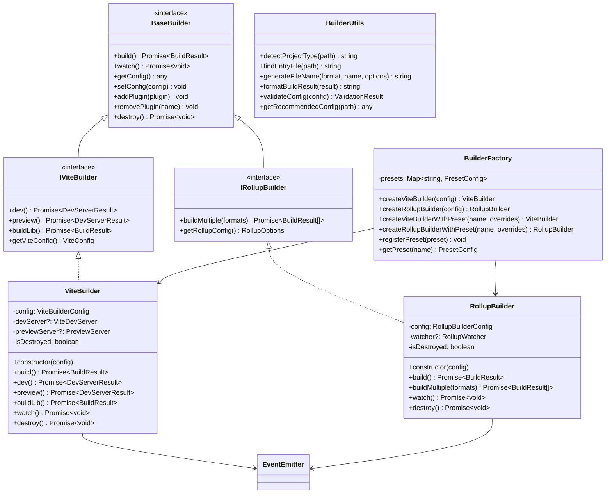
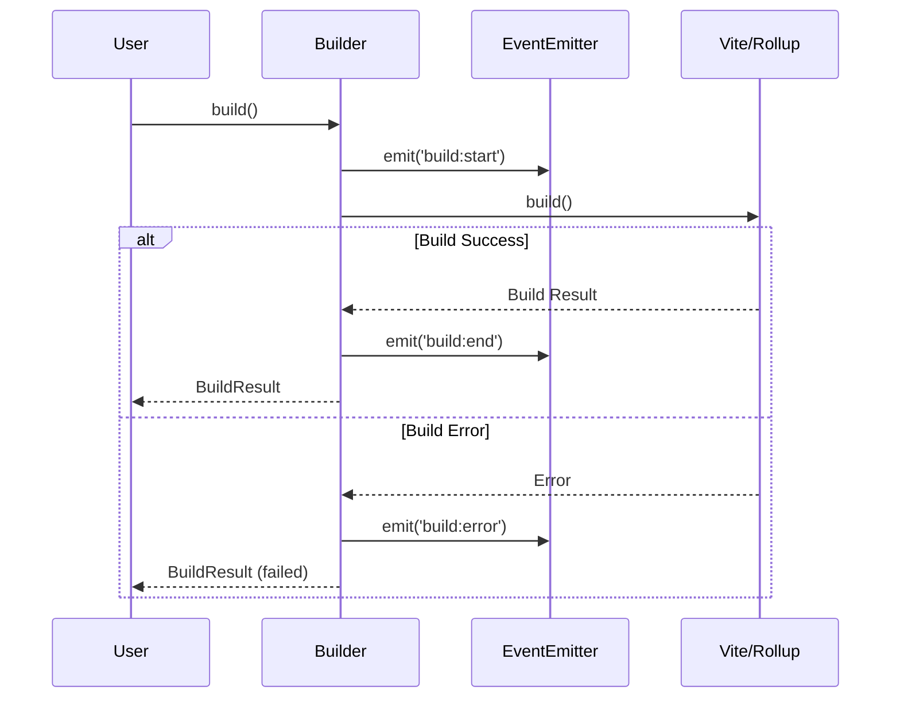
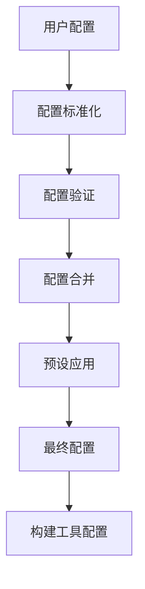
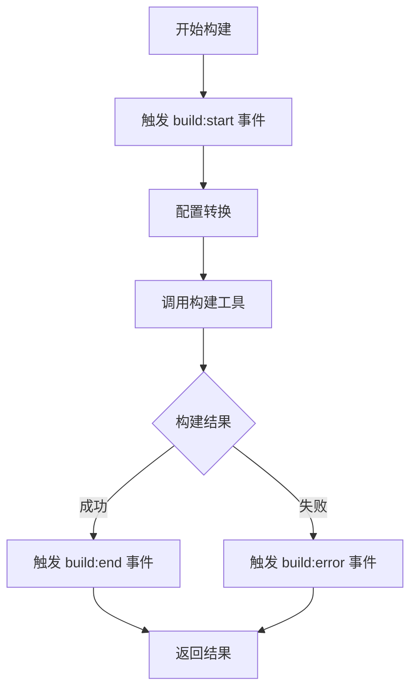
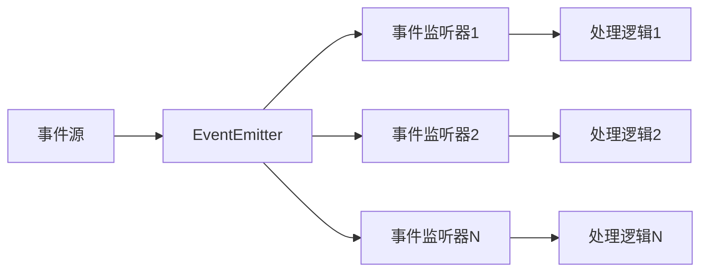
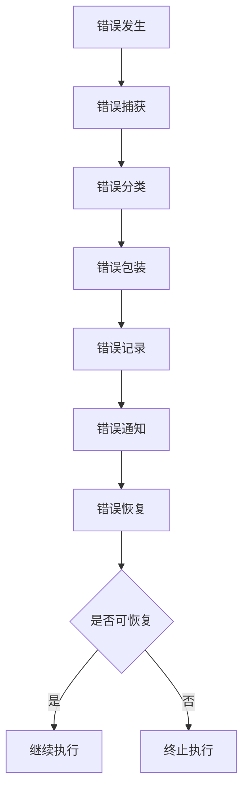
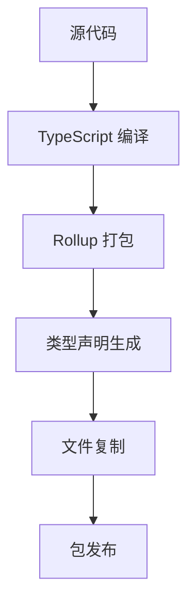

# @ldesign/kit 架构设计

## 整体架构

### 1. 分层架构

@ldesign/kit 采用分层架构设计，从底层到顶层分为以下几层：

```
┌─────────────────────────────────────────┐
│              应用层 (Application)        │
│  ┌─────────┐ ┌─────────┐ ┌─────────┐    │
│  │ Builder │ │Scaffold │ │ Console │    │
│  └─────────┘ └─────────┘ └─────────┘    │
├─────────────────────────────────────────┤
│              服务层 (Service)            │
│  ┌─────────┐ ┌─────────┐ ┌─────────┐    │
│  │   Git   │ │ Package │ │   SSL   │    │
│  └─────────┘ └─────────┘ └─────────┘    │
├─────────────────────────────────────────┤
│              核心层 (Core)               │
│  ┌─────────┐ ┌─────────┐ ┌─────────┐    │
│  │  Cache  │ │Validation│ │ Events  │    │
│  └─────────┘ └─────────┘ └─────────┘    │
├─────────────────────────────────────────┤
│              基础层 (Foundation)         │
│  ┌─────────┐ ┌─────────┐ ┌─────────┐    │
│  │  Utils  │ │FileSystem│ │ Network │    │
│  └─────────┘ └─────────┘ └─────────┘    │
└─────────────────────────────────────────┘
```

**各层职责：**

- **基础层**: 提供最基础的工具函数和系统操作
- **核心层**: 提供核心业务功能，如缓存、验证、事件等
- **服务层**: 提供特定领域的服务，如 Git、包管理等
- **应用层**: 提供完整的应用解决方案，如构建工具、脚手架等

### 2. 模块化设计

每个功能模块都是独立的，具有清晰的边界和职责：

```typescript
// 模块结构
src/
├── utils/           # 基础工具模块
├── filesystem/      # 文件系统模块
├── network/         # 网络模块
├── cache/           # 缓存模块
├── validation/      # 验证模块
├── events/          # 事件模块
├── git/             # Git 模块
├── package/         # 包管理模块
├── ssl/             # SSL 模块
├── builder/         # 构建工具模块 (新增)
├── scaffold/        # 脚手架模块
├── console/         # 控制台 UI 模块
└── index.ts         # 主入口文件
```

## 构建工具模块架构

### 1. 模块结构

```
src/builder/
├── types.ts              # 类型定义
├── vite-builder.ts       # Vite 构建器
├── rollup-builder.ts     # Rollup 构建器
├── builder-factory.ts    # 构建器工厂
├── builder-utils.ts      # 构建工具函数
└── index.ts              # 模块入口
```

### 2. 类图设计



### 3. 事件系统架构



## 核心设计模式

### 1. 工厂模式 (Factory Pattern)

用于创建不同类型的构建器：

```typescript
class BuilderFactory {
  static createViteBuilder(config?: ViteBuilderConfig): ViteBuilder {
    return new ViteBuilder(config)
  }

  static createRollupBuilder(config: RollupBuilderConfig): RollupBuilder {
    return new RollupBuilder(config)
  }

  static createViteBuilderWithPreset(
    presetName: string,
    overrides?: Partial<ViteBuilderConfig>
  ): ViteBuilder {
    const preset = this.getPreset(presetName)
    const config = this.mergeConfig(preset.config, overrides)
    return new ViteBuilder(config)
  }
}
```

### 2. 建造者模式 (Builder Pattern)

用于构建复杂的配置对象：

```typescript
class ViteConfigBuilder {
  private config: ViteBuilderConfig = {}

  entry(entry: string): this {
    this.config.entry = entry
    return this
  }

  outDir(outDir: string): this {
    this.config.outDir = outDir
    return this
  }

  server(server: ServerConfig): this {
    this.config.server = server
    return this
  }

  build(): ViteBuilderConfig {
    return { ...this.config }
  }
}
```

### 3. 观察者模式 (Observer Pattern)

用于事件系统的实现：

```typescript
class ViteBuilder extends EventEmitter {
  async build(): Promise<BuildResult> {
    this.emit('build:start', { mode: 'build', config: this.config })

    try {
      const result = await this.performBuild()
      this.emit('build:end', { result })
      return result
    } catch (error) {
      this.emit('build:error', { error })
      throw error
    }
  }
}
```

### 4. 策略模式 (Strategy Pattern)

用于不同构建策略的实现：

```typescript
interface BuildStrategy {
  build(config: any): Promise<BuildResult>
}

class ViteBuildStrategy implements BuildStrategy {
  async build(config: ViteBuilderConfig): Promise<BuildResult> {
    // Vite 构建逻辑
  }
}

class RollupBuildStrategy implements BuildStrategy {
  async build(config: RollupBuilderConfig): Promise<BuildResult> {
    // Rollup 构建逻辑
  }
}
```

### 5. 适配器模式 (Adapter Pattern)

用于适配不同构建工具的 API：

```typescript
class ViteAdapter {
  static adaptConfig(config: ViteBuilderConfig): ViteConfig {
    // 将内部配置转换为 Vite 配置
    return {
      root: config.root,
      build: {
        outDir: config.outDir,
        sourcemap: config.sourcemap,
        // ...
      },
    }
  }
}
```

## 数据流架构

### 1. 配置流



### 2. 构建流



### 3. 事件流



## 错误处理架构

### 1. 错误分类

```typescript
enum ErrorType {
  CONFIG_ERROR = 'CONFIG_ERROR',
  BUILD_ERROR = 'BUILD_ERROR',
  NETWORK_ERROR = 'NETWORK_ERROR',
  FILE_ERROR = 'FILE_ERROR',
  VALIDATION_ERROR = 'VALIDATION_ERROR',
}

class BuilderError extends Error {
  constructor(
    public type: ErrorType,
    message: string,
    public cause?: Error
  ) {
    super(message)
    this.name = 'BuilderError'
  }
}
```

### 2. 错误处理流程



## 性能优化架构

### 1. 缓存策略

```typescript
class BuildCache {
  private memoryCache = new Map()
  private fileCache: FileCache

  async get(key: string): Promise<any> {
    // 1. 检查内存缓存
    if (this.memoryCache.has(key)) {
      return this.memoryCache.get(key)
    }

    // 2. 检查文件缓存
    const cached = await this.fileCache.get(key)
    if (cached) {
      this.memoryCache.set(key, cached)
      return cached
    }

    return null
  }
}
```

### 2. 懒加载机制

```typescript
class LazyLoader {
  private static instances = new Map()

  static async load<T>(moduleName: string, factory: () => Promise<T>): Promise<T> {
    if (!this.instances.has(moduleName)) {
      this.instances.set(moduleName, factory())
    }
    return this.instances.get(moduleName)
  }
}
```

### 3. 资源管理

```typescript
class ResourceManager {
  private resources = new Set()

  register(resource: Disposable): void {
    this.resources.add(resource)
  }

  async dispose(): Promise<void> {
    await Promise.all(Array.from(this.resources).map(resource => resource.dispose()))
    this.resources.clear()
  }
}
```

## 扩展性架构

### 1. 插件系统

```typescript
interface Plugin {
  name: string
  setup(builder: BaseBuilder): void
}

class PluginManager {
  private plugins = new Map<string, Plugin>()

  register(plugin: Plugin): void {
    this.plugins.set(plugin.name, plugin)
  }

  apply(builder: BaseBuilder): void {
    for (const plugin of this.plugins.values()) {
      plugin.setup(builder)
    }
  }
}
```

### 2. 中间件系统

```typescript
type Middleware = (context: BuildContext, next: () => Promise<void>) => Promise<void>

class MiddlewareManager {
  private middlewares: Middleware[] = []

  use(middleware: Middleware): void {
    this.middlewares.push(middleware)
  }

  async execute(context: BuildContext): Promise<void> {
    let index = 0

    const next = async (): Promise<void> => {
      if (index < this.middlewares.length) {
        const middleware = this.middlewares[index++]
        await middleware(context, next)
      }
    }

    await next()
  }
}
```

## 测试架构

### 1. 测试分层

```
tests/
├── unit/           # 单元测试
│   ├── builder/
│   ├── utils/
│   └── ...
├── integration/    # 集成测试
│   ├── build-flow/
│   └── ...
└── e2e/           # 端到端测试
    ├── scenarios/
    └── ...
```

### 2. Mock 策略

```typescript
// Mock Vite API
vi.mock('vite', () => ({
  build: vi.fn(),
  createServer: vi.fn(),
  preview: vi.fn(),
}))

// Mock 文件系统
vi.mock('fs', () => ({
  existsSync: vi.fn(),
  readFileSync: vi.fn(),
  writeFileSync: vi.fn(),
}))
```

## 部署架构

### 1. 构建流程



### 2. 发布策略

```typescript
// 多格式输出
export default [
  // ESM 格式
  {
    input: 'src/index.ts',
    output: {
      file: 'dist/index.js',
      format: 'es',
    },
  },
  // CJS 格式
  {
    input: 'src/index.ts',
    output: {
      file: 'dist/index.cjs',
      format: 'cjs',
    },
  },
]
```

## 监控和日志架构

### 1. 日志系统

```typescript
class Logger {
  private level: LogLevel
  private transports: Transport[]

  log(level: LogLevel, message: string, meta?: any): void {
    if (this.shouldLog(level)) {
      const logEntry = this.formatLog(level, message, meta)
      this.transports.forEach(transport => transport.write(logEntry))
    }
  }
}
```

### 2. 性能监控

```typescript
class PerformanceMonitor {
  private metrics = new Map()

  startTimer(name: string): void {
    this.metrics.set(name, { startTime: Date.now() })
  }

  endTimer(name: string): number {
    const metric = this.metrics.get(name)
    if (metric) {
      const duration = Date.now() - metric.startTime
      metric.duration = duration
      return duration
    }
    return 0
  }
}
```

这个架构设计确保了 @ldesign/kit 的可维护性、可扩展性和高性能，为用户提供了强大而灵活的构建工具解决方案。
