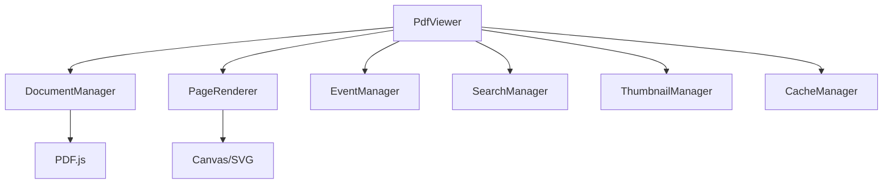
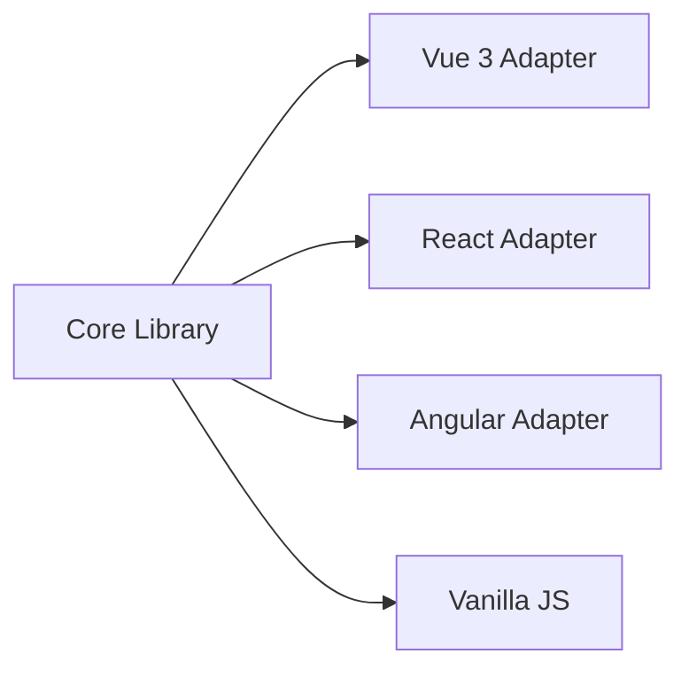

# 介绍

@ldesign/pdf 是一个功能完整、高性能的PDF预览器库，专为现代Web应用设计。它提供了丰富的PDF预览功能，支持多种框架集成，并具有出色的性能表现。

## 特性概览

### 🚀 核心特性

- **框架无关**：支持原生JavaScript、Vue3等多种框架
- **TypeScript支持**：完整的类型定义，确保类型安全
- **高性能**：智能缓存、懒加载、虚拟滚动
- **响应式设计**：完美适配桌面端和移动端

### 📋 功能特性

- **文档加载**：支持URL、File对象、ArrayBuffer等多种输入方式
- **页面导航**：上一页、下一页、跳转到指定页面
- **缩放控制**：自由缩放、适应宽度、适应页面
- **页面旋转**：支持90°、180°、270°旋转
- **文本搜索**：全文搜索、高亮显示、大小写敏感
- **缩略图导航**：页面缩略图、快速跳转
- **全屏模式**：沉浸式阅读体验
- **下载打印**：支持文档下载和打印

### 🎨 定制特性

- **主题系统**：内置亮色/暗色主题
- **自定义样式**：CSS变量，轻松定制外观
- **工具栏定制**：可显示/隐藏各种工具按钮
- **事件系统**：监听文档加载、页面变化等事件

## 设计理念

### 性能优先

@ldesign/pdf 从设计之初就将性能作为首要考虑因素：

- **智能缓存**：页面级缓存机制，避免重复渲染
- **懒加载**：按需加载页面内容，减少初始加载时间
- **内存管理**：自动清理不需要的资源，防止内存泄漏
- **渲染优化**：使用Canvas和WebGL加速渲染

### 开发体验

提供出色的开发体验是我们的重要目标：

- **TypeScript优先**：完整的类型定义和智能提示
- **API设计**：简洁直观的API，易于学习和使用
- **错误处理**：详细的错误信息和处理建议
- **文档完善**：详细的文档和丰富的示例

### 可扩展性

灵活的架构设计，支持各种定制需求：

- **插件系统**：支持功能扩展和定制
- **事件驱动**：基于事件的架构，易于集成
- **配置丰富**：大量配置选项，满足不同需求
- **主题定制**：支持深度定制外观和交互

## 技术架构

### 核心模块

- **PdfViewer**：主要的预览器类，协调各个模块
- **DocumentManager**：文档加载和管理
- **PageRenderer**：页面渲染引擎
- **EventManager**：事件管理和分发
- **SearchManager**：文本搜索功能
- **ThumbnailManager**：缩略图生成和管理
- **CacheManager**：缓存管理

### 框架适配

通过适配器模式，核心库可以轻松集成到不同的前端框架中。

## 使用场景

### 文档管理系统

- 在线文档预览
- 文档审批流程
- 文档版本对比
- 文档注释和标记

### 电子书阅读器

- 电子书在线阅读
- 阅读进度管理
- 书签和笔记
- 全文搜索

### 报表系统

- 报表在线预览
- 报表打印和下载
- 报表分享和协作
- 移动端适配

### 教育平台

- 课件在线预览
- 作业提交和批改
- 学习资料管理
- 移动学习支持

## 浏览器兼容性

@ldesign/pdf 基于现代Web标准构建，支持以下浏览器：

| 浏览器 | 版本要求 | 说明 |
|--------|----------|------|
| Chrome | ≥ 88 | 完全支持 |
| Firefox | ≥ 78 | 完全支持 |
| Safari | ≥ 14 | 完全支持 |
| Edge | ≥ 88 | 完全支持 |

### 功能支持

- **Canvas API**：用于PDF页面渲染
- **Web Workers**：用于PDF解析和处理
- **Fullscreen API**：用于全屏模式
- **File API**：用于本地文件处理
- **Blob API**：用于文件下载

## 下一步

现在你已经了解了 @ldesign/pdf 的基本概念，可以开始：

1. [快速开始](/guide/getting-started) - 创建你的第一个PDF预览器
2. [安装指南](/guide/installation) - 详细的安装说明
3. [API参考](/api/) - 完整的API文档
4. [示例代码](/examples/) - 丰富的示例和最佳实践

如果你在使用过程中遇到任何问题，欢迎：

- 查看 [常见问题](/guide/faq)
- 提交 [Issue](https://github.com/ldesign/pdf/issues)
- 参与 [讨论](https://github.com/ldesign/pdf/discussions)
