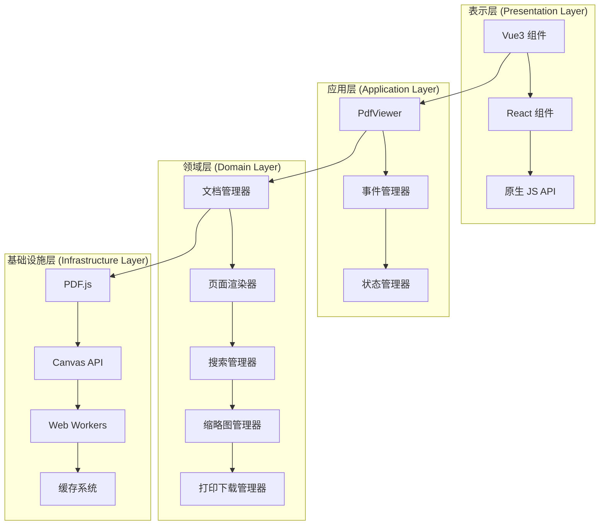
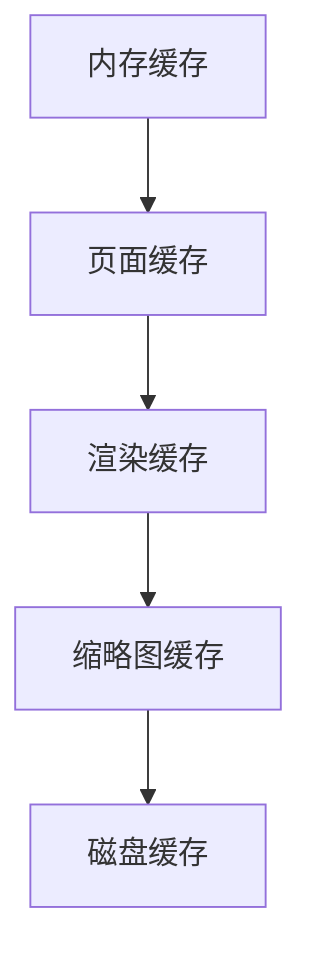
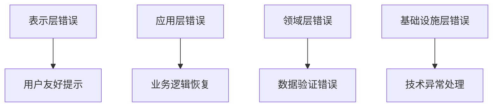

# @ldesign/pdf 架构设计

## 整体架构概览

@ldesign/pdf 采用分层架构和模块化设计，确保代码的可维护性、可扩展性和可测试性。



## 核心模块设计

### 1. PdfViewer (主控制器)

作为整个系统的核心控制器，负责协调各个子模块的工作。

#### 职责
- **模块协调**：协调文档管理器、页面渲染器等各个模块
- **状态管理**：维护全局状态，如当前页面、缩放比例等
- **事件分发**：处理用户交互事件，分发给相应的处理器
- **生命周期管理**：管理组件的初始化、更新、销毁等生命周期

#### 设计模式
- **外观模式**：为复杂的子系统提供简单的接口
- **中介者模式**：协调各个模块之间的交互
- **观察者模式**：通过事件系统实现松耦合通信

```typescript
class PdfViewer implements IPdfViewer {
  private documentManager: PdfDocumentManager
  private pageRenderer: PdfPageRenderer
  private eventManager: EventManager
  private state: PdfViewerState
  
  constructor(config: PdfViewerConfig) {
    this.initializeModules(config)
    this.bindEvents()
  }
  
  async loadDocument(input: PdfInput): Promise<void> {
    // 协调文档加载流程
  }
  
  private initializeModules(config: PdfViewerConfig): void {
    // 初始化各个子模块
  }
}
```

### 2. PdfDocumentManager (文档管理器)

负责PDF文档的加载、解析和管理。

#### 职责
- **文档加载**：支持多种输入方式的文档加载
- **文档解析**：使用PDF.js解析PDF文档结构
- **页面管理**：管理文档页面的获取和缓存
- **元数据提取**：提取文档的元数据信息

#### 设计特点
- **策略模式**：支持不同的文档加载策略
- **工厂模式**：根据输入类型创建相应的加载器
- **缓存机制**：实现页面级缓存，提高性能

```typescript
class PdfDocumentManager implements IPdfDocumentManager {
  private document: PDFDocumentProxy | null = null
  private pageCache = new Map<number, PDFPageProxy>()
  
  async loadDocument(input: PdfInput): Promise<PDFDocumentProxy> {
    const data = await this.processInput(input)
    this.document = await pdfjsLib.getDocument(data).promise
    return this.document
  }
  
  async getPage(pageNumber: number): Promise<PDFPageProxy> {
    // 实现页面获取和缓存逻辑
  }
}
```

### 3. PdfPageRenderer (页面渲染器)

负责将PDF页面渲染到DOM元素中。

#### 职责
- **多模式渲染**：支持Canvas、SVG、纯文本等渲染模式
- **文本层渲染**：渲染可选择的文本层
- **注释层渲染**：渲染PDF注释和链接
- **性能优化**：实现渲染性能优化

#### 设计特点
- **策略模式**：不同的渲染模式使用不同的策略
- **模板方法模式**：定义渲染流程的骨架
- **装饰器模式**：为基础渲染添加文本层、注释层等装饰

```typescript
class PdfPageRenderer implements IPdfPageRenderer {
  private renderTasks = new Map<HTMLElement, any>()
  
  async renderPage(
    page: PDFPageProxy,
    container: HTMLElement,
    options: RenderOptions
  ): Promise<void> {
    await this.cancelRenderTask(container)
    this.cleanupContainer(container)
    
    switch (options.mode) {
      case 'canvas':
        await this.renderToCanvas(page, container, viewport, options)
        break
      case 'svg':
        await this.renderToSvg(page, container, viewport, options)
        break
    }
    
    if (options.enableTextSelection) {
      await this.renderTextLayer(page, container, viewport)
    }
  }
}
```

### 4. EventManager (事件管理器)

实现事件驱动架构的核心组件。

#### 职责
- **事件注册**：管理事件监听器的注册和注销
- **事件分发**：将事件分发给相应的监听器
- **事件过滤**：支持事件的过滤和路由
- **错误处理**：处理事件处理过程中的错误

#### 设计特点
- **观察者模式**：实现发布-订阅机制
- **命令模式**：将事件处理封装为命令对象
- **责任链模式**：支持事件的链式处理

```typescript
class EventManager {
  private listeners = new Map<keyof PdfViewerEvents, Set<EventListener>>()
  
  on<K extends keyof PdfViewerEvents>(
    event: K,
    listener: PdfViewerEvents[K]
  ): void {
    // 注册事件监听器
  }
  
  emit<K extends keyof PdfViewerEvents>(
    event: K,
    data: Parameters<PdfViewerEvents[K]>[0]
  ): void {
    // 分发事件到所有监听器
  }
}
```

## 数据流架构

### 1. 单向数据流

采用单向数据流架构，确保数据流向的可预测性。


#### 数据流向
1. **用户操作**：用户的点击、滚动、输入等操作
2. **事件处理**：事件管理器捕获并处理用户操作
3. **状态更新**：根据操作更新应用状态
4. **视图渲染**：根据新状态重新渲染视图
5. **界面更新**：用户看到更新后的界面

### 2. 状态管理

实现集中式的状态管理，确保状态的一致性。

```typescript
interface PdfViewerState {
  isDocumentLoaded: boolean
  currentPage: number
  totalPages: number
  currentScale: number
  currentZoomMode: ZoomMode
  currentRotation: RotationAngle
  isLoading: boolean
  isFullscreen: boolean
  searchState: {
    isSearching: boolean
    query: string
    currentMatch: number
    totalMatches: number
  }
}
```

#### 状态更新原则
- **不可变性**：状态对象不可直接修改，只能通过创建新对象更新
- **原子性**：状态更新操作是原子的，要么全部成功，要么全部失败
- **可预测性**：相同的输入总是产生相同的状态变化

## 缓存架构

### 1. 多级缓存系统

实现多级缓存系统，提高性能和用户体验。



#### 缓存层级
1. **内存缓存**：最快的缓存，存储最近使用的数据
2. **页面缓存**：缓存PDF页面对象，避免重复解析
3. **渲染缓存**：缓存渲染结果，避免重复渲染
4. **缩略图缓存**：缓存生成的缩略图
5. **磁盘缓存**：持久化缓存，跨会话保存

### 2. 缓存策略

#### LRU (Least Recently Used)
- 当缓存满时，优先淘汰最近最少使用的项目
- 适用于页面缓存和渲染缓存

#### TTL (Time To Live)
- 为缓存项设置生存时间，过期自动清理
- 适用于网络资源缓存

#### 智能预加载
- 根据用户行为预测可能需要的资源
- 在空闲时间预加载相邻页面

```typescript
class CacheManager<T> {
  private cache = new Map<string, CacheItem<T>>()
  private config: CacheConfig
  
  set(key: string, data: T): void {
    if (this.cache.size >= this.config.maxItems) {
      this.cleanup()
    }
    this.cache.set(key, {
      data,
      timestamp: Date.now(),
      accessCount: 0,
      lastAccessed: Date.now(),
    })
  }
  
  get(key: string): T | null {
    const item = this.cache.get(key)
    if (!item) return null
    
    if (Date.now() - item.timestamp > this.config.maxAge) {
      this.cache.delete(key)
      return null
    }
    
    item.accessCount++
    item.lastAccessed = Date.now()
    return item.data
  }
}
```

## 错误处理架构

### 1. 分层错误处理

不同层级采用不同的错误处理策略。



#### 错误分类
- **用户错误**：用户输入错误、操作错误等
- **业务错误**：业务规则违反、状态不一致等
- **系统错误**：网络错误、解析错误、渲染错误等
- **未知错误**：未预期的异常情况

### 2. 错误恢复机制

#### 优雅降级
- 在功能不可用时提供替代方案
- 保证核心功能的可用性

#### 重试机制
- 对于临时性错误实现自动重试
- 使用指数退避算法避免过度重试

#### 错误边界
- 使用错误边界隔离错误影响范围
- 防止单个组件错误影响整个应用

```typescript
class ErrorHandler {
  static handle(error: Error, context: string): void {
    const errorInfo = {
      message: error.message,
      stack: error.stack,
      context,
      timestamp: Date.now(),
    }
    
    // 记录错误日志
    console.error('PDF Viewer Error:', errorInfo)
    
    // 根据错误类型采取不同处理策略
    if (error instanceof NetworkError) {
      this.handleNetworkError(error)
    } else if (error instanceof ParseError) {
      this.handleParseError(error)
    } else {
      this.handleUnknownError(error)
    }
  }
}
```

## 性能优化架构

### 1. 渲染优化

#### 虚拟滚动
- 只渲染可见区域的内容
- 动态创建和销毁DOM元素

#### 分帧渲染
- 将大型渲染任务分解为小块
- 使用requestAnimationFrame避免阻塞

#### Web Workers
- 在后台线程进行计算密集型任务
- 避免阻塞主线程的用户交互

### 2. 内存优化

#### 对象池
- 重用频繁创建和销毁的对象
- 减少垃圾回收的压力

#### 弱引用
- 使用WeakMap和WeakSet避免内存泄漏
- 自动清理不再引用的对象

#### 内存监控
- 实时监控内存使用情况
- 在内存不足时主动清理缓存

这种架构设计确保了@ldesign/pdf具有良好的可维护性、可扩展性和性能表现，能够满足各种复杂的业务需求。
