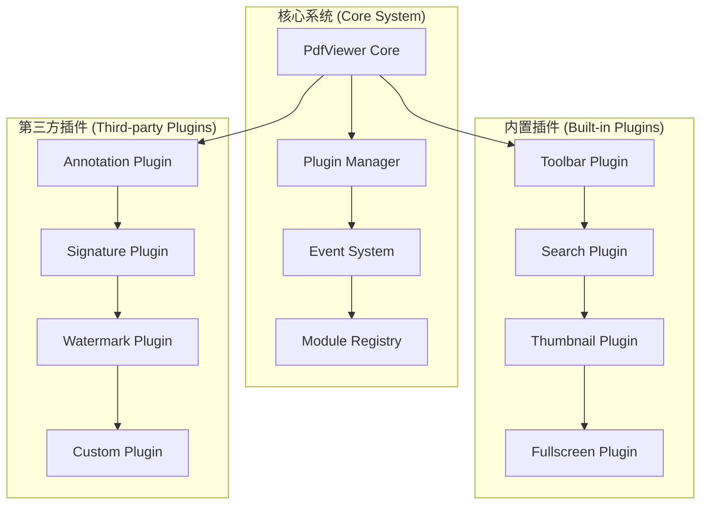

# @ldesign/pdf 扩展性设计

## 扩展性架构概览

@ldesign/pdf 采用插件化架构和模块化设计，确保系统具有良好的扩展性，能够适应不断变化的需求。



## 插件系统设计

### 1. 插件接口定义

所有插件都必须实现标准的插件接口：

```typescript
interface IPdfPlugin {
  // 插件基本信息
  readonly name: string
  readonly version: string
  readonly description: string
  readonly author: string
  
  // 插件依赖
  readonly dependencies?: string[]
  readonly peerDependencies?: string[]
  
  // 生命周期方法
  install(viewer: IPdfViewer, options?: any): Promise<void>
  uninstall(viewer: IPdfViewer): Promise<void>
  
  // 可选的生命周期钩子
  onDocumentLoaded?(documentInfo: PdfDocumentInfo): void
  onPageChanged?(pageNumber: number, pageInfo: PdfPageInfo): void
  onZoomChanged?(scale: number, zoomMode: ZoomMode): void
  onDestroy?(): void
}
```

### 2. 插件管理器

插件管理器负责插件的注册、加载、卸载和生命周期管理：

```typescript
class PluginManager {
  private plugins = new Map<string, IPdfPlugin>()
  private installedPlugins = new Set<string>()
  private viewer: IPdfViewer
  
  constructor(viewer: IPdfViewer) {
    this.viewer = viewer
  }
  
  // 注册插件
  register(plugin: IPdfPlugin): void {
    if (this.plugins.has(plugin.name)) {
      throw new Error(`Plugin ${plugin.name} is already registered`)
    }
    
    // 检查依赖
    this.checkDependencies(plugin)
    
    this.plugins.set(plugin.name, plugin)
  }
  
  // 安装插件
  async install(pluginName: string, options?: any): Promise<void> {
    const plugin = this.plugins.get(pluginName)
    if (!plugin) {
      throw new Error(`Plugin ${pluginName} not found`)
    }
    
    if (this.installedPlugins.has(pluginName)) {
      throw new Error(`Plugin ${pluginName} is already installed`)
    }
    
    // 安装依赖插件
    await this.installDependencies(plugin)
    
    // 安装插件
    await plugin.install(this.viewer, options)
    this.installedPlugins.add(pluginName)
    
    // 绑定生命周期事件
    this.bindLifecycleEvents(plugin)
  }
  
  // 卸载插件
  async uninstall(pluginName: string): Promise<void> {
    const plugin = this.plugins.get(pluginName)
    if (!plugin || !this.installedPlugins.has(pluginName)) {
      return
    }
    
    // 检查是否有其他插件依赖此插件
    this.checkDependents(pluginName)
    
    // 卸载插件
    await plugin.uninstall(this.viewer)
    this.installedPlugins.delete(pluginName)
    
    // 解绑生命周期事件
    this.unbindLifecycleEvents(plugin)
  }
  
  // 获取已安装的插件列表
  getInstalledPlugins(): string[] {
    return Array.from(this.installedPlugins)
  }
  
  // 检查插件依赖
  private checkDependencies(plugin: IPdfPlugin): void {
    if (!plugin.dependencies) return
    
    for (const dep of plugin.dependencies) {
      if (!this.plugins.has(dep)) {
        throw new Error(`Dependency ${dep} not found for plugin ${plugin.name}`)
      }
    }
  }
  
  // 安装依赖插件
  private async installDependencies(plugin: IPdfPlugin): Promise<void> {
    if (!plugin.dependencies) return
    
    for (const dep of plugin.dependencies) {
      if (!this.installedPlugins.has(dep)) {
        await this.install(dep)
      }
    }
  }
  
  // 绑定生命周期事件
  private bindLifecycleEvents(plugin: IPdfPlugin): void {
    if (plugin.onDocumentLoaded) {
      this.viewer.on('documentLoaded', plugin.onDocumentLoaded)
    }
    if (plugin.onPageChanged) {
      this.viewer.on('pageChanged', plugin.onPageChanged)
    }
    if (plugin.onZoomChanged) {
      this.viewer.on('zoomChanged', plugin.onZoomChanged)
    }
  }
}
```

### 3. 插件开发示例

#### 水印插件示例

```typescript
class WatermarkPlugin implements IPdfPlugin {
  readonly name = 'watermark'
  readonly version = '1.0.0'
  readonly description = 'Add watermark to PDF pages'
  readonly author = 'ldesign'
  
  private watermarkText = ''
  private watermarkOpacity = 0.3
  private viewer: IPdfViewer | null = null
  
  async install(viewer: IPdfViewer, options?: WatermarkOptions): Promise<void> {
    this.viewer = viewer
    
    if (options) {
      this.watermarkText = options.text || 'WATERMARK'
      this.watermarkOpacity = options.opacity || 0.3
    }
    
    // 监听页面渲染完成事件
    viewer.on('renderComplete', this.addWatermark.bind(this))
  }
  
  async uninstall(viewer: IPdfViewer): Promise<void> {
    viewer.off('renderComplete', this.addWatermark.bind(this))
    this.removeAllWatermarks()
    this.viewer = null
  }
  
  private addWatermark(pageNumber: number, container: HTMLElement): void {
    // 创建水印元素
    const watermark = document.createElement('div')
    watermark.className = 'pdf-watermark'
    watermark.textContent = this.watermarkText
    watermark.style.cssText = `
      position: absolute;
      top: 50%;
      left: 50%;
      transform: translate(-50%, -50%) rotate(-45deg);
      font-size: 48px;
      color: rgba(0, 0, 0, ${this.watermarkOpacity});
      pointer-events: none;
      user-select: none;
      z-index: 10;
    `
    
    container.appendChild(watermark)
  }
  
  private removeAllWatermarks(): void {
    const watermarks = document.querySelectorAll('.pdf-watermark')
    watermarks.forEach(watermark => watermark.remove())
  }
  
  // 公共API
  setWatermarkText(text: string): void {
    this.watermarkText = text
    this.refreshWatermarksIfNeeded()
  }
  
  setWatermarkOpacity(opacity: number): void {
    this.watermarkOpacity = Math.max(0, Math.min(1, opacity))
    this.refreshWatermarksIfNeeded()
  }
  
  private refreshWatermarksIfNeeded(): void {
    if (this.viewer) {
      this.removeAllWatermarks()
      // 触发重新渲染以应用新的水印设置
      this.viewer.refresh()
    }
  }
}

interface WatermarkOptions {
  text?: string
  opacity?: number
  color?: string
  fontSize?: number
  rotation?: number
}
```

## 事件系统扩展

### 1. 自定义事件

支持插件定义和触发自定义事件：

```typescript
// 扩展事件接口
interface ExtendedPdfViewerEvents extends PdfViewerEvents {
  // 插件可以添加自定义事件
  'watermark:added': (pageNumber: number, watermarkId: string) => void
  'annotation:created': (annotation: CustomAnnotation) => void
  'signature:completed': (signature: DigitalSignature) => void
}

// 插件中触发自定义事件
class AnnotationPlugin implements IPdfPlugin {
  private viewer: IPdfViewer | null = null
  
  async install(viewer: IPdfViewer): Promise<void> {
    this.viewer = viewer
    this.setupAnnotationTools()
  }
  
  private createAnnotation(type: string, position: Point): void {
    const annotation = {
      id: generateId(),
      type,
      position,
      timestamp: Date.now(),
    }
    
    // 触发自定义事件
    this.viewer?.emit('annotation:created', annotation)
  }
}
```

### 2. 事件拦截和修改

支持插件拦截和修改事件：

```typescript
interface EventInterceptor {
  intercept<K extends keyof PdfViewerEvents>(
    event: K,
    handler: (data: Parameters<PdfViewerEvents[K]>[0]) => Parameters<PdfViewerEvents[K]>[0] | null
  ): void
}

class SecurityPlugin implements IPdfPlugin {
  readonly name = 'security'
  
  async install(viewer: IPdfViewer): Promise<void> {
    // 拦截下载事件，添加安全检查
    viewer.interceptEvent('download', (downloadOptions) => {
      if (!this.checkDownloadPermission()) {
        console.warn('Download not allowed by security policy')
        return null // 阻止事件继续
      }
      
      // 修改下载选项
      return {
        ...downloadOptions,
        filename: `[SECURE]_${downloadOptions.filename}`,
      }
    })
  }
  
  private checkDownloadPermission(): boolean {
    // 实现安全检查逻辑
    return true
  }
}
```

## 主题系统扩展

### 1. 主题插件接口

```typescript
interface IThemePlugin extends IPdfPlugin {
  readonly themeName: string
  readonly themeVariables: Record<string, string>
  
  applyTheme(container: HTMLElement): void
  removeTheme(container: HTMLElement): void
}

class DarkThemePlugin implements IThemePlugin {
  readonly name = 'dark-theme'
  readonly version = '1.0.0'
  readonly description = 'Dark theme for PDF viewer'
  readonly author = 'ldesign'
  readonly themeName = 'dark'
  
  readonly themeVariables = {
    '--pdf-background': '#1a1a1a',
    '--pdf-page-background': '#2d2d2d',
    '--pdf-toolbar-background': '#333333',
    '--pdf-text-color': '#ffffff',
    '--pdf-text-muted': '#cccccc',
    '--pdf-border-color': '#444444',
  }
  
  async install(viewer: IPdfViewer): Promise<void> {
    const container = viewer.getContainer()
    this.applyTheme(container)
  }
  
  async uninstall(viewer: IPdfViewer): Promise<void> {
    const container = viewer.getContainer()
    this.removeTheme(container)
  }
  
  applyTheme(container: HTMLElement): void {
    container.classList.add('pdf-dark-theme')
    
    // 应用CSS变量
    Object.entries(this.themeVariables).forEach(([property, value]) => {
      container.style.setProperty(property, value)
    })
  }
  
  removeTheme(container: HTMLElement): void {
    container.classList.remove('pdf-dark-theme')
    
    // 移除CSS变量
    Object.keys(this.themeVariables).forEach(property => {
      container.style.removeProperty(property)
    })
  }
}
```

### 2. 主题管理器

```typescript
class ThemeManager {
  private themes = new Map<string, IThemePlugin>()
  private currentTheme: string | null = null
  private viewer: IPdfViewer
  
  constructor(viewer: IPdfViewer) {
    this.viewer = viewer
  }
  
  registerTheme(theme: IThemePlugin): void {
    this.themes.set(theme.themeName, theme)
  }
  
  async applyTheme(themeName: string): Promise<void> {
    // 移除当前主题
    if (this.currentTheme) {
      await this.removeCurrentTheme()
    }
    
    // 应用新主题
    const theme = this.themes.get(themeName)
    if (!theme) {
      throw new Error(`Theme ${themeName} not found`)
    }
    
    await theme.install(this.viewer)
    this.currentTheme = themeName
  }
  
  async removeCurrentTheme(): Promise<void> {
    if (!this.currentTheme) return
    
    const theme = this.themes.get(this.currentTheme)
    if (theme) {
      await theme.uninstall(this.viewer)
    }
    
    this.currentTheme = null
  }
  
  getAvailableThemes(): string[] {
    return Array.from(this.themes.keys())
  }
  
  getCurrentTheme(): string | null {
    return this.currentTheme
  }
}
```

## 渲染器扩展

### 1. 自定义渲染器

支持插件提供自定义的页面渲染器：

```typescript
interface ICustomRenderer {
  readonly name: string
  readonly supportedFormats: string[]
  
  canRender(page: PDFPageProxy, options: RenderOptions): boolean
  render(page: PDFPageProxy, container: HTMLElement, options: RenderOptions): Promise<void>
}

class WebGLRenderer implements ICustomRenderer {
  readonly name = 'webgl'
  readonly supportedFormats = ['pdf']
  
  canRender(page: PDFPageProxy, options: RenderOptions): boolean {
    // 检查WebGL支持
    const canvas = document.createElement('canvas')
    const gl = canvas.getContext('webgl') || canvas.getContext('experimental-webgl')
    return !!gl
  }
  
  async render(page: PDFPageProxy, container: HTMLElement, options: RenderOptions): Promise<void> {
    const canvas = document.createElement('canvas')
    const gl = canvas.getContext('webgl')
    
    if (!gl) {
      throw new Error('WebGL not supported')
    }
    
    // 实现WebGL渲染逻辑
    await this.renderWithWebGL(page, gl, options)
    container.appendChild(canvas)
  }
  
  private async renderWithWebGL(page: PDFPageProxy, gl: WebGLRenderingContext, options: RenderOptions): Promise<void> {
    // WebGL渲染实现
    // 这里可以实现更高性能的GPU加速渲染
  }
}
```

### 2. 渲染器注册

```typescript
class RendererRegistry {
  private renderers = new Map<string, ICustomRenderer>()
  
  register(renderer: ICustomRenderer): void {
    this.renderers.set(renderer.name, renderer)
  }
  
  getRenderer(name: string): ICustomRenderer | null {
    return this.renderers.get(name) || null
  }
  
  findSuitableRenderer(page: PDFPageProxy, options: RenderOptions): ICustomRenderer | null {
    for (const renderer of this.renderers.values()) {
      if (renderer.canRender(page, options)) {
        return renderer
      }
    }
    return null
  }
  
  getAvailableRenderers(): string[] {
    return Array.from(this.renderers.keys())
  }
}
```

## 配置系统扩展

### 1. 插件配置

支持插件定义自己的配置选项：

```typescript
interface PluginConfig {
  [pluginName: string]: any
}

interface ExtendedPdfViewerConfig extends PdfViewerConfig {
  plugins?: {
    enabled: string[]
    config: PluginConfig
  }
}

// 使用示例
const viewer = createPdfViewer({
  container,
  plugins: {
    enabled: ['watermark', 'dark-theme', 'annotation'],
    config: {
      watermark: {
        text: 'CONFIDENTIAL',
        opacity: 0.2,
        color: '#ff0000',
      },
      annotation: {
        enableDrawing: true,
        enableText: true,
        defaultColor: '#ffff00',
      },
    },
  },
})
```

### 2. 动态配置更新

```typescript
class ConfigManager {
  private config: ExtendedPdfViewerConfig
  private viewer: IPdfViewer
  
  constructor(viewer: IPdfViewer, config: ExtendedPdfViewerConfig) {
    this.viewer = viewer
    this.config = config
  }
  
  updatePluginConfig(pluginName: string, newConfig: any): void {
    if (!this.config.plugins) {
      this.config.plugins = { enabled: [], config: {} }
    }
    
    this.config.plugins.config[pluginName] = {
      ...this.config.plugins.config[pluginName],
      ...newConfig,
    }
    
    // 通知插件配置已更新
    this.viewer.emit('pluginConfigUpdated', { pluginName, config: newConfig })
  }
  
  getPluginConfig(pluginName: string): any {
    return this.config.plugins?.config[pluginName] || {}
  }
}
```

## 扩展开发工具

### 1. 插件开发脚手架

```typescript
// 插件开发基类
abstract class BasePlugin implements IPdfPlugin {
  abstract readonly name: string
  abstract readonly version: string
  abstract readonly description: string
  abstract readonly author: string
  
  protected viewer: IPdfViewer | null = null
  protected config: any = {}
  
  async install(viewer: IPdfViewer, options?: any): Promise<void> {
    this.viewer = viewer
    this.config = options || {}
    
    await this.onInstall()
    this.bindEvents()
  }
  
  async uninstall(viewer: IPdfViewer): Promise<void> {
    this.unbindEvents()
    await this.onUninstall()
    
    this.viewer = null
    this.config = {}
  }
  
  // 子类需要实现的方法
  protected abstract onInstall(): Promise<void>
  protected abstract onUninstall(): Promise<void>
  
  // 可选的事件绑定方法
  protected bindEvents(): void {}
  protected unbindEvents(): void {}
  
  // 工具方法
  protected emit(event: string, data?: any): void {
    this.viewer?.emit(event, data)
  }
  
  protected on(event: string, handler: Function): void {
    this.viewer?.on(event, handler)
  }
  
  protected off(event: string, handler: Function): void {
    this.viewer?.off(event, handler)
  }
}
```

### 2. 插件测试工具

```typescript
class PluginTester {
  static async testPlugin(plugin: IPdfPlugin, mockViewer?: Partial<IPdfViewer>): Promise<TestResult> {
    const viewer = mockViewer || this.createMockViewer()
    const results: TestResult = {
      passed: 0,
      failed: 0,
      errors: [],
    }
    
    try {
      // 测试安装
      await plugin.install(viewer as IPdfViewer)
      results.passed++
      
      // 测试卸载
      await plugin.uninstall(viewer as IPdfViewer)
      results.passed++
      
    } catch (error) {
      results.failed++
      results.errors.push(error.message)
    }
    
    return results
  }
  
  private static createMockViewer(): Partial<IPdfViewer> {
    return {
      on: jest.fn(),
      off: jest.fn(),
      emit: jest.fn(),
      getContainer: () => document.createElement('div'),
      getState: () => ({
        isDocumentLoaded: false,
        currentPage: 1,
        totalPages: 0,
        currentScale: 1,
        currentZoomMode: 'fit-width',
        currentRotation: 0,
        isLoading: false,
        isFullscreen: false,
        searchState: {
          isSearching: false,
          query: '',
          currentMatch: 0,
          totalMatches: 0,
        },
      }),
    }
  }
}

interface TestResult {
  passed: number
  failed: number
  errors: string[]
}
```

这种扩展性设计确保了@ldesign/pdf能够通过插件系统灵活地扩展功能，满足各种特殊需求，同时保持核心系统的简洁和稳定。
