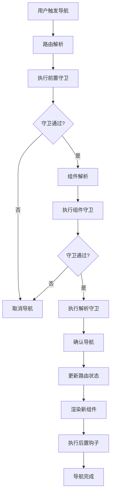

# 架构设计

## 🏗️ 整体架构

### 系统架构图

```
┌─────────────────────────────────────────────────────────────┐
│                    @ldesign/router                          │
├─────────────────────────────────────────────────────────────┤
│  应用层 (Application Layer)                                  │
│  ┌─────────────┐  ┌─────────────┐  ┌─────────────┐          │
│  │   Vue App   │  │  Component  │  │   Plugin    │          │
│  └─────────────┘  └─────────────┘  └─────────────┘          │
├─────────────────────────────────────────────────────────────┤
│  组件层 (Component Layer)                                    │
│  ┌─────────────┐  ┌─────────────┐  ┌─────────────┐          │
│  │ RouterView  │  │ RouterLink  │  │ RouteGuard  │          │
│  └─────────────┘  └─────────────┘  └─────────────┘          │
├─────────────────────────────────────────────────────────────┤
│  API层 (API Layer)                                          │
│  ┌─────────────┐  ┌─────────────┐  ┌─────────────┐          │
│  │  useRouter  │  │  useRoute   │  │ useNavigation│          │
│  └─────────────┘  └─────────────┘  └─────────────┘          │
├─────────────────────────────────────────────────────────────┤
│  插件层 (Plugin Layer)                                       │
│  ┌─────────────┐  ┌─────────────┐  ┌─────────────┐          │
│  │ Animation   │  │    Cache    │  │  Preload    │          │
│  └─────────────┘  └─────────────┘  └─────────────┘          │
├─────────────────────────────────────────────────────────────┤
│  核心层 (Core Layer)                                         │
│  ┌─────────────┐  ┌─────────────┐  ┌─────────────┐          │
│  │   Router    │  │   Matcher   │  │   History   │          │
│  └─────────────┘  └─────────────┘  └─────────────┘          │
├─────────────────────────────────────────────────────────────┤
│  工具层 (Utils Layer)                                        │
│  ┌─────────────┐  ┌─────────────┐  ┌─────────────┐          │
│  │    Path     │  │    Query    │  │   Events    │          │
│  └─────────────┘  └─────────────┘  └─────────────┘          │
└─────────────────────────────────────────────────────────────┘
```

## 📁 模块设计

### 核心模块 (Core)

#### 1. Router 模块

```typescript
// 路由器核心实现
class RouterImpl implements Router {
  private matcher: RouteMatcher
  private history: RouterHistory
  private currentRoute: Ref<RouteLocationNormalized>
  private plugins: Map<string, RouterPlugin>

  // 核心方法
  push(to: RouteLocationRaw): Promise<NavigationFailure | void>
  replace(to: RouteLocationRaw): Promise<NavigationFailure | void>
  resolve(to: RouteLocationRaw): RouteLocation
  addRoute(route: RouteRecordRaw): () => void
  removeRoute(name: string | symbol): void
}
```

#### 2. Matcher 模块

```typescript
// 基于 Trie 树的路由匹配器
class TrieRouteMatcher implements RouteMatcher {
  private root: TrieNode = new TrieNode()
  private nameMap: Map<string, RouteRecordNormalized> = new Map()

  // 高效路由匹配
  match(path: string): RouteMatch | null
  resolve(location: RouteLocationRaw): RouteLocation
  addRoute(record: RouteRecordRaw): RouteRecordNormalized

  // 嵌套路由支持
  private matchSegments(
    node: TrieNode,
    segments: string[],
    index: number,
    params: RouteParams,
    matchedSegments: string[],
    matchedRecords: RouteRecordNormalized[]
  ): MatchResult | null
}
```

#### 3. History 模块

```typescript
// 历史记录管理
abstract class RouterHistory {
  abstract push(to: HistoryLocation): void
  abstract replace(to: HistoryLocation): void
  abstract go(delta: number): void
  abstract listen(callback: NavigationCallback): () => void
}

// 具体实现
class WebHistory extends RouterHistory {
  /* ... */
}
class HashHistory extends RouterHistory {
  /* ... */
}
class MemoryHistory extends RouterHistory {
  /* ... */
}
```

### 组件模块 (Components)

#### 1. RouterView 组件

```typescript
// 路由视图组件
export const RouterView = defineComponent({
  name: 'RouterView',
  props: {
    // 动画配置
    animation: String as PropType<AnimationType>,
    // 缓存配置
    keepAlive: Boolean,
    maxCache: Number,
    // 错误处理
    errorComponent: Object as PropType<Component>,
    loadingComponent: Object as PropType<Component>,
  },
  setup(props, { slots }) {
    // 组件实现
  },
})
```

#### 2. RouterLink 组件

```typescript
// 路由链接组件
export const RouterLink = defineComponent({
  name: 'RouterLink',
  props: {
    to: [String, Object] as PropType<RouteLocationRaw>,
    // 预加载配置
    preload: String as PropType<PreloadStrategy>,
    // 样式配置
    activeClass: String,
    exactActiveClass: String,
    // 权限配置
    permission: String,
    // 确认配置
    confirm: [Boolean, String, Function],
  },
  setup(props, { slots }) {
    // 组件实现
  },
})
```

### 插件模块 (Plugins)

#### 1. 动画插件

```typescript
// 路由动画插件
export function createAnimationPlugin(options: AnimationOptions): RouterPlugin {
  return {
    name: 'animation',
    install(router) {
      // 注册动画处理器
      router.beforeEach((to, from, next) => {
        const animation = to.meta.animation || options.default
        if (animation) {
          this.setupAnimation(animation, to, from)
        }
        next()
      })
    },
  }
}
```

#### 2. 缓存插件

```typescript
// 路由缓存插件
export function createCachePlugin(options: CacheOptions): RouterPlugin {
  return {
    name: 'cache',
    install(router) {
      const cache = new RouteCache(options)

      // 提供缓存 API
      router.provide('routeCache', cache)

      // 自动缓存处理
      router.afterEach((to, from) => {
        if (this.shouldCache(to)) {
          cache.set(to.fullPath, to.matched[0].components)
        }
      })
    },
  }
}
```

#### 3. 预加载插件

```typescript
// 组件预加载插件
export function createPreloadPlugin(options: PreloadOptions): RouterPlugin {
  return {
    name: 'preload',
    install(router) {
      const preloader = new ComponentPreloader(options)

      // 注册预加载策略
      router.provide('preloader', preloader)

      // 自动预加载
      if (options.auto) {
        this.setupAutoPreload(router, preloader)
      }
    },
  }
}
```

## 🔄 数据流设计

### 导航流程



### 状态管理

```typescript
// 路由状态管理
class RouteState {
  // 当前路由
  current: Ref<RouteLocationNormalized>

  // 历史记录
  history: RouteLocationNormalized[]

  // 导航状态
  pending: Ref<RouteLocationNormalized | null>

  // 错误状态
  error: Ref<NavigationFailure | null>

  // 更新状态
  updateRoute(route: RouteLocationNormalized): void
  setPending(route: RouteLocationNormalized | null): void
  setError(error: NavigationFailure | null): void
}
```

## 🔌 插件系统设计

### 插件接口

```typescript
// 插件基础接口
interface RouterPlugin {
  name: string
  version?: string
  dependencies?: string[]

  install: (router: Router, options?: any) => void
  uninstall?: (router: Router) => void
}

// 插件管理器
class PluginManager {
  private plugins: Map<string, RouterPlugin> = new Map()

  register(plugin: RouterPlugin): void
  unregister(name: string): void
  get(name: string): RouterPlugin | undefined
  has(name: string): boolean
}
```

### 插件生命周期

```typescript
// 插件生命周期钩子
interface PluginHooks {
  beforeInstall?: (router: Router, options: any) => void
  afterInstall?: (router: Router, options: any) => void
  beforeUninstall?: (router: Router) => void
  afterUninstall?: (router: Router) => void
}
```

## 🎯 性能优化设计

### 1. 路由匹配优化

```typescript
// Trie 树节点
class TrieNode {
  children: Map<string, TrieNode> = new Map()
  paramChild: TrieNode | null = null
  wildcardChild: TrieNode | null = null
  route: RouteRecordNormalized | null = null

  // O(m) 时间复杂度匹配
  match(segments: string[], index: number): RouteMatch | null {
    if (index === segments.length) {
      return this.route ? { route: this.route, params: {} } : null
    }

    const segment = segments[index]

    // 精确匹配
    const exactChild = this.children.get(segment)
    if (exactChild) {
      const result = exactChild.match(segments, index + 1)
      if (result) return result
    }

    // 参数匹配
    if (this.paramChild) {
      const result = this.paramChild.match(segments, index + 1)
      if (result) {
        result.params[this.paramChild.paramName] = segment
        return result
      }
    }

    // 通配符匹配
    if (this.wildcardChild) {
      return this.wildcardChild.match(segments, segments.length)
    }

    return null
  }
}
```

### 2. 组件缓存优化

```typescript
// LRU 缓存实现
class LRUCache<K, V> {
  private capacity: number
  private cache: Map<K, V> = new Map()

  get(key: K): V | undefined {
    if (this.cache.has(key)) {
      // 移到最前面
      const value = this.cache.get(key)!
      this.cache.delete(key)
      this.cache.set(key, value)
      return value
    }
    return undefined
  }

  set(key: K, value: V): void {
    if (this.cache.has(key)) {
      this.cache.delete(key)
    } else if (this.cache.size >= this.capacity) {
      // 删除最久未使用的项
      const firstKey = this.cache.keys().next().value
      this.cache.delete(firstKey)
    }
    this.cache.set(key, value)
  }
}
```

### 3. 预加载优化

```typescript
// 智能预加载策略
class IntelligentPreloader {
  private loadingQueue: Set<string> = new Set()
  private loadedCache: Set<string> = new Set()

  async preload(route: RouteLocationRaw): Promise<void> {
    const path = this.normalizePath(route)

    // 避免重复加载
    if (this.loadingQueue.has(path) || this.loadedCache.has(path)) {
      return
    }

    this.loadingQueue.add(path)

    try {
      // 预加载组件
      await this.preloadComponent(route)

      // 预加载数据
      if (this.shouldPreloadData(route)) {
        await this.preloadData(route)
      }

      this.loadedCache.add(path)
    } finally {
      this.loadingQueue.delete(path)
    }
  }
}
```

## 🔒 类型安全设计

### 路径类型推导

```typescript
// 路径参数类型提取
type ExtractParams<T extends string> = T extends `${infer _}:${infer Param}/${infer Rest}`
  ? { [K in Param]: string } & ExtractParams<Rest>
  : T extends `${infer _}:${infer Param}`
  ? { [K in Param]: string }
  : {}

// 路由记录类型
interface TypedRouteRecord<T extends string = string> {
  path: T
  name?: string
  component?: Component
  meta?: RouteMeta
  params?: ExtractParams<T>
}

// 类型安全的路由使用
function useTypedRoute<T extends string>(): {
  params: Ref<ExtractParams<T>>
  query: Ref<Record<string, string>>
  meta: Ref<RouteMeta>
} {
  const route = useRoute()
  return {
    params: computed(() => route.params as ExtractParams<T>),
    query: computed(() => route.query),
    meta: computed(() => route.meta),
  }
}
```

## 🧪 测试架构

### 测试分层

```
测试金字塔
    ┌─────────────┐
    │  E2E Tests  │  ← Playwright
    ├─────────────┤
    │ Integration │  ← Vitest + Vue Test Utils
    │    Tests    │
    ├─────────────┤
    │ Unit Tests  │  ← Vitest
    └─────────────┘
```

### 测试工具配置

```typescript
// Vitest 配置
export default defineConfig({
  test: {
    environment: 'jsdom',
    setupFiles: ['./test/setup.ts'],
    coverage: {
      provider: 'v8',
      reporter: ['text', 'json', 'html'],
      threshold: {
        global: {
          branches: 90,
          functions: 90,
          lines: 90,
          statements: 90,
        },
      },
    },
  },
})
```
