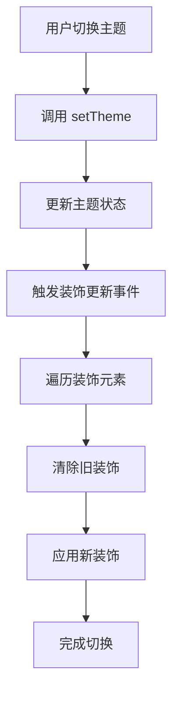

# 基于元素类型的装饰系统

## 🎯 设计理念

新的装饰系统采用了**以页面元素命名**的设计理念，解决了之前主题切换时装饰不一致的问题。

### 核心原则

1. **元素类型命名** - 装饰挂件以页面元素类型命名（如 `header`、`button`、`card`），而不是具体装饰物
   名称
2. **主题无关性** - 所有主题都使用相同的元素类型，只是装饰内容不同
3. **完整换肤** - 切换主题时，所有装饰都会同步更新，实现完整的换肤体验

## 🏗️ 系统架构

### 元素类型定义

```typescript
export type ElementType =
  | 'header' // 页面头部装饰
  | 'navigation' // 导航栏装饰
  | 'button' // 按钮装饰
  | 'card' // 卡片装饰
  | 'form' // 表单装饰
  | 'sidebar' // 侧边栏装饰
  | 'footer' // 页脚装饰
  | 'modal' // 弹窗装饰
  | 'background' // 背景装饰
  | 'corner' // 角落装饰
```

### 装饰位置

```typescript
export type DecorationPosition =
  | 'top-left'
  | 'top-right'
  | 'bottom-left'
  | 'bottom-right'
  | 'center'
  | 'edge-top'
  | 'edge-bottom'
  | 'edge-left'
  | 'edge-right'
```

## 🎨 主题装饰配置

### 春节主题示例

```typescript
export const springFestivalDecorations: ElementDecoration[] = [
  {
    element: 'header',
    position: 'top-right',
    content: '🏮', // 红灯笼
    style: {
      size: 'large',
      animation: 'swing',
    },
  },
  {
    element: 'button',
    position: 'corner',
    content: '✨', // 金色光点
    style: {
      size: 'small',
      animation: 'sparkle',
    },
  },
  // ... 更多装饰配置
]
```

### 圣诞主题示例

```typescript
export const christmasDecorations: ElementDecoration[] = [
  {
    element: 'header',
    position: 'top-right',
    content: '🎄', // 圣诞树
    style: {
      size: 'large',
      animation: 'twinkle',
    },
  },
  {
    element: 'button',
    position: 'corner',
    content: '❄️', // 雪花
    style: {
      size: 'small',
      animation: 'snowfall',
    },
  },
  // ... 更多装饰配置
]
```

## 🔧 使用方式

### Vue 指令使用

```vue
<template>
  <!-- 基础用法 -->
  <header v-element-decoration="'header'">页面头部</header>

  <!-- 指定位置 -->
  <button v-element-decoration="{ element: 'button', position: 'top-right' }">按钮</button>

  <!-- 指定主题 -->
  <div v-element-decoration="{ element: 'card', theme: 'spring-festival' }">卡片内容</div>
</template>
```

### 编程式使用

```typescript
import { getElementDecorations, generateDecorationClass } from '@ldesign/theme'

// 获取指定主题和元素的装饰
const decorations = getElementDecorations('spring-festival', 'button')

// 生成装饰CSS类名
const className = generateDecorationClass('button', 'top-right', 'spring-festival')
```

## 🎭 主题切换机制

### 自动更新装饰

当主题切换时，系统会自动：

1. 触发 `theme-decoration-update` 事件
2. 遍历所有已装饰的元素
3. 清除旧装饰
4. 应用新主题的装饰

```typescript
// 主题切换时的处理
window.addEventListener('theme-decoration-update', event => {
  const newTheme = event.detail.theme
  updateAllDecorations(newTheme)
})
```

### 装饰更新流程



## 🎨 CSS 样式系统

### 基础装饰样式

```css
.theme-decoration {
  position: absolute;
  pointer-events: none;
  user-select: none;
  font-size: 16px;
  line-height: 1;
  z-index: 10;
  transition: all 0.3s ease;
}
```

### 装饰大小

```css
.decoration-small {
  font-size: 12px;
  transform: scale(0.8);
}
.decoration-medium {
  font-size: 16px;
  transform: scale(1);
}
.decoration-large {
  font-size: 24px;
  transform: scale(1.2);
}
```

### 动画效果

系统提供了丰富的动画效果：

- `swing` - 摆动动画（适用于灯笼、铃铛）
- `glow` - 发光动画（适用于福字、星星）
- `sparkle` - 闪烁动画（适用于光点）
- `float` - 飘浮动画（适用于背景装饰）
- `twinkle` - 闪烁动画（适用于圣诞树）
- `snowfall` - 雪花飘落动画

## 🔄 与旧系统的对比

### 旧系统问题

```typescript
// ❌ 旧系统：以装饰物命名
v-widget-decoration="'lantern'"  // 只适用于春节主题
v-widget-decoration="'snowflake'" // 只适用于圣诞主题
```

**问题**：切换主题时，装饰挂件名称不匹配，导致装饰丢失

### 新系统优势

```typescript
// ✅ 新系统：以元素类型命名
v-element-decoration="'header'"  // 适用于所有主题
v-element-decoration="'button'"  // 适用于所有主题
```

**优势**：

- 主题切换时装饰完整保留
- 所有主题使用统一的元素类型
- 更好的可维护性和扩展性

## 🚀 扩展性设计

### 添加新主题

```typescript
// 1. 定义新主题的装饰配置
export const valentineDecorations: ElementDecoration[] = [
  {
    element: 'header',
    position: 'top-right',
    content: '💕',
    style: { size: 'large', animation: 'heartbeat' },
  },
  // ... 更多配置
]

// 2. 注册到主题映射
export const themeDecorations = {
  default: defaultDecorations,
  'spring-festival': springFestivalDecorations,
  christmas: christmasDecorations,
  valentine: valentineDecorations, // 新增
}
```

### 添加新元素类型

```typescript
// 1. 扩展元素类型定义
export type ElementType =
  | 'header'
  | 'button'
  | 'card'
  | 'tooltip'    // 新增
  | 'badge'      // 新增

// 2. 为新元素类型配置装饰
{
  element: 'tooltip',
  position: 'top-right',
  content: '✨',
  style: { size: 'small' }
}
```

## 📱 响应式适配

系统支持响应式设计：

```css
@media (max-width: 768px) {
  .theme-decoration {
    font-size: 14px;
  }

  .decoration-large {
    font-size: 18px;
  }
}
```

## ♿ 无障碍支持

```css
/* 减少动画偏好 */
@media (prefers-reduced-motion: reduce) {
  .theme-decoration {
    animation: none !important;
  }
}

/* 高对比度模式 */
@media (prefers-contrast: high) {
  .theme-decoration {
    filter: contrast(1.5);
  }
}
```

## 🎯 最佳实践

1. **语义化命名** - 使用描述元素功能的名称，而不是外观
2. **适度装饰** - 避免过度装饰影响用户体验
3. **性能考虑** - 合理使用动画，避免影响页面性能
4. **主题一致性** - 确保同一元素类型在不同主题中都有对应装饰
5. **响应式设计** - 考虑不同屏幕尺寸下的装饰效果

这个新的装饰系统为主题切换提供了更好的一致性和可维护性，是构建现代主题系统的重要基础。
