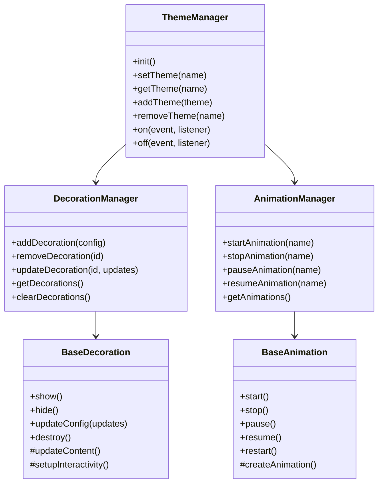

# LDesign Theme 项目总览

## 项目简介

LDesign Theme 是一个功能强大的主题系统，专为现代 Web 应用设计。它提供了丰富的节日主题、动态装饰元素
和流畅的动画效果，让开发者能够轻松为应用添加节日氛围和视觉魅力。

## 核心特性

### 🎨 主题系统

- **多主题支持**: 内置圣诞节、春节、万圣节等节日主题
- **动态切换**: 支持运行时主题切换，无需重新加载页面
- **自动激活**: 基于时间范围的自动主题激活
- **持久化**: 主题选择的本地存储和恢复

### 🎭 装饰系统

- **丰富元素**: 雪花、灯笼、烟花、南瓜灯等装饰元素
- **智能定位**: 灵活的定位系统，支持多种锚点和偏移
- **交互支持**: 装饰元素可响应用户交互
- **响应式**: 自适应不同屏幕尺寸

### 🎬 动画系统

- **多种类型**: 下落、漂浮、闪烁等动画效果
- **性能优化**: GPU 加速，智能降级
- **可控制**: 支持播放、暂停、停止等操作
- **自定义**: 支持自定义动画配置

### 🎯 Vue 集成

- **完整支持**: 提供 Vue 3 插件、组件、指令和组合式函数
- **类型安全**: 完整的 TypeScript 类型定义
- **开发友好**: 丰富的开发工具和调试功能

## 技术架构

### 核心架构

```
@ldesign/theme
├── core/                 # 核心功能
│   ├── theme-manager     # 主题管理器
│   ├── decoration-manager# 装饰管理器
│   ├── animation-manager # 动画管理器
│   └── types            # 类型定义
├── themes/              # 内置主题
│   ├── presets/         # 主题预设
│   └── colors/          # 颜色配置
├── decorations/         # 装饰系统
│   ├── elements/        # 装饰元素
│   ├── animations/      # 动画效果
│   └── factory/         # 工厂模式
├── adapt/               # 框架适配
│   └── vue/             # Vue 集成
└── utils/               # 工具函数
```

### 设计模式

1. **工厂模式**: 装饰元素和动画的创建
2. **观察者模式**: 事件系统和状态管理
3. **策略模式**: 不同类型的动画和装饰
4. **单例模式**: 主题管理器实例
5. **组合模式**: 复杂装饰元素的组合

### 核心类图



## 项目结构

### 目录结构

```
packages/theme/
├── src/                     # 源代码
│   ├── core/               # 核心功能
│   │   ├── theme-manager.ts
│   │   ├── decoration-manager.ts
│   │   ├── animation-manager.ts
│   │   └── types.ts
│   ├── themes/             # 主题相关
│   │   ├── presets/        # 预设主题
│   │   └── colors/         # 颜色配置
│   ├── decorations/        # 装饰系统
│   │   ├── elements/       # 装饰元素
│   │   ├── animations/     # 动画效果
│   │   └── factory.ts      # 工厂类
│   ├── adapt/              # 框架适配
│   │   └── vue/            # Vue 集成
│   ├── utils/              # 工具函数
│   └── index.ts            # 主入口
├── tests/                  # 测试文件
│   ├── unit/               # 单元测试
│   ├── e2e/                # E2E 测试
│   └── utils/              # 测试工具
├── docs/                   # 文档
│   ├── guide/              # 使用指南
│   ├── api/                # API 文档
│   └── examples/           # 示例代码
├── summary/                # 项目总结
│   ├── project-overview.md
│   ├── architecture.md
│   ├── implementation.md
│   └── usage-guide.md
└── package.json
```

### 文件说明

| 文件/目录          | 说明                                     |
| ------------------ | ---------------------------------------- |
| `src/core/`        | 核心功能模块，包含主题、装饰、动画管理器 |
| `src/themes/`      | 内置主题和颜色配置                       |
| `src/decorations/` | 装饰元素和动画系统                       |
| `src/adapt/vue/`   | Vue 框架集成层                           |
| `tests/`           | 完整的测试套件                           |
| `docs/`            | 详细的文档系统                           |
| `summary/`         | 项目总结和设计文档                       |

## 开发流程

### 1. 环境准备

```bash
# 克隆仓库
git clone https://github.com/ldesign/ldesign.git
cd ldesign

# 安装依赖
pnpm install

# 进入主题包
cd packages/theme
```

### 2. 开发模式

```bash
# 启动开发模式
pnpm dev

# 运行测试
pnpm test

# 运行测试覆盖率
pnpm test:coverage

# 运行 E2E 测试
pnpm test:e2e
```

### 3. 构建发布

```bash
# 构建项目
pnpm build

# 类型检查
pnpm type-check

# 代码检查
pnpm lint

# 发布到 NPM
pnpm publish
```

## 技术栈

### 核心技术

- **TypeScript**: 类型安全的 JavaScript 超集
- **Vue 3**: 现代化的前端框架
- **Vite**: 快速的构建工具
- **Vitest**: 现代化的测试框架
- **Playwright**: E2E 测试框架

### 开发工具

- **ESLint**: 代码质量检查
- **Prettier**: 代码格式化
- **Husky**: Git 钩子管理
- **Commitizen**: 规范化提交信息
- **VitePress**: 文档生成

### 构建工具

- **TSUP**: TypeScript 构建工具
- **Rollup**: 模块打包器
- **PostCSS**: CSS 处理工具

## 性能特性

### 1. 渲染性能

- **GPU 加速**: 使用 `transform3d` 和 `will-change` 优化动画
- **虚拟化**: 大量装饰元素的虚拟化渲染
- **批量更新**: 减少 DOM 操作次数
- **防抖节流**: 优化事件处理性能

### 2. 内存管理

- **自动清理**: 组件销毁时自动清理资源
- **弱引用**: 使用 WeakMap 避免内存泄漏
- **对象池**: 复用装饰元素对象
- **延迟加载**: 按需加载主题资源

### 3. 网络优化

- **资源预加载**: 智能预加载主题资源
- **缓存策略**: 合理的资源缓存机制
- **压缩优化**: 资源文件压缩和优化
- **CDN 支持**: 支持 CDN 资源加载

## 兼容性

### 浏览器支持

- **现代浏览器**: Chrome 90+, Firefox 88+, Safari 14+, Edge 90+
- **移动浏览器**: iOS Safari 14+, Chrome Mobile 90+
- **特性检测**: 自动检测浏览器特性并降级

### 框架支持

- **Vue 3**: 完整支持，提供插件、组件、指令
- **Vue 2**: 计划支持（通过适配层）
- **React**: 计划支持（独立适配包）
- **原生 JS**: 完整支持核心 API

## 扩展性设计

### 1. 插件系统

```typescript
// 插件接口
interface ThemePlugin {
  name: string
  install(themeManager: ThemeManager): void
  uninstall?(): void
}

// 注册插件
themeManager.use(myPlugin)
```

### 2. 自定义装饰

```typescript
// 继承基础装饰类
class CustomDecoration extends BaseDecoration {
  protected updateContent(): void {
    // 自定义实现
  }
}

// 注册装饰类型
DecorationFactory.register('custom', CustomDecoration)
```

### 3. 自定义动画

```typescript
// 继承基础动画类
class CustomAnimation extends BaseAnimation {
  protected createAnimation(): void {
    // 自定义实现
  }
}

// 注册动画类型
AnimationFactory.register('custom', CustomAnimation)
```

## 质量保证

### 测试覆盖

- **单元测试**: 覆盖率 > 90%
- **集成测试**: 核心功能集成测试
- **E2E 测试**: 用户场景端到端测试
- **性能测试**: 动画性能和内存使用测试

### 代码质量

- **TypeScript**: 严格的类型检查
- **ESLint**: 代码质量规则
- **Prettier**: 统一的代码格式
- **Husky**: 提交前检查

### 文档完整性

- **API 文档**: 完整的 API 参考文档
- **使用指南**: 详细的使用教程
- **示例代码**: 丰富的示例和演示
- **更新日志**: 详细的版本更新记录

## 未来规划

### 短期目标 (3 个月)

- [ ] 完善测试覆盖率
- [ ] 优化性能和内存使用
- [ ] 添加更多内置主题
- [ ] 完善文档和示例

### 中期目标 (6 个月)

- [ ] React 适配层开发
- [ ] 移动端优化
- [ ] 主题编辑器工具
- [ ] 社区主题市场

### 长期目标 (1 年)

- [ ] 3D 装饰效果支持
- [ ] WebGL 动画引擎
- [ ] 音效系统集成
- [ ] AI 主题生成

## 贡献指南

我们欢迎社区贡献！请查看 [贡献指南](../../CONTRIBUTING.md) 了解如何参与项目开发。

### 贡献方式

- 🐛 报告 Bug
- 💡 提出新功能建议
- 📝 改进文档
- 🎨 设计新主题
- 💻 提交代码

### 开发规范

- 遵循 TypeScript 最佳实践
- 编写完整的测试用例
- 保持代码风格一致
- 提供清晰的提交信息
- 更新相关文档

---

**LDesign Theme** - 让你的应用充满节日魅力！ 🎉
