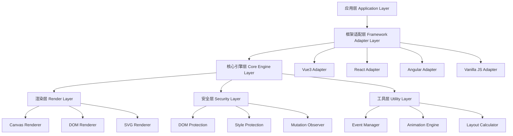
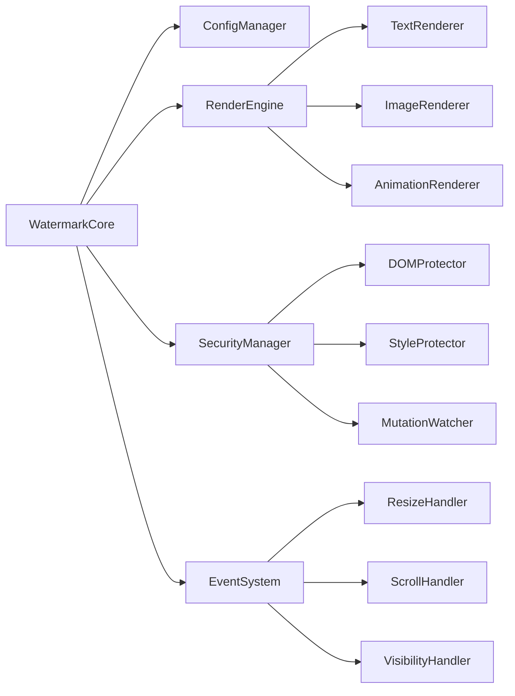
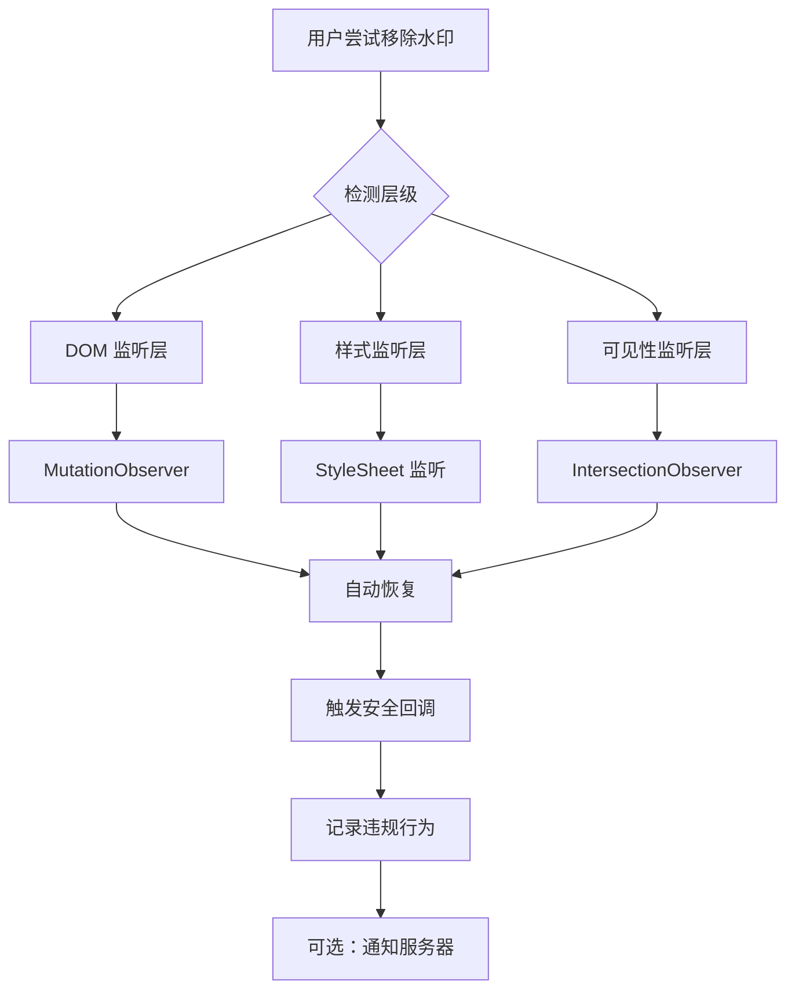

# 水印系统设计文档

## 概述

本设计文档描述了一个跨框架的水印系统架构，该系统提供文本水印、图片水印、动态水印等功能，具备安全防护
能力，并深度集成 Vue3 生态系统。系统采用模块化设计，支持多种使用方式和部署场景。

## 架构

### 整体架构



### 核心模块架构



## 组件和接口

### 核心类设计

#### WatermarkCore 类

```typescript
class WatermarkCore {
  private config: WatermarkConfig
  private renderer: BaseRenderer
  private security: SecurityManager
  private eventSystem: EventSystem

  constructor(config: WatermarkConfig)
  create(container: HTMLElement): WatermarkInstance
  destroy(instance: WatermarkInstance): void
  update(instance: WatermarkInstance, config: Partial<WatermarkConfig>): void

  // 安全相关方法
  enableSecurity(level: SecurityLevel): void
  onSecurityViolation(callback: SecurityCallback): void
}
```

#### 配置接口

```typescript
interface WatermarkConfig {
  // 基础配置
  content: string | string[] | HTMLImageElement
  container?: HTMLElement | string

  // 样式配置
  style: {
    fontSize?: number
    fontFamily?: string
    fontWeight?: string | number
    color?: string
    opacity?: number
    rotate?: number
  }

  // 布局配置
  layout: {
    width?: number
    height?: number
    gapX?: number
    gapY?: number
    offsetX?: number
    offsetY?: number
  }

  // 动画配置
  animation?: {
    type: 'rotate' | 'move' | 'fade' | 'pulse'
    duration?: number
    delay?: number
    iteration?: number | 'infinite'
  }

  // 安全配置
  security?: {
    level: 'none' | 'basic' | 'advanced'
    onViolation?: SecurityCallback
    mutationObserver?: boolean
    styleProtection?: boolean
  }

  // 响应式配置
  responsive?: {
    breakpoints?: Record<string, Partial<WatermarkConfig>>
    autoResize?: boolean
    debounceTime?: number
  }
}
```

### Vue3 集成组件

#### Provider 组件

```typescript
// WatermarkProvider.vue
interface WatermarkProviderProps {
  config?: WatermarkConfig
  globalSecurity?: boolean
}

const WatermarkProvider = defineComponent<WatermarkProviderProps>({
  setup(props, { slots }) {
    const watermarkC
  it('应该能响应 props 变化', () => {})
    it('应该能正确处理插槽内容', () => {})
  })

  describe('v-watermark 指令', () => {
    it('应该能通过指令创建水印', () => {})
    it('应该能通过修饰符启用安全模式', () => {})
    it('应该能在元素移除时自动清理', () => {})
  })
})
```

### 端到端测试

```typescript
describe('水印系统 E2E 测试', () => {
  it('应该能在真实浏览器环境中正常工作', () => {})
  it('应该能抵御常见的水印移除攻击', () => {})
  it('应该能在不同设备尺寸下正确显示', () => {})
  it('应该能与其他UI库兼容', () => {})
})
```

### 性能测试

```typescript
describe('性能测试', () => {
  it('创建大量水印时性能应该可接受', () => {})
  it('动画播放时CPU使用率应该合理', () => {})
  it('内存使用应该稳定，无内存泄漏', () => {})
  it('响应式调整应该流畅', () => {})
})
```

## 安全设计

### 多层防护机制



### 安全策略实现

```typescript
class SecurityManager {
  private watchers: Map<string, SecurityWatcher> = new Map()
  private violationHistory: SecurityViolation[] = []

  enableProtection(instance: WatermarkInstance, level: SecurityLevel) {
    switch (level) {
      case 'basic':
        this.enableDOMProtection(instance)
        break
      case 'advanced':
        this.enableDOMProtection(instance)
        this.enableStyleProtection(instance)
        this.enableCanvasProtection(instance)
        this.enableObfuscation(instance)
        break
    }
  }

  private enableDOMProtection(instance: WatermarkInstance) {
    const observer = new MutationObserver(mutations => {
      mutations.forEach(mutation => {
        if (mutation.type === 'childList') {
          mutation.removedNodes.forEach(node => {
            if (this.isWatermarkElement(node, instance)) {
              this.handleViolation({
                type: 'dom_removal',
                target: node as HTMLElement,
                timestamp: Date.now(),
                details: { mutation },
              })
              this.recoverWatermark(instance)
            }
          })
        }
      })
    })

    observer.observe(instance.container, {
      childList: true,
      subtree: true,
    })

    this.watchers.set(`dom_${instance.id}`, {
      type: 'mutation',
      observer,
      callback: this.handleViolation.bind(this),
      isActive: true,
    })
  }

  private enableStyleProtection(instance: WatermarkInstance) {
    // 监听样式表变化
    const styleObserver = new MutationObserver(mutations => {
      mutations.forEach(mutation => {
        if (mutation.type === 'attributes' && mutation.attributeName === 'style') {
          const target = mutation.target as HTMLElement
          if (this.isWatermarkElement(target, instance)) {
            this.validateWatermarkStyle(target, instance)
          }
        }
      })
    })

    instance.elements.forEach(element => {
      styleObserver.observe(element, {
        attributes: true,
        attributeFilter: ['style', 'class'],
      })
    })
  }

  private enableCanvasProtection(instance: WatermarkInstance) {
    // 使用 Canvas 绘制水印，增加移除难度
    const canvas = document.createElement('canvas')
    const ctx = canvas.getContext('2d')!

    // 绘制水印到 Canvas
    this.drawWatermarkToCanvas(ctx, instance.config)

    // 将 Canvas 转换为背景图片
    const dataURL = canvas.toDataURL()
    instance.container.style.backgroundImage = `url(${dataURL})`
    instance.container.style.backgroundRepeat = 'repeat'
  }

  private enableObfuscation(instance: WatermarkInstance) {
    // DOM 结构混淆
    instance.elements.forEach(element => {
      // 随机化类名和ID
      element.className = this.generateObfuscatedClassName()
      element.id = this.generateObfuscatedId()

      // 添加干扰元素
      this.addDecoyElements(element)
    })
  }
}
```

## 渲染引擎设计

### 多渲染器架构

```typescript
abstract class BaseRenderer {
  abstract render(config: WatermarkConfig, context: RenderContext): HTMLElement[]
  abstract update(elements: HTMLElement[], config: WatermarkConfig): void
  abstract destroy(elements: HTMLElement[]): void

  protected calculateLayout(config: WatermarkConfig, containerRect: DOMRect) {
    // 通用布局计算逻辑
  }

  protected applyAnimation(element: HTMLElement, animation: AnimationConfig) {
    // 通用动画应用逻辑
  }
}

class DOMRenderer extends BaseRenderer {
  render(config: WatermarkConfig, context: RenderContext): HTMLElement[] {
    const elements: HTMLElement[] = []
    const layout = this.calculateLayout(config, context.containerRect)

    for (let row = 0; row < layout.rows; row++) {
      for (let col = 0; col < layout.cols; col++) {
        const element = this.createWatermarkElement(config, row, col)
        elements.push(element)
      }
    }

    return elements
  }

  private createWatermarkElement(config: WatermarkConfig, row: number, col: number): HTMLElement {
    const element = document.createElement('div')
    element.className = 'watermark-item'

    // 设置内容
    if (typeof config.content === 'string') {
      element.textContent = config.content
    } else if (Array.isArray(config.content)) {
      element.innerHTML = config.content.join('<br>')
    }

    // 应用样式
    this.applyStyles(element, config, row, col)

    // 应用动画
    if (config.animation) {
      this.applyAnimation(element, config.animation)
    }

    return element
  }
}

class CanvasRenderer extends BaseRenderer {
  private canvas: HTMLCanvasElement
  private ctx: CanvasRenderingContext2D

  constructor() {
    super()
    this.canvas = document.createElement('canvas')
    this.ctx = this.canvas.getContext('2d')!
  }

  render(config: WatermarkConfig, context: RenderContext): HTMLElement[] {
    this.setupCanvas(context.containerRect)
    this.drawWatermarks(config, context)

    const wrapper = document.createElement('div')
    wrapper.className = 'watermark-canvas-wrapper'
    wrapper.appendChild(this.canvas)

    return [wrapper]
  }

  private drawWatermarks(config: WatermarkConfig, context: RenderContext) {
    const layout = this.calculateLayout(config, context.containerRect)

    this.ctx.save()
    this.applyCanvasStyles(config)

    for (let row = 0; row < layout.rows; row++) {
      for (let col = 0; col < layout.cols; col++) {
        this.drawSingleWatermark(config, row, col, layout)
      }
    }

    this.ctx.restore()
  }
}

class SVGRenderer extends BaseRenderer {
  render(config: WatermarkConfig, context: RenderContext): HTMLElement[] {
    const svg = document.createElementNS('http://www.w3.org/2000/svg', 'svg')
    const layout = this.calculateLayout(config, context.containerRect)

    svg.setAttribute('width', context.containerRect.width.toString())
    svg.setAttribute('height', context.containerRect.height.toString())
    svg.setAttribute('class', 'watermark-svg')

    // 创建图案定义
    const defs = document.createElementNS('http://www.w3.org/2000/svg', 'defs')
    const pattern = this.createWatermarkPattern(config, layout)
    defs.appendChild(pattern)
    svg.appendChild(defs)

    // 应用图案
    const rect = document.createElementNS('http://www.w3.org/2000/svg', 'rect')
    rect.setAttribute('width', '100%')
    rect.setAttribute('height', '100%')
    rect.setAttribute('fill', `url(#${pattern.id})`)
    svg.appendChild(rect)

    return [svg]
  }
}
```

## 动画系统设计

### 动画引擎

```typescript
class AnimationEngine {
  private animations: Map<string, AnimationInstance> = new Map()

  createAnimation(element: HTMLElement, config: AnimationConfig, onComplete?: () => void): string {
    const id = this.generateAnimationId()
    const animation = new AnimationInstance(element, config, onComplete)

    this.animations.set(id, animation)
    animation.start()

    return id
  }

  pauseAnimation(id: string) {
    const animation = this.animations.get(id)
    animation?.pause()
  }

  resumeAnimation(id: string) {
    const animation = this.animations.get(id)
    animation?.resume()
  }

  stopAnimation(id: string) {
    const animation = this.animations.get(id)
    if (animation) {
      animation.stop()
      this.animations.delete(id)
    }
  }
}

class AnimationInstance {
  private startTime: number = 0
  private pausedTime: number = 0
  private animationFrame?: number
  private isPlaying: boolean = false
  private isPaused: boolean = false

  constructor(
    private element: HTMLElement,
    private config: AnimationConfig,
    private onComplete?: () => void
  ) {}

  start() {
    this.isPlaying = true
    this.startTime = performance.now()
    this.animate()
  }

  private animate = () => {
    if (!this.isPlaying) return

    const currentTime = performance.now()
    const elapsed = currentTime - this.startTime - this.pausedTime
    const progress = Math.min(elapsed / this.config.duration, 1)

    this.applyAnimation(progress)

    if (progress < 1) {
      this.animationFrame = requestAnimationFrame(this.animate)
    } else {
      this.complete()
    }
  }

  private applyAnimation(progress: number) {
    const eased = this.easeFunction(progress)

    switch (this.config.type) {
      case 'rotate':
        this.element.style.transform = `rotate(${eased * 360}deg)`
        break
      case 'fade':
        this.element.style.opacity = (0.3 + eased * 0.7).toString()
        break
      case 'move':
        const x = Math.sin(eased * Math.PI * 2) * 10
        const y = Math.cos(eased * Math.PI * 2) * 10
        this.element.style.transform = `translate(${x}px, ${y}px)`
        break
      case 'pulse':
        const scale = 0.8 + Math.sin(eased * Math.PI * 4) * 0.2
        this.element.style.transform = `scale(${scale})`
        break
    }
  }

  private easeFunction(t: number): number {
    // 缓动函数 - 可以根据需要选择不同的缓动类型
    return t * t * (3 - 2 * t) // smoothstep
  }
}
```

## 响应式系统设计

### 响应式管理器

```typescript
class ResponsiveManager {
  private breakpoints: Map<string, number> = new Map([
    ['xs', 0],
    ['sm', 576],
    ['md', 768],
    ['lg', 992],
    ['xl', 1200],
    ['xxl', 1400],
  ])

  private observers: Map<string, ResizeObserver> = new Map()
  private currentBreakpoint: string = 'lg'

  observeContainer(
    container: HTMLElement,
    instance: WatermarkInstance,
    callback: (breakpoint: string) => void
  ) {
    const observer = new ResizeObserver(entries => {
      for (const entry of entries) {
        const { width } = entry.contentRect
        const newBreakpoint = this.getBreakpoint(width)

        if (newBreakpoint !== this.currentBreakpoint) {
          this.currentBreakpoint = newBreakpoint
          callback(newBreakpoint)
        }

        // 重新计算布局
        this.recalculateLayout(instance, entry.contentRect)
      }
    })

    observer.observe(container)
    this.observers.set(instance.id, observer)
  }

  private getBreakpoint(width: number): string {
    let currentBreakpoint = 'xs'

    for (const [name, minWidth] of this.breakpoints) {
      if (width >= minWidth) {
        currentBreakpoint = name
      }
    }

    return currentBreakpoint
  }

  private recalculateLayout(instance: WatermarkInstance, rect: DOMRect) {
    // 根据新的容器尺寸重新计算水印布局
    const newContext = {
      ...instance.renderContext,
      containerRect: rect,
    }

    // 更新渲染上下文
    instance.renderContext = newContext

    // 重新渲染水印
    instance.renderer.update(instance.elements, instance.config)
  }
}
```

这个设计文档涵盖了：

1. **整体架构**：分层设计，模块化架构
2. **核心组件**：WatermarkCore 类、配置接口、渲染引擎
3. **Vue3 集成**：Provider、Hook、Component、Directive、Plugin
4. **数据模型**：实例模型、渲染上下文、安全监控
5. **错误处理**：错误类型、处理策略
6. **测试策略**：单元测试、集成测试、E2E 测试、性能测试
7. **安全设计**：多层防护机制、安全策略实现
8. **渲染引擎**：DOM、Canvas、SVG 多种渲染器
9. **动画系统**：动画引擎、动画实例管理
10. **响应式系统**：断点管理、自适应布局

<function_calls> <invoke name="userInput"> <parameter name="question">**设计文档是否符合你的期望？这
个设计涵盖了所有需求中的功能点，包括跨框架支持、Vue3 深度集成、安全防护、动画系统等。如果满意，我们
可以继续创建实现任务列表。**
