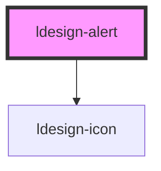

# ldesign-alert

Alert 警告信息组件

```html path=null start=null
<!-- 基础用法 -->
<ldesign-alert type="success" alert-title="Success Tips">操作成功的提示。</ldesign-alert>

<!-- 带描述与操作 -->
<ldesign-alert type="warning" alert-title="Warning Text">
  <span>这是一个带操作的警告信息。</span>
  <ldesign-button slot="actions" type="primary" size="small">了解更多</ldesign-button>
</ldesign-alert>
```

<!-- Auto Generated Below -->


## Overview

Alert 警告信息
用于在页面中展示重要的提示信息，支持四种状态、标题/描述、操作区与可关闭。

## Properties

| Property              | Attribute                | Description                   | Type                                          | Default     |
| --------------------- | ------------------------ | ----------------------------- | --------------------------------------------- | ----------- |
| `alertTitle`          | `alert-title`            | 标题（避开标准 HTMLElement.title 冲突） | `string`                                      | `undefined` |
| `banner`              | `banner`                 | 横幅样式（常用于页面顶部）                 | `boolean`                                     | `false`     |
| `closable`            | `closable`               | 是否显示关闭按钮                      | `boolean`                                     | `false`     |
| `description`         | `description`            | 描述（也可通过默认 slot 自定义内容）         | `string`                                      | `undefined` |
| `marquee`             | `marquee`                | 启用滚动公告（Marquee）               | `boolean`                                     | `false`     |
| `marqueeDirection`    | `marquee-direction`      | 方向                            | `"left" \| "right"`                           | `'left'`    |
| `marqueeGap`          | `marquee-gap`            | 两段内容之间的间距（px）                 | `number`                                      | `24`        |
| `marqueePauseOnHover` | `marquee-pause-on-hover` | 悬停时是否暂停                       | `boolean`                                     | `true`      |
| `marqueeSpeed`        | `marquee-speed`          | 滚动速度（px/s）                    | `number`                                      | `60`        |
| `showIcon`            | `show-icon`              | 是否显示图标                        | `boolean`                                     | `true`      |
| `type`                | `type`                   | 警告类型                          | `"error" \| "info" \| "success" \| "warning"` | `'info'`    |


## Events

| Event          | Description | Type                |
| -------------- | ----------- | ------------------- |
| `ldesignClose` | 关闭事件        | `CustomEvent<void>` |


## Methods

### `close() => Promise<void>`

手动关闭（带高度收起动画）

#### Returns

Type: `Promise<void>`


## Dependencies

### Depends on

- [ldesign-icon](../icon)

### Graph


----------------------------------------------

*Built with [StencilJS](https://stenciljs.com/)*
