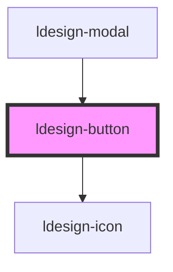

# ldesign-button

<!-- Auto Generated Below -->

## Overview

Button 按钮组件
用于触发操作或导航

## Properties

| Property   | Attribute  | Description | Type                                                          | Default       |
| ---------- | ---------- | ----------- | ------------------------------------------------------------- | ------------- |
| `block`    | `block`    | 是否为块级按钮     | `boolean`                                                     | `false`       |
| `disabled` | `disabled` | 是否禁用        | `boolean`                                                     | `false`       |
| `icon`     | `icon`     | 图标名称        | `string`                                                      | `undefined`   |
| `loading`  | `loading`  | 是否加载中       | `boolean`                                                     | `false`       |
| `shape`    | `shape`    | 按钮形状        | `"circle" \| "rectangle" \| "round"`                          | `'rectangle'` |
| `size`     | `size`     | 按钮尺寸        | `"large" \| "medium" \| "small"`                              | `'medium'`    |
| `type`     | `type`     | 按钮类型        | `"danger" \| "outline" \| "primary" \| "secondary" \| "text"` | `'primary'`   |

## Events

| Event          | Description | Type                      |
| -------------- | ----------- | ------------------------- |
| `ldesignClick` | 点击事件        | `CustomEvent<MouseEvent>` |

## Dependencies

### Used by

 - [ldesign-modal](../modal)

### Depends on

- [ldesign-icon](../icon)

### Graph

----------------------------------------------

*Built with [StencilJS](https://stenciljs.com/)*
