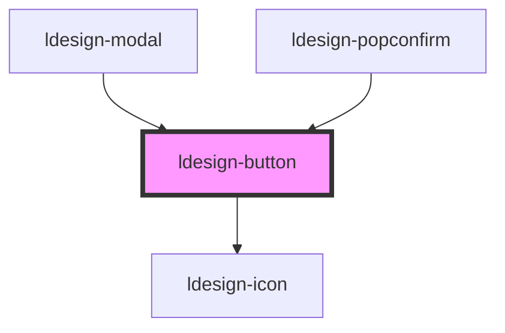

# ldesign-button

## 使用示例

- 新增形状：square 正方形（适合纯图标按钮）
```html path=null start=null
<ldesign-button shape="square" size="small" icon="heart" aria-label="喜欢"></ldesign-button>
```

- 新增类型：success、warning
```html path=null start=null
<ldesign-button type="success">成功</ldesign-button>
<ldesign-button type="warning">警告</ldesign-button>
```

- 新样式：link、dashed
```html path=null start=null
<ldesign-button type="link">查看详情</ldesign-button>
<ldesign-button type="dashed">更多</ldesign-button>
```

- 新配置：icon-position、native-type
```html path=null start=null
<ldesign-button icon="arrow-right" icon-position="right">下一步</ldesign-button>
<ldesign-button native-type="submit" type="primary">提交</ldesign-button>
```

> 下方为自动生成的属性与事件文档，构建后会自动更新。

<!-- Auto Generated Below -->


## Overview

Button 按钮组件
用于触发操作或导航

## Properties

| Property       | Attribute       | Description                      | Type                                                                                                          | Default       |
| -------------- | --------------- | -------------------------------- | ------------------------------------------------------------------------------------------------------------- | ------------- |
| `block`        | `block`         | 是否为块级按钮                          | `boolean`                                                                                                     | `false`       |
| `disabled`     | `disabled`      | 是否禁用                             | `boolean`                                                                                                     | `false`       |
| `icon`         | `icon`          | 图标名称                             | `string`                                                                                                      | `undefined`   |
| `iconPosition` | `icon-position` | 图标位置：left \| right               | `"left" \| "right"`                                                                                           | `'left'`      |
| `loading`      | `loading`       | 是否加载中                            | `boolean`                                                                                                     | `false`       |
| `nativeType`   | `native-type`   | 原生按钮类型：button \| submit \| reset | `"button" \| "reset" \| "submit"`                                                                             | `'button'`    |
| `shape`        | `shape`         | 按钮形状                             | `"circle" \| "rectangle" \| "round" \| "square"`                                                              | `'rectangle'` |
| `size`         | `size`          | 按钮尺寸                             | `"large" \| "medium" \| "small"`                                                                              | `'medium'`    |
| `type`         | `type`          | 按钮类型                             | `"danger" \| "dashed" \| "link" \| "outline" \| "primary" \| "secondary" \| "success" \| "text" \| "warning"` | `'primary'`   |


## Events

| Event          | Description | Type                      |
| -------------- | ----------- | ------------------------- |
| `ldesignClick` | 点击事件        | `CustomEvent<MouseEvent>` |


## Dependencies

### Used by

 - [ldesign-modal](../modal)
 - [ldesign-popconfirm](../popconfirm)

### Depends on

- [ldesign-icon](../icon)

### Graph


----------------------------------------------

*Built with [StencilJS](https://stenciljs.com/)*
