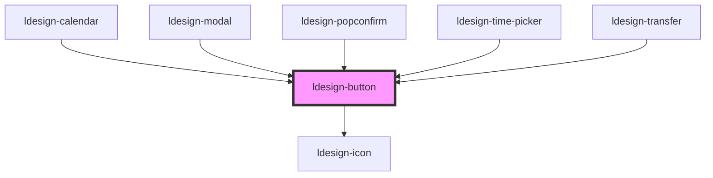

# ldesign-button

## 使用示例

- 新增形状：square 正方形（适合纯图标按钮）
```html path=null start=null
<ldesign-button shape="square" size="small" icon="heart" aria-label="喜欢"></ldesign-button>
```

- 语义类型（实底）：primary / success / warning / danger / secondary
```html path=null start=null
<ldesign-button type="primary">填充按钮</ldesign-button>
<ldesign-button type="success">填充按钮</ldesign-button>
<ldesign-button type="warning">填充按钮</ldesign-button>
<ldesign-button type="danger">填充按钮</ldesign-button>
<ldesign-button type="secondary">填充按钮</ldesign-button>
```

- 新增：渐变按钮（支持 color 语义和变形 shape）
```html path=null start=null
<ldesign-button type="gradient">Gradient Primary</ldesign-button>
<ldesign-button type="gradient" color="success">Gradient Success</ldesign-button>
<ldesign-button type="gradient" color="warning">Gradient Warning</ldesign-button>
<ldesign-button type="gradient" color="danger">Gradient Danger</ldesign-button>

<!-- 形状变体示例 -->
<ldesign-button type="gradient" shape="round">圆角渐变</ldesign-button>
<ldesign-button type="gradient" shape="circle" icon="heart" aria-label="喜欢"></ldesign-button>
<ldesign-button type="gradient" shape="square" icon="star" aria-label="收藏"></ldesign-button>
```

- 形态与颜色解耦：给 outline / dashed / text / link 指定 color
```html path=null start=null
<ldesign-button type="outline" color="primary">描边按钮</ldesign-button>
<ldesign-button type="outline" color="success">描边按钮</ldesign-button>
<ldesign-button type="outline" color="warning">描边按钮</ldesign-button>
<ldesign-button type="outline" color="danger">描边按钮</ldesign-button>
<ldesign-button type="outline" color="default">描边按钮</ldesign-button>

<ldesign-button type="dashed" color="primary">虚框按钮</ldesign-button>
<ldesign-button type="dashed" color="success">虚框按钮</ldesign-button>
<ldesign-button type="dashed" color="warning">虚框按钮</ldesign-button>
<ldesign-button type="dashed" color="danger">虚框按钮</ldesign-button>
<ldesign-button type="dashed" color="default">虚框按钮</ldesign-button>

<ldesign-button type="text" color="primary">文字按钮</ldesign-button>
<ldesign-button type="text" color="success">文字按钮</ldesign-button>
<ldesign-button type="text" color="warning">文字按钮</ldesign-button>
<ldesign-button type="text" color="danger">文字按钮</ldesign-button>
<ldesign-button type="text" color="default">文字按钮</ldesign-button>
```

- 幽灵按钮（适合深色背景）
```html path=null start=null
<div style="background:#121212;padding:20px">
  <ldesign-button ghost color="default">幽灵按钮</ldesign-button>
  <ldesign-button ghost color="primary">幽灵按钮</ldesign-button>
  <ldesign-button ghost color="success">幽灵按钮</ldesign-button>
<ldesign-button ghost color="warning">幽灵按钮</ldesign-button>
<ldesign-button ghost color="danger">幽灵按钮</ldesign-button>
</div>
```

- 新配置：icon-position、native-type
```html path=null start=null
<ldesign-button icon="arrow-right" icon-position="right">下一步</ldesign-button>
<ldesign-button native-type="submit" type="primary">提交</ldesign-button>
```

> 下方为自动生成的属性与事件文档，构建后会自动更新。

<!-- Auto Generated Below -->


## Overview

Button 按钮组件
用于触发操作或导航

## Properties

| Property       | Attribute       | Description                             | Type                                                                                                                                     | Default       |
| -------------- | --------------- | --------------------------------------- | ---------------------------------------------------------------------------------------------------------------------------------------- | ------------- |
| `block`        | `block`         | 是否为块级按钮                                 | `boolean`                                                                                                                                | `false`       |
| `color`        | `color`         | 语义颜色（用于 outline/dashed/text/link/ghost） | `"danger" \| "default" \| "primary" \| "success" \| "warning"`                                                                           | `'primary'`   |
| `danger`       | `danger`        | 危险态（AntD 风格）                            | `boolean`                                                                                                                                | `false`       |
| `disabled`     | `disabled`      | 是否禁用                                    | `boolean`                                                                                                                                | `false`       |
| `ghost`        | `ghost`         | 幽灵按钮（一般用于深色背景）                          | `boolean`                                                                                                                                | `false`       |
| `htmlType`     | `html-type`     | 对齐 AntD：htmlType 优先；nativeType 兼容       | `"button" \| "reset" \| "submit"`                                                                                                        | `undefined`   |
| `icon`         | `icon`          | 图标名称                                    | `string`                                                                                                                                 | `undefined`   |
| `iconPosition` | `icon-position` | 图标位置：left \| right                      | `"left" \| "right"`                                                                                                                      | `'left'`      |
| `loading`      | `loading`       | 是否加载中                                   | `boolean`                                                                                                                                | `false`       |
| `nativeType`   | `native-type`   |                                         | `"button" \| "reset" \| "submit"`                                                                                                        | `'button'`    |
| `shape`        | `shape`         | 按钮形状                                    | `"circle" \| "rectangle" \| "round" \| "square"`                                                                                         | `'rectangle'` |
| `size`         | `size`          | 按钮尺寸                                    | `"large" \| "medium" \| "middle" \| "small"`                                                                                             | `'middle'`    |
| `type`         | `type`          | 按钮类型                                    | `"danger" \| "dashed" \| "default" \| "gradient" \| "link" \| "outline" \| "primary" \| "secondary" \| "success" \| "text" \| "warning"` | `'default'`   |


## Events

| Event          | Description | Type                      |
| -------------- | ----------- | ------------------------- |
| `ldesignClick` | 点击事件        | `CustomEvent<MouseEvent>` |


## Dependencies

### Used by

 - [ldesign-calendar](../calendar)
 - [ldesign-modal](../modal)
 - [ldesign-popconfirm](../popconfirm)
 - [ldesign-time-picker](../time-picker)
 - [ldesign-transfer](../transfer)

### Depends on

- [ldesign-icon](../icon)

### Graph


----------------------------------------------

*Built with [StencilJS](https://stenciljs.com/)*
