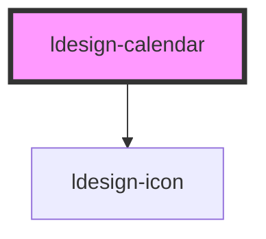

# ldesign-calendar

<!-- Auto Generated Below -->

## Properties

| Property          | Attribute           | Description | Type                              | Default        |
| ----------------- | ------------------- | ----------- | --------------------------------- | -------------- |
| `defaultValue`    | `default-value`     |             | `string`                          | `undefined`    |
| `disabledDate`    | `disabled-date`     |             | `(d: Date) => boolean`            | `undefined`    |
| `firstDayOfWeek`  | `first-day-of-week` |             | `0 \| 1 \| 2 \| 3 \| 4 \| 5 \| 6` | `1`            |
| `format`          | `format`            |             | `string`                          | `'YYYY-MM-DD'` |
| `maxDate`         | `max-date`          |             | `string`                          | `undefined`    |
| `minDate`         | `min-date`          |             | `string`                          | `undefined`    |
| `showWeekNumbers` | `show-week-numbers` |             | `boolean`                         | `false`        |
| `value`           | `value`             |             | `string`                          | `undefined`    |

## Events

| Event           | Description | Type                  |
| --------------- | ----------- | --------------------- |
| `ldesignChange` |             | `CustomEvent<string>` |

## Dependencies

### Depends on

- [ldesign-icon](../icon)

### Graph

----------------------------------------------

*Built with [StencilJS](https://stenciljs.com/)*
