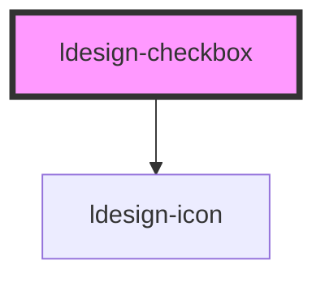

# ldesign-checkbox

<!-- Auto Generated Below -->

## Overview

Checkbox 复选框组件
在一组备选项中进行多选

## Properties

| Property        | Attribute       | Description    | Type                             | Default     |
| --------------- | --------------- | -------------- | -------------------------------- | ----------- |
| `border`        | `border`        | 是否显示边框         | `boolean`                        | `false`     |
| `button`        | `button`        | 是否为按钮样式        | `boolean`                        | `false`     |
| `checked`       | `checked`       | 是否选中           | `boolean`                        | `false`     |
| `disabled`      | `disabled`      | 是否禁用           | `boolean`                        | `false`     |
| `indeterminate` | `indeterminate` | 设置半选状态，只负责样式控制 | `boolean`                        | `false`     |
| `size`          | `size`          | 多选框的尺寸         | `"large" \| "medium" \| "small"` | `'medium'`  |
| `value`         | `value`         | 选中状态的值         | `number \| string`               | `undefined` |

## Events

| Event           | Description  | Type                   |
| --------------- | ------------ | ---------------------- |
| `ldesignChange` | 当绑定值变化时触发的事件 | `CustomEvent<boolean>` |

## Dependencies

### Depends on

- [ldesign-icon](../icon)

### Graph

----------------------------------------------

*Built with [StencilJS](https://stenciljs.com/)*
