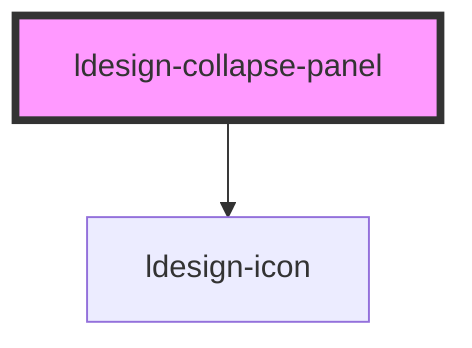

# ldesign-collapse-panel

<!-- Auto Generated Below -->

## Overview

CollapsePanel 折叠面板项

## Properties

| Property              | Attribute               | Description               | Type                | Default           |
| --------------------- | ----------------------- | ------------------------- | ------------------- | ----------------- |
| `active`              | `active`                | 激活状态（由父级控制）               | `boolean`           | `false`           |
| `destroyOnClose`      | `destroy-on-close`      | 收起后是否销毁内容（优先级高于 lazy）     | `boolean`           | `false`           |
| `disabled`            | `disabled`              | 禁用                        | `boolean`           | `false`           |
| `expandIcon`          | `expand-icon`           | 展开图标名称（默认 chevron-right）  | `string`            | `'chevron-right'` |
| `expandIconPlacement` | `expand-icon-placement` | 图标位置（由父级传入，也可单独覆盖）        | `"left" \| "right"` | `'left'`          |
| `extra`               | `extra`                 | 右侧附加区（可用 slot="extra" 覆盖） | `string`            | `undefined`       |
| `header`              | `header`                | 头部文本（可用 slot="header" 覆盖） | `string`            | `undefined`       |
| `lazy`                | `lazy`                  | 首次激活才渲染内容（懒渲染）            | `boolean`           | `false`           |
| `name`                | `name`                  | 面板唯一标识（由父级匹配）             | `string`            | `undefined`       |

## Events

| Event                       | Description | Type                             |
| --------------------------- | ----------- | -------------------------------- |
| `ldesignCollapseItemToggle` | 冒泡给父级，用于切换  | `CustomEvent<{ name: string; }>` |

## Dependencies

### Depends on

- [ldesign-icon](../icon)

### Graph

----------------------------------------------

*Built with [StencilJS](https://stenciljs.com/)*
