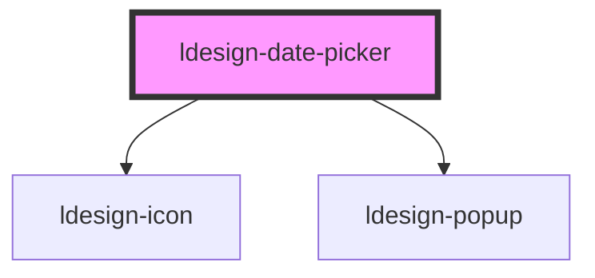

# ldesign-date-picker

<!-- Auto Generated Below -->

## Properties

| Property          | Attribute           | Description | Type                                                 | Default        |
| ----------------- | ------------------- | ----------- | ---------------------------------------------------- | -------------- |
| `clearable`       | `clearable`         |             | `boolean`                                            | `true`         |
| `defaultValue`    | `default-value`     |             | `string`                                             | `undefined`    |
| `disabled`        | `disabled`          |             | `boolean`                                            | `false`        |
| `disabledDate`    | `disabled-date`     |             | `(d: Date) => boolean`                               | `undefined`    |
| `firstDayOfWeek`  | `first-day-of-week` |             | `0 \| 1 \| 2 \| 3 \| 4 \| 5 \| 6`                    | `1`            |
| `format`          | `format`            |             | `string`                                             | `'YYYY-MM-DD'` |
| `maxDate`         | `max-date`          |             | `string`                                             | `undefined`    |
| `minDate`         | `min-date`          |             | `string`                                             | `undefined`    |
| `mode`            | `mode`              |             | `"date" \| "month" \| "quarter" \| "week" \| "year"` | `'date'`       |
| `placeholder`     | `placeholder`       |             | `string`                                             | `'请选择日期'`      |
| `showWeekNumbers` | `show-week-numbers` |             | `boolean`                                            | `false`        |
| `value`           | `value`             |             | `string`                                             | `undefined`    |

## Events

| Event                  | Description | Type                   |
| ---------------------- | ----------- | ---------------------- |
| `ldesignChange`        |             | `CustomEvent<any>`     |
| `ldesignVisibleChange` |             | `CustomEvent<boolean>` |

## Dependencies

### Depends on

- [ldesign-icon](../icon)
- [ldesign-popup](../popup)

### Graph

----------------------------------------------

*Built with [StencilJS](https://stenciljs.com/)*
