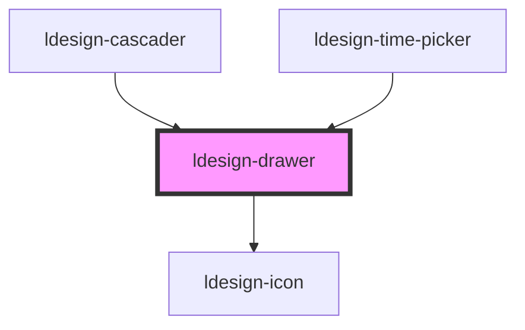

# ldesign-drawer

<!-- Auto Generated Below -->

## Overview

Drawer 抽屉组件
从屏幕边缘滑出一个面板，常用于显示导航、表单或详情

## Properties

| Property             | Attribute             | Description                                            | Type                                     | Default     |
| -------------------- | --------------------- | ------------------------------------------------------ | ---------------------------------------- | ----------- |
| `animation`          | `animation`           | 是否显示进入/退出动画                                            | `boolean`                                | `true`      |
| `animationDuration`  | `animation-duration`  | 动画持续时间（毫秒）                                             | `number`                                 | `300`       |
| `autoFocus`          | `auto-focus`          | 自动聚焦到第一个可交互元素                                          | `boolean`                                | `true`      |
| `beforeClose`        | `before-close`        | 关闭前的钩子（返回false阻止关闭）                                    | `() => boolean \| Promise<boolean>`      | `undefined` |
| `bodyPadding`        | `body-padding`        | 内容区域内边距                                                | `boolean \| string`                      | `true`      |
| `borderRadius`       | `border-radius`       | 圆角大小                                                   | `string`                                 | `'12px'`    |
| `closable`           | `closable`            | 是否显示右上角关闭按钮                                            | `boolean`                                | `true`      |
| `closeOnEsc`         | `close-on-esc`        | 是否允许按下 ESC 关闭                                          | `boolean`                                | `true`      |
| `contentBorder`      | `content-border`      | 是否显示内容区域边框                                             | `boolean`                                | `false`     |
| `contentShadow`      | `content-shadow`      | 是否启用内容区域阴影                                             | `boolean`                                | `false`     |
| `customClass`        | `custom-class`        | 自定义类名                                                  | `string`                                 | `''`        |
| `damping`            | `damping`             | 是否启用阻尼效果                                               | `boolean`                                | `true`      |
| `dampingFactor`      | `damping-factor`      | 阻尼系数（0-1）                                              | `number`                                 | `0.5`       |
| `darkMode`           | `dark-mode`           | 是否启用暗黑模式                                               | `boolean`                                | `false`     |
| `drawerTitle`        | `drawer-title`        | 标题文本（可通过 slot=header 自定义头部）                            | `string`                                 | `undefined` |
| `footerBorder`       | `footer-border`       | 是否显示底部分割线                                              | `boolean`                                | `true`      |
| `footerButtons`      | `footer-buttons`      | 自定义底部按钮                                                | `DrawerButton[]`                         | `[]`        |
| `fullscreen`         | `fullscreen`          | 是否全屏显示                                                 | `boolean`                                | `false`     |
| `fullscreenable`     | `fullscreenable`      | 是否可以全屏切换                                               | `boolean`                                | `false`     |
| `getContainer`       | `get-container`       | 容器（选择器或元素）：若提供，则把组件节点移动到该容器下                           | `HTMLElement \| string`                  | `undefined` |
| `handleHeight`       | `handle-height`       | 拖动手柄的高度（像素，用于 handle 模式）                               | `number`                                 | `40`        |
| `headerBorder`       | `header-border`       | 是否显示头部分割线                                              | `boolean`                                | `true`      |
| `headerConfig`       | `header-config`       | 头部高级配置                                                 | `HeaderConfig`                           | `{}`        |
| `keyboardNavigation` | `keyboard-navigation` | 是否启用键盘导航                                               | `boolean`                                | `true`      |
| `lazyLoad`           | `lazy-load`           | 内容延迟加载（毫秒）                                             | `number`                                 | `0`         |
| `level`              | `level`               | 抽屉层级模式（normal \| high \| top）                          | `"high" \| "normal" \| "top"`            | `'normal'`  |
| `loading`            | `loading`             | 加载状态配置                                                 | `LoadingConfig \| boolean`               | `false`     |
| `mask`               | `mask`                | 是否显示遮罩层                                                | `boolean`                                | `true`      |
| `maskClosable`       | `mask-closable`       | 点击遮罩是否关闭                                               | `boolean`                                | `true`      |
| `maxSize`            | `max-size`            | 最大尺寸（像素或百分比）                                           | `number \| string`                       | `'80%'`     |
| `minSize`            | `min-size`            | 最小尺寸（像素或百分比）                                           | `number \| string`                       | `200`       |
| `minimizable`        | `minimizable`         | 是否显示最小化按钮                                              | `boolean`                                | `false`     |
| `minimized`          | `minimized`           | 是否处于最小化状态                                              | `boolean`                                | `false`     |
| `onOpen`             | `on-open`             | 打开时的回调                                                 | `() => void \| Promise<void>`            | `undefined` |
| `placement`          | `placement`           | 抽屉出现的位置                                                | `"bottom" \| "left" \| "right" \| "top"` | `'right'`   |
| `preserveState`      | `preserve-state`      | 是否在关闭时保留状态                                             | `boolean`                                | `false`     |
| `progressPercent`    | `progress-percent`    | 进度条百分比                                                 | `number`                                 | `0`         |
| `resizable`          | `resizable`           | 是否可调整大小（桌面端和移动端统一配置）                                   | `boolean`                                | `false`     |
| `resizeMode`         | `resize-mode`         | 调整大小的手柄位置（'edge' \| 'handle'）                          | `"edge" \| "handle"`                     | `'edge'`    |
| `rounded`            | `rounded`             | 是否启用圆角                                                 | `boolean`                                | `false`     |
| `showProgress`       | `show-progress`       | 是否显示进度条                                                | `boolean`                                | `false`     |
| `showResizeHint`     | `show-resize-hint`    | 是否显示调整大小的提示                                            | `boolean`                                | `true`      |
| `size`               | `size`                | 面板尺寸（left/right 为宽度，top/bottom 为高度）。可为数字（px）或任意 CSS 长度 | `number \| string`                       | `360`       |
| `snapPoints`         | `snap-points`         | 吸附点配置                                                  | `SnapPoint[]`                            | `[]`        |
| `snapThreshold`      | `snap-threshold`      | 吸附阈值（像素）                                               | `number`                                 | `50`        |
| `swipeThreshold`     | `swipe-threshold`     | 滑动关闭的阈值（百分比）                                           | `number`                                 | `0.3`       |
| `swipeToClose`       | `swipe-to-close`      | 是否启用滑动关闭（支持所有方向）                                       | `boolean`                                | `true`      |
| `swipeTriggerArea`   | `swipe-trigger-area`  | 滑动关闭的触发区域（'anywhere' \| 'handle' \| 'header'）          | `"anywhere" \| "handle" \| "header"`     | `'handle'`  |
| `virtualScroll`      | `virtual-scroll`      | 是否启用虚拟滚动（适用于大量内容）                                      | `boolean`                                | `false`     |
| `visible`            | `visible`             | 是否显示抽屉                                                 | `boolean`                                | `false`     |
| `zIndex`             | `z-index`             | z-index                                                | `number`                                 | `1000`      |

## Events

| Event                     | Description | Type                                                                   |
| ------------------------- | ----------- | ---------------------------------------------------------------------- |
| `ldesignClose`            | 事件：关闭       | `CustomEvent<void>`                                                    |
| `ldesignFullscreenChange` | 事件：全屏切换     | `CustomEvent<boolean>`                                                 |
| `ldesignLoadingChange`    | 事件：加载状态变化   | `CustomEvent<boolean>`                                                 |
| `ldesignMinimizeChange`   | 事件：最小化切换    | `CustomEvent<boolean>`                                                 |
| `ldesignResizeEnd`        | 事件：调整大小结束   | `CustomEvent<{ size: string \| number; }>`                             |
| `ldesignResizeStart`      | 事件：调整大小开始   | `CustomEvent<void>`                                                    |
| `ldesignSizeChange`       | 事件：尺寸变化     | `CustomEvent<{ size: string \| number; placement: DrawerPlacement; }>` |
| `ldesignSnapToPoint`      | 事件：吸附到点     | `CustomEvent<SnapPoint>`                                               |
| `ldesignVisibleChange`    | 事件：可见性变化    | `CustomEvent<boolean>`                                                 |

## Methods

### `close() => Promise<void>`

关闭（等价于 hide），同时触发 close 事件

#### Returns

Type: `Promise<void>`

### `hide() => Promise<void>`

隐藏抽屉（带动画）

#### Returns

Type: `Promise<void>`

### `setLoading(loading: boolean | LoadingConfig) => Promise<void>`

设置加载状态

#### Parameters

| Name      | Type                       | Description |
| --------- | -------------------------- | ----------- |
| `loading` | `boolean \| LoadingConfig` |             |

#### Returns

Type: `Promise<void>`

### `show(emit?: boolean) => Promise<void>`

显示抽屉

#### Parameters

| Name   | Type      | Description |
| ------ | --------- | ----------- |
| `emit` | `boolean` |             |

#### Returns

Type: `Promise<void>`

### `toggleFullscreen() => Promise<void>`

切换全屏

#### Returns

Type: `Promise<void>`

### `toggleMinimize() => Promise<void>`

切换最小化

#### Returns

Type: `Promise<void>`

### `updateProgress(percent: number) => Promise<void>`

更新进度

#### Parameters

| Name      | Type     | Description |
| --------- | -------- | ----------- |
| `percent` | `number` |             |

#### Returns

Type: `Promise<void>`

## Dependencies

### Used by

 - [ldesign-cascader](../cascader)
 - [ldesign-time-picker](../time-picker)

### Depends on

- [ldesign-icon](../icon)

### Graph

----------------------------------------------

*Built with [StencilJS](https://stenciljs.com/)*
