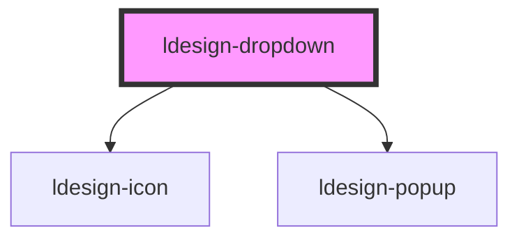

# ldesign-dropdown

下拉菜单组件，基于 [ldesign-popup](../popup) 实现。

<!-- Auto Generated Below -->

## Overview

Dropdown 下拉菜单
基于 <ldesign-popup> 实现

## Properties

| Property        | Attribute         | Description                      | Type                                                                                                                                                                 | Default          |
| --------------- | ----------------- | -------------------------------- | -------------------------------------------------------------------------------------------------------------------------------------------------------------------- | ---------------- |
| `arrow`         | `arrow`           | 是否显示箭头（默认不显示）                    | `boolean`                                                                                                                                                            | `false`          |
| `closeOnSelect` | `close-on-select` | 点击选项后是否自动关闭                      | `boolean`                                                                                                                                                            | `true`           |
| `defaultValue`  | `default-value`   | 默认值（非受控）                         | `string`                                                                                                                                                             | `undefined`      |
| `disabled`      | `disabled`        | 是否禁用                             | `boolean`                                                                                                                                                            | `false`          |
| `items`         | `items`           | 下拉项列表（可传数组或 JSON 字符串）            | `DropdownItem[] \| string`                                                                                                                                           | `[]`             |
| `maxHeight`     | `max-height`      | 列表最大高度（px）                       | `number`                                                                                                                                                             | `240`            |
| `placeholder`   | `placeholder`     | 占位文案（当未选中任何项且使用默认 trigger 时显示）   | `string`                                                                                                                                                             | `'请选择'`          |
| `placement`     | `placement`       | 出现位置（默认 bottom-start）            | `"bottom" \| "bottom-end" \| "bottom-start" \| "left" \| "left-end" \| "left-start" \| "right" \| "right-end" \| "right-start" \| "top" \| "top-end" \| "top-start"` | `'bottom-start'` |
| `theme`         | `theme`           | 主题（浅色/深色），透传给 Popup              | `"dark" \| "light"`                                                                                                                                                  | `'light'`        |
| `trigger`       | `trigger`         | 触发方式（默认 click）                   | `"click" \| "contextmenu" \| "focus" \| "hover" \| "manual"`                                                                                                         | `'click'`        |
| `value`         | `value`           | 选中值（受控）                          | `string`                                                                                                                                                             | `undefined`      |
| `visible`       | `visible`         | 外部受控可见性（仅 trigger = 'manual' 生效） | `boolean`                                                                                                                                                            | `false`          |
| `width`         | `width`           | 列表宽度（可选）                         | `number \| string`                                                                                                                                                   | `undefined`      |

## Events

| Event                  | Description | Type                                                |
| ---------------------- | ----------- | --------------------------------------------------- |
| `ldesignChange`        | 选中变化事件      | `CustomEvent<{ key: string; item: DropdownItem; }>` |
| `ldesignVisibleChange` | 对外转发可见性变化   | `CustomEvent<boolean>`                              |

## Dependencies

### Depends on

- [ldesign-icon](../icon)
- [ldesign-popup](../popup)

### Graph

----------------------------------------------

*Built with [StencilJS](https://stenciljs.com/)*
