# ldesign-icon

<!-- Auto Generated Below -->

## Overview

Icon 图标组件
基于 Lucide 图标库

## Properties

| Property            | Attribute      | Description | Type                                       | Default     |
| ------------------- | -------------- | ----------- | ------------------------------------------ | ----------- |
| `color`             | `color`        | 图标颜色        | `string`                                   | `undefined` |
| `name` _(required)_ | `name`         | 图标名称        | `string`                                   | `undefined` |
| `size`              | `size`         | 图标尺寸        | `"large" \| "medium" \| "small" \| number` | `'medium'`  |
| `spin`              | `spin`         | 是否旋转        | `boolean`                                  | `false`     |
| `strokeWidth`       | `stroke-width` | 描边宽度        | `number`                                   | `2`         |

## Dependencies

### Used by

 - [ldesign-backtop](../backtop)
 - [ldesign-button](../button)
 - [ldesign-checkbox](../checkbox)
 - [ldesign-collapse-panel](../collapse)
 - [ldesign-drawer](../drawer)
 - [ldesign-dropdown](../dropdown)
 - [ldesign-image](../image)
 - [ldesign-image-viewer](../image-viewer)
 - [ldesign-input](../input)
 - [ldesign-menu](../menu)
 - [ldesign-message](../message)
 - [ldesign-modal](../modal)
 - [ldesign-notification](../notification)
 - [ldesign-pagination](../pagination)
 - [ldesign-popconfirm](../popconfirm)
 - [ldesign-rate](../rate)
 - [ldesign-select](../select)
 - [ldesign-switch](../switch)
 - [ldesign-tree](../tree)

### Graph

```mermaid
graph TD;
  ldesign-backtop --> ldesign-icon
  ldesign-button --> ldesign-icon
  ldesign-checkbox --> ldesign-icon
  ldesign-collapse-panel --> ldesign-icon
  ldesign-drawer --> ldesign-icon
  ldesign-dropdown --> ldesign-icon
  ldesign-image --> ldesign-icon
  ldesign-image-viewer --> ldesign-icon
  ldesign-input --> ldesign-icon
  ldesign-menu --> ldesign-icon
  ldesign-message --> ldesign-icon
  ldesign-modal --> ldesign-icon
  ldesign-notification --> ldesign-icon
  ldesign-pagination --> ldesign-icon
  ldesign-popconfirm --> ldesign-icon
  ldesign-rate --> ldesign-icon
  ldesign-select --> ldesign-icon
  ldesign-switch --> ldesign-icon
  ldesign-tree --> ldesign-icon
  style ldesign-icon fill:#f9f,stroke:#333,stroke-width:4px
```

----------------------------------------------

*Built with [StencilJS](https://stenciljs.com/)*
