# ldesign-icon

基于 Lucide 图标库的高性能 Web Component 图标组件，提供丰富的视觉效果和交互功能。

## ✨ 特性

- 🎨 **1000+ 高质量图标** - 基于 Lucide 图标库
- 🚀 **高性能加载** - 智能缓存和按需加载机制  
- 🎭 **丰富的动画效果** - spin、pulse、bounce、flash、shake
- 🌈 **渐变色支持** - 可自定义渐变色方案
- 🔄 **变换效果** - 支持旋转、翻转等变换
- 📝 **自定义 SVG** - 可使用自定义 SVG 内容
- ♿ **无障碍支持** - 完整的 ARIA 属性
- 🌙 **主题适配** - 支持暗色主题和响应式设计
- 📦 **TypeScript** - 完整的类型定义

## 🔨 快速使用

### 基础用法

```html
<ldesign-icon name="home"></ldesign-icon>
<ldesign-icon name="user" size="large" color="#1890ff"></ldesign-icon>
```

### 动画效果

```html
<ldesign-icon name="loader" animation="spin"></ldesign-icon>
<ldesign-icon name="heart" animation="pulse" color="#ff0000"></ldesign-icon>
```

### 渐变色

```html
<ldesign-icon 
  name="rocket" 
  gradient="true" 
  gradient-colors='["#667eea", "#764ba2"]'
></ldesign-icon>
```

<!-- Auto Generated Below -->


## Overview

Icon 图标组件 - 基于 Lucide 图标库，支持自定义 SVG、渐变色、多种动画效果

## Properties

| Property            | Attribute        | Description | Type                                                   | Default     |
| ------------------- | ---------------- | ----------- | ------------------------------------------------------ | ----------- |
| `name` _(required)_ | `name`           | 图标名称        | `string`                                               | `undefined` |
| `size`              | `size`           | 图标尺寸        | `"large" \| "medium" \| "middle" \| "small" \| number` | `'medium'`  |
| `color`             | `color`          | 图标颜色        | `string`                                               | `undefined` |
| `animation`         | `animation`      | 动画效果        | `"none" \| "spin" \| "pulse" \| "bounce" \| "flash" \| "shake"` | `'none'` |
| `spin`              | `spin`           | 是否旋转（兼容旧版） | `boolean`                                              | `false`     |
| `rotate`            | `rotate`         | 旋转角度        | `0 \| 45 \| 90 \| 135 \| 180 \| 225 \| 270 \| 315`     | `0`         |
| `flip`              | `flip`           | 翻转方向        | `"none" \| "horizontal" \| "vertical" \| "both"`      | `'none'`    |
| `strokeWidth`       | `stroke-width`   | 描边宽度        | `number`                                               | `2`         |
| `gradient`          | `gradient`       | 是否使用渐变色    | `boolean`                                              | `false`     |
| `gradientColors`    | `gradient-colors`| 渐变色配置      | `[string, string]`                                     | `['#4f46e5', '#7c3aed']` |
| `customSvg`         | `custom-svg`     | 自定义 SVG 内容 | `string \| CustomSvgConfig`                            | `undefined` |
| `disabled`          | `disabled`       | 是否禁用交互     | `boolean`                                              | `false`     |
| `ariaLabel`         | `aria-label`     | 无障碍标签      | `string`                                               | `undefined` |
| `showLoading`       | `show-loading`   | 是否显示加载状态  | `boolean`                                              | `true`      |
| `loadTimeout`       | `load-timeout`   | 加载超时时间(ms) | `number`                                               | `5000`      |


## Dependencies

### Used by

 - [ldesign-alert](../alert)
 - [ldesign-avatar](../avatar)
 - [ldesign-backtop](../backtop)
 - [ldesign-button](../button)
 - [ldesign-calendar](../calendar)
 - [ldesign-cascader](../cascader)
 - [ldesign-checkbox](../checkbox)
 - [ldesign-collapse-panel](../collapse)
 - [ldesign-date-picker](../datepicker)
 - [ldesign-drawer](../drawer)
 - [ldesign-dropdown](../dropdown)
 - [ldesign-ellipsis](../ellipsis)
 - [ldesign-image](../image)
 - [ldesign-image-viewer](../image-viewer)
 - [ldesign-input](../input)
 - [ldesign-input-number](../input-number)
 - [ldesign-mention](../mention)
 - [ldesign-menu](../menu)
 - [ldesign-message](../message)
 - [ldesign-modal](../modal)
 - [ldesign-notification](../notification)
 - [ldesign-pagination](../pagination)
 - [ldesign-popconfirm](../popconfirm)
 - [ldesign-progress](../progress)
 - [ldesign-rate](../rate)
 - [ldesign-select](../select)
 - [ldesign-switch](../switch)
 - [ldesign-tag](../tag)
 - [ldesign-time-picker](../time-picker)
 - [ldesign-transfer](../transfer)
 - [ldesign-tree](../tree)

### Graph

```mermaid
graph TD;
  ldesign-alert --> ldesign-icon
  ldesign-avatar --> ldesign-icon
  ldesign-backtop --> ldesign-icon
  ldesign-button --> ldesign-icon
  ldesign-calendar --> ldesign-icon
  ldesign-cascader --> ldesign-icon
  ldesign-checkbox --> ldesign-icon
  ldesign-collapse-panel --> ldesign-icon
  ldesign-date-picker --> ldesign-icon
  ldesign-drawer --> ldesign-icon
  ldesign-dropdown --> ldesign-icon
  ldesign-ellipsis --> ldesign-icon
  ldesign-image --> ldesign-icon
  ldesign-image-viewer --> ldesign-icon
  ldesign-input --> ldesign-icon
  ldesign-input-number --> ldesign-icon
  ldesign-mention --> ldesign-icon
  ldesign-menu --> ldesign-icon
  ldesign-message --> ldesign-icon
  ldesign-modal --> ldesign-icon
  ldesign-notification --> ldesign-icon
  ldesign-pagination --> ldesign-icon
  ldesign-popconfirm --> ldesign-icon
  ldesign-progress --> ldesign-icon
  ldesign-rate --> ldesign-icon
  ldesign-select --> ldesign-icon
  ldesign-switch --> ldesign-icon
  ldesign-tag --> ldesign-icon
  ldesign-time-picker --> ldesign-icon
  ldesign-transfer --> ldesign-icon
  ldesign-tree --> ldesign-icon
  style ldesign-icon fill:#f9f,stroke:#333,stroke-width:4px
```


----------------------------------------------

## Events

| Event       | Description      | Type                                              |
| ----------- | ---------------- | ------------------------------------------------- |
| `iconClick` | 点击图标时触发      | `CustomEvent<MouseEvent>`                        |
| `iconLoad`  | 图标加载完成时触发   | `CustomEvent<{ name: string; success: boolean }>` |
| `iconError` | 图标加载失败时触发   | `CustomEvent<{ name: string; error: string }>`   |

## Methods

### `reload() => Promise<void>`

重新加载图标

#### Returns

Type: `Promise<void>`

### `updateIcon(name: string) => Promise<void>`

更新图标

#### Returns

Type: `Promise<void>`

## CSS Custom Properties

| Name                                  | Description    |
| ------------------------------------- | -------------- |
| `--ldesign-icon-size-small`         | 小尺寸图标大小    |
| `--ldesign-icon-size-medium`        | 中等尺寸图标大小   |
| `--ldesign-icon-size-large`         | 大尺寸图标大小    |
| `--ldesign-icon-animation-duration` | 动画持续时间      |
| `--ldesign-icon-animation-easing`   | 动画缓动函数      |
| `--ldesign-icon-transition`         | 过渡效果        |
| `--ldesign-color-error`             | 错误状态颜色      |

----------------------------------------------

*Built with [StencilJS](https://stenciljs.com/)*
